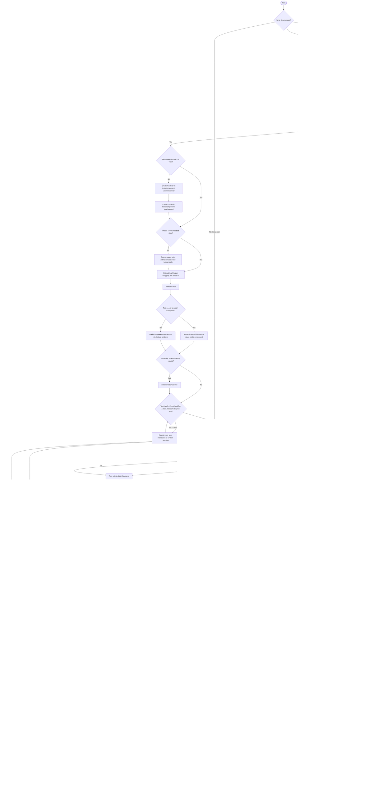

# Component View Test Agent

**Goal**: Create, update, and fix component view tests (`*.view.test.tsx`) in the MetaMask Mobile codebase using the `tests/component-view/` framework.

Use this skill whenever you need to:

- Write a new component view test file
- Update tests after a component or preset has changed
- Fix a failing component view test
- Diagnose why a component view test is failing
- Create a new renderer or preset for a new view

---

## What Are Component View Tests?

Component view tests are **integration-level** tests that test views through real Redux state — no mocked hooks or selectors. They live alongside the component as `ComponentName.view.test.tsx` and use a dedicated framework in `tests/component-view/`.

Key constraint: **only Engine and allowed native modules may be mocked** (enforced at runtime by `app/util/test/testSetupView.js` and by ESLint override in `.eslintrc.js` for `**/*.view.test.*`).

---

## The Framework at a Glance

```
tests/component-view/
├── mocks.ts              ← Engine + native mocks (import this first, always)
├── render.tsx            ← renderComponentViewScreen, renderScreenWithRoutes
├── stateFixture.ts       ← StateFixtureBuilder (createStateFixture)
├── presets/              ← initialState<Feature>() builders — one file per feature area
└── renderers/            ← render<Feature>View() functions — one file per feature area
```

---

## Workflow Overview



---

## Golden Rules (Enforced)

1. **Only mock Engine and allowed native modules** — no arbitrary `jest.mock()` in `*.view.test.*` files. Allowed:
   - `../../app/core/Engine`
   - `../../app/core/Engine/Engine`
   - `react-native-device-info`
   - (these are already handled by `tests/component-view/mocks.ts`)

2. **Drive all behavior through Redux state** — no mocking of hooks or selectors. Provide data via state overrides.

3. **Reuse presets and renderers** — never rebuild the full state manually from scratch.

4. **No fake timers** — never use `jest.useFakeTimers()`, `jest.advanceTimersByTime()`, or `jest.useRealTimers()`.

5. **Test behavior, not snapshots** — use `toBeOnTheScreen()`, `not.toBeOnTheScreen()`, interaction assertions.

6. **Follow AAA** — Arrange → Act → Assert, blank lines between each section. One test = one user journey or business outcome; multiple chained actions in a single test are fine.

7. **No render scenarios** — every test must have at least one of: `fireEvent`, `waitFor`/`findBy`, `store.dispatch`/`act`, or an Engine spy. Static visibility checks are not tests. See [`references/writing-tests.md`](references/writing-tests.md) for examples.

8. **Use selector ID constants, never raw strings** — every `getByTestId` / `findByTestId` / `queryByTestId` must reference a constant from `ComponentName.testIds.ts`. Create the file if it does not exist.

9. **Every view with async data needs one data-completeness test** — wait for the load and validate all significant fields of all items in the base mock using `within()` per row. One per independent async data flow.

10. **Filter / segmentation tests must assert both sides** — after selecting a filter, assert both what appears (positive `findByTestId`) and what disappears (negative `queryByTestId(...).not.toBeOnTheScreen()`).

---

## Supporting Files

For detailed guidance, examples, and code templates, consult these files:

| File                                                                   | Content                                                                                                                                                                                                                  |
| ---------------------------------------------------------------------- | ------------------------------------------------------------------------------------------------------------------------------------------------------------------------------------------------------------------------ |
| [`references/writing-tests.md`](references/writing-tests.md)           | Step 0 (read before writing), Step 0.5 (enumerate use cases, deduplicate, coverage), Step 1 (test file structure, good examples, minimal template, import order), Step 2 (renderers, presets, React Query, route params) |
| [`references/navigation-mocking.md`](references/navigation-mocking.md) | Step 3 (route probes, single nav push, multi-screen renderer, cross-screen journey, userEvent) + Step 4 (external service / API mocking, MSW placeholder)                                                                |
| [`references/reference.md`](references/reference.md)                   | Step 5 (fiat), Step 6 (run commands), Step 6.5 (self-review checklist), Step 7 (failure diagnosis), Assertion Patterns, What NOT to Do, Quick Reference                                                                  |
