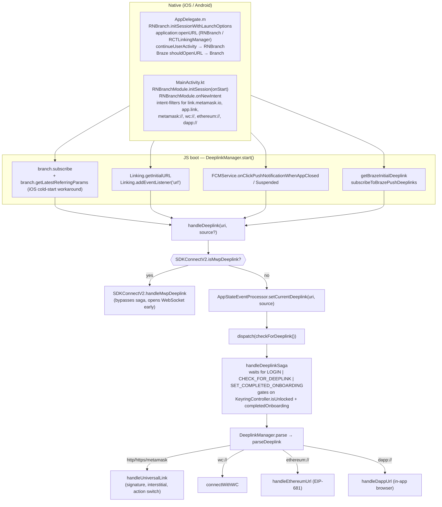

# Deeplinks Architecture (MetaMask Mobile)

Authoritative map of how a tapped link becomes an in‑app action. Use this to orient quickly before touching `app/core/DeeplinkManager/**`, the root saga, the `AppStateEventListener`, the Android manifest, or `ios/MetaMask/AppDelegate.m`.

For the product-level "how do I add a handler?" walkthrough, see `docs/readme/deeplinking.md` and `.cursor/rules/deeplink-handler-guidelines.mdc`. This skill covers the **plumbing**.

## Supported Surfaces

| Category              | Examples                                                         | Notes                                                             |
| --------------------- | ---------------------------------------------------------------- | ----------------------------------------------------------------- |
| Universal links (new) | `https://link.metamask.io/<action>`, `https://link-test....`     | Preferred. Routed through Branch.                                 |
| Universal links (old) | `https://metamask.app.link/...`, `metamask-alternate.app.link`   | Branch short-link domains. Rewritten to `link.metamask.io`.       |
| Custom schemes        | `metamask://`, `wc://`, `ethereum://`, `dapp://`, `expo-metamask`| `metamask://` is rewritten to `https://link.metamask.io/` in JS.  |
| Push-delivered        | FCM `data.deeplink`, Braze `payload.url`                         | Delivered through FCMService / BrazeDeeplinks, not OS link APIs.  |
| MWP / SDKConnectV2    | `metamask://connect/mwp?...`                                     | **Intercepted before the normal pipeline** (see below).           |
| In-app direct callers | Carousel, QR scanner, in-app browser, notification CTAs         | Call `SharedDeeplinkManager.parse` directly — skip `handleDeeplink` **and** the saga. |

## 10,000-foot View



## Native Entry Points

### iOS — `ios/MetaMask/AppDelegate.m`

- `didFinishLaunchingWithOptions`:
  - `[RNBranch.branch checkPasteboardOnInstall]` — deferred-deeplink fallback when app is launched cold after an install.
  - `[RNBranch initSessionWithLaunchOptions:launchOptions isReferrable:YES]`.
  - Braze init, then `braze.delegate = self` so we can implement `braze:shouldOpenURL:`.
- `application:openURL:options:` — in DEBUG uses `RCTLinkingManager` as a fallback (otherwise RNBranch owns URL handling).
- `application:continueUserActivity:restorationHandler:` — always forwarded to `RNBranch` (Universal Links).
- `braze:shouldOpenURL:` — **workaround for duplicate delivery**: if the URL host is a Branch/MM link domain, hand it to `Branch.getInstance handleDeepLink` and return `NO`. Otherwise return `NO` (Braze RN bridge still emits the JS event; `subscribeToBrazePushDeeplinks` handles it tagged with `ORIGIN_BRAZE`).

### Android — `android/app/src/main/java/io/metamask/MainActivity.kt` + `AndroidManifest.xml`

- `MainActivity.onStart` → `RNBranchModule.initSession(intent.data, this)`.
- `MainActivity.onNewIntent` → sets `branch_force_new_session=true` then `RNBranchModule.onNewIntent(intent)` (works around "Session initialization already happened" warning).
- Also wires `NotificationModule.saveNotificationIntent` and `BrazeReactUtils.populateInitialPushPayloadFromIntent`.
- `AndroidManifest.xml` declares `autoVerify=true` intent-filters for:
  - `https://link.metamask.io`, `https://link-test.metamask.io`
  - `https://metamask.app.link`, `metamask-alternate.app.link` and `.test-app.link` variants
  - `expo-metamask` scheme
- Plus non-verified intent-filters for `metamask://`, `wc://`, `ethereum://`, `dapp://`, `http`, `https`.

## JS Boot — `DeeplinkManager.start()`

File: `app/core/DeeplinkManager/DeeplinkManager.ts`. Called from `startAppServices` in `app/store/sagas/index.ts` after `ON_PERSISTED_DATA_LOADED` and `ON_NAVIGATION_READY`.

It subscribes to every deeplink source so every route funnels into `handleDeeplink`:

1. **FCM** — cold tap via `onClickPushNotificationWhenAppClosed`, foreground/background tap via `onClickPushNotificationWhenAppSuspended`. Source = `ORIGIN_PUSH_NOTIFICATION`.
2. **Braze** — `getBrazeInitialDeeplink` (cold) + `subscribeToBrazePushDeeplinks` (live). Source = `ORIGIN_BRAZE`.
3. **React Native Linking** — `getInitialURL` (cold) + `addEventListener('url', …)` (foreground).
4. **Branch** — `branch.subscribe(opts)` and a manual `getBranchDeeplink()` call.

### Workaround: iOS cold-start Branch subscribe

```130:183:app/core/DeeplinkManager/DeeplinkManager.ts
    // branch.subscribe is not called for iOS cold start after the new RN architecture upgrade.
    // This is a workaround to ensure that the deeplink is processed for iOS cold start.
    // TODO: Remove this once branch.subscribe is called for iOS cold start.
    getBranchDeeplink();
```

`getBranchDeeplink()` pulls `branch.getLatestReferringParams()` and, if present, uses `~referring_link` or `+non_branch_link`.

### Workaround: Branch short-link rewrite

Branch resolves `metamask.app.link/<id>` / `metamask-alternate.app.link/<id>` into a short-code path; the **actual** app route lives in the Branch param `$deeplink_path`. This was added to fix the **X (Twitter) Deepview flow on iOS** (PR #27139) — tapping a `t.co` link in X opens `https://metamask-alternate.app.link/<id>?__branch_flow_type=viewapp&...`, the Branch SDK returns params but no resolved in-app URI, so we reconstruct it ourselves. **Every external Branch link we publish must include a `$deeplink_path`.**

`rewriteBranchUri` replaces host + pathname while preserving the query string, and only fires when `+clicked_branch_link` is set in the params:

```22:40:app/core/DeeplinkManager/DeeplinkManager.ts
export function rewriteBranchUri(
  uri: string | undefined,
  params: BranchParams | undefined,
): string | undefined {
  try {
    if (!uri || !params?.['+clicked_branch_link']) return uri;
    const rawPath = params.$deeplink_path;
    if (typeof rawPath !== 'string') return uri;

    const parsed = new URL(uri);
    parsed.host = AppConstants.MM_IO_UNIVERSAL_LINK_HOST;
    parsed.pathname = `/${rawPath.replace(/^\//, '')}`;
    return parsed.toString();
```

## JS Entry — `handleDeeplink`

File: `app/core/DeeplinkManager/handlers/legacy/handleDeeplink.ts`. All native/branch/push flows call this.

```15:38:app/core/DeeplinkManager/handlers/legacy/handleDeeplink.ts
export function handleDeeplink(opts: { uri?: string; source?: string }) {
  // This is the earliest JS entry point for deeplinks. We must handle SDKConnectV2
  // links here immediately to establish the WebSocket connection as fast as possible,
  // without waiting for the app to be unlocked or fully onboarded.
  if (SDKConnectV2.isMwpDeeplink(opts.uri)) {
    trackMwpDeepLinkUsed();
    SDKConnectV2.handleMwpDeeplink(opts.uri);
    return;
  }
  const { dispatch } = ReduxService.store;
  const { uri, source } = opts;
  ...
    AppStateEventProcessor.setCurrentDeeplink(uri, source);
    dispatch(checkForDeeplink());
```

Two important consequences:

- **MWP/SDKConnectV2 deeplinks bypass the saga entirely.** The WebSocket must open even when the app is locked / not yet onboarded. MWP prefix is `metamask://connect/mwp` (`ConnectionRegistry.DEEPLINK_PREFIX`). Analytics still fires (`DEEP_LINK_USED` with `route: DeepLinkRoute.MMC_MWP` / `"mmc_mwp"`) — it's a fire-and-forget `detectAppInstallation().then(...)` that cannot block the WebSocket handshake (PR #27864).
- **Everything else is stored, not processed.** The pending URL lives on `AppStateEventProcessor.pendingDeeplink` until the saga picks it up.

## In-App Direct Callers (Bypass `handleDeeplink` + Saga)

Several in-app surfaces call `SharedDeeplinkManager.parse(...)` directly, which means they **skip both the MWP/SDKConnectV2 intercept and the saga's unlock/onboarding gate**. They enter the pipeline straight at the protocol dispatcher. This is safe because these callers are only reachable when the user is already inside a running, authenticated app.

| Caller                                                                            | Origin                      | Notes                                                                              |
| --------------------------------------------------------------------------------- | --------------------------- | ---------------------------------------------------------------------------------- |
| `app/components/Views/QRScanner/index.tsx`                                        | `ORIGIN_QR_CODE`            | Uses `isMetaMaskUniversalLink()` to route MM universal links via `parse()` on iOS (PR #25739). Custom schemes (`ethereum:`, `dapp:`, `metamask:`) still go through the dedicated handlers. Passes `onHandled` to pop the scanner. |
| `app/components/Views/AccountsMenu/AccountsMenu.tsx`                              | `ORIGIN_QR_CODE`            | 500 ms setTimeout before `parse` (UX-timed).                                       |
| `app/components/UI/Carousel/index.tsx`                                            | `ORIGIN_CAROUSEL`           | Falls back to `Linking.openURL` for external links; only internal MM links `parse`.|
| `app/components/UI/Notification/NotificationMenuItem/Cta.tsx`                     | `ORIGIN_DEEPLINK`           | Only calls `parse` if `cta.link` contains `MM_IO_UNIVERSAL_LINK_HOST`.             |
| `app/components/Views/Notifications/Details/Footers/AnnouncementCtaFooter.tsx`    | `ORIGIN_DEEPLINK`           | Announcement CTA (`metamask://…` buttons).                                         |
| `app/components/Views/BrowserTab/BrowserTab.tsx`                                  | `ORIGIN_IN_APP_BROWSER`     | Passes a `browserCallBack` so `handleDappUrl` can load URLs into the current tab. |

Consequence: a deeplink triggered by these callers **cannot** open an MWP WebSocket (by design) and won't wait for login/onboarding.

## Saga Pipeline — `handleDeeplinkSaga`

File: `app/store/sagas/index.ts` (forked from `rootSaga`).

```203:273:app/store/sagas/index.ts
export function* handleDeeplinkSaga() {
  let hasInitializedSDKServices = false;
  while (true) {
    const value = (yield take([
      UserActionType.LOGIN,
      UserActionType.CHECK_FOR_DEEPLINK,
      SET_COMPLETED_ONBOARDING,
    ])) as LoginAction | CheckForDeeplinkAction | SetCompletedOnboardingAction;
    ...
    if (AppStateEventProcessor.pendingDeeplink) {
      const url = new UrlParser(AppStateEventProcessor.pendingDeeplink);
      ...
      if (!existingUser && url.pathname === '/onboarding') {
        setTimeout(() => {
          SharedDeeplinkManager.parse(url.href, { origin: storedSource });
        }, 200);
        AppStateEventProcessor.clearPendingDeeplink();
        continue;
      }
    }
    const { KeyringController } = Engine.context;
    const isUnlocked = KeyringController.isUnlocked();
    if (!isUnlocked || !completedOnboarding) continue;

    if (!hasInitializedSDKServices) {
      yield call(initializeSDKServices);
      hasInitializedSDKServices = true;
    }
    ...
    setTimeout(() => {
      SharedDeeplinkManager.parse(deeplink, { origin: deeplinkSource });
    }, 200);
    AppStateEventProcessor.clearPendingDeeplink();
```

Key points:

- **Wake-up events**: `LOGIN`, `CHECK_FOR_DEEPLINK`, `SET_COMPLETED_ONBOARDING`. Anything that changes authenticated state re-drives the saga.
- **Gates**: the keyring must be unlocked **and** onboarding must be complete. Otherwise the iteration `continue`s; the deeplink stays in `pendingDeeplink` until a future wake-up.
- **Fast onboarding exception**: if user is brand-new (`existingUser === false`) and path is `/onboarding`, parse immediately. This is how the `onboarding` deeplink action can run pre-login.
- **SDK services init**: `WC2Manager.init({})` and `SDKConnect.init({ context: 'Nav/App' })` run once, lazily, only after first successful deeplink resolution post-unlock. TODO in the code notes this exists because SDKConnect "does some weird stuff when it's initialized".
- **200 ms setTimeout**: workaround — parse runs outside the saga tick so the modal doesn't collide with an ongoing navigation event.

### Related: `AppStateEventProcessor` timing

- `setCurrentDeeplink` sets both `currentDeeplink` (used by attribution/analytics) and `pendingDeeplink` (used by the saga).
- `handleAppStateChange` uses a **2000 ms** timeout on `background → active` transitions before firing `APP_OPENED`, so a deeplink that triggers a foreground transition has time to be set. iOS `inactive` transitions are deliberately ignored so they don't clobber the `background` → `active` detection.

## `DeeplinkManager.parse` → `parseDeeplink`

File: `app/core/DeeplinkManager/utils/parseDeeplink.ts`. Protocol-dispatch only.

```46:86:app/core/DeeplinkManager/utils/parseDeeplink.ts
switch (urlObj.protocol.replace(':', '')) {
  case PROTOCOLS.METAMASK:
  case PROTOCOLS.HTTP:
  case PROTOCOLS.HTTPS: {
    const mappedUrl = url.replace(
      `${PROTOCOLS.METAMASK}://`,
      `${PROTOCOLS.HTTPS}://${AppConstants.MM_IO_UNIVERSAL_LINK_HOST}/`,
    );
    ...
    handleUniversalLink({ instance, handled, urlObj: mappedUrlObj, browserCallBack, url: mappedUrl, source: origin });
  }
  case PROTOCOLS.WC: connectWithWC(...)
  case PROTOCOLS.ETHEREUM: handleEthereumUrl(...)
  case PROTOCOLS.DAPP: handleDappUrl(...)
}
```

Rewrite step: `metamask://<action>` becomes `https://link.metamask.io/<action>`, so there is **one** canonical path through `handleUniversalLink`. `http://` is handled the same way (historical).

Failure path for this function: if parsing throws and origin is `ORIGIN_QR_CODE`, the unrecognized-QR Alert is shown; otherwise a generic "Invalid URL" alert. Private keys (length 64) are silently ignored here.

## `handleUniversalLink`

File: `app/core/DeeplinkManager/handlers/legacy/handleUniversalLink.ts`. This is where **all** product actions actually get dispatched.

Pipeline (in order):

1. Reject obviously-malformed hostnames.
2. Extract the action from `pathname.split('/')[1]`.
3. Short-circuit OAuth redirect and empty-path `metamask://` (a common "open the app" intent from third-party apps).
4. **Intercept MetaMask SDK actions** (`bind`, `connect`, `mmsdk`) — remap `https://link.metamask.io/` back to `metamask://` and dispatch to `handleMetaMaskDeeplink`.
5. Compute `isSupportedDomain` against `MM_UNIVERSAL_LINK_HOST{,_ALTERNATE}`, `MM_UNIVERSAL_LINK_TEST_APP_HOST{,_ALTERNATE}`, `MM_IO_UNIVERSAL_LINK_HOST`, `MM_IO_UNIVERSAL_LINK_TEST_HOST`.
6. If the link has a `sig`, run `verifyDeeplinkSignature`.
7. Derive `linkType` → `PRIVATE | PUBLIC | INVALID | UNSUPPORTED` (see table below).
8. Fetch Branch referring params with a **500 ms timeout** for analytics only.
9. Decide whether to show the interstitial modal.
10. Route to the handler via the action switch.

### Link-type matrix

| Supported domain | Supported action | Valid signature | → `linkType`                         |
| ---------------- | ---------------- | --------------- | ------------------------------------- |
| no               | —                | —               | `INVALID` ("page doesn't exist" modal) |
| yes              | no               | no              | `INVALID`                              |
| yes              | no               | yes             | `UNSUPPORTED` ("update app" modal)     |
| yes              | yes              | no              | `PUBLIC` (security warning)            |
| yes              | yes              | yes             | `PRIVATE` (confirmation, may skip)     |

### Interstitial bypass rules

```102:134:app/core/DeeplinkManager/handlers/legacy/handleUniversalLink.ts
const WHITELISTED_ACTIONS: SUPPORTED_ACTIONS[] = [
  SUPPORTED_ACTIONS.DAPP, SUPPORTED_ACTIONS.WC,
  SUPPORTED_ACTIONS.CARD_ONBOARDING, SUPPORTED_ACTIONS.CARD_HOME, SUPPORTED_ACTIONS.CARD_KYC_NOTIFICATION,
  SUPPORTED_ACTIONS.PERPS, SUPPORTED_ACTIONS.PERPS_MARKETS, SUPPORTED_ACTIONS.PERPS_ASSET,
  SUPPORTED_ACTIONS.BUY, SUPPORTED_ACTIONS.BUY_CRYPTO, SUPPORTED_ACTIONS.SELL, SUPPORTED_ACTIONS.SELL_CRYPTO,
];
const METAMASK_SDK_ACTIONS: SUPPORTED_ACTIONS[] = [ANDROID_SDK, CONNECT, MMSDK];
const interstitialWhitelistUrls = [] as const;
const trustedInAppSources = [ORIGIN_CAROUSEL, ORIGIN_NOTIFICATION, ORIGIN_PUSH_NOTIFICATION, ORIGIN_BRAZE];
```

- Actions in `WHITELISTED_ACTIONS` → no modal, handler runs.
- URLs matching `interstitialWhitelistUrls` → no modal (currently empty; kept as a hook).
- Origin in `trustedInAppSources` AND linkType is PUBLIC/PRIVATE → no modal.
- PRIVATE link + user has disabled the modal in Settings (`selectDeepLinkModalDisabled`) → modal auto-accepts (analytics records `interstitialShown=false`).
- PUBLIC links ALWAYS show the modal (security requirement), even for trusted sources above if not in the bypass list.

### Analytics — `DEEP_LINK_USED`

Every termination path (accepted, rejected, skipped) calls `trackDeepLinkAnalytics` with a `DeepLinkAnalyticsContext` including: route, signature status, interstitial shown/action, Branch params, and origin. Failures fall back silently. See `docs/readme/deeplink-analytics.md`.

## Signature Verification — `verifySignature.ts`

- ECDSA P-256 / SHA-256 via `react-native-quick-crypto`. Public key from `AppConstants.MM_DEEP_LINK_PUBLIC_KEY_X/Y` (production key; there is no dev key).
- Canonicalization depends on `sig_params`:
  - `sig_params` present → only the listed params + `sig_params` itself are signed. This is the **forward-compatible** path (clients may append unsigned params).
  - `sig_params=""` (empty) → only `sig_params` itself is signed.
  - no `sig_params` → legacy mode: all params except `sig` are signed.
- Returns `MISSING` / `VALID` / `INVALID`. A tampered signature **demotes** the link to PUBLIC; it does **not** trigger the INVALID modal.

## Key Files

| Concern                         | File                                                                      |
| ------------------------------- | ------------------------------------------------------------------------- |
| Native iOS entry                | `ios/MetaMask/AppDelegate.m`                                              |
| Native Android entry            | `android/app/src/main/java/io/metamask/MainActivity.kt`                   |
| Android intent-filters          | `android/app/src/main/AndroidManifest.xml`                                |
| JS singleton + Branch subscribe | `app/core/DeeplinkManager/DeeplinkManager.ts`                             |
| Earliest JS entry + SDK bypass  | `app/core/DeeplinkManager/handlers/legacy/handleDeeplink.ts`              |
| Saga gate                       | `app/store/sagas/index.ts` (`handleDeeplinkSaga`)                         |
| Pending-URL storage             | `app/core/AppStateEventListener.ts` (`AppStateEventProcessor`)            |
| Protocol dispatch               | `app/core/DeeplinkManager/utils/parseDeeplink.ts`                         |
| Main action router              | `app/core/DeeplinkManager/handlers/legacy/handleUniversalLink.ts`         |
| Signature verification          | `app/core/DeeplinkManager/utils/verifySignature.ts`                       |
| Supported action enum           | `app/constants/deeplinks.ts` (`ACTIONS`, `PROTOCOLS`, `PREFIXES`)         |
| Origin constants                | `app/core/AppConstants.ts` (`DEEPLINKS.ORIGIN_*`)                         |
| Braze plumbing                  | `app/core/Braze/BrazeDeeplinks.ts`                                        |
| FCM plumbing                    | `app/util/notifications/services/FCMService.ts`                           |
| MWP/SDK interception            | `app/core/SDKConnectV2/services/connection-registry.ts`                   |
| Analytics context/types         | `app/core/DeeplinkManager/types/deepLinkAnalytics.types.ts`               |
| Human docs                      | `docs/readme/deeplinking.md`, `docs/readme/deeplinking-diagrams.md`       |
| Handler-author guide            | `.cursor/rules/deeplink-handler-guidelines.mdc`                           |

## Workarounds / Gotchas Already In Place

Keep this list in mind before proposing refactors — each item was added for a concrete reason.

1. **iOS cold-start `branch.subscribe` miss** — `DeeplinkManager.start` calls `getBranchDeeplink()` unconditionally after the new RN architecture upgrade. Tracked by a TODO in the file.
2. **Branch short-link rewrite** — `rewriteBranchUri` replaces the host/path with `link.metamask.io/$deeplink_path`. Applied to both `branch.subscribe` output and `getLatestReferringParams().~referring_link`.
3. **`metamask://` → `https://link.metamask.io/` remap** in `parseDeeplink` — keeps a single code path through `handleUniversalLink`. Then `handleUniversalLink` remaps SDK actions **back** to `metamask://` before delegating to `handleMetaMaskDeeplink`.
4. **SDKConnectV2 MWP bypass** in `handleDeeplink` — handled **before** redux/saga to open the WebSocket even while the app is locked / pre-onboarding. Analytics (`trackMwpDeepLinkUsed`) is fire-and-forget so it never blocks the handshake.
5. **Fast-onboarding branch** in the saga — `/onboarding` path is parsed before the unlock/onboarding gate when `existingUser === false`.
6. **200 ms `setTimeout` before `parse()`** in the saga — avoids modal/navigation race during navigation stack mount.
7. **2000 ms `setTimeout` on app foreground** in `AppStateEventListener.handleAppStateChange` — gives the native layer time to emit the deeplink URL before firing `APP_OPENED`.
8. **`inactive` state guard** in `AppStateEventListener` — on iOS, `background → inactive → active` must not forget the original `background` state; otherwise `APP_OPENED` would fire for every incoming call / permission dialog.
9. **iOS Braze `shouldOpenURL` returns `NO`** — prevents duplicate delivery: universal links are forwarded to `[Branch handleDeepLink:]`; non-universal links are left to the JS `PUSH_NOTIFICATION_EVENT` listener (`ORIGIN_BRAZE`).
10. **`branch_force_new_session=true`** in `MainActivity.onNewIntent` — avoids the Branch SDK warning/dedupe when the activity is re-launched while still in the back-stack.
11. **`checkPasteboardOnInstall`** in iOS `didFinishLaunchingWithOptions` — deferred deep link resolution post-install.
12. **500 ms timeout on `branch.getLatestReferringParams`** in `handleUniversalLink` — Branch is **advisory** for analytics here; we never let it block routing.
13. **OAuth redirect short-circuit** — `action === ACTIONS.OAUTH_REDIRECT` returns immediately; OAuthService owns that flow.
14. **`SUPPORTED_ACTIONS.SEND` and `SUPPORTED_ACTIONS.WC` recurse** through `instance.parse(...)` with the remapped `ethereum:` / `wc:` URL — reuses the protocol dispatcher instead of duplicating logic.
15. **`PERPS_ASSET` path synthesis** — `handleUniversalLink` rewrites `/perps-asset?symbol=X` into `perps?screen=asset&symbol=X` before calling `handlePerpsUrl`. The `perps-asset` action exists for URL ergonomics only.
16. **Tampered signature demotion, not rejection** — invalid `sig` becomes a PUBLIC link (user still sees a warning) rather than an INVALID modal. This is intentional per the product doc.
17. **Lazy one-time SDK service init** — `WC2Manager.init` / `SDKConnect.init` run inside the saga after the first post-unlock deeplink. The TODO in `handleDeeplinkSaga` notes this should go away once SDKConnect init is refactored.
18. **DEBUG-only `RCTLinkingManager` fallback** on iOS — in release builds `RNBranch` alone owns `application:openURL:`.
19. **`trustedInAppSources` bypass widened to PUBLIC + PRIVATE** (PR #28973) — previously only PRIVATE links from carousel / notifications / push / Braze skipped the interstitial; PUBLIC links now skip too. Do **not** narrow this back to PRIVATE without a product conversation — it was a deliberate UX choice to avoid modal spam on our own in-app notifications.
20. **QRScanner ↔ DeeplinkManager integration** (PR #25739) — MM universal links scanned from the in-app scanner on iOS would otherwise route through `Linking.openURL`, which sends the user to Safari → App Store even though the app is foregrounded. `QRScanner` now calls `isMetaMaskUniversalLink()` and routes through `SharedDeeplinkManager.parse()` instead. Custom schemes stay on the old path.
21. **`$deeplink_path` is mandatory on every externally published Branch link** — without it, `rewriteBranchUri` leaves the URL at `metamask[-alternate].app.link/<short-id>` and `handleUniversalLink` will classify it as INVALID (hostname is a supported domain but the path is the short-id, not a known action).

## Adding or Debugging a Link

- **Adding a new action**: follow `.cursor/rules/deeplink-handler-guidelines.mdc`. The most-forgotten step is the switch case in `handleUniversalLink`.
- **Link doesn't open the app**: check the Android manifest intent-filters / iOS associated domain (`applinks:`) — the `autoVerify=true` filters are the universal-link hook.
- **Expo dev-build Android gotcha**: in `expo-metamask://` dev builds the link arriving at the JS layer is rewritten by Expo before reaching `handleDeeplink`, which triggers a "This page doesn't exist" modal. Test universal links using a Bitrise/release build, not `yarn start:android` through Expo (see PR #23349 manual-testing notes).
- **Link opens the app but nothing happens**: likely stuck in the saga (locked wallet / incomplete onboarding) or missing switch case in `handleUniversalLink`. Inspect `AppStateEventProcessor.pendingDeeplink` and DevLogger logs prefixed with `DeepLinkManager:parse`.
- **Signature keeps failing**: verify `sig_params` lists exactly the params that were signed, and that no listed param is missing from the URL. Legacy mode (no `sig_params`) verifies **all** non-`sig` params.
- **Duplicate modal or double handling**: look for a push/Branch/Linking fan-in — only one source should hand off to `handleDeeplink` per tap. The iOS Braze delegate is the historical offender.
- **MWP connection doesn't open**: it bypasses everything above — inspect `SDKConnectV2` / `ConnectionRegistry`, not the saga.
