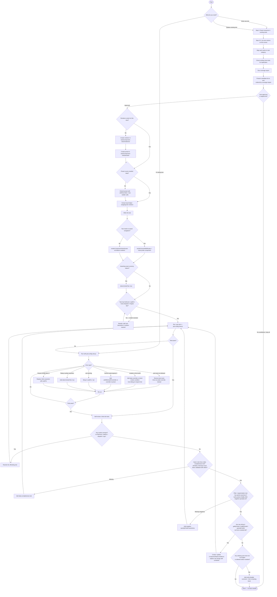

# Component View Test Agent

**Goal**: Create, update, and fix component view tests (`*.view.test.tsx`) in the MetaMask Mobile codebase using the `tests/component-view/` framework.

Use this skill whenever you need to:

- Write a new component view test file
- Update tests after a component or preset has changed
- Fix a failing component view test
- Diagnose why a component view test is failing
- Create a new renderer or preset for a new view

---

## What Are Component View Tests?

Component view tests are **integration-level** tests that test views through real Redux state — no mocked hooks or selectors. They live alongside the component as `ComponentName.view.test.tsx` and use a dedicated framework in `tests/component-view/`.

Key constraint: **only Engine and allowed native modules may be mocked** (enforced at runtime by `app/util/test/testSetupView.js` and by ESLint override in `.eslintrc.js` for `**/*.view.test.*`).

---

## The Framework at a Glance

```
tests/component-view/
├── mocks.ts              ← Engine + native mocks (import this first, always)
├── render.tsx            ← renderComponentViewScreen, renderScreenWithRoutes
├── stateFixture.ts       ← StateFixtureBuilder (createStateFixture)
├── presets/
│   ├── bridge.ts         ← initialStateBridge()
│   ├── wallet.ts         ← initialStateWallet()
│   ├── trending.ts       ← initialStateTrending()
│   ├── walletActions.ts  ← initialStateWalletActions()
│   ├── perpsStatePreset.ts ← initialStatePerps()
│   └── predict.ts        ← initialStatePredict()
└── renderers/
    ├── bridge.ts         ← renderBridgeView()
    ├── wallet.ts         ← renderWalletView()
    ├── trending.ts       ← renderTrendingView()
    ├── walletActions.ts  ← renderWalletActionsView()
    ├── perpsViewRenderer.tsx ← renderPerpsView()
    └── predict.tsx       ← renderPredictFeedView(), renderPredictFeedViewWithRoutes()
```

---

## Workflow Overview



---

## Golden Rules (Enforced)

1. **Only mock Engine and allowed native modules** — no arbitrary `jest.mock()` in `*.view.test.*` files. Allowed:
   - `../../app/core/Engine`
   - `../../app/core/Engine/Engine`
   - `react-native-device-info`
   - (these are already handled by `tests/component-view/mocks.ts`)

2. **Drive all behavior through Redux state** — no mocking of hooks or selectors. Provide data via state overrides.

3. **Reuse presets and renderers** — never rebuild the full state manually from scratch.

4. **No fake timers** — never use `jest.useFakeTimers()`, `jest.advanceTimersByTime()`, or `jest.useRealTimers()`.

5. **Test behavior, not snapshots** — use `toBeOnTheScreen()`, `not.toBeOnTheScreen()`, interaction assertions.

6. **Follow AAA** — Arrange → Act → Assert, blank lines between each section. Tests can and should chain multiple user actions when they form a coherent user journey. "One test = one user story or business outcome" — not "one fireEvent per test".

7. **No render scenarios** — a test that only sets up state and checks what's visible (even with multiple assertions) is a render scenario and is an antipattern. Every test must involve at least one of: a user interaction (`fireEvent`), an async flow (`waitFor`/`findBy`), a Redux action (`store.dispatch`/`act`), or an Engine spy. Ask: "does this test involve the user doing something or the system reacting to something?" If no, rewrite it.

8. **Use selector ID constants, never raw strings** — every `getByTestId` / `findByTestId` / `queryByTestId` call must reference a constant from the component's `ComponentName.testIds.ts` file, not a hardcoded string literal. If the file does not exist, create it before writing the test. Raw string literals are only acceptable for elements that belong to another component that hasn't exported its selectors yet (document why in a comment).

9. **Every view with async data needs one data-completeness test** — when a view loads data asynchronously (API call, Engine polling), write one test that waits for the load to complete and then validates all significant fields of all items in the full mock dataset using `within()` per row. This is NOT a render scenario: the async resolution is the event under test.
   - **Scope:** one data-completeness test per independent async data flow in the view.
   - **What to validate:** every significant visible field (name, price, change %, icon text) of every item in the base mock dataset using `within(rowElement)` to scope queries to a single row.

10. **Filter / segmentation tests must assert both sides** — when a test selects a filter, network, or category, always assert both what appears (positive: the expected items are on screen) AND what disappears (negative: `queryByTestId(...).not.toBeOnTheScreen()` for items from the previous set).

---

## The Ideal Component View Test

Component view tests are **integration tests**, not unit tests. The ideal test models a
**complete user journey**: a realistic sequence of actions a user would take and the
system outcomes that result.

### Shape of an ideal test

```typescript
// Note: test ID strings in this example are written out for readability.
// In real code, always import from ComponentName.testIds.ts and use constants:
//   import { PredictFeedSelectorsIDs } from './PredictFeed.testIds';
//   getByTestId(PredictFeedSelectorsIDs.SEARCH_BUTTON)
it('user opens search, types a query, and sees matching results', async () => {
  // Arrange — minimal state + spy setup
  const getMarketsSpy = jest.spyOn(
    Engine.context.PredictController,
    'getMarkets',
  );
  getMarketsSpy.mockResolvedValue([MOCK_PREDICT_MARKET]);
  const { getByTestId, findByPlaceholderText, findByTestId } =
    renderPredictFeedView();

  // Act — realistic user action sequence
  fireEvent.press(getByTestId(PredictFeedSelectorsIDs.SEARCH_BUTTON));
  const searchInput = await findByPlaceholderText('Search prediction markets');
  fireEvent.changeText(searchInput, 'bitcoin');

  // Assert — end state: Engine called correctly + UI reflects result
  await waitFor(() => {
    expect(getMarketsSpy).toHaveBeenCalledWith(
      expect.objectContaining({ q: 'bitcoin' }),
    );
  });
  expect(
    await findByTestId(PredictFeedSelectorsIDs.SEARCH_RESULT_ITEM_0),
  ).toBeOnTheScreen();

  getMarketsSpy.mockRestore();
});
```

### Rules for the ideal test

- **Multiple actions are fine** — pressing a button, then typing, then pressing again is one user journey
- **Multiple assertions are fine** — assert both sides of a state change (positive + negative)
- **Engine spy + UI assertion in the same test** — proves cause AND effect together
- **The antipattern is still render scenarios** — if there is no `fireEvent`, no async reaction, no `dispatch`, no Engine spy, it's a render scenario regardless of how many assertions it has

---

## Step 0: Read Before Writing

Before writing any test, read:

- The component file under test
- Any existing `*.view.test.tsx` for the same component
- The relevant preset(s) in `tests/component-view/presets/`
- The relevant renderer(s) in `tests/component-view/renderers/`

---

## Step 0.5: Enumerate Use Cases and Check for Duplication

**Do this before writing a single test line.** Produce a candidate list that is explicitly scoped and deduplicated.

### 1. List User-Facing Actions

Ask: "What can a user **do** on this screen?" Be exhaustive:

- Type or paste input (amount, address, search query)
- Press a button (CTA, confirm, cancel, back, copy)
- Select an item from a list (token, network, account, chain)
- Scroll to load more / pull to refresh
- Dismiss or open a modal / bottom sheet
- Navigate to a sub-screen
- Wait for async data to arrive (API response, Engine polling)
- Long-press or swipe an item
- Toggle a setting or switch

### 2. Map Each Action to a Component View Test Category

Only keep actions that map to a **valid test pattern**. Drop anything that would only produce a render scenario.

| User action / system event                            | Valid pattern                                         |
| ----------------------------------------------------- | ----------------------------------------------------- |
| Presses button → UI changes                           | `fireEvent.press` → `waitFor`                         |
| Types input → value appears                           | `userEvent.type` or `fireEvent.changeText` → `findBy` |
| Selects item → navigates                              | `userEvent.press` → route probe                       |
| Redux action dispatched → Engine called               | `store.dispatch` + `act` → Engine spy                 |
| Async data arrives → list renders                     | `findBy` / `waitFor`                                  |
| User triggers action → API called with correct params | interaction → spy assertion                           |
| Multi-step user journey → end state visible           | Multiple `fireEvent` → final `findBy`                 |

**Drop these — they are render scenarios:**

- "The screen shows X when state is Y" (no interaction, no async, no dispatch)
- "The button is disabled when no amount is set" (static check, no action)
- "The token name appears in the header" (initial render only)

### 3. Check Existing View Tests for Duplication

For each remaining candidate, read `ComponentName.view.test.tsx` (if it exists) and ask:

- Is there already a view test that covers this exact interaction?

Remove duplicates from your candidate list.

### 4. Run Coverage to Identify Impact

Before finalizing the candidate list, run coverage on the feature area:

```bash
yarn test:view:coverage:folder app/components/UI/MyFeature
```

Read the coverage table output. Focus on:

- Files with **low line/branch coverage**
- **Uncovered branches** — conditions like `if (isLoading)`, `if (error)` that have no test

Use this to **prioritize** your candidate list: implement the tests that cover the most uncovered paths first.

### 5. Present the Candidate List and Wait for Approval

**Stop here.** Present the candidate list to the user — do not write any test code yet.

Format it clearly, ordered by impact (lowest coverage / highest uncovered branch count first):

---

**Proposed tests for `MyView.view.test.tsx`** (ordered by impact):

| #   | Test description                                               | Pattern                         | Coverage impact               |
| --- | -------------------------------------------------------------- | ------------------------------- | ----------------------------- |
| 1   | User types '9.5' on keypad → fiat display updates              | `fireEvent` → `findBy`          | keypad input branch uncovered |
| 2   | User taps dest token area → navigates to token selector        | `fireEvent.press` → route probe | navigation branch uncovered   |
| 3   | `setSlippage('5')` dispatched → Engine called with slippage: 5 | `store.dispatch` → Engine spy   | slippage wiring uncovered     |

Dropped:

- ❌ RENDER SCENARIO: 'shows source token name in header' — no interaction
- ❌ DUPLICATE: 'opens source token selector' — already in `BridgeView.view.test.tsx`

**Proceed with all, a subset, or suggest changes?**

---

Wait for the user's response before writing any test code. If the user adjusts the list, update it and confirm again before implementing.

---

## Supporting Files

For detailed guidance, examples, and code templates, consult these files:

| File                                                                   | Content                                                                                                                                                   |
| ---------------------------------------------------------------------- | --------------------------------------------------------------------------------------------------------------------------------------------------------- |
| [`references/writing-tests.md`](references/writing-tests.md)           | Step 1 (test file structure, antipatterns, good examples, minimal template, import order) + Step 2 (renderers, presets, React Query, route params)        |
| [`references/navigation-mocking.md`](references/navigation-mocking.md) | Step 3 (route probes, single nav push, multi-screen renderer, cross-screen journey, userEvent) + Step 4 (external service / API mocking, MSW placeholder) |
| [`references/reference.md`](references/reference.md)                   | Step 5 (fiat), Step 6 (run commands), Step 6.5 (self-review checklist), Step 7 (failure diagnosis), Assertion Patterns, What NOT to Do, Quick Reference   |

---

## Quick Reference

```bash
# Run a single test file
yarn jest -c jest.config.view.js <path> --runInBand --silent --coverage=false

# Coverage for a feature folder
yarn test:view:coverage:folder app/components/UI/MyFeature

# Lint check
yarn eslint <path/to/test.tsx>
```

**Key locations:**

| What                                              | Where                                                 |
| ------------------------------------------------- | ----------------------------------------------------- |
| Global Engine + native mocks                      | `tests/component-view/mocks.ts`                       |
| renderComponentViewScreen, renderScreenWithRoutes | `tests/component-view/render.tsx`                     |
| StateFixtureBuilder                               | `tests/component-view/stateFixture.ts`                |
| Routes                                            | `app/constants/navigation/Routes.ts`                  |
| DeepPartial type                                  | `app/util/test/renderWithProvider` (type-only import) |
