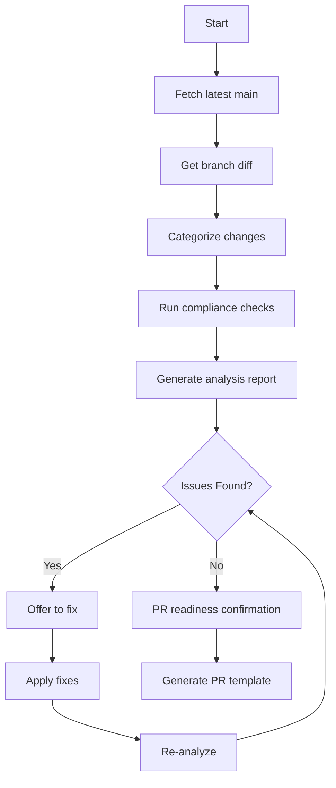

# CODEBOT Command

Automated code quality enforcement that analyzes only the changes in your current branch compared to main.

## What This Command Does

1. **Detects changed files** between your current branch and main branch
2. **Categorizes files** by type (test, controller, component, styles, general) and risk level
3. **Applies MetaMask Mobile guidelines** including design system, TypeScript, testing, and controller standards
4. **Reports violations** with severity levels and fix suggestions
5. **Provides actionable feedback** for PR readiness with scoring

## Core Principles

Automated quality checks • Proactive issue detection • Actionable feedback • PR readiness validation • Follow project guidelines

## Workflow



## Usage Instructions

### In Cursor Chat

Simply type:
```
@CODEBOT
```

Or be more specific:
```
@CODEBOT analyze my changes
@CODEBOT check PR readiness
@CODEBOT what violations do I have?
@CODEBOT am I ready for PR?
```

### Expected Output

CODEBOT will:
1. Identify all changed files in your branch
2. Categorize files by type and risk level
3. Analyze each file according to MetaMask Mobile standards
4. Report violations with severity levels (Critical/High/Medium)
5. Suggest specific fixes for each issue
6. Provide a PR readiness score (X/10)
7. Give you actionable next steps

### Integration with Workflow

**Before committing:**
```
@CODEBOT check my changes
```

**Before creating PR:**
```
@CODEBOT am I ready for PR?
```

**After code review feedback:**
```
@CODEBOT verify fixes
```

**After making fixes:**
```
@CODEBOT re-analyze
```

## Execution Steps

### 1. Fetch Latest Changes

**Ensure up-to-date comparison**:

```bash
git fetch origin main
```

### 2. Get Branch Differences

**List changed files**:

```bash
git diff --name-status origin/main...HEAD
```

**Get detailed changes**:

```bash
git diff origin/main...HEAD --stat
```

**Full diff for analysis**:

```bash
git diff origin/main...HEAD
```

### 3. Categorize Changes

**File Categories**:
- Source files: `*.ts`, `*.tsx`, `*.js`, `*.jsx` (exclude tests)
- Test files: `*.test.ts`, `*.test.tsx`, `*.spec.ts`
- Configuration: `*.json`, `*.yml`, `*.config.*`
- Documentation: `*.md`, `*.mdx`
- Styles: `*.styles.ts`, `*.css`

**Change Types**:
- A = Added (new files)
- M = Modified (existing files changed)
- D = Deleted (removed files)
- R = Renamed (file moved/renamed)

**Risk Assessment**:
- 🔴 High: Controllers, Engine, Security, Core navigation
- 🟡 Medium: Components, Utils, Services
- 🟢 Low: Styles, Constants, Types, Docs

### 4. Run Compliance Checks

#### A. Design System Compliance (UI files only)

**Check for anti-patterns**:

```bash
# ❌ Direct tw import (should use useTailwind hook)
grep -r "import tw from 'twrnc'" <changed-files>

# ❌ StyleSheet usage (should use Tailwind)
grep -r "StyleSheet.create" <changed-files>

# ❌ Raw View/Text (should use Box/Text from design system)
grep -r "from 'react-native'" <changed-files> | grep -E "(View|Text)[ ,]"
```

**Verify correct patterns**:
- ✅ `import { useTailwind } from '@metamask/design-system-twrnc-preset'`
- ✅ `import { Box, Text } from '@metamask/design-system-react-native'`
- ✅ `twClassName=` prop usage
- ✅ Design token colors (bg-default, text-primary, etc.)

#### B. TypeScript Quality

```bash
# Check for 'any' types (should be avoided)
grep -r ": any" <changed-files>

# Run type check
yarn tsc --noEmit

# Check for missing exports
yarn lint:tsc
```

#### C. Controller Compliance (if controller files changed)

**Required patterns**:
- ✅ Extends `BaseController`
- ✅ Has `getDefault${Name}State` function
- ✅ Uses messenger (NO callbacks)
- ✅ Has state metadata
- ✅ Uses `this.update()` for state changes
- ✅ Exports selectors (NOT getter methods)

**Anti-patterns to flag**:
- ❌ Direct `this.state` mutations
- ❌ Callback functions in constructor
- ❌ Getter methods instead of selectors
- ❌ Low-level setters (setState, setProperty)

#### D. Testing Coverage

**Find test files**:

```bash
# For each changed source file, check if test exists
# Example: src/components/Button.tsx → Button.test.tsx
```

**Run affected tests**:

```bash
yarn jest --findRelatedTests <changed-files>
```

**Coverage check**:

```bash
yarn jest --coverage --collectCoverageFrom=<changed-files>
```

#### E. Code Quality

**Run linters**:

```bash
yarn lint:eslint <files>
yarn lint:tsc
```

**Check for anti-patterns**:

```bash
# Console.log statements (should use Logger)
grep -r "console\\.log" <changed-files>

# TODO without issue reference
grep -r "TODO" <changed-files> | grep -v "#[0-9]"

# Hardcoded strings (check for i18n needs)
grep -r "Hardcoded String Pattern" <changed-files>
```

### 5. Generate Analysis Report

**Report Structure**:

```markdown
# Branch Analysis Report

## 📊 Change Summary
- Branch: <current-branch>
- Base: main
- Files changed: X modified, Y added, Z deleted
- Lines: +XXX / -YYY
- Commits ahead: N
- Complexity: [Low/Medium/High]
- Risk level: [Low/Medium/High]

## 📁 Files Changed

### High Risk (N files)
- path/to/controller.ts (+XX/-YY lines)
- path/to/engine.ts (+XX/-YY lines)

### Medium Risk (N files)
- path/to/component.tsx (+XX/-YY lines)

### Low Risk (N files)
- path/to/styles.ts (+XX/-YY lines)
- path/to/README.md (+XX/-YY lines)

## ✅ Compliance Status

### Design System (UI Changes)
- [✅/❌] Uses design system components
- [✅/❌] Uses useTailwind() hook
- [✅/❌] No StyleSheet.create()
- [✅/❌] Uses design tokens

### TypeScript Standards
- [✅/❌] No 'any' types
- [✅/❌] Proper type exports
- [✅/❌] TSDoc for public APIs
- [✅/❌] Type checks pass

### Controller Standards (if applicable)
- [✅/❌] Extends BaseController
- [✅/❌] Has default state function
- [✅/❌] Uses messenger pattern
- [✅/❌] Has state metadata
- [✅/❌] Uses selectors (not getters)

### Testing
- [✅/❌] Unit tests present
- [✅/❌] Tests pass
- [✅/❌] Coverage threshold met
- [✅/❌] No skipped tests

### Documentation
- [✅/❌] TSDoc added/updated
- [✅/❌] README updated
- [✅/❌] Complex logic commented
- [✅/❌] Manual test steps clear

### Code Quality
- [✅/❌] Lint checks pass
- [✅/❌] No console.log statements
- [✅/❌] No unresolved TODOs
- [✅/❌] Proper error handling

## 🎯 Strengths
- List positive aspects of changes
- Good patterns observed
- Quality improvements made

## ⚠️ Issues Found

### Blocking (Must Fix)
1. **Issue description** (file.ts:123)
   - Problem: Detailed explanation
   - Fix: Suggested solution
   - Priority: HIGH

### Warnings (Should Fix)
1. **Issue description** (file.ts:456)
   - Problem: Detailed explanation
   - Fix: Suggested solution
   - Priority: MEDIUM

### Suggestions (Nice to Have)
1. **Improvement idea**
   - Current: What exists now
   - Better: Suggested improvement
   - Priority: LOW

## 📝 PR Readiness

### Readiness Score: X/10

**Status**: [✅ Ready / ⚠️ Ready with changes / ❌ Not ready]

**Checklist**:
- [ ] All blocking issues resolved
- [ ] Tests pass and coverage adequate
- [ ] Lint and type checks pass
- [ ] Documentation complete
- [ ] Changes are focused (single feature/fix)
- [ ] Manual testing steps identified
- [ ] Screenshots ready (if UI changes)

### Suggested PR Title
```
<type>[optional scope]: <description>
```

### Suggested Branch Name
```
<type>/<issue-number>_<description>
```

## 🚀 Next Steps

1. **Fix blocking issues** (if any)
2. **Address warnings** (recommended)
3. **Run tests**: `yarn jest --findRelatedTests`
4. **Create PR** when ready: Use `/commit` then `gh pr create`

## 📚 References
- Coding Guidelines: `.github/guidelines/CODING_GUIDELINES.md`
- UI Guidelines: `.cursor/rules/ui-development-guidelines.mdc`
- Testing Guidelines: `.cursor/rules/unit-testing-guidelines.mdc`
- PR Guidelines: `.cursor/rules/pr-creation-guidelines.mdc`
```

### 6. Offer Automated Fixes

**If issues found, offer to**:

1. **Auto-fix linting issues**:
   ```bash
   yarn lint-staged
   yarn eslint --fix <files>
   ```

2. **Generate test stubs**:
   - Create missing test files
   - Add basic test structure

3. **Add TSDoc templates**:
   - Add JSDoc comments to public methods
   - Document complex functions

4. **Update documentation**:
   - Create/update README if needed
   - Add inline comments for complex logic

### 7. Re-analyze After Fixes

**Verify fixes**:
- Re-run all checks
- Confirm issues resolved
- Update readiness score

## Checklist

- [ ] Latest main fetched
- [ ] Branch diff analyzed
- [ ] Files categorized by risk
- [ ] Design system compliance checked (UI files)
- [ ] TypeScript quality verified
- [ ] Controller standards validated (if applicable)
- [ ] Test coverage assessed
- [ ] Documentation reviewed
- [ ] Code quality checks passed
- [ ] Analysis report generated
- [ ] PR readiness determined
- [ ] Auto-fixes offered (if issues found)

## Success Criteria

**Ready for PR when**:
- All blocking issues resolved
- Tests pass with adequate coverage
- Lint and type checks pass
- Required documentation present
- Changes focused and scoped
- Follows all project guidelines
- Readiness score ≥ 8/10

## Quick Commands

```bash
# Get branch changes
git fetch origin main
git diff --name-status origin/main...HEAD
git diff --stat origin/main...HEAD

# Run quality checks
yarn lint:eslint <files>
yarn tsc --noEmit
yarn jest --findRelatedTests <files>
yarn jest --coverage

# Fix issues
yarn lint-staged
yarn eslint --fix <files>

# Create PR (when ready)
gh pr create --title "type: description" --assignee @me --draft
```

## Advanced Analysis Options

### Detailed Mode
- Line-by-line change review
- Function complexity metrics
- Dependency impact analysis
- Security vulnerability scan

### Quick Mode
- File list only
- Basic compliance checks
- Pass/fail status
- Critical issues only

### PR Template Mode
- Generate complete PR description
- Pre-fill manual testing steps
- Include relevant screenshots sections
- Add related issues references

## Why CODEBOT Analyzes Only Your Changes

CODEBOT analyzes **only your changes** (current branch vs main), so:
- ✅ Fast analysis (only changed files)
- ✅ Focused feedback (your code only)
- ✅ PR-specific (ready to merge?)
- ✅ No noise from existing code
- ✅ Actionable improvements for current work

## Tips for Best Results

1. **Run CODEBOT before creating PR** - Catch issues early
2. **Fix blocking issues first** - They prevent merge
3. **Address high priority issues** - They improve code quality
4. **Consider suggestions** - They follow best practices
5. **Run again after fixes** - Verify all issues resolved
6. **Use with other commands** - Combine with `/unit-test` and `/commit`

## Configuration

CODEBOT automatically:
- ✅ Loads MetaMask Mobile guidelines
- ✅ Identifies file types and risk levels
- ✅ Applies appropriate checks for each file type
- ✅ Provides contextual feedback
- ✅ Suggests actionable fixes
- ✅ Scores PR readiness

No configuration needed - it just works!

## References

- PR Creation Guidelines: `.cursor/rules/pr-creation-guidelines.mdc`
- Unit Testing Guidelines: `.cursor/rules/unit-testing-guidelines.mdc`
- UI Development Guidelines: `.cursor/rules/ui-development-guidelines.mdc`
- Coding Guidelines: `.github/guidelines/CODING_GUIDELINES.md`
- Controller Guidelines: [MetaMask Core](https://github.com/MetaMask/core/blob/main/docs/controller-guidelines.md)

---

**Remember**: CODEBOT is a guide, not a gatekeeper. Use it to improve code quality and catch issues early, but apply judgment to the recommendations. Happy coding! 🚀
