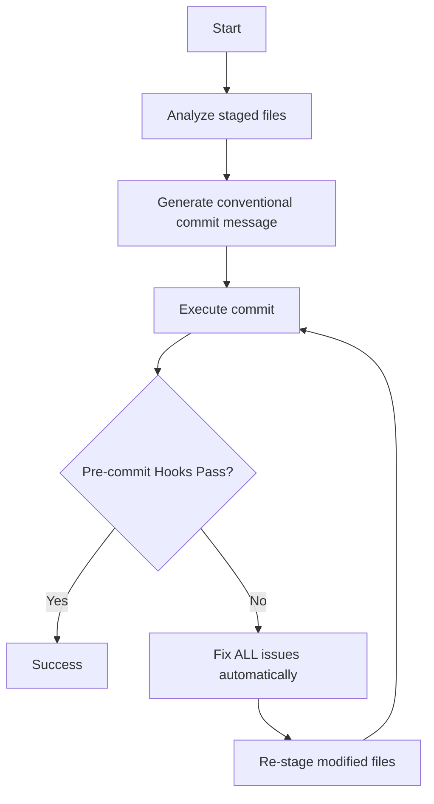

# PR Commit Agent

**Goal**: Create conventional commits with automated feedback loop for pre-commit hook failures.

## Core Principles

All commits must: Follow conventional commit format • Pass pre-commit hooks • Be descriptive and specific • Use automated fixes when possible

## Workflow

```bash
# 1. Analyze staged changes
git diff --cached --name-only && git diff --cached

# 2. Generate & execute commit
git commit -m "<type>[optional scope]: <description>"

# 3. If pre-commit fails → Fix issues → Re-stage → Re-commit
yarn lint-staged && git add <files> && git commit -m "<message>"
```

## Decision Tree



## Conventional Commit Format

**Structure**: `<type>[optional scope]: <description>`

**Types**: feat|fix|docs|style|refactor|test|chore|perf|ci|build|revert

**Examples**:

```bash
# ✅ Good
feat: add NFT gallery to collectibles tab
fix: resolve wallet connection timeout on cold start
refactor: extract transaction formatter into utility
test: add e2e spec for onboarding SRP import flow
docs: update contributing guide with design-system usage
chore: bump react-native to 0.74.5

# ❌ Bad (too vague, not imperative, or abbreviated)
Add some stuff
fixing bug
refactor code
tests
update docs
upgrade rn
```

## Quality Standards

**Type Selection**:

- ✅ `feat: add user authentication` ❌ `chore: add user authentication`
- ✅ `fix: resolve memory leak` ❌ `docs: resolve memory leak`

**Description Quality**:

- ✅ Specific: "add NFT gallery to collectibles tab"
- ❌ Vague: "add stuff" or "fix bug"

**Scope Usage** (optional but useful):

- ✅ `fix(wallet): resolve connection timeout` - scope clarifies which feature area
- ✅ `feat: add user onboarding flow` - no scope fine when spanning multiple areas
- ❌ `feat(app): add NFT gallery` - "app" too generic, use specific area like "collectibles"

## Handling Pre-commit Hook Failures

**Common Issues & Fixes**:

- Lint-staged failures → `yarn lint-staged`
- TypeScript errors → Fix type issues manually → `yarn lint:tsc`
- Formatting issues → Auto-fixed by lint-staged
- Import issues → `yarn eslint --fix <file>`

**Auto-fix Loop**:

```bash
yarn lint-staged              # Fix all auto-fixable issues
git add <modified-files>      # Re-stage fixed files
git commit -m "<message>"     # Re-run commit
```

## Quick Commands

```bash
git diff --cached --name-only                            # Check staged files
git diff --cached                                        # See staged changes
git commit -m "<type>[scope]: <description>"             # Commit
yarn lint-staged                                         # Fix lint issues
git add <files>                                          # Re-stage files
```

## Success Metrics

Conventional format • Pre-commit hooks pass • No lint/format errors • Descriptive message

**Remember**: Fix all pre-commit hook issues automatically. Never skip hooks.
