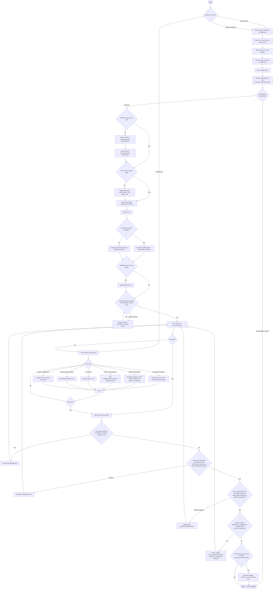

# Component View Test Agent

**Goal**: Create, update, and fix component view tests (`*.view.test.tsx`) in the MetaMask Mobile codebase using the `tests/component-view/` framework.

Use this skill whenever you need to:

- Write a new component view test file
- Update tests after a component or preset has changed
- Fix a failing component view test
- Diagnose why a component view test is failing
- Create a new renderer or preset for a new view

---

## What Are Component View Tests?

Component view tests are **integration-level** tests that test views through real Redux state — no mocked hooks or selectors. They live alongside the component as `ComponentName.view.test.tsx` and use a dedicated framework in `tests/component-view/`.

Key constraint: **only Engine and allowed native modules may be mocked** (enforced at runtime and by ESLint).

---

## The Framework at a Glance

```
tests/component-view/
├── mocks.ts              ← Engine + native mocks (import this first, always)
├── render.tsx            ← renderComponentViewScreen, renderScreenWithRoutes
├── stateFixture.ts       ← StateFixtureBuilder (createStateFixture)
├── presets/
│   ├── bridge.ts         ← initialStateBridge()
│   ├── wallet.ts         ← initialStateWallet()
│   ├── trending.ts       ← initialStateTrending()
│   ├── walletActions.ts  ← initialStateWalletActions()
│   ├── perpsStatePreset.ts ← initialStatePerps()
│   └── predict.ts        ← initialStatePredict()
└── renderers/
    ├── bridge.ts         ← renderBridgeView()
    ├── wallet.ts         ← renderWalletView()
    ├── trending.ts       ← renderTrendingView()
    ├── walletActions.ts  ← renderWalletActionsView()
    ├── perpsViewRenderer.tsx ← renderPerpsView()
    └── predict.tsx       ← renderPredictFeedView(), renderPredictFeedViewWithRoutes()
```

---

## Workflow Overview



---

## Golden Rules (Enforced)

1. **Only mock Engine and allowed native modules** — no arbitrary `jest.mock()` in `*.view.test.*` files. Allowed:
   - `../../app/core/Engine`
   - `../../app/core/Engine/Engine`
   - `react-native-device-info`
   - (these are already handled by `tests/component-view/mocks.ts`)

2. **Drive all behavior through Redux state** — no mocking of hooks or selectors. Provide data via state overrides.

3. **Reuse presets and renderers** — never rebuild the full state manually from scratch.

4. **No fake timers** — never use `jest.useFakeTimers()`, `jest.advanceTimersByTime()`, or `jest.useRealTimers()`.

5. **Test behavior, not snapshots** — use `toBeOnTheScreen()`, `not.toBeOnTheScreen()`, interaction assertions.

6. **Follow AAA** — Arrange → Act → Assert, blank lines between each section. Tests can and should chain multiple user actions when they form a coherent user journey. "One test = one user story or business outcome" — not "one fireEvent per test".

7. **No render scenarios** — a test that only sets up state and checks what's visible (even with multiple assertions) is a render scenario and is an antipattern. Every test must involve at least one of: a user interaction (`fireEvent`), an async flow (`waitFor`/`findBy`), a Redux action (`store.dispatch`/`act`), or an Engine spy. Ask: "does this test involve the user doing something or the system reacting to something?" If no, rewrite it.

8. **Use selector ID constants, never raw strings** — every `getByTestId` / `findByTestId` / `queryByTestId` call must reference a constant from the component's `ComponentName.testIds.ts` file, not a hardcoded string literal. If the file does not exist, create it before writing the test. Raw string literals are only acceptable for elements that belong to another component that hasn't exported its selectors yet (document why in a comment).

9. **Every view with async data needs one data-completeness test** — when a view loads data asynchronously (API call, Engine polling), write one test that waits for the load to complete and then validates all significant fields of all items in the full mock dataset using `within()` per row. This is NOT a render scenario: the async resolution is the event under test. This test proves the full data pipeline end-to-end (mock → controller → Redux → render → visible fields).
   - **Scope:** one data-completeness test per independent async data flow in the view. If a view has a main list AND a search result list, each needs its own completeness assertion in a separate test — they represent distinct async flows.
   - **What to validate:** every significant visible field (name, price, change %, icon text) of every item in the base mock dataset using `within(rowElement)` to scope queries to a single row.

10. **Filter / segmentation tests must assert both sides** — when a test selects a filter, network, or category, always assert both what appears (positive: the expected items are on screen) AND what disappears (negative: `queryByTestId(...).not.toBeOnTheScreen()` for items from the previous set). Asserting only one side does not prove the list actually changed.

---

## The Ideal Component View Test

Component view tests are **integration tests**, not unit tests. The ideal test models a
**complete user journey**: a realistic sequence of actions a user would take and the
system outcomes that result.

### Shape of an ideal test

```typescript
// Note: test ID strings in this example are written out for readability.
// In real code, always import from ComponentName.testIds.ts and use constants:
//   import { PredictFeedSelectorsIDs } from './PredictFeed.testIds';
//   getByTestId(PredictFeedSelectorsIDs.SEARCH_BUTTON)
it('user opens search, types a query, and sees matching results', async () => {
  // Arrange — minimal state + spy setup
  const getMarketsSpy = jest.spyOn(
    Engine.context.PredictController,
    'getMarkets',
  );
  getMarketsSpy.mockResolvedValue([MOCK_PREDICT_MARKET]);
  const { getByTestId, findByPlaceholderText, findByTestId } =
    renderPredictFeedView();

  // Act — realistic user action sequence
  fireEvent.press(getByTestId(PredictFeedSelectorsIDs.SEARCH_BUTTON)); // import from PredictFeed.testIds.ts
  const searchInput = await findByPlaceholderText('Search prediction markets');
  fireEvent.changeText(searchInput, 'bitcoin');

  // Assert — end state: Engine called correctly + UI reflects result
  await waitFor(() => {
    expect(getMarketsSpy).toHaveBeenCalledWith(
      expect.objectContaining({ q: 'bitcoin' }),
    );
  });
  expect(
    await findByTestId(PredictFeedSelectorsIDs.SEARCH_RESULT_ITEM_0),
  ).toBeOnTheScreen(); // import from PredictFeed.testIds.ts

  getMarketsSpy.mockRestore();
});
```

### Rules for the ideal test

- **Multiple actions are fine** — pressing a button, then typing, then pressing again is one user journey
- **Multiple assertions are fine** — assert both sides of a state change (positive + negative)
- **Engine spy + UI assertion in the same test** — proves cause AND effect together
- **The antipattern is still render scenarios** — if there is no `fireEvent`, no async reaction, no `dispatch`, no Engine spy, it's a render scenario regardless of how many assertions it has

---

## Step 0: Read Before Writing

Before writing any test, read:

- The component file under test
- Any existing `*.view.test.tsx` for the same component
- The relevant preset(s) in `tests/component-view/presets/`
- The relevant renderer(s) in `tests/component-view/renderers/`

---

## Step 0.5: Enumerate Use Cases and Check for Duplication

**Do this before writing a single test line.** Produce a candidate list that is explicitly scoped and deduplicated.

### 1. List User-Facing Actions

Ask: "What can a user **do** on this screen?" Be exhaustive:

- Type or paste input (amount, address, search query)
- Press a button (CTA, confirm, cancel, back, copy)
- Select an item from a list (token, network, account, chain)
- Scroll to load more / pull to refresh
- Dismiss or open a modal / bottom sheet
- Navigate to a sub-screen
- Wait for async data to arrive (API response, Engine polling)
- Long-press or swipe an item
- Toggle a setting or switch

### 2. Map Each Action to a Component View Test Category

Only keep actions that map to a **valid test pattern**. Drop anything that would only produce a render scenario.

| User action / system event                            | Valid pattern                                         |
| ----------------------------------------------------- | ----------------------------------------------------- |
| Presses button → UI changes                           | `fireEvent.press` → `waitFor`                         |
| Types input → value appears                           | `userEvent.type` or `fireEvent.changeText` → `findBy` |
| Selects item → navigates                              | `userEvent.press` → route probe                       |
| Redux action dispatched → Engine called               | `store.dispatch` + `act` → Engine spy                 |
| Async data arrives → list renders                     | `findBy` / `waitFor`                                  |
| User triggers action → API called with correct params | interaction → spy assertion                           |
| Multi-step user journey → end state visible           | Multiple `fireEvent` → final `findBy`                 |

**Drop these — they are render scenarios:**

- "The screen shows X when state is Y" (no interaction, no async, no dispatch)
- "The button is disabled when no amount is set" (static check, no action)
- "The token name appears in the header" (initial render only)

### 3. Check Existing View Tests for Duplication

For each remaining candidate, read `ComponentName.view.test.tsx` (if it exists) and ask:

- Is there already a view test that covers this exact interaction?

Remove duplicates from your candidate list.

### 4. Run Coverage to Identify Impact

Before finalizing the candidate list, run coverage on the feature area **without `--silent` and without `--coverage=false`** to see which files and lines are least covered:

```bash
# Coverage for a specific feature folder
yarn jest -c jest.config.view.js app/components/UI/MyFeature --runInBand --coverage

# Coverage for a single file
yarn jest -c jest.config.view.js app/components/UI/MyFeature/Views/MyView/MyView.view.test.tsx --runInBand --coverage
```

Read the coverage table output. Focus on:

- Files with **low line/branch coverage** — interactions that exist in the component but are never exercised by any test
- **Uncovered branches** — conditions like `if (isLoading)`, `if (error)`, `if (hasQuote)` that have no test hitting the false/true path

Use this to **prioritize** your candidate list: implement the tests that cover the most uncovered paths first.

### 5. Present the Candidate List and Wait for Approval

**Stop here.** Present the candidate list to the user — do not write any test code yet.

Format it clearly, ordered by impact (lowest coverage / highest uncovered branch count first):

---

**Proposed tests for `MyView.view.test.tsx`** (ordered by impact):

| #   | Test description                                               | Pattern                         | Coverage impact               |
| --- | -------------------------------------------------------------- | ------------------------------- | ----------------------------- |
| 1   | User types '9.5' on keypad → fiat display updates              | `fireEvent` → `findBy`          | keypad input branch uncovered |
| 2   | User taps dest token area → navigates to token selector        | `fireEvent.press` → route probe | navigation branch uncovered   |
| 3   | `setSlippage('5')` dispatched → Engine called with slippage: 5 | `store.dispatch` → Engine spy   | slippage wiring uncovered     |

Dropped:

- ❌ RENDER SCENARIO: 'shows source token name in header' — no interaction
- ❌ DUPLICATE: 'opens source token selector' — already in `BridgeView.view.test.tsx`

**Proceed with all, a subset, or suggest changes?**

---

Wait for the user's response before writing any test code. If the user adjusts the list, update it and confirm again before implementing.

---

## Step 1: Write a New Test File

### File naming

```
ComponentName.view.test.tsx   ← always *.view.test.tsx
```

### What makes a good test

A good test is driven by **user interaction or a meaningful business condition** — not by what is statically visible after render. If your test has no `fireEvent`, no `act`, no `waitFor`, and no Engine spy, ask yourself: am I just checking the initial render? If yes, it's a render scenario and it's an antipattern.

**Render scenarios are antipatterns — avoid all of these forms:**

```typescript
// ❌ Single condition, static assertion
it('disables the CTA when no source amount is set', () => {
  const { getByTestId } = renderBridgeView({ overrides: { bridge: { sourceAmount: '' } } });
  expect(getByTestId('cta-button')).toBeDisabled();
});

// ❌ Multiple static assertions — still just a render scenario, more assertions don't make it meaningful
it('renders input areas and hides confirm button without tokens or amount', () => {
  const { getByTestId, queryByTestId } = renderBridgeView({ overrides: { ... } });
  expect(getByTestId(SOURCE_AREA)).toBeOnTheScreen();
  expect(getByTestId(DEST_AREA)).toBeOnTheScreen();
  expect(queryByTestId(CONFIRM_BUTTON)).toBeNull();
});
```

**Good tests are interaction-driven or verify a meaningful business rule with a non-trivial state consequence:**

```typescript
// ✅ User types on keypad → fiat value reacts in real time
it('types 9.5 with keypad and displays $19,000.00 fiat value', async () => {
  const { getByTestId, getByText, findByText, findByDisplayValue } =
    defaultBridgeWithTokens({
      bridge: {
        sourceAmount: '0',
        sourceToken: ETH_SOURCE,
        destToken: undefined,
      },
    });

  await waitFor(() =>
    expect(
      getByTestId(BuildQuoteSelectors.KEYPAD_DELETE_BUTTON),
    ).toBeOnTheScreen(),
  );

  fireEvent.press(getByText('9'));
  fireEvent.press(getByText('.'));
  fireEvent.press(getByText('5'));

  expect(await findByDisplayValue('9.5')).toBeOnTheScreen();
  expect(await findByText('$19,000.00')).toBeOnTheScreen();
});

// ✅ Redux dispatch → Engine called with correct params (proves the wiring, not just the UI)
it('calls quote API with custom slippage when user has set 5% and quote is requested', async () => {
  const updateQuoteSpy = jest.spyOn(
    Engine.context.BridgeController,
    'updateBridgeQuoteRequestParams',
  );
  const { store } = defaultBridgeWithTokens({
    bridge: { selectedDestChainId: '0x1' },
  });
  updateQuoteSpy.mockClear();

  act(() => {
    store.dispatch(setSlippage('5'));
  });

  await waitFor(
    () => {
      expect(updateQuoteSpy).toHaveBeenCalledWith(
        expect.objectContaining({ slippage: 5 }),
        expect.anything(),
      );
    },
    { timeout: 1000 },
  );

  updateQuoteSpy.mockRestore();
});

// ✅ Async data completeness — waits for API mock to resolve, then validates every
// field of every item. Valid because data arrival is async (findBy / waitFor).
// One of these per view — proves the full data pipeline end-to-end.
it('user sees all items with complete data after async load', async () => {
  const { findByText, findByTestId } = renderMyFeatureWithRoutes();

  // Wait for the first item to confirm data has loaded
  await waitFor(async () => {
    expect(await findByText('Token A')).toBeOnTheScreen();
  });

  // Validate all fields of each item in the base mock dataset
  const tokenARow = await findByTestId('token-row-item-eip155:1/erc20:0xAAA');
  const tokenAScope = within(tokenARow);
  expect(tokenAScope.getByText('Token A')).toBeOnTheScreen();
  expect(tokenAScope.getByText(/\+5\.2/)).toBeOnTheScreen(); // % change
  expect(tokenAScope.getByText(/\$100/)).toBeOnTheScreen(); // price

  const tokenBRow = await findByTestId('token-row-item-eip155:1/erc20:0xBBB');
  const tokenBScope = within(tokenBRow);
  expect(tokenBScope.getByText('Token B')).toBeOnTheScreen();
  expect(tokenBScope.getByText(/-1\.8/)).toBeOnTheScreen();
  expect(tokenBScope.getByText(/\$200/)).toBeOnTheScreen();
});

// ✅ User navigates to a new screen — proves the navigation wiring end-to-end.
// When you only need to confirm navigation occurred (not render the destination screen),
// omit the Component key. The framework renders a probe element with
// testID=`route-${routeName}` automatically when navigation arrives at that route.
it('navigates to dest token selector on press', async () => {
  const state = initialStateBridge()
    .withOverrides({ bridge: { sourceToken: ETH_SOURCE } })
    .build();
  const { findByTestId, findByText } = renderScreenWithRoutes(
    BridgeView as unknown as React.ComponentType,
    { name: Routes.BRIDGE.ROOT },
    [{ name: Routes.BRIDGE.TOKEN_SELECTOR }],
    { state },
  );

  fireEvent.press(await findByText('Swap to'));

  await findByTestId(`route-${Routes.BRIDGE.TOKEN_SELECTOR}`);
});
```

### Local helper pattern

For test files where most tests share a common baseline, extract a local helper instead of repeating the same overrides:

```typescript
// Define the baseline once — each test only overrides its delta from here
const DEFAULT_BRIDGE = {
  sourceToken: ETH_SOURCE,
  destToken: USDC_DEST,
  sourceAmount: '1',
};

const defaultBridgeWithTokens = (overrides?: Record<string, unknown>) => {
  const { bridge: bridgeOverrides, ...rest } = overrides ?? {};
  return renderBridgeView({
    deterministicFiat: true,
    overrides: {
      bridge: {
        ...DEFAULT_BRIDGE,
        ...(bridgeOverrides as Record<string, unknown>),
      },
      ...rest,
    } as unknown as DeepPartial<RootState>,
  });
};
```

Then each test only specifies its delta from this baseline.

### Minimal template

```typescript
import '../../../../../../tests/component-view/mocks';
import { renderMyFeatureView } from '../../../../../../tests/component-view/renderers/myFeature';
import {
  describeForPlatforms,
  itForPlatforms,
} from '../../../util/test/platform';
import { act, fireEvent, waitFor, within } from '@testing-library/react-native';
import { MyViewSelectorsIDs } from './MyView.testIds'; // ← always import from the component's testIds file
import type { DeepPartial } from '../../../../../util/test/renderWithProvider';
import type { RootState } from '../../../../../reducers';

// Local helper — encapsulates the common baseline, each test only overrides its delta
// Define the baseline before the helper
const DEFAULT_MY_FEATURE = {
  sourceToken: ETH_SOURCE,
  destToken: USDC_DEST,
  sourceAmount: '1',
};

const renderDefault = (overrides?: Record<string, unknown>) => {
  const { myFeature: featureOverrides, ...rest } = overrides ?? {};
  return renderMyFeatureView({
    deterministicFiat: true,
    overrides: {
      myFeature: {
        ...DEFAULT_MY_FEATURE,
        ...(featureOverrides as Record<string, unknown>),
      },
      ...rest,
    } as unknown as DeepPartial<RootState>,
  });
};

describeForPlatforms('MyView', () => {
  // ✅ User interaction → UI reacts
  it('types an amount with the keypad and updates the fiat display', async () => {
    const { getByTestId, getByText, findByDisplayValue, findByText } =
      renderDefault({
        bridge: {
          sourceAmount: '0',
          sourceToken: ETH_SOURCE,
          destToken: USDC_DEST,
        },
      });

    await waitFor(() =>
      expect(
        getByTestId(MyViewSelectorsIDs.KEYPAD_DELETE_BUTTON),
      ).toBeOnTheScreen(),
    );

    fireEvent.press(getByText('1'));
    fireEvent.press(getByText('0'));

    expect(await findByDisplayValue('10')).toBeOnTheScreen();
    expect(await findByText('$20,000.00')).toBeOnTheScreen();
  });

  // ✅ Redux dispatch → Engine method called with correct params
  it('calls updateBridgeQuoteRequestParams with the selected dest chain when chain changes', async () => {
    const updateQuoteSpy = jest.spyOn(
      Engine.context.BridgeController,
      'updateBridgeQuoteRequestParams',
    );
    const { store } = renderDefault({
      bridge: { sourceToken: ETH_SOURCE, sourceAmount: '1' },
    });
    updateQuoteSpy.mockClear();

    act(() => {
      store.dispatch(setDestChain('0xa'));
    });

    await waitFor(() => {
      expect(updateQuoteSpy).toHaveBeenCalledWith(
        expect.objectContaining({ destChainId: '0xa' }),
        expect.anything(),
      );
    });

    updateQuoteSpy.mockRestore();
  });

  // ✅ User press → navigates to a new screen
  it('opens the destination token selector when the dest token area is tapped', async () => {
    const state = initialStateMyFeature()
      .withOverrides({ bridge: { sourceToken: ETH_SOURCE } })
      .build();
    const { findByText, findByTestId } = renderScreenWithRoutes(
      MyView as unknown as React.ComponentType,
      { name: Routes.MY_FEATURE },
      [{ name: Routes.MY_FEATURE_TOKEN_SELECTOR }],
      { state },
    );

    fireEvent.press(await findByText('Swap to'));

    await findByTestId(`route-${Routes.MY_FEATURE_TOKEN_SELECTOR}`);
  });
});
```

### Import order

**Hard requirement:** `tests/component-view/mocks` must be the very first import (side-effect import that installs the Engine and native module mocks before anything else loads).

For all remaining imports, follow the project's ESLint import ordering rules. The order is flexible — a typical arrangement is:

1. `tests/component-view/mocks` **(must be first)**
2. Renderer (e.g. `renderBridgeView`)
3. Platform helpers: `describeForPlatforms`, `itForPlatforms` from `app/util/test/platform`
4. Selector ID constants from `./ComponentName.testIds`
5. `@testing-library/react-native` utilities
6. Any other test-specific constants or type imports

---

## Step 2: Choose the Right Renderer and Preset

### Use an existing renderer when available

| View area      | Renderer                                                    | Preset                      |
| -------------- | ----------------------------------------------------------- | --------------------------- |
| Bridge         | `renderBridgeView`                                          | `initialStateBridge`        |
| Wallet         | `renderWalletView`                                          | `initialStateWallet`        |
| Trending       | `renderTrendingView`                                        | `initialStateTrending`      |
| Wallet Actions | `renderWalletActionsView`                                   | `initialStateWalletActions` |
| Perps          | `renderPerpsView`                                           | `initialStatePerps`         |
| Predict        | `renderPredictFeedView` / `renderPredictFeedViewWithRoutes` | `initialStatePredict`       |

### Passing state overrides

Always start from a preset, then narrow down with minimal overrides:

```typescript
// Good — minimal delta from preset
renderBridgeView({
  deterministicFiat: true,
  overrides: {
    bridge: { sourceAmount: '1' },
  },
});

// Good — complex override via engine background state when needed
renderBridgeView({
  overrides: {
    engine: {
      backgroundState: {
        BridgeController: {
          state: { quotesLastFetched: 0 },
        },
      },
    },
  },
});
```

### When no renderer exists for the view yet

Create one. Pattern (copy from `tests/component-view/renderers/bridge.ts`):

```typescript
// tests/component-view/renderers/myFeature.ts
import '../mocks';
import React from 'react';
import type { DeepPartial } from '../../../app/util/test/renderWithProvider';
import type { RootState } from '../../../app/reducers';
import { renderComponentViewScreen } from '../render';
import Routes from '../../../app/constants/navigation/Routes';
import MyView from '../../../app/components/Views/MyFeature';
import { initialStateMyFeature } from '../presets/myFeature';

interface RenderMyFeatureOptions {
  overrides?: DeepPartial<RootState>;
  deterministicFiat?: boolean;
}

export function renderMyFeatureView(
  options: RenderMyFeatureOptions = {},
): ReturnType<typeof renderComponentViewScreen> {
  const { overrides, deterministicFiat } = options;
  const builder = initialStateMyFeature({ deterministicFiat });
  if (overrides) builder.withOverrides(overrides);
  const state = builder.build();
  return renderComponentViewScreen(
    MyView as unknown as React.ComponentType,
    { name: Routes.MY_FEATURE },
    { state },
  );
}
```

### When the view uses React Query (`@tanstack/react-query`)

If the view (or any child component) calls `useQuery` / `useMutation`, wrap the component in a `QueryClientProvider` inside the renderer — otherwise tests throw `No QueryClient set`:

```typescript
// tests/component-view/renderers/myFeature.tsx
import React from 'react';
import { QueryClient, QueryClientProvider } from '@tanstack/react-query';
import { renderComponentViewScreen } from '../render';
import { initialStateMyFeature } from '../presets/myFeature';
import MyView from '../../../app/components/UI/MyFeature/MyView';
import Routes from '../../../app/constants/navigation/Routes';

export function renderMyFeatureView(options = {}) {
  const state = initialStateMyFeature(options).build();
  const queryClient = new QueryClient({ defaultOptions: { queries: { retry: false } } });

  return renderComponentViewScreen(
    () => (
      <QueryClientProvider client={queryClient}>
        <MyView />
      </QueryClientProvider>
    ),
    { name: Routes.MY_FEATURE },
    { state },
  );
}
```

Key points:

- Set `retry: false` so failed queries surface immediately in tests without retry delays
- Create a **new `QueryClient` per call** to avoid state leaking between tests

### When the view reads route params (`initialParams`)

`renderComponentViewScreen` and `renderScreenWithRoutes` accept a 4th `initialParams` argument for views that read params from the route (e.g. via `useRoute().params`):

```typescript
// For a view that expects { marketId: string } as route params
renderComponentViewScreen(
  MyDetailView as unknown as React.ComponentType,
  { name: Routes.MY_FEATURE.DETAIL },
  { state },
  { marketId: 'market-abc-123' }, // ← initialParams as 4th argument
);
```

In tests using `renderScreenWithRoutes`, pass `initialParams` in the route object:

```typescript
renderScreenWithRoutes(
  MyDetailView as unknown as React.ComponentType,
  { name: Routes.MY_FEATURE.DETAIL, params: { marketId: 'market-abc-123' } },
  [],
  { state },
);
```

If the component crashes with `Cannot read properties of undefined (reading 'marketId')`, the view is reading a required route param — pass it via `initialParams` or `params`.

---

And the matching preset (`tests/component-view/presets/myFeature.ts`):

```typescript
import { createStateFixture } from '../stateFixture';

export const initialStateMyFeature = (options?: {
  deterministicFiat?: boolean;
}) => {
  const builder = createStateFixture()
    .withMinimalAccounts()
    .withMinimalMainnetNetwork()
    .withMinimalKeyringController()
    .withRemoteFeatureFlags({});

  if (options?.deterministicFiat) {
    builder.withOverrides({
      /* currency rate overrides */
    });
  }
  return builder;
};
```

---

## Step 3: Navigation Testing

### How route probes work

When `renderScreenWithRoutes` registers a route, the framework automatically renders a probe element with `testID=\`route-${routeName}\`` when navigation arrives at that route. This is what makes `findByTestId(\`route-${Routes.X}\`)` work.

- **To assert navigation occurred**: register the route without a `Component` key. The probe element is rendered automatically — you only need `findByTestId(\`route-${routeName}\`)`.
- **To test the destination screen itself** (cross-screen journeys): register the route with `Component: RealComponent`. The real component renders instead of the probe.
- **In renderers**: always register the real components so that cross-screen journey tests work. Probe-only routes are for one-off navigation assertions in individual tests.

### Single navigation push

When a test asserts that pressing something navigates to a new screen, use `renderScreenWithRoutes`. Register only the routes that test needs to assert on:

```typescript
import { renderScreenWithRoutes } from '../../../../../../../tests/component-view/render';
import { initialStateBridge } from '../../../../../../../tests/component-view/presets/bridge';
import Routes from '../../../../../../constants/navigation/Routes';

it('opens the destination token selector when the dest token area is tapped', async () => {
  const state = initialStateBridge()
    .withOverrides({ bridge: { sourceToken: ETH_SOURCE } })
    .build();

  const { findByTestId, findByText } = renderScreenWithRoutes(
    BridgeView as unknown as React.ComponentType,
    { name: Routes.BRIDGE.ROOT },
    [{ name: Routes.BRIDGE.TOKEN_SELECTOR }],
    { state },
  );

  fireEvent.press(await findByText('Swap to'));

  await findByTestId(`route-${Routes.BRIDGE.TOKEN_SELECTOR}`);
});
```

### Multi-screen renderer (for feature-level tests)

When a feature can navigate across several screens and you want to test those journeys end-to-end, the renderer itself should pre-register **all reachable routes** — not just the entry screen. This is the pattern used by `renderTrendingViewWithRoutes`:

```typescript
// tests/component-view/renderers/myFeature.ts
export function renderMyFeatureWithRoutes(options = {}) {
  const state = initialStateMyFeature(options).build();

  return renderScreenWithRoutes(
    MyFeatureHome as unknown as React.ComponentType,
    { name: Routes.MY_FEATURE.HOME },
    [
      {
        name: Routes.MY_FEATURE.DETAIL,
        Component: MyFeatureDetail as unknown as React.ComponentType<unknown>,
      },
      {
        name: Routes.MY_FEATURE.FILTER_MODAL,
        Component: MyFeatureFilter as unknown as React.ComponentType<unknown>,
      },
      {
        name: Routes.MY_FEATURE.ASSET,
        Component: AssetDetails as unknown as React.ComponentType<unknown>,
      },
    ],
    { state },
  );
}
```

Then tests can navigate across screens freely without registering routes per test.

### Cross-screen journey test

The most valuable navigation tests follow a **complete user journey across multiple screens**:

```typescript
// ✅ User navigates from feed → full list view, then applies a network filter —
// the list updates with chain-specific data.
//
// Key techniques in this pattern:
//
// 1. DYNAMIC MOCK — the mock responds differently based on the params the component
//    passes. This proves the component sends the correct filter params to the API,
//    not just that the UI reacts to props.
//
// 2. PAIRED ASSERTIONS — after selecting the filter, assert BOTH sides:
//    - Positive: new items appear (the filtered set)
//    - Negative: old items are gone (queryByTestId(...).not.toBeOnTheScreen())
//    Asserting only one side does not prove the list actually changed.
it('displays only BNB tokens when BNB Chain network filter is selected', async () => {
  // Dynamic mock: returns different data based on the chainIds param
  getMyFeatureDataMock.mockImplementation(async (params) => {
    if (params?.chainIds?.length === 1 && params.chainIds[0] === 'eip155:56') {
      return mockBnbChainToken; // BNB-specific dataset
    }
    return mockTokensData; // default multi-chain dataset
  });

  const { findByTestId, findByText, getByTestId, queryByTestId } =
    renderMyFeatureWithRoutes();

  // Screen 1: wait for feed to load (confirms default data is visible)
  await waitFor(() =>
    expect(
      getByTestId(MyFeatureSelectorsIDs.FEED_SCROLL_VIEW),
    ).toBeOnTheScreen(),
  );

  // Navigate to full list view
  await userEvent.press(getByTestId('section-header-view-all'));
  await waitFor(() =>
    expect(getByTestId('full-list-header')).toBeOnTheScreen(),
  );

  // Confirm a non-BNB token is visible before filtering
  expect(
    await findByTestId('token-row-eip155:1/erc20:0xAAA...'),
  ).toBeOnTheScreen();

  // Open network filter modal and select BNB Chain
  await userEvent.press(getByTestId('all-networks-button'));
  await waitFor(() => expect(getByTestId('close-button')).toBeOnTheScreen());
  await userEvent.press(await findByText('BNB Chain'));

  // ✅ Positive assertions — BNB token appears with all its fields
  const bnbRow = await findByTestId('token-row-eip155:56/erc20:0xBTC000...');
  expect(within(bnbRow).getByText('Bitcoin BNB')).toBeOnTheScreen();
  expect(within(bnbRow).getByText(/\$44,500/)).toBeOnTheScreen();
  expect(within(bnbRow).getByText(/-1\.8/)).toBeOnTheScreen();

  // ✅ Negative assertions — previous chain tokens are gone (proves the list changed,
  // not just that new items were added on top)
  expect(
    queryByTestId('token-row-eip155:1/erc20:0xAAA...'),
  ).not.toBeOnTheScreen();
  expect(
    queryByTestId('token-row-eip155:1/erc20:0xBBB...'),
  ).not.toBeOnTheScreen();
  expect(
    queryByTestId('token-row-eip155:1/erc20:0xCCC...'),
  ).not.toBeOnTheScreen();
});
```

### `userEvent` vs `fireEvent`

For interactions that involve realistic user behavior (typing, pressing with focus), prefer `userEvent` over `fireEvent`:

```typescript
import { fireEvent, userEvent } from '@testing-library/react-native';

// ✅ userEvent — simulates full event sequence including focus, pointer events
await userEvent.press(getByTestId('button'));
await userEvent.type(getByTestId('search-input'), 'ethereum');

// fireEvent — lower-level, useful when userEvent isn't available or for non-user events
fireEvent.press(getByTestId('button'));
fireEvent.changeText(getByTestId('input'), 'value');
```

Route names live in `app/constants/navigation/Routes.ts`.

---

## Step 4: External Service / API Mocking

Some views call external services **directly** (not through Engine controllers) — e.g. a `getTrendingTokens()` function imported from a package, or a `fetch()` call to an external API. These cannot be driven through Redux state overrides.

### Current pattern — jest.mock on the service module

When a view calls an external service function directly, mock the module in a dedicated file under `tests/component-view/mocks/` and expose setup/clear helpers:

```typescript
// tests/component-view/mocks/myFeatureApiMocks.ts
import { getMyFeatureData } from '@metamask/some-package';

export const getMyFeatureDataMock = getMyFeatureData as jest.Mock;

export const mockFeatureData = [
  { id: 'item-1', name: 'Token A', price: '100.00', change24h: 5.2 },
  { id: 'item-2', name: 'Token B', price: '200.00', change24h: -1.8 },
];

export const setupMyFeatureApiMock = (data = mockFeatureData) => {
  getMyFeatureDataMock.mockImplementation(async () => data);
};

export const clearMyFeatureApiMocks = () => {
  jest.clearAllMocks();
};
```

In the test file, declare the `jest.mock` at module scope and use `beforeEach`/`afterEach` for lifecycle:

```typescript
// NOTE: antipattern — only Engine and native modules should be mocked in view tests.
// This is a temporary workaround for service functions called directly from components,
// not through Engine. Track removal in the linked issue.
// eslint-disable-next-line no-restricted-syntax
jest.mock('@metamask/some-package', () => {
  const actual = jest.requireActual('@metamask/some-package');
  return { ...actual, getMyFeatureData: jest.fn().mockResolvedValue([]) };
});

import {
  setupMyFeatureApiMock,
  clearMyFeatureApiMocks,
  mockFeatureData,
  getMyFeatureDataMock,
} from '../../../../tests/component-view/mocks/myFeatureApiMocks';

describe('MyFeatureView', () => {
  beforeEach(() => {
    setupMyFeatureApiMock(mockFeatureData);
  });

  afterEach(() => {
    clearMyFeatureApiMocks();
  });

  it('shows token list after data loads from the external service', async () => {
    const { findByText } = renderMyFeatureWithRoutes();

    expect(await findByText('Token A')).toBeOnTheScreen();
  });

  it('shows only filtered results when a specific param is passed', async () => {
    getMyFeatureDataMock.mockImplementation(async (params) => {
      if (params?.chainId === 'eip155:56') return [mockBnbData];
      return mockFeatureData;
    });

    const { findByText } = renderMyFeatureWithRoutes();
    // ... interact to trigger the filter, then assert
  });
});
```

> ⚠️ **This is a known antipattern.** The golden rule is that only Engine and allowed native modules should be mocked in `*.view.test.*` files. Mocking a service module directly bypasses the ESLint guard (note the `eslint-disable` comment). Always link to a tracking issue and plan to migrate to a proper solution.

### Future pattern — Mock Service Worker (MSW)

> 📌 **Placeholder — no example exists yet in this codebase.**

For views that call HTTP endpoints directly (via `fetch`), the intended approach is [Mock Service Worker (msw)](https://mswjs.io/), which intercepts requests at the network level without needing `jest.mock`. This keeps tests closer to real behavior and avoids the module-mock antipattern.

When the first MSW-based view test is written, document the setup here:

```typescript
// TODO: Add MSW setup example once the first test using it is merged.
// Expected shape:
//
// import { setupServer } from 'msw/node';
// import { http, HttpResponse } from 'msw';
//
// const server = setupServer(
//   http.get('https://api.example.com/tokens', () =>
//     HttpResponse.json(mockTokensData),
//   ),
// );
//
// beforeAll(() => server.listen());
// afterEach(() => server.resetHandlers());
// afterAll(() => server.close());
```

---

## Step 5: Deterministic Fiat Assertions

Pass `deterministicFiat: true` whenever a test asserts exact currency values. This injects stable exchange rates:

```typescript
const { getByText } = renderBridgeView({
  deterministicFiat: true,
  overrides: { bridge: { sourceAmount: '1' } },
});
expect(getByText('$2,000.00')).toBeOnTheScreen();
```

---

## Step 6: Run the Tests

**Always use `jest.config.view.js`** — the default Jest config does not apply the component view test rules.

```bash
# Run a single file
yarn jest -c jest.config.view.js app/components/UI/Bridge/Views/BridgeView/BridgeView.view.test.tsx --runInBand --silent --coverage=false

# Run a specific test by name
yarn jest -c jest.config.view.js <file> -t "renders the source token" --runInBand --silent --coverage=false

# Watch mode
yarn jest -c jest.config.view.js <file> --watch
```

---

## Step 6.5: Self-Review Checklist (run after all tests pass)

Before declaring the task done, go through this checklist for every test written or modified. If any item fails, fix it and re-run.

| #   | Check                                                                                                                                                                                                                                                        | What to do if it fails                                                 |
| --- | ------------------------------------------------------------------------------------------------------------------------------------------------------------------------------------------------------------------------------------------------------------ | ---------------------------------------------------------------------- |
| 1   | **No render scenarios** — every test has at least one `fireEvent`, `waitFor`/`findBy`, `store.dispatch`, or Engine spy                                                                                                                                       | Rewrite the test to add a user interaction or system reaction          |
| 2   | **No selector mocking** — no `(useSelector as jest.Mock).mockImplementation(...)` anywhere in the file                                                                                                                                                       | Remove; drive behavior through state overrides instead                 |
| 3   | **No fake timers** — no `jest.useFakeTimers()`, `jest.advanceTimersByTime()`, or `jest.useRealTimers()`                                                                                                                                                      | Remove fake timers; use `waitFor` / `findBy` for async flows           |
| 4   | **Data-completeness test exists** — if the view loads data asynchronously (API, Engine polling), there is one test that waits for the load and validates all fields of all items in the full base mock using `within()` per row                              | Add the data-completeness test                                         |
| 5   | **Filter/segmentation tests have paired assertions** — every test that selects a filter or changes a network asserts both what appears (`findByTestId`) AND what disappears (`queryByTestId(...).not.toBeOnTheScreen()`) for each item from the previous set | Add the missing negative assertions                                    |
| 6   | **No raw strings in `getByTestId` / `findByTestId` / `queryByTestId`** — all test IDs reference constants from the component's `ComponentName.testIds.ts`                                                                                                    | Create or update the testIds file; replace raw strings with constants  |
| 7   | **Any `jest.mock` for non-Engine modules is flagged** — if a service module is mocked directly, the `eslint-disable` comment is present and a tracking issue is linked                                                                                       | Add the comment and issue link                                         |
| 8   | **AAA formatting** — blank lines between the Arrange, Act, and Assert blocks in every test                                                                                                                                                                   | Add the blank line separators                                          |
| 9   | **Import order** — `mocks.ts` is first; remaining order follows project ESLint rules                                                                                                                                                                         | Ensure `mocks.ts` is the very first import; reorder the rest as needed |

---

## Step 7: Diagnosing Failures

### Identify the error type first

| Error pattern                                    | Likely cause                                       | Fix                                                               |
| ------------------------------------------------ | -------------------------------------------------- | ----------------------------------------------------------------- |
| `jest.mock is not allowed in *.view.test.*`      | Arbitrary `jest.mock` added to test                | Remove it; drive via state instead                                |
| `Unable to find an element with testID: xxx`     | State not providing needed data, or element hidden | Add the relevant state via overrides or check rendering condition |
| `Cannot read property 'X' of undefined`          | Preset missing a required state slice              | Add `.withMinimalXController()` or override in preset             |
| `Warning: An update was not wrapped in act(...)` | Async state update not awaited                     | Use `await waitFor(...)`                                          |
| `No QueryClient set`                             | Missing provider — not in Engine mock              | Add to mocks.ts or wrap with QueryClientProvider in renderer      |
| Flakey number assertions                         | Non-deterministic exchange rates                   | Add `deterministicFiat: true`                                     |
| Test passes locally, fails in CI                 | Time-sensitive assertions                          | Use `waitFor` not inline assertions after interactions            |

### Inspect what's rendered

```typescript
// Add temporarily inside the test
const { debug } = renderBridgeView();
debug(); // prints full component tree
```

### Check that state data reaches the component

Add a `console.log` in the component temporarily, or use `debug()` to confirm the Redux state is wired correctly before writing assertions.

### Check stale presets

When a controller's state shape changes (e.g. a new required field added to `BridgeController`), the preset becomes stale. Compare the component's actual selector usage against what the preset provides.

---

## Assertion Patterns

```typescript
// Presence / absence
expect(getByText('Label')).toBeOnTheScreen();
expect(queryByText('Label')).not.toBeOnTheScreen();

// Enabled / disabled state
expect(getByTestId('cta-button')).toBeEnabled();
expect(getByTestId('cta-button')).toBeDisabled();

// After interaction
fireEvent.press(getByTestId('some-button'));
await waitFor(() => expect(getByText('Result')).toBeOnTheScreen());

// Navigation assertion
await findByTestId(`route-${Routes.SOME_SCREEN}`);

// Within a subtree — scope queries to avoid false positives when the same text or
// testID appears in multiple list items (e.g., every row shows a "price" label).
// Use within(rowElement) to constrain the query to a single row.
import { within } from '@testing-library/react-native';
const card = getByTestId(MyViewSelectorsIDs.TOKEN_CARD_ETH);
expect(within(card).getByText('ETH')).toBeOnTheScreen();
expect(within(card).getByText('$2,000.00')).toBeOnTheScreen();
```

---

## What NOT to Do

```typescript
// ❌ Render scenario — no interaction, no system reaction, just static visibility
it('renders input areas and hides confirm button without tokens or amount', () => {
  const { getByTestId, queryByTestId } = renderBridgeView({ overrides: { ... } });
  expect(getByTestId(SOURCE_AREA)).toBeOnTheScreen();     // render check
  expect(getByTestId(DEST_AREA)).toBeOnTheScreen();       // render check
  expect(queryByTestId(CONFIRM_BUTTON)).toBeNull();       // render check
});
// More assertions does NOT make it a better test if they're all static.
// ✅ Instead: drive the test through a user interaction, Redux action, or Engine spy

// ❌ Arbitrary mock — blocked by ESLint and runtime guard
jest.mock('../../some/hook', () => ({ useMyHook: jest.fn() }));

// ❌ Mocking a selector
(useSelector as jest.Mock).mockImplementation(...);

// ❌ Fake timers
jest.useFakeTimers();

// ❌ Snapshot assertion
expect(wrapper).toMatchSnapshot();

// ❌ Rebuilding the whole state from scratch
renderComponentViewScreen(MyView, { name: 'X' }, {
  state: { engine: { backgroundState: { /* 200 lines */ } } },
});
// ✅ Instead: use a preset + minimal overrides

// ❌ Raw string literal in getByTestId / findByTestId / queryByTestId
getByTestId('my-view-scroll-view');
queryByTestId('confirm-button');

// ✅ Use the constant from the component's testIds file
import { MyViewSelectorsIDs } from './MyView.testIds';
getByTestId(MyViewSelectorsIDs.SCROLL_VIEW);
queryByTestId(MyViewSelectorsIDs.CONFIRM_BUTTON);

// If the testIds file does not exist yet, create it first:
// export const MyViewSelectorsIDs = {
//   SCROLL_VIEW: 'my-view-scroll-view',
//   CONFIRM_BUTTON: 'my-view-confirm-button',
// } as const;
```

---

## Quick Reference

```bash
# Run component view tests
yarn jest -c jest.config.view.js <path> --runInBand --silent --coverage=false

# Lint check
yarn eslint <path/to/test.tsx>
```

**Key locations:**

| What                                              | Where                                                 |
| ------------------------------------------------- | ----------------------------------------------------- |
| Global Engine + native mocks                      | `tests/component-view/mocks.ts`                       |
| renderComponentViewScreen, renderScreenWithRoutes | `tests/component-view/render.tsx`                     |
| Bridge renderer                                   | `tests/component-view/renderers/bridge.ts`            |
| Wallet renderer                                   | `tests/component-view/renderers/wallet.ts`            |
| Bridge preset                                     | `tests/component-view/presets/bridge.ts`              |
| Wallet preset                                     | `tests/component-view/presets/wallet.ts`              |
| StateFixtureBuilder                               | `tests/component-view/stateFixture.ts`                |
| DeepPartial type                                  | `app/util/test/renderWithProvider` (type-only import) |
| Framework rules                                   | `tests/component-view/COMPONENT_VIEW_TEST_RULES.md`   |
| Routes                                            | `app/constants/navigation/Routes.ts`                  |
