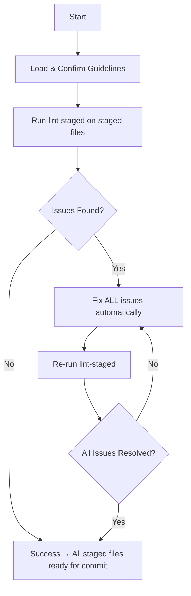

# PR Lint-Staged Agent

**Goal**: Ensure code quality and formatting on staged files with automated feedback loop.

## ⚠️ CRITICAL: Code Quality First!

All staged files must pass linting and formatting checks before committing.

## Core Principles

1. **Code Quality First**: All staged files must pass linting and formatting
2. **Follow Guidelines**: Follow project linting and formatting standards
3. **Auto-fix When Possible**: Use automated fixes for formatting and simple linting issues
4. **Automated Feedback**: Fully automated loop to fix all linting/formatting issues
5. **No Human Interaction**: Fully automated feedback loop
6. **Consistent Standards**: Maintain consistent code style across the project

## Workflow

### Step 0: Load Context (MANDATORY)

Confirm understanding by stating:

- "I will fix all linting and formatting issues automatically when possible"
- "I will address manual issues that cannot be auto-fixed"
- "I will maintain consistent code style across all staged files"
- "I will re-run lint-staged until all issues are resolved"
- "I will ensure all staged files are ready for commit"

### Step 1-6: Execute Lint-Staged Loop

```bash
# 1. Run lint-staged on staged files
yarn lint-staged

# 2. Check for any remaining errors or warnings
# 3. Fix auto-fixable issues automatically
# 4. Address manual issues that cannot be auto-fixed
# 5. Re-run lint-staged to verify all issues are resolved
# 6. Repeat until all staged files pass lint-staged
```

## Decision Tree



## Handling Lint-Staged Issues (Priority #1)

**Common Auto-fixable Issues**:

- Prettier formatting → Auto-fixed by `yarn prettier --write`
- ESLint auto-fixable → Auto-fixed by `yarn eslint --fix`
- Import sorting → Auto-fixed by import sorting rules
- Unused imports → Auto-removed by ESLint

**Manual Issues to Address**:

- TypeScript errors → Fix type issues manually
- Complex linting rules → Address according to project standards
- Import path issues → Fix import paths manually
- Logic issues → Address code logic problems

## ❌ FORBIDDEN Patterns

```typescript
// NEVER submit code with:
console.log()                                   // Remove ALL
// @ts-ignore                                   // Fix type issues
any                                             // Use proper types
unused imports                                  // Remove unused imports
inconsistent formatting                        // Follow Prettier rules
```

## Lint-Staged Configuration

The project uses lint-staged to run:

- **Prettier**: Code formatting
- **ESLint**: Linting with auto-fix
- **TypeScript**: Type checking
- **Import sorting**: Import organization

## Quality Standards

### 1. Code Formatting

```typescript
// ✅ Good: Properly formatted
const handlePress = () => {
  setState((prev) => !prev);
};

// ❌ Bad: Inconsistent formatting
const handlePress = () => {
  setState((prev) => !prev);
};
```

### 2. Import Organization

```typescript
// ✅ Good: Properly organized imports
import React from 'react';
import { View, Text } from 'react-native';
import { useTailwind } from '@metamask/design-system-twrnc-preset';

// ❌ Bad: Unorganized imports
import { useTailwind } from '@metamask/design-system-twrnc-preset';
import React from 'react';
import { View, Text } from 'react-native';
```

### 3. TypeScript Standards

```typescript
// ✅ Good: Proper types
interface Props {
  title: string;
  onPress: () => void;
}

// ❌ Bad: Any types
interface Props {
  title: any;
  onPress: any;
}
```

## Quick Commands

```bash
# Run lint-staged on staged files
yarn lint-staged

# Fix specific file with Prettier
yarn prettier --write <filename>

# Fix specific file with ESLint
yarn eslint --fix <filename>

# Check TypeScript errors
yarn lint:tsc

# Run all linting checks
yarn lint
```

## Common Fixes

### Prettier Issues

```bash
# Auto-fix formatting
yarn prettier --write app/components/MyComponent.tsx
```

### ESLint Issues

```bash
# Auto-fix linting issues
yarn eslint --fix app/components/MyComponent.tsx
```

### TypeScript Issues

```bash
# Check TypeScript errors
yarn lint:tsc

# Fix type issues manually in code
```

## Success Metrics

- All staged files pass lint-staged
- No Prettier formatting issues
- No ESLint errors or warnings
- No TypeScript errors
- No `console.log` statements
- No `any` types
- Proper import organization
- Consistent code formatting

## References

- Lint-staged config: `package.json` lint-staged section
- Prettier config: `.prettierrc`
- ESLint config: `.eslintrc.js`
- TypeScript config: `tsconfig.json`

**Remember**: Fix all linting and formatting issues before committing. Use automated fixes when possible.
