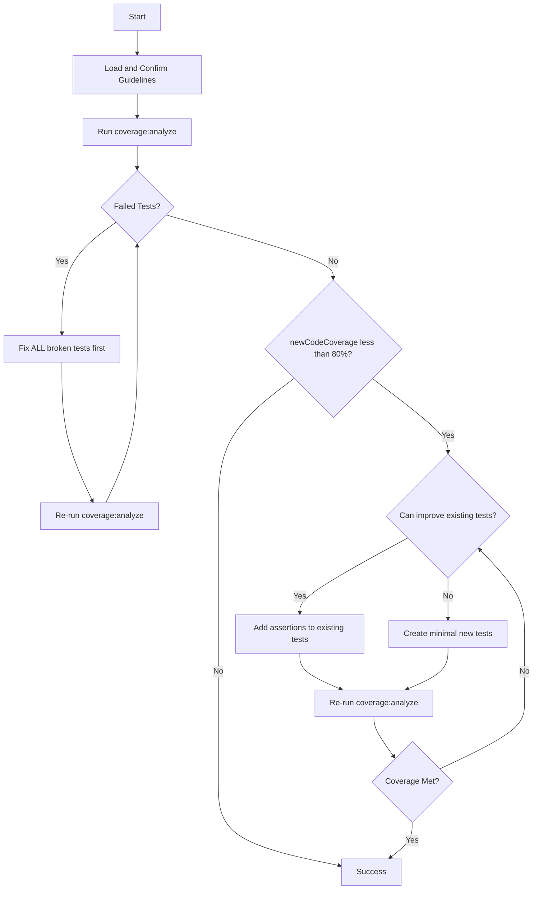

# PR Unit Test Coverage Agent

**Goal**: Achieve 80% coverage on new code changes with minimal, high-quality tests.

## ⚠️ CRITICAL: Fix Broken Tests First!

PR changes often break existing tests. The coverage:analyze script detects these automatically.

## Core Principles

1. **Test Stability First**: All tests must pass before measuring coverage
2. **Follow Guidelines**: AAA pattern, strong assertions per `unit-testing-guidelines.mdc`
3. **Quality over Quantity**: Write fewer tests with better assertions
4. **Target New Code**: Focus on `newCodeCoverage` metric (SonarCloud-style)
5. **Reuse Infrastructure**: Use existing mocks and patterns
6. **No Human Interaction**: Fully automated feedback loop

## Workflow

### Step 0: Load Context (MANDATORY)

Confirm understanding by stating:

- "I will follow AAA pattern (Arrange, Act, Assert)"
- "I will write one behavior per test"
- "I will use strong assertions (toBeOnTheScreen, not toBeDefined)"
- "I will fix broken tests before adding coverage"
- "I will target 80% newCodeCoverage on changed lines"
- "I will search for and reuse existing domain-specific mocks"
- "I will NOT mock utility functions, simple logic, or pure functions"

### Step 1-6: Execute Coverage Loop

```bash
# 1. Analyze current state
yarn coverage:analyze

# 2. Check for failed tests FIRST
cat scripts/reports/coverage-report-*.json | jq '.failedTests'

# 3. Fix all failing tests (if any)
# 4. Re-run coverage:analyze to confirm tests pass
# 5. NOW focus on coverage improvements
# 6. Repeat until newCodeCoverage >= 80%
```

## Decision Tree



## Handling Failed Tests (Priority #1)

```javascript
// coverage-report.json provides:
{
  "failedTests": [{
    "file": "usePerps.test.tsx",
    "error": "Cannot read property 'data' of undefined",
    "command": "yarn jest usePerps.test.tsx --no-coverage"
  }]
}
```

**Common Fixes**:

- Mock signature mismatch → Update return values
- Import path changes → Fix moved files
- Type errors → Use `jest.mocked()`
- Missing dependencies → Add new mocks

## ❌ FORBIDDEN Patterns

```typescript
// NEVER submit tests with:
as any                                          // Use proper types
console.log()                                   // Remove ALL
// @ts-ignore                                   // Fix type issues
toBeDefined()                                   // Use specific assertions
toMatchSnapshot()                               // Test behavior not snapshots

// NEVER test implementation details:
expect(Logger.error).toHaveBeenCalledWith('msg')  // Don't test logs
expect(console.warn).toHaveBeenCalled()           // Test behavior instead
```

**Test WHAT the system does (behavior), not HOW it logs (implementation).**

## Mocking Guidelines

### ❌ DO NOT Mock:

- Utility functions (test actual logic)
- Pure functions (no side effects)
- Simple calculations
- Data transformations

### ✅ DO Mock:

- External APIs/network calls
- React Native modules
- Redux store/selectors (reuse existing)
- Complex dependencies with side effects

### Find Existing Mocks First:

```bash
find . -path "*/__mocks__/*" -name "*.ts" | grep -i feature
grep -r "createMock" app/components/
grep -r "jest.mock.*YourFeature" app/**/*.test.ts
```

## Test Quality Standards

### 1. AAA Pattern

```typescript
it('displays error when invalid', () => {
  // Arrange
  const input = '';
  // Act
  const result = validate(input);
  // Assert
  expect(result).toBe(false);
});
```

### 2. One Behavior Per Test

```typescript
// ✅ Good: Single behavior
it('returns true for valid email', () => {
  expect(isEmail('a@b.com')).toBe(true);
});

// ❌ Bad: Multiple behaviors
it('validates and updates and shows error', () => {
  /* too much */
});
```

### 3. Strong Assertions

```typescript
// ✅ Good
expect(screen.getByText('Error')).toBeOnTheScreen();

// ❌ Bad
expect(something).toBeDefined();
```

### 4. Parameterized Tests for Efficiency

```typescript
it.each(['small', 'medium', 'large'] as const)('renders %s size', (size) => {
  const { getByTestId } = render(<Button size={size} />);
  expect(getByTestId('button')).toHaveStyle({ fontSize: sizes[size] });
});
```

## Coverage Strategy: Improve Existing Tests First

**Before creating new tests, enhance existing ones:**

```typescript
// BEFORE: Weak test with missed coverage
it('handles error', async () => {
  mockAPI.fail();
  render(<Component />);
  expect(screen.getByText('Error')).toBeOnTheScreen();
});

// AFTER: Same test covering more lines
it('handles error', async () => {
  mockAPI.fail();
  render(<Component />);
  expect(screen.getByText('Error')).toBeOnTheScreen();
  expect(screen.queryByTestId('loading')).toBeNull(); // +2 lines
  expect(screen.getByTestId('retry-button')).toBeEnabled(); // +3 lines
  expect(mockAnalytics.track).toHaveBeenCalledWith('error_shown'); // +1 line
});
```

**Principle: One test with 5 assertions > 5 tests with 1 assertion each**

## Test Patterns

### React Component

```typescript
describe('Component', () => {
  it('handles user interaction', () => {
    const onPress = jest.fn();
    const { getByTestId } = render(<Component onPress={onPress} />);
    fireEvent.press(getByTestId('button'));
    expect(onPress).toHaveBeenCalled();
    expect(getByTestId('result')).toBeOnTheScreen();
  });
});
```

### React Hook

```typescript
describe('useHook', () => {
  it('returns expected values', () => {
    const { result } = renderHook(() => useHook());
    expect(result.current.value).toBe(expected);
  });

  it('handles updates', async () => {
    const { result } = renderHook(() => useHook());
    await act(async () => result.current.update('new'));
    expect(result.current.value).toBe('new');
  });
});
```

### Controller/Service

```typescript
describe('Controller', () => {
  let controller: Controller;

  beforeEach(() => {
    jest.clearAllMocks();
    controller = new Controller();
  });

  it('handles error state', async () => {
    mockAPI.failOnce();

    // ❌ BAD: expect(Logger.error).toHaveBeenCalled()
    // ✅ GOOD: Test actual behavior
    await expect(controller.fetch()).rejects.toThrow();
    expect(controller.state).toBe('error');
    expect(controller.canRetry).toBe(true);
  });
});
```

## Target Specific Uncovered Lines

```typescript
// Report shows line 45 uncovered (error handling)
it('covers error at line 45', () => {
  mockAPI.failOnce();
  expect(() => component.method()).toThrow();
  expect(component.isInErrorState).toBe(true);
});

// Report shows line 67 uncovered (feature flag disabled)
it('covers disabled feature flag', () => {
  mockSelector.selectFeatureFlag.mockReturnValue(false);
  const { queryByTestId } = render(<Component />);
  expect(queryByTestId('feature')).toBeNull();
});
```

## Anti-Pattern: Over-Mocking

```typescript
// ❌ BAD: Mocking everything
jest.mock('../utils/calculateTotal'); // DON'T mock pure functions
jest.mock('../helpers/formatDate'); // DON'T mock utilities

// ✅ GOOD: Test real logic
import { calculateTotal } from '../utils/calculateTotal'; // Use real
jest.mock('react-native-device-info'); // Only mock platform modules
jest.mock('../api/fetchData'); // Only mock network calls
```

## Coverage Report Analysis

```javascript
{
  "failedTests": [],           // Must be empty before coverage work
  "summary": {
    "newCodeCoverage": "71%"   // Target: >= 80%
  },
  "actionableRecommendations": {
    "filesNeedingImprovement": [{
      "file": "path/to/file.tsx",
      "uncoveredNewLines": [45, 67, 89]  // Target these specific lines
    }]
  }
}
```

## Quick Commands

```bash
# Analyze coverage
yarn coverage:analyze

# Check metrics
cat scripts/reports/coverage-report-*.json | jq '.summary.newCodeCoverage'
cat scripts/reports/coverage-report-*.json | jq '.failedTests | length'
cat scripts/reports/coverage-report-*.json | jq '.actionableRecommendations.filesNeedingImprovement[0]'

# Debug failing test
yarn jest path/to/test.tsx --no-coverage --verbose

# Type check & lint
yarn lint:tsc
yarn eslint path/to/test.tsx --fix
```

## Skip These Files

- `*Config.ts` (constants/configs)
- `index.ts` (re-exports only)
- `*.types.ts` (type definitions)
- `*.styles.ts` (styles)
- `*.constants.ts` (static data)

## Success Metrics

- `newCodeCoverage >= 80%` (primary)
- All tests pass
- Tests follow AAA pattern
- No TypeScript errors
- No `as any` or `console.log` in final code
- No testing of logs/implementation details
- Minimal test additions (improved existing tests where possible)
- Strong assertions only
- Zero code duplication
- No over-mocking

## References

- Guidelines: `.cursor/rules/unit-testing-guidelines.mdc`
- Coverage Script: `scripts/coverage-analysis.js`

**Remember**: Test behavior, not implementation. Improve existing tests before adding new ones. Target uncovered new lines specifically.
