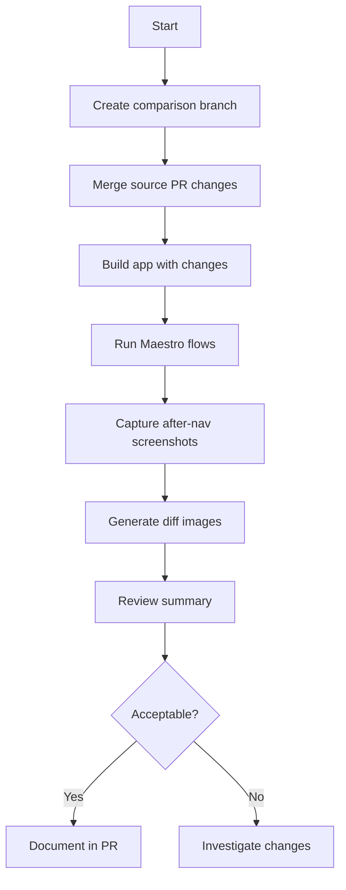

# Visual Regression Comparison Skill

This skill helps compare visual regression baselines between different branches or PRs, typically used to assess the visual impact of significant UI changes like navigation migrations.

## When to Use This Skill

Use this skill when the user wants to:

- Compare visual baselines between two branches or PRs
- Generate visual diff images showing UI changes
- Assess the impact of navigation or UI framework changes
- Validate that UI changes are intentional and acceptable
- Create a visual comparison report for PR review

## Prerequisites

Before running the comparison workflow:

1. **Maestro CLI** must be installed (`curl -Ls 'https://get.maestro.mobile.dev' | bash`)
2. **ImageMagick** must be installed (`brew install imagemagick`)
3. **iOS Simulator** must be running with the app built and installed
4. **Visual regression baselines** must exist in `.maestro/baselines/ios/`

## Workflow Overview



## Step-by-Step Instructions

### 1. Set Up Comparison Branch

Create a new branch that combines the visual regression framework with the target PR changes:

```bash
# Start from the target PR branch (e.g., navigation migration)
git checkout feat/react-navigation-v6-migration

# Create comparison branch
git checkout -b chore/visual-regression-nav-comparison

# Merge visual regression framework
git merge origin/chore/add-maestro-visual-regression-tests --no-edit
```

### 2. Prepare the Environment

```bash
# Ensure simulator is running
xcrun simctl boot "iPhone 15 Pro" 2>/dev/null || true

# Build the app with changes
yarn setup:expo  # or yarn setup for native
yarn watch:clean &
yarn start:ios
```

### 3. Capture Screenshots with Changes

Run the comparison script to capture new screenshots:

```bash
.maestro/scripts/compare-visual-regression.sh capture
```

This will:

- Create `.maestro/after-nav/` directory structure
- Run Maestro flows with modified screenshot paths
- Save screenshots to `after-nav/` instead of `baselines/`

### 4. Generate Diff Images

```bash
.maestro/scripts/generate-diffs.sh
```

This generates:

- `*-diff.png` - Highlighting changed pixels in red
- `*-comparison.png` - Side-by-side comparison (baseline | after | diff)
- `*-report.txt` - Change metrics for each screen
- `summary.md` - Overall regression summary

### 5. Review Results

Check the summary:

```bash
cat .maestro/diffs/summary.md
```

View diff images:

```bash
open .maestro/diffs/
```

## Script Reference

### compare-visual-regression.sh

| Command   | Description                                                |
| --------- | ---------------------------------------------------------- |
| `sync`    | Merge latest navigation changes and regenerate screenshots |
| `capture` | Only capture new screenshots (skip merge)                  |
| `diff`    | Only generate diff images (skip capture)                   |
| `full`    | Run full workflow: sync + capture + diff (default)         |

### generate-diffs.sh

| Option              | Default | Description                       |
| ------------------- | ------- | --------------------------------- |
| `--highlight-color` | `red`   | Color for changed pixels          |
| `--threshold`       | `5%`    | Fuzz threshold for comparison     |
| `--output-format`   | `both`  | `diff`, `side-by-side`, or `both` |

## Directory Structure

```
.maestro/
├── baselines/ios/         # Original baseline screenshots
├── after-nav/ios/         # Screenshots after changes (gitignored)
├── diffs/ios/             # Generated diff images (gitignored)
│   ├── *-diff.png         # Pixel difference highlights
│   ├── *-comparison.png   # Side-by-side comparisons
│   ├── *-report.txt       # Per-screen metrics
│   └── summary.md         # Overall summary
└── scripts/
    ├── compare-visual-regression.sh
    └── generate-diffs.sh
```

## Interpreting Results

### Diff Images

- **Red pixels** in diff images indicate changes
- **White pixels** indicate unchanged areas
- Higher change percentage = more significant visual impact

### Expected vs Unexpected Changes

- **Expected**: Navigation transitions, header styles, tab animations
- **Unexpected**: Content shifts, missing elements, layout breaks

### Change Thresholds

- `< 1%` - Minor rendering differences, usually acceptable
- `1-5%` - Small UI changes, review needed
- `> 5%` - Significant changes, detailed review required

## Syncing Updates

When the source PR is updated:

```bash
# On comparison branch
git fetch origin
.maestro/scripts/compare-visual-regression.sh sync
```

This will:

1. Merge latest changes from the navigation PR
2. Rebuild and recapture screenshots
3. Regenerate diff images
4. Update the summary report

## Documenting for PR Review

Include in your PR description:

```markdown
## Visual Regression Analysis

Compared visual baselines before and after navigation migration.

### Summary

- **Total screens**: X
- **Unchanged**: Y
- **Changed**: Z

### Notable Changes

- [Screen Name]: Description of change and why it's expected

### Diff Images

[Attach or link to relevant diff images]
```

## Troubleshooting

### No Screenshots Captured

- Verify iOS Simulator is running with app installed
- Check Maestro can connect: `maestro hierarchy`
- Ensure flows exist in `.maestro/flows/`

### ImageMagick Errors

- Install with: `brew install imagemagick`
- Verify: `compare --version`

### Large Number of Changes

- Check if app state is consistent (logged in, same network)
- Verify baseline screenshots are from a clean state
- Consider re-generating baselines if they're outdated
