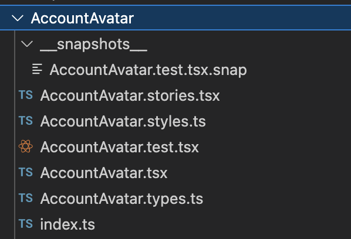
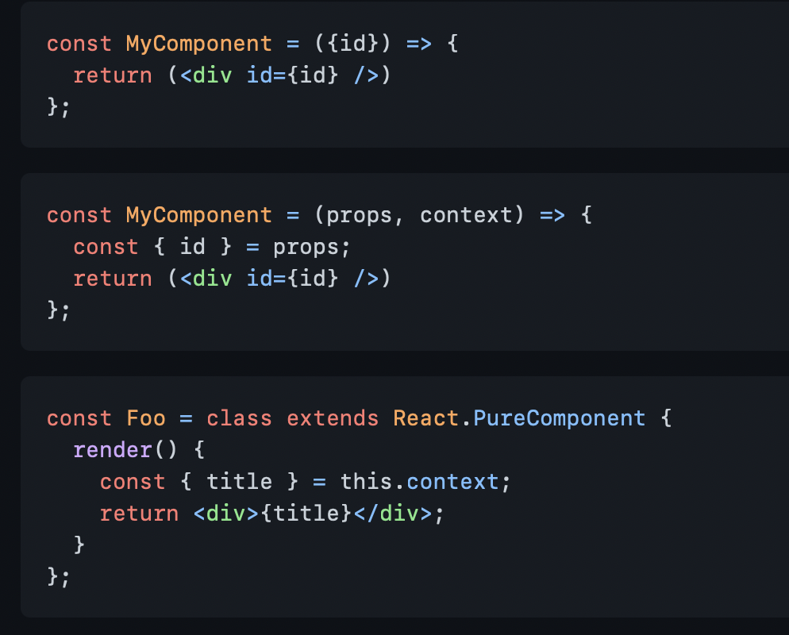

# MetaMask Mobile Coding Guidelines

### 1. New Code Should be Typescript
- New components and utilities should be written in Typescript and enforce typing. 
- Existing code should be refactored into Typescript where time allows. If you are replacing a component use Typescript.

### 2. Using Functional Components and Hooks Instead of Classes
- You can use class or functional components with hooks. Use functional components and hooks as they result in more concise and readable code compared to classes.

### 3. Organize Files Related to the Same Component in One Folder
- An example of a component file structure:

### 4. Follow Naming Conventions
- You should always use PascalCase when naming components to differentiate them from other non-component TSX files. For example: *TextField*, *NavMenu*, and *SuccessButton*.
- Use camelCase for functions declared inside components like *handleInput()* or *showElement()*.
- When creating hooks use *withHOOKNAME()*.

### 5. Avoid Repetitive Code
- If you notice you are writing duplicated code or components, convert it into a component, utility functions or hooks that can be reused. Do this with [scalable intention](https://sandimetz.com/blog/2016/1/20/the-wrong-abstraction). 

### 6. Render Optimization
- In render() functions use sub-components instead of have large inline bodies of components.
- Use memoizing on rendering (useMemo) and methods (useCallback) when possible. Follow recommended React Native guidance.

### 7. Use Object Destructuring For Props
- Instead of passing the props object, use object destructuring to pass the prop name. This discards the need to refer to the props object each time you need to use it.

### 8. Document Each Component/Utility
- New utility functions should be documented using the [JSDoc](https://jsdoc.app) or [TSDoc](https://tsdoc.org) commenting format.
- Referencing our component docs.
- If applicable add URL to online resources if they are meaningful for the component/method.

### 9. Write Tests for Each Component/Utility
- Write tests for the components you create as it reduces the possibilities of errors. Testing ensures that the components are behaving as you would expect. In this project Jest is used, and it provides an environment where you can execute your tests.

### 10. External packages should be well maintained
- New packages should only be integrated if the application doesn’t have the existing functionality and it cannot be added by implementing a small utility function. Use the https://snyk.io/advisor/ to assess the popularity, maintainability and security analysis. The package must be in good standing to be added to the project.
- Update existing dependencies when you notice they are out of date.

[Source](https://www.makeuseof.com/must-follow-react-practices/)
