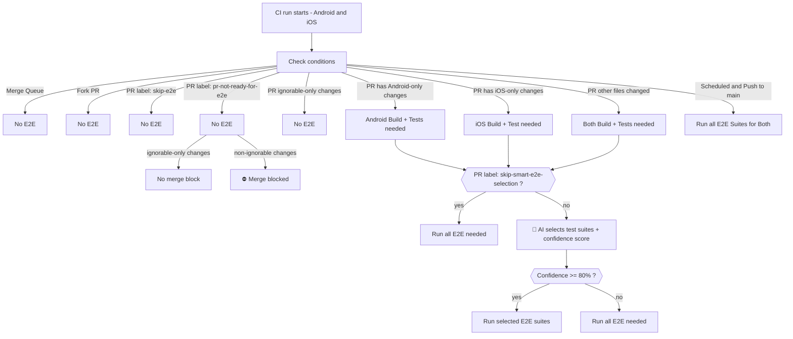

# E2E Test Decision Tree

The following diagram shows the high level decision flow used by Mobile CI to determine whether E2E tests should run, to which platform, and whether AI-powered test selection is applied.

## E2E tests skipped by default on new PRs

To save infra resources while waiting for static analysis findings and potential fixes/iterations:

- Label `pr-not-ready-for-e2e` is applied to the PR automatically when it is created.
- E2E tests are skipped and merge is blocked while the label is present, **unless** all changes are ignorable-only.
- If E2E tests are needed, they should pass to be able to merge.

## AI test selection

Runs only when all of the following are true:

- Not a fork
- No hard E2E skip signal (label `skip-e2e`)
- No `skip-smart-e2e-selection` labelllllllllll

## (Exceptional) skip builds and all E2E tests

- Label `skip-e2e` can be added to the PR to skip E2E tests (and builds) in case of infra issues.
- Using this label should be exceptional in case of CI friction and urgencies. Verify new changes and regressions manually before merging.

## E2E flakiness detection in PRs

Flakiness detection is applied to modified E2E test files in PRs:

- Modified E2E test files run twice
- It applies to existing test files as well as new test files added in the PR
- It can be disabled by adding the label `skip-e2e-flakiness-detection`. Useful when making large refactors or when changes don't pose flakiness risk.
