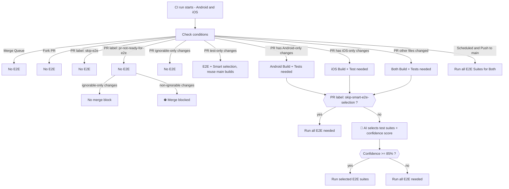

# E2E Test Decision Tree

The following diagram shows the high level decision flow used by Mobile CI to determine whether E2E tests should run, to which platform, and whether AI-powered test selection is applied.

## Test-only PR changes

When a PR only changes E2E/performance test files (and other ignorable files), CI still runs Smart E2E Selection and the selected E2E/performance suites, but **does not compile fresh iOS/Android native builds**. Instead, it reuses the latest matching artifacts from `main`.

The native build fingerprint for test-only PRs is computed from **`main` HEAD** (not the PR merge tree) so the lookup key matches completed `ci.yml` runs on `main`. Reuse tries GitHub Actions artifacts first, then the Cirrus `main` APK cache on Android.

If `main` has new native-changing commits but its CI build has not finished yet, reuse lookup may miss — CI logs a warning and **falls back to a fresh native build** instead of failing the workflow. Performance E2E on test-only PRs resolves BrowserStack apps via stable main `custom_id`s (`MetaMask-Android-*-main`) first, then legacy `…-main-<run_id>` IDs; if none are found it **falls back to a fresh dual Android upload** instead of failing.

This applies when all changed files match `e2e_test_files` or `e2e_ignorable` filters in `.github/rules/filter-rules.yml`, with at least one E2E test file changed, and no E2E-relevant workflow files were modified.

Use the `force-builds` label or `[force-builds]` commit tag to override reuse and compile fresh builds — including on test-only PRs that would otherwise require main-branch artifacts.

## E2E tests skipped by default on new PRs

To save infra resources while waiting for static analysis findings and potential fixes/iterations:

- Label `pr-not-ready-for-e2e` is applied to the PR automatically when it is created.
- E2E tests are skipped and merge is blocked while the label is present, **unless** all changes are ignorable-only.
- If E2E tests are needed, they should pass to be able to merge.

## Smart AI E2E test selection

Runs only when all of the following are true:

- Not a fork
- No hard E2E skip signal (label `skip-e2e`)
- No `skip-smart-e2e-selection` label

## (Exceptional) skip builds and all E2E tests

- Label `skip-e2e` can be added to the PR to skip E2E tests (and builds) in case of infra issues.
- Using this label should be exceptional in case of CI friction and urgencies. Verify new changes and regressions manually before merging.

## (Exceptional) force Appium iOS smoke tests on PRs

Appium iOS smoke tests are skipped on PRs by default (they still run on every `main` push/schedule). To also run them on a PR, add the `run-appium-ios-tests` label. Smart E2E Selection still controls which suites run. CI re-runs automatically when the label is added or removed.

## E2E flakiness detection in PRs

Flakiness detection is applied to modified E2E test files in PRs:

- Modified E2E test files run twice
- It applies to existing test files as well as new test files added in the PR
- It can be disabled by adding the label `skip-e2e-flakiness-detection`. Useful when making large refactors or when changes don't pose flakiness risk.

## Release branches

PRs to release branches (cherry-picks from main to release/\* branches and PRs to stable branch) are exempt from the following:

- Label `pr-not-ready-for-e2e` is not applied
- Smart AI E2E selection is skipped - all E2E suites are run (if changes are not ignorable-only, e.g. only docs)
