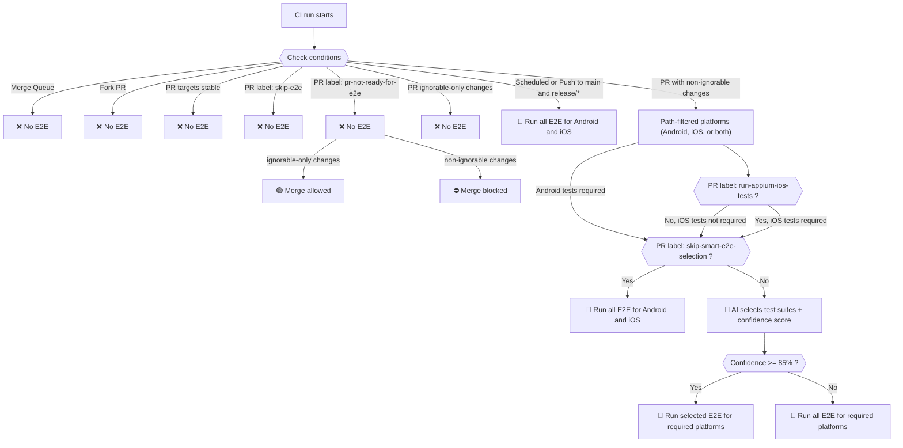

# E2E Test Decision Tree

The following diagram shows the intended decision flow used for `Mobile CI` (ci.yml) to determine whether E2E tests (and builds) should run, for which platform, and whether AI-powered test selection is applied. It is intended to stay high-level for readability reasons, focusing only on when E2E tests should run.

This diagram is the source of truth for the intended E2E trigger policy. CI should follow this flow, and agents should not modify it unless a human is intentionally changing that policy.

```mermaid
flowchart TD
    CI[CI run starts] --> GR{{Check conditions}}
    GR -->|Merge Queue| MQ[❌ No E2E]
    GR -->|Fork PR| FK[❌ No E2E]
    GR -->|PR targets stable| ST[❌ No E2E]
    GR -->|PR label: skip-e2e| HS[❌ No E2E]
    GR -->|PR label: pr-not-ready-for-e2e| L2[❌ No E2E]
    L2 -->|ignorable-only changes| NoBlock[🟢 Merge allowed]
    L2 -->|non-ignorable changes| Skip2[⛔️ Merge blocked]
    GR -->|PR ignorable-only changes| Ignorable[ ❌ No E2E]
    GR -->|Scheduled or Push to main and release/*| Full[🧪 Run all E2E for Android and iOS]

    GR -->|PR with non-ignorable changes| PRToValidate["Path-filtered platforms (Android, iOS, or both)"]
    PRToValidate -->|Android tests required| Smart{{PR label: skip-smart-e2e-selection ?}}
    PRToValidate -->iOSRequired{{PR label: run-appium-ios-tests ?}}
    iOSRequired -->|No, iOS tests not required| Smart{{PR label: skip-smart-e2e-selection ?}}
    iOSRequired -->|Yes, iOS tests required| Smart{{PR label: skip-smart-e2e-selection ?}}

    Smart -->|Yes| AllTags[🧪 Run all E2E for Android and iOS]
    Smart -->|No| AI[🤖 AI selects test suites + confidence score]
    AI --> CONF{{Confidence >= 85% ?}}
    CONF -->|Yes| SelectedTags[🧪 Run selected E2E for required platforms]
    CONF -->|No| AllTagsFallback[🧪 Run all E2E for required platforms]

```

## iOS builds on PRs into `main` are on request only

After the global checks, path filters determine whether a non-ignorable PR
requires Android, iOS, or both. An ignorable-only PR stops before this stage;
labels cannot revive it.

| Request                          | Effect                                                                                                                                   |
| -------------------------------- | ---------------------------------------------------------------------------------------------------------------------------------------- |
| `run-appium-ios-tests` label     | Includes iOS in the final platforms and runs Appium iOS, even when path filters selected Android only.                                   |
| `skip-smart-e2e-selection` label | Bypasses Smart E2E and runs the full `ALL` tag set on **both Android and iOS**, once path filters establish that the PR is E2E-eligible. |

The same platform and label policy applies to PRs targeting `main` and
`release/*`.

Consequences:

- A non-ignorable PR with Android selected and no iOS request runs Android only.
- A non-ignorable PR with only iOS selected and no iOS request runs no E2E.
- If at least one platform is selected, `skip-smart-e2e-selection` runs both
  Android and iOS.
- Pushes to `main` and `release/*`, plus the overnight schedule, run all E2E on
  both platforms.

## E2E tests skipped by default on new PRs during peak hours

To save infra resources while waiting for static analysis findings and potential fixes/iterations:

- Label `pr-not-ready-for-e2e` is applied to the PR automatically when it is created.
- E2E tests are skipped and merge is blocked while the label is present, **unless** all PR changes are ignorable-only.
- If E2E tests are needed, they should pass to be able to merge, so remove the label and the CI will re-run again including the tests.

## Smart AI E2E test selection

Runs only when all of the following are true:

- Event is a pull request
- Not a fork
- No hard E2E skip signal (label `skip-e2e`)
- No `skip-smart-e2e-selection` label

For eligible PRs targeting `main` or `release/*`, Smart E2E selects test tags for the platforms selected by path filters and platform requests.

When `skip-smart-e2e-selection` is present, Smart E2E is bypassed and the full `ALL` tag set runs on **both Android and iOS**. This happens after path filters establish that the PR is E2E-eligible, so an ignorable-only PR still cannot be
revived by this label.

When an E2E-relevant workflow changes, Smart E2E Selection applies a hard rule before calling AI: it returns the `ALL` tag set with 100% confidence. This protects workflow and runner changes that can affect every E2E suite.

## (Exceptional) skip builds and all E2E tests

- Label `skip-e2e` can be added to the PR to skip E2E tests (and builds) in case of e.g. infra issues.
- Using this label should be exceptional in case of CI friction and urgencies. Verify new changes and regressions manually before merging.

## E2E flakiness detection in PRs

Flakiness detection is applied to modified E2E test files in PRs:

- Modified E2E test files run twice
- It applies to existing test files as well as new test files added in the PR
- It can be disabled by adding the label `skip-e2e-flakiness-detection`. Useful when making large refactors or when changes don't pose flakiness risk.

## Release branches

`release/*` branches are release candidates cut from main.

- Pull requests targeting `main` and `release/*` follow the same path-filter,
  platform-request, and Smart E2E policy.
- Every push to `release/*` runs Android and iOS Appium E2E with `ALL` tags.
- Pull requests from `release/*` to `stable` are synchronization PRs and run no
  E2E.
- The final release decision is based on the latest tested `release/*` SHA.
