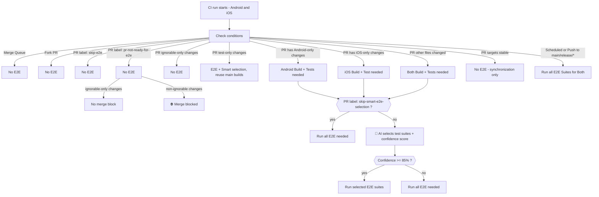

# E2E Test Decision Tree

The following diagram shows the high level decision flow used by Mobile CI to determine whether E2E tests should run, to which platform, and whether AI-powered test selection is applied.

```mermaid
flowchart TD
    CI[CI run starts - Android and iOS] --> GR[Check conditions]
    GR -->|Merge Queue | MQ[No E2E]
    GR -->|Fork PR| FK[No E2E]
    GR -->|PR label: skip-e2e| HS[No E2E]
    GR -->|PR label: pr-not-ready-for-e2e| L2[No E2E]
    L2 -->|ignorable-only changes| NoBlock[No merge block]
    L2 -->|non-ignorable changes| Skip2[⛔️ Merge blocked]
    GR -->|PR ignorable-only changes| Ignorable[No E2E]
    GR -->|PR test-only changes| TestOnly[E2E + Smart selection, reuse main builds]
    GR -->|PR has Android-only changes| Android[Android Build + Tests needed]
    GR -->|PR has iOS-only changes| iOS[iOS Build + Test needed]
    GR -->|PR other files changed| Both[Both Build + Tests needed]
    GR -->|PR targets stable| StableSync[No E2E - synchronization only]
    GR -->|Scheduled or Push to main/release/*| Full[Run all E2E Suites for Both]

    Android & iOS & Both --> LABEL{{PR label: skip-smart-e2e-selection ?}}
    LABEL -->|yes| AllTags[Run all E2E needed]
    LABEL -->|no| AI[🤖 AI selects test suites + confidence score]
    AI --> CONF{{Confidence >= 85% ?}}
    CONF -->|yes| SelectedTags[Run selected E2E suites]
    CONF -->|no| AllTagsFallback[Run all E2E needed]
```

## Test-only PR changes

When a PR only changes E2E/performance test files (and other ignorable files), CI still runs Smart E2E Selection and the selected E2E/performance suites, but **does not compile fresh iOS/Android native builds**. Instead, it reuses the latest matching artifacts from `main`.

The native build fingerprint for test-only PRs is computed from **`main` HEAD** (not the PR merge tree) so the lookup key matches completed `ci.yml` runs on `main`. Reuse tries GitHub Actions artifacts first, then the Cirrus `main` APK cache on Android.

If `main` has new native-changing commits but its CI build has not finished yet, reuse lookup may miss — CI logs a warning and **falls back to a fresh native build** instead of failing the workflow. Performance E2E on test-only PRs resolves BrowserStack apps via stable main `custom_id`s (`MetaMask-Android-*-main`) first, then legacy `…-main-<run_id>` IDs; if none are found it **falls back to a fresh dual Android upload** instead of failing.

This applies when all changed files match `e2e_test_files` or `e2e_ignorable` filters in `.github/rules/filter-rules.yml`, with at least one E2E test file changed, and no E2E-relevant workflow files were modified.

Use the `force-builds` label or `[force-builds]` commit tag to override reuse and compile fresh builds — including on test-only PRs that would otherwise require main-branch artifacts.

## E2E tests skipped by default on new PRs

To save infra resources while waiting for static analysis findings and potential fixes/iterations:

- Label `pr-not-ready-for-e2e` is applied to the PR automatically when it is created.
- E2E tests are skipped and merge is blocked while the label is present, **unless** all changes are ignorable-only.
- If E2E tests are needed, they should pass to be able to merge.

## Smart AI E2E test selection

Runs only when all of the following are true:

- Event is a pull request
- Not a fork
- No hard E2E skip signal (label `skip-e2e`)
- No `skip-smart-e2e-selection` label
- PR does not target `stable`

For PRs targeting `main` or `release/*`, Smart E2E selects the test tags. Release
cherry-pick PRs use the same Android-first platform policy as main PRs: Android
is selected by path filters and iOS is opt-in through the Appium iOS label or
shared smoke/Appium infrastructure changes.

## (Exceptional) skip builds and all E2E tests

- Label `skip-e2e` can be added to the PR to skip E2E tests (and builds) in case of infra issues.
- Using this label should be exceptional in case of CI friction and urgencies. Verify new changes and regressions manually before merging.

## Appium smoke platform policy

- Pull requests targeting `main` or `release/*` run Appium Android when Android E2E is required. Smart E2E controls the selected tags.
- Appium iOS is skipped on PRs by default. It runs when `run-appium-ios-tests` is added or shared smoke/Appium infrastructure changes (`tests/page-objects/**`, `tests/selectors/**`, `tests/locators/**`, `tests/framework/**`, or `tests/smoke-appium/**`), provided an iOS build is required by path filters.
- Pushes to `main` and `release/*` run Appium Android and Appium iOS with the full `ALL` tag set.
- PRs targeting `stable` from `release/*` are synchronization-only and run no E2E, including Appium.
- Stable branch synchronization automation remains active; stable is not the release-build source.

## E2E flakiness detection in PRs

Flakiness detection is applied to modified E2E test files in PRs:

- Modified E2E test files run twice
- It applies to existing test files as well as new test files added in the PR
- It can be disabled by adding the label `skip-e2e-flakiness-detection`. Useful when making large refactors or when changes don't pose flakiness risk.

## Release branches

`release/*` branches are release candidates. Their E2E policy is:

- Cherry-pick PRs from `main` use Smart E2E selection with the Android-first platform policy.
- Release cherry-pick PRs do not automatically run iOS; use `run-appium-ios-tests` when an iOS build is required.
- Every push to `release/*` runs Android and iOS Appium E2E with `ALL` tags.
- PRs from `release/*` to `stable` are synchronization PRs and run no E2E.
- The final release decision is based on the latest tested `release/*` SHA, which is also the source for the production build.
