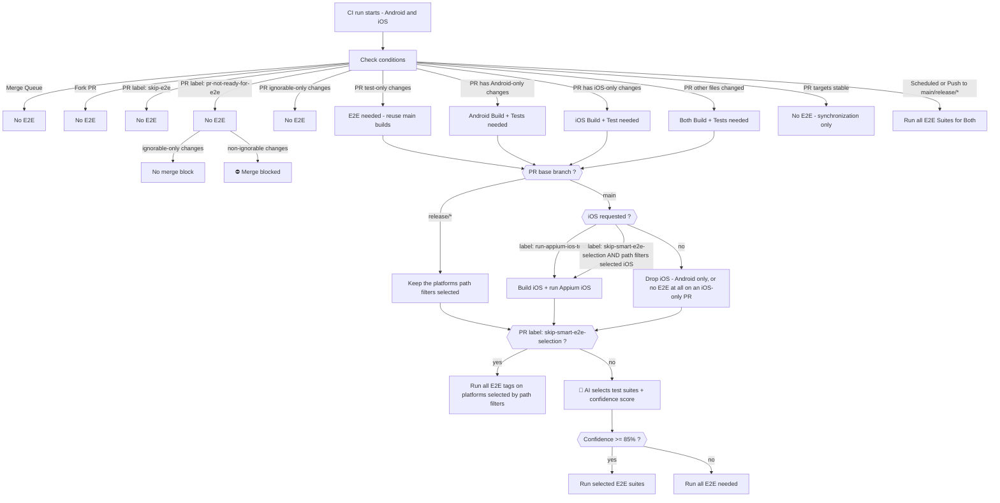

# E2E Test Decision Tree

The following diagram shows the high level decision flow used by Mobile CI to determine whether E2E tests should run, to which platform, and whether AI-powered test selection is applied.

```mermaid
flowchart TD
    CI[CI run starts - Android and iOS] --> GR[Check conditions]
    GR -->|Merge Queue | MQ[No E2E]
    GR -->|Fork PR| FK[No E2E]
    GR -->|PR label: skip-e2e| HS[No E2E]
    GR -->|PR label: pr-not-ready-for-e2e| L2[No E2E]
    L2 -->|ignorable-only changes| NoBlock[No merge block]
    L2 -->|non-ignorable changes| Skip2[⛔️ Merge blocked]
    GR -->|PR ignorable-only changes| Ignorable[No E2E]
    GR -->|PR test-only changes| TestOnly[E2E needed - reuse main builds]
    GR -->|PR has Android-only changes| Android[Android Build + Tests needed]
    GR -->|PR has iOS-only changes| iOS[iOS Build + Test needed]
    GR -->|PR other files changed| Both[Both Build + Tests needed]
    GR -->|PR targets stable| StableSync[No E2E - synchronization only]
    GR -->|Scheduled or Push to main/release/*| Full[Run all E2E Suites for Both]

    TestOnly & Android & iOS & Both --> BASE{{PR base branch ?}}
    BASE -->|release/*| KeepIOS[Keep the platforms path filters selected]
    BASE -->|main| IOSREQ{{iOS requested ?}}
    IOSREQ -->|label: run-appium-ios-tests| OptIn[Build iOS + run Appium iOS]
    IOSREQ -->|label: skip-smart-e2e-selection AND path filters selected iOS| OptIn
    IOSREQ -->|no| StripIOS[Drop iOS - Android only, or no E2E at all on an iOS-only PR]
    StripIOS & KeepIOS & OptIn --> LABEL{{PR label: skip-smart-e2e-selection ?}}
    LABEL -->|yes| AllTags[Run all E2E tags on platforms selected by path filters]
    LABEL -->|no| AI[🤖 AI selects test suites + confidence score]
    AI --> CONF{{Confidence >= 85% ?}}
    CONF -->|yes| SelectedTags[Run selected E2E suites]
    CONF -->|no| AllTagsFallback[Run all E2E needed]
```

## iOS builds on PRs into `main` are on request only

Path filters alone **never** build the iOS app on a pull request targeting
`main`. iOS has to be requested, and there are exactly two ways to do it:

| Request                          | Effect                                                                                                                                                                                                                                 |
| -------------------------------- | -------------------------------------------------------------------------------------------------------------------------------------------------------------------------------------------------------------------------------------- |
| `run-appium-ios-tests` label     | Builds iOS and runs Appium iOS, **even when path filters selected Android only**. Widening is the whole point of this label.                                                                                                           |
| `skip-smart-e2e-selection` label | Builds iOS and runs Appium iOS with the full `ALL` tag set, **but only when path filters already selected iOS**. This label expands the tag set, not the platform list, so it never adds a platform path filters deliberately skipped. |

Nothing else opts in. In particular, shared smoke/Appium infrastructure changes
no longer pull in an iOS build on a `main` PR the way they do on `release/*`.

**The app is only built when iOS E2E will actually run.** On PRs into `main`,
`ios_e2e_needed` and `run_appium_ios` are driven by the same two requests above,
so they are always equal — CI never spends a macOS build on an app nothing will
test. A unit test asserts this invariant across every combination.

Consequences when iOS is _not_ requested:

- A PR that touches shared or cross-platform code runs **Android only**.
- A PR that touches **only** iOS files (`ios/**`, `Podfile`, native iOS code)
  runs **no E2E at all** — there is no Android build to test either, so
  `native_build_needed` and Smart E2E Selection both turn off. Adding either
  label restores iOS _and_ Smart E2E Selection.
- `validate-e2e-fixtures` is iOS-only, so **fixture validation only runs on a
  `main` PR when iOS was requested**. It still runs unconditionally on PRs into
  `release/*` that build iOS.

iOS coverage outside feature-branch PRs is unchanged. Every push to `main` and
`release/*`, plus the hourly overnight schedule, builds iOS and runs Appium iOS
with the full `ALL` tag set. PRs into `release/*` keep the Android-first policy:
they build iOS when path filters select it, and Appium iOS stays opt-in — see
[Appium smoke platform policy](#appium-smoke-platform-policy).

So an unlabelled `main` PR that breaks iOS surfaces on `main` after merge rather
than in the PR. Add `run-appium-ios-tests` when you are touching anything that
could plausibly be iOS-specific.

The rule is implemented in `.github/scripts/compute-e2e-platform-flags.cjs`:
`computeE2EPlatformFlags` drops iOS while recording `iosByPathFilters`, and
`applyE2ELabelOverrides` restores it for either request. `build-ios-apps` in
`.github/workflows/ci.yml` then gates on the resulting `ios_e2e_needed`.

## Test-only PR changes

When a PR only changes E2E/performance test files (and other ignorable files), CI still runs Smart E2E Selection and the selected E2E/performance suites, but **does not compile fresh iOS/Android native builds**. Instead, it reuses the latest matching artifacts from `main`.

The native build fingerprint for test-only PRs is computed from **`main` HEAD** (not the PR merge tree) so the lookup key matches completed `ci.yml` runs on `main`.

On `current` runners, reuse tries GitHub Actions artifacts first (`find-reusable-build`), then the Cirrus `main` APK / iOS app cache. Namespace e2e builds skip that lookup. Android then checks the Namespace APK cache and compiles on miss; iOS has no equivalent fingerprint cache yet, so it compiles. The workflow still falls back to a fresh build instead of failing.

If `main` has new native-changing commits but its CI build has not finished yet, reuse lookup may miss — CI logs a warning and **falls back to a fresh native build** instead of failing the workflow. Performance E2E on test-only PRs resolves BrowserStack apps via stable main `custom_id`s (`MetaMask-Android-*-main`) first, then legacy `…-main-<run_id>` IDs; if none are found it **falls back to a fresh dual Android upload** instead of failing.

This applies when all changed files match `e2e_test_files` or `e2e_ignorable` filters in `.github/rules/filter-rules.yml`, with at least one E2E test file changed, and no E2E-relevant workflow files were modified.

Use the `force-builds` label or `[force-builds]` commit tag to override reuse and compile fresh builds — including on test-only PRs that would otherwise require main-branch artifacts.

## E2E tests skipped by default on new PRs

To save infra resources while waiting for static analysis findings and potential fixes/iterations:

- Label `pr-not-ready-for-e2e` is applied to the PR automatically when it is created.
- E2E tests are skipped and merge is blocked while the label is present, **unless** all changes are ignorable-only.
- If E2E tests are needed, they should pass to be able to merge.

## Smart AI E2E test selection

When an E2E-relevant workflow changes, Smart E2E Selection applies a hard rule
before calling AI: it returns the `ALL` tag set with 100% confidence. This protects
workflow and runner changes that can affect every E2E suite.

Runs only when all of the following are true:

- Event is a pull request
- Not a fork
- No hard E2E skip signal (label `skip-e2e`)
- No `skip-smart-e2e-selection` label
- PR does not target `stable`

For PRs targeting `main` or `release/*`, Smart E2E selects the test tags. PRs
into `main` are Android-only unless iOS is explicitly requested (see
[iOS builds on PRs into `main` are on request only](#ios-builds-on-prs-into-main-are-on-request-only)). Release
cherry-pick PRs are Android-first: Android is selected by path filters and iOS is
opt-in through the Appium iOS label or shared smoke/Appium infrastructure
changes.

When `skip-smart-e2e-selection` is present, Smart E2E is bypassed and the full
`ALL` tag set runs on each platform already required by path filters — it does
not add platforms that path filters would skip. Where path filters require iOS,
this label also builds iOS and enables Appium iOS smoke — on PRs into `main` as
well as `release/*`. It is the second of the two iOS requests described in
[iOS builds on PRs into `main` are on request only](#ios-builds-on-prs-into-main-are-on-request-only);
the non-widening rule is exactly why it cannot pull in iOS on an Android-only PR,
where `run-appium-ios-tests` is the label to use instead.

## (Exceptional) skip builds and all E2E tests

- Label `skip-e2e` can be added to the PR to skip E2E tests (and builds) in case of infra issues.
- Using this label should be exceptional in case of CI friction and urgencies. Verify new changes and regressions manually before merging.

## Appium smoke platform policy

- Pull requests targeting `main` or `release/*` run Appium Android when Android E2E is required. Smart E2E controls the selected tags.
- On PRs into `main`, Appium iOS runs **only when iOS was requested** via `run-appium-ios-tests`, or via `skip-smart-e2e-selection` when path filters already require iOS. Path filters and smoke-infra changes alone do not trigger it, and the iOS app is not built unless it will be tested. See [iOS builds on PRs into `main` are on request only](#ios-builds-on-prs-into-main-are-on-request-only).
- On PRs into `release/*`, Appium iOS is skipped by default. It runs when `run-appium-ios-tests` is added (also opts into the iOS native build on Android-only PRs), when `skip-smart-e2e-selection` is added and path filters already require iOS, or when shared smoke/Appium infrastructure changes (`tests/page-objects/**`, `tests/selectors/**`, `tests/locators/**`, `tests/framework/**`, or `tests/smoke-appium/**`) and path filters require an iOS build.
- Pushes to `main` and `release/*` run Appium Android and Appium iOS with the full `ALL` tag set. This is where iOS coverage for merged feature work comes from.
- PRs targeting `stable` from `release/*` are synchronization-only and run no E2E, including Appium.
- Stable branch synchronization automation remains active; stable is not the release-build source.

## E2E flakiness detection in PRs

Flakiness detection is applied to modified E2E test files in PRs:

- Modified E2E test files run twice
- It applies to existing test files as well as new test files added in the PR
- It can be disabled by adding the label `skip-e2e-flakiness-detection`. Useful when making large refactors or when changes don't pose flakiness risk.

## Release branches

`release/*` branches are release candidates. Their E2E policy is:

- Cherry-pick PRs from `main` use Smart E2E selection with the Android-first platform policy.
- Release cherry-pick PRs do not automatically run iOS; use `run-appium-ios-tests` to opt into the iOS build and Appium iOS smoke when needed. Unlike PRs into `main`, path filters selecting iOS are enough to build it here, and shared smoke/Appium infrastructure changes still enable Appium iOS.
- Every push to `release/*` runs Android and iOS Appium E2E with `ALL` tags.
- PRs from `release/*` to `stable` are synchronization PRs and run no E2E.
- The final release decision is based on the latest tested `release/*` SHA, which is also the source for the production build.
