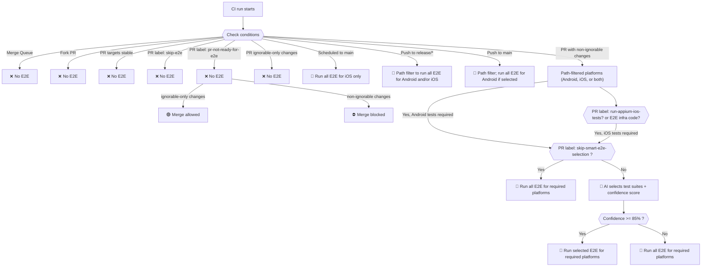

# E2E Test Decision Tree

The following diagram shows the intended decision flow used for `Mobile CI` (ci.yml) to determine whether E2E tests (and builds) should run, for which platform, and whether AI-powered test selection is applied. It is intended to stay high-level for readability reasons, focusing only on when E2E tests should run.

Note: This doc is the source of truth for the intended E2E trigger policy. CI should follow this logic and agents should not modify this doc unless a human is intentionally changing the policy. Keep it high level, avoiding technical details.

```mermaid
flowchart TD
    CI[CI run starts] --> GR{{Check conditions}}
    GR -->|Merge Queue| MQ[❌ No E2E]
    GR -->|Fork PR| FK[❌ No E2E]
    GR -->|PR targets stable| ST[❌ No E2E]
    GR -->|PR label: skip-e2e| HS[❌ No E2E]
    GR -->|PR label: pr-not-ready-for-e2e| L2[❌ No E2E]
    L2 -->|ignorable-only changes| NoBlock[🟢 Merge allowed]
    L2 -->|non-ignorable changes| Skip2[⛔️ Merge blocked]
    GR -->|PR ignorable-only changes| Ignorable[ ❌ No E2E]
    GR -->|Scheduled to main| Scheduled[🧪 Run all E2E for iOS only]
    GR -->|Push to release/*| FullRelease[🧪 Path filter to run all E2E for Android and/or iOS]
    GR -->|Push to main| AndroidMain[🧪 Path filter; run all E2E for Android if selected]

    GR -->|PR with non-ignorable changes| PRToValidate["Path-filtered platforms (Android, iOS, or both)"]
    PRToValidate -->|Yes, Android tests required| Smart{{PR label: skip-smart-e2e-selection ?}}
    PRToValidate -->iOSRequired{{PR label: run-appium-ios-tests? or E2E infra code?}}
    iOSRequired -->|Yes, iOS tests required| Smart{{PR label: skip-smart-e2e-selection ?}}

    Smart -->|Yes| AllTags[🧪 Run all E2E for required platforms]
    Smart -->|No| AI[🤖 AI selects test suites + confidence score]
    AI --> CONF{{Confidence >= 85% ?}}
    CONF -->|Yes| SelectedTags[🧪 Run selected E2E for required platforms]
    CONF -->|No| AllTagsFallback[🧪 Run all E2E for required platforms]

```

## E2E platform policy

After the global gates, path filters classify non-ignorable changes as Android-only, iOS-only, or both. For pull requests, iOS is suppressed unless it is explicitly requested with `run-appium-ios-tests`. Ignorable-only changes stop before this stage; labels cannot revive them.

For every eligible pull request, iOS runs on explicit request:

| Request | Effect |
| --- | --- |
| `run-appium-ios-tests` | Adds iOS while preserving the path-selected Android platform. |
| `skip-smart-e2e-selection` | Runs all Android E2E tags and bypasses AI test tag selection. It does not request iOS. |
| Both labels | Runs all E2E tags on Android and iOS. |

For non-PR events:

- Scheduled runs on `main` execute all iOS E2E tests only; Android E2E tests do not run.
- Pushes to `main` execute Android E2E tests only when path filtering selects Android-relevant changes. If no Android paths are selected, E2E tests do not run.

Forced platform runs:

| Condition | Effect |
| --- | --- |
| E2E infrastructure changes on a PR targeting `main` | Select both Android and iOS as required to run to catch breaking infrastructure changes. |

## E2E tests skipped by default on new PRs during peak hours

To save infra resources while waiting for static analysis findings and potential fixes/iterations:

- Label `pr-not-ready-for-e2e` is applied to the PR automatically when it is created.
- E2E tests are skipped and merge is blocked while the label is present, **unless** all PR changes are ignorable-only.
- If E2E tests are needed, they should pass to be able to merge, so remove the label and the CI will re-run again including the tests.

## Smart AI E2E test selection

Runs only when all of the following are true:

- Event is a pull request
- Not a fork
- No hard E2E skip signal (label `skip-e2e`)
- No `skip-smart-e2e-selection` label

For eligible pull requests without a skip label, AI selects tags for the platforms selected by the E2E platform policy. With `skip-smart-e2e-selection`, AI smart selection is bypassed and the full `ALL` tag set runs, i.e. all the test suites. Global gates still apply, so an ignorable-only PR cannot be revived by the label.

Some changes trigger conservative hard rules based on lessons from past regressions. These rules force the full `ALL` E2E test suite when changes could break E2E execution or increase the risk of missing app bugs. For example, when an E2E test-execution workflow, such as `setup-e2e-env`, changes, Smart E2E Selection returns the `ALL` tag set with 100% confidence before calling AI. Performance-only workflow changes are handled by performance selection, and other artifact or runner-support changes do not force all smoke tags.

## (Exceptional) skip builds and all E2E tests

- Label `skip-e2e` can be added to the PR to skip E2E tests (and builds) in case of e.g. infra issues.
- Using this label should be exceptional in case of CI friction and urgencies. Verify new changes and regressions manually before merging.

## E2E flakiness detection in PRs targeting `main`

Flakiness detection is applied to modified E2E test files in PRs targeting `main`:

- Modified E2E test files run twice
- It applies to existing test files as well as new test files added in the PR
- It can be disabled by adding the label `skip-e2e-flakiness-detection`. Useful when making large refactors or when changes don't pose flakiness risk.

## Release branches

`release/*` branches are release candidates cut from main.

- Pull requests targeting `release/*` branches follow the E2E platform and Smart E2E policies above.
- Pushes to `release/*` branches use deterministic path filtering and run `ALL` tags (test suites) on Android, iOS, or both; ignorable-only pushes skip E2E.
- Pull requests from `release/*` to `stable` are synchronization PRs and run no E2E.
- The final release decision is based on the latest tested `release/*` SHA.
