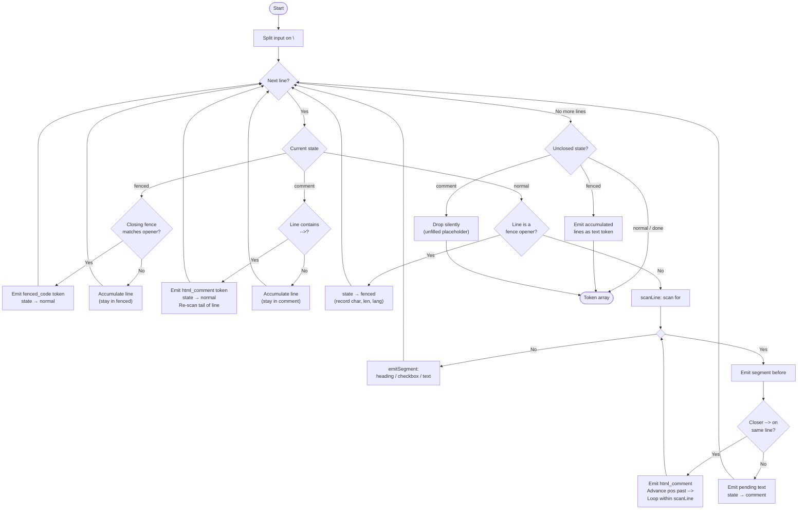

# markdown-tokenizer

A minimal, zero-dependency, single-pass GFM tokenizer used by the PR template
validators.

## Why it exists

Parsing a PR body with plain regex is fragile: a `<!--` inside a Gherkin code
block can silently drop every section that follows it, and a `Fixes: #123` line
inside a code block can bypass the issue-link check. A tokenizer that
understands document structure makes these impossible — fenced code content
stays in a `fenced_code` token and is never confused with author-visible prose.

## Recognised constructs

Constructs are matched in this precedence order:

| Priority | Construct | Token kind |
|---|---|---|
| 1 | ` ``` ` / `~~~` fenced blocks (multi-line) | `fenced_code` |
| 2 | `<!-- … -->` comments (single- or multi-line) | `html_comment` |
| 3 | ATX headings `#` – `######` | `heading` |
| 4 | GFM task-list items `- [ ]` / `- [x]` | `checkbox` |
| 5 | Everything else | `text` (one token per line) |

**Known limitations** (intentional):
- Indented code blocks (4-space) → emitted as `text`
- Setext headings (`===` / `---`) → emitted as `text`
- Inline backtick spans are not tracked; `<!--` inside `` `code` `` is still
  treated as a comment opener

## Token fields

Every token carries `kind`, `raw` (verbatim source), and `content` (payload
with delimiters stripped). Kind-specific extras:

| kind | `content` | extra fields |
|---|---|---|
| `heading` | heading text, e.g. `**Description**` | `level` (1–6) |
| `html_comment` | comment body without `<!--` / `-->` | — |
| `fenced_code` | code body without the fence-marker lines | `lang` |
| `checkbox` | label text after `- [x] ` | `checked` (boolean) |
| `text` | the line as-is | — |

See the TypeScript source for the full `Token` interface and `TokenKind` union.

## API

### `tokenize(text)`

Converts a markdown string into a flat, ordered array of tokens.

```typescript
import { tokenize } from './markdown-tokenizer';

const tokens = tokenize(markdownText);
// → [ heading, html_comment, text, fenced_code, checkbox, … ]
```

### `sectionTokens(tokens, sectionTitle)`

Returns the tokens that belong to the section introduced by a heading whose
`raw` source contains `sectionTitle`. The heading itself is excluded. The
section ends at the next heading of equal or higher level (`##` ends at the
next `##`, not at `###`). Returns `null` when no matching heading is found.

```typescript
import { tokenize, sectionTokens, visibleText } from './markdown-tokenizer';

const tokens  = tokenize(markdownText);
const section = sectionTokens(tokens, '## **Description**');
if (section) {
  const text = visibleText(section); // author-visible text, comments stripped
}
```

### `visibleText(tokens)`

Concatenates the `content` of all non-`html_comment` tokens with `\n`.
Equivalent to "strip HTML comments and join remaining text" — which is what
every validator needs after extracting a section.

## How to add a new validator

1. Tokenize once and extract the relevant section:

```typescript
const tokens  = tokenize(markdownText);
const section = sectionTokens(tokens, '## **My Section**');
if (!section) return { ok: false, reason: 'Section missing' };
```

2. Work with the token array directly:

```typescript
// Visible prose only (HTML comments and fenced code excluded)
const text = visibleText(section).trim();

// Only checkboxes
const unchecked = section.filter(t => t.kind === 'checkbox' && !t.checked);

// Only text lines (fenced code blocks excluded)
const textLines = section.filter(t => t.kind === 'text').map(t => t.content);
```

## Parsing workflow

The tokenizer runs one pass over the input using a three-state machine.



### State descriptions

| State | Entered when | Exited when |
|---|---|---|
| `normal` | Start / after any complete token | Fence opener or `<!--` without a same-line `-->` |
| `fenced` | Fence opener (` ``` ` / `~~~`) seen | Matching closing fence seen |
| `comment` | `<!--` without a `-->` on the same line | `-->` seen on a subsequent line |

### Unclosed construct policy

| Construct | Policy | Reason |
|---|---|---|
| Unclosed fence | Emit accumulated lines as a `text` token | Makes content visible to validators |
| Unclosed `<!--` (outside fence) | Silently drop | Treats it as an unfilled template placeholder |
| `<!--` inside a fenced block | Treated as literal code, never opens a comment | Prevents a code example from consuming subsequent sections |
