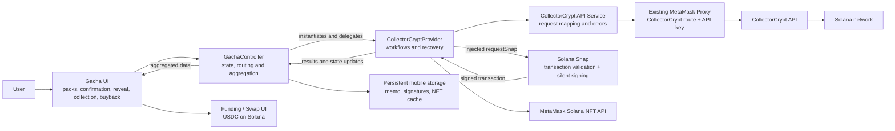
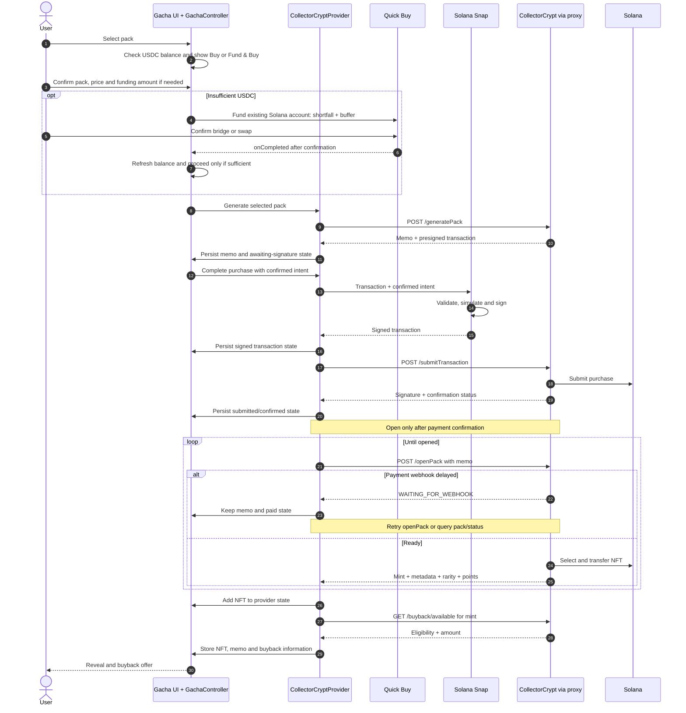
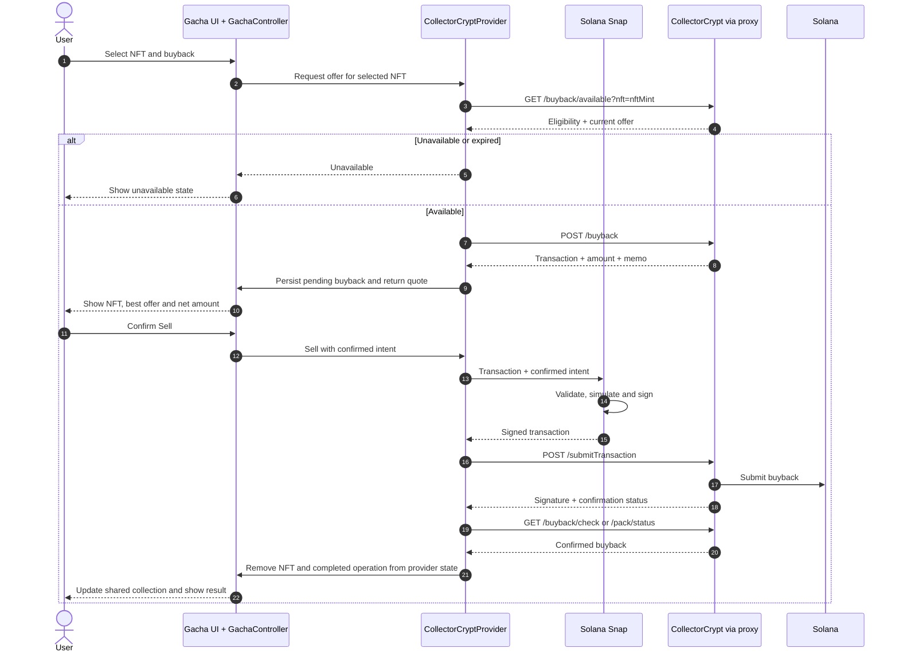
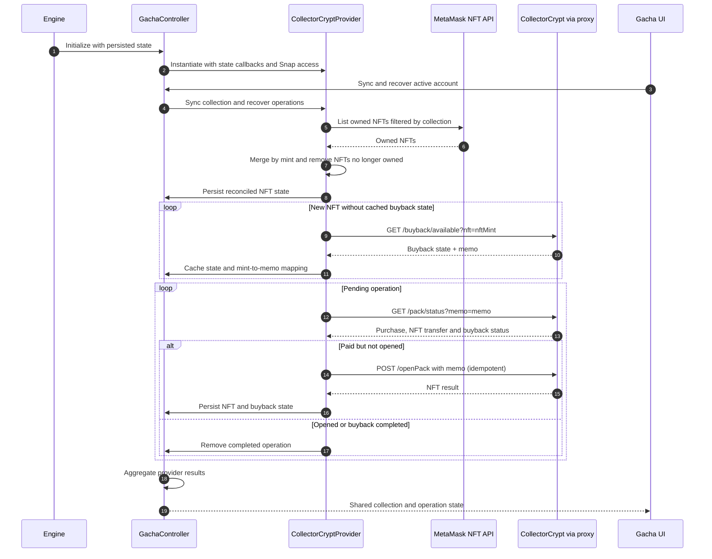

# Gacha in MetaMask Mobile — CollectorCrypt Solana provider

Status: Proposed

Deciders: To be confirmed

## 1. Proposal summary

| Item         | Decision                                                                                            |
| ------------ | --------------------------------------------------------------------------------------------------- |
| Experience   | Fund USDC → buy a pack → reveal an NFT → keep it, sell it back or redeem it.                        |
| V1           | Gacha feature with CollectorCrypt as its first provider, on Solana.                                 |
| Architecture | Engine → GachaController → CollectorCryptProvider → services. Local recovery state; no new backend. |
| Transactions | CollectorCrypt prepares and submits; the Solana Snap validates and signs.                           |
| Funding      | Quick Buy funds the user's existing Solana account.                                                 |

## 2. Problem Statement

Build the Gacha feature for pack purchase, reveal and buyback, with recovery after an app restart, crash or interrupted API call. CollectorCrypt is the first provider; the architecture must support adding and aggregating others.

CollectorCrypt exposes action endpoints, not a wallet-wide recovery API. Mobile must persist enough state to resume interrupted operations and reconcile them against CollectorCrypt and Solana.

## 3. Background

### 3.1 Glossary

- **Gacha / pack**: Purchase of a mystery pack that reveals one collectible NFT.
- **Buyback**: Sale of the NFT back to CollectorCrypt at the quoted price.
- **Turbo**: Automatic buyback of common cards.
- **Memo ID**: Provider-generated identifier linking a pack's purchase, opening and buyback.
- **Redemption**: Exchange of an eligible NFT for delivery of the physical collectible.

### 3.2 Product and volume context

CollectorCrypt activity is approximately **28,000 packs created and opened per day**. Provider data and feedback indicate that users typically buy, reveal and sell back in a short session.

The [Solana API flow](https://docs.collectorcrypt.com/gacha/api) is:

1. `generatePack` returns a memo and a transaction presigned by CollectorCrypt.
2. The user signs; `submitTransaction` submits the USDC payment to CollectorCrypt's gacha wallet.
3. After payment confirmation, `openPack(memo)` selects and transfers the NFT.
4. The user can request a buyback within the eligibility window.

## 4. Scope

### 4.1 V1 included

- GachaController registered in the Engine, with CollectorCryptProvider as its first provider.
- CollectorCrypt on Solana: 1–20 packs per purchase action, buyback and optional Turbo.
- Shared Gacha pack, reveal and collection UI, with optimistic NFT updates and buyback status.
- NFT discovery through `/users/{address}/solana-tokens`, filtered by CollectorCrypt collection.
- Redemption handoff to CollectorCrypt for KYC and physical delivery.
- Local recovery state and the existing MetaMask proxy.

### 4.2 V1 excluded

- EVM and additional provider implementations. The controller/provider separation is included in V1.
- A backend database, event indexer or reconciliation service.
- Gifts, winners feeds and full purchase history.
- General MetaMask NFT gallery integration; possible V2 scope.

## 5. Decision Outcome

Build Gacha around a shared controller and provider-specific integrations:

- **Gacha UI:** shared experience, funding and user consent; calls only GachaController.
- **GachaController:** registered in the Engine; instantiates providers, owns persisted state, routes actions and aggregates provider results for the UI.
- **CollectorCryptProvider:** first provider; owns CollectorCrypt workflows, recovery and service calls.
- **Existing proxy:** API forwarding and server-side API key injection; no business state.
- **Solana Snap:** mandatory transaction validation and silent signing in one call.
- **CollectorCrypt:** transaction preparation, submission, pack opening and buyback.
- **MetaMask NFT API:** owned NFTs, merged with local `openPack` results and buyback state.

## 6. Architecture

### 6.1 Architectural principle

Keep shared state and aggregation in GachaController; keep provider workflows and API details in each provider. Adding a provider should extend the Gacha catalogue and collection through the controller.

Persist unfinished work; read confirmed state from the existing APIs and chain. V1 needs no position tracking, real-time streams, PnL or historical index.

CollectorCrypt has no user session: each action identifies the wallet and its memo, transaction signature, NFT mint or buyback quote. The memo links purchase, opening and recovery.

### 6.2 Architecture overview



### 6.3 Components

#### 6.3.1 Gacha UI

Shared pack picker, funding, confirmation, reveal, collection and buyback actions. Calls GachaController hooks and renders its aggregated data; no direct provider or API calls.

#### 6.3.2 GachaController

Registered and initialized in the Engine. Instantiates CollectorCryptProvider, owns persisted Gacha state and supplies state access/update callbacks and Snap access to the provider.

Routes each action to its provider and exposes a shared catalogue and collection. As providers are added, the controller merges their results while preserving provider identity for subsequent actions.

#### 6.3.3 CollectorCryptProvider and services

Owns CollectorCrypt purchase, opening, buyback, NFT reconciliation and recovery. Uses CollectorCrypt API services, the NFT service and injected Snap access; updates its state through GachaController's callbacks.

Services map provider endpoints, validate responses and map errors. The provider reconciles payment status before retrying. CollectorCrypt-specific formats and API details remain inside this integration.

#### 6.3.4 Existing proxy

Add a CollectorCrypt route to the existing [proxy](https://github.com/consensys-vertical-apps/va-mmcx-external-proxy). It injects the API key server-side; Mobile never receives it.

#### 6.3.5 Solana Snap

Expose two guarded methods: purchase and buyback. Each decodes, validates, simulates and signs the CollectorCrypt transaction against Mobile's confirmed intent. Return the signed transaction to Mobile; do not display confirmation UI or submit it. See [confirmation and guard rules](#78-mobile-confirmation-and-snap-signing).

#### 6.3.6 NFT API and local collection state

CollectorCryptProvider uses `/users/{address}/solana-tokens`, filtered by collection, and merges with direct `openPack` results. GachaController exposes the result in the Gacha collection; general Mobile Solana gallery support remains outside V1.

### 6.4 Architecture rationale and trade-offs

| Benefit                                                             | Trade-off                                                                                 |
| ------------------------------------------------------------------- | ----------------------------------------------------------------------------------------- |
| Existing proxy and APIs; no new backend to operate.                 | Dependence on CollectorCrypt's availability and status reporting.                         |
| Immediate reveal from `openPack`, without waiting for NFT indexing. | Mobile reconciles optimistic state and webhook delays.                                    |
| Small local recovery store.                                         | Device-local recovery; retries and duplicate calls must be handled.                       |
| Shared GachaController with isolated providers.                     | Adding providers requires mapping their results into the shared catalogue and collection. |

If the feature is retired, there is no dedicated backend or separate account system to unwind.

### 6.5 Local state, NFT merge and recovery model

GachaController owns persisted state, separated by provider. CollectorCrypt data lives under `state.collectorCrypt`, with operations and NFTs keyed by Solana account. Conceptual provider state:

```typescript
type CollectorCryptOperation = {
  memo: string;
  packType: string;
  generatedAt: number;
  purchaseSignature?: string;
  purchaseStatus: 'pending' | 'submitted' | 'confirmed';
  openStatus: 'pending' | 'waiting_for_webhook' | 'opened';
  nftMint?: string;
};

type CollectorCryptNft = {
  nftMint: string;
  collectionAddress: string;
  memo?: string;
  metadata: unknown;
  buyback: {
    status: 'unknown' | 'available' | 'unavailable';
    amount?: string;
    checkedAt?: number;
  };
  source: 'openPack' | 'nftApi' | 'merged';
};
```

**Isolate state by provider and account.** Aggregated data retains its provider identity; account switching must never expose another account's operations or NFTs. Remove completed purchase and buyback operations; refresh NFT state on startup.

Initial cache policy, to be confirmed:

| Entry                                    | Retention                                                              |
| ---------------------------------------- | ---------------------------------------------------------------------- |
| Generated, unsigned and unpaid operation | About 30 seconds; discard stale transactions and restart the purchase. |
| Buyback information                      | About 72 hours; remove expired entries and refetch when needed.        |

#### 6.5.1 NFT and buyback state

CollectorCryptProvider adds the `openPack` NFT immediately to its state. GachaController exposes it in the shared collection. When the NFT API catches up:

- Merge by mint; prefer `openPack` metadata until the API returns the asset.
- Remove NFTs no longer owned.
- Keep the memo-to-mint association during buyback eligibility.
- Revalidate buyback availability before signing.

For NFTs discovered outside the current session, call `buyback/available` with the mint and persist the response and memo for later status checks.

## 7. User flows

### 7.1 Existing Solana wallet continuity

CollectorCrypt identifies users by Solana address. Selecting the same account in MetaMask restores access to its NFTs and eligible buybacks, including those acquired through Jupiter or another wallet. No account migration is needed.

### 7.2 Pack catalogue, naming, display and assets

| Data                                                                              | Owner / source                                                            |
| --------------------------------------------------------------------------------- | ------------------------------------------------------------------------- |
| Pack ID, price, payment token, odds, availability, limits and collection metadata | CollectorCrypt API → services → CollectorCryptProvider → GachaController. |
| Display names and pack artwork                                                    | MetaMask; keep provider pack IDs unchanged for API calls and attribution. |
| NFT images and collectible metadata                                               | `openPack` and the MetaMask NFT API.                                      |

Naming is a product decision: CollectorCrypt uses names such as Pokémon 25/50; Jupiter uses Silver/Gold/Maxi. MetaMask may choose its own names.

Bundle one artwork per pack type or variant alongside the provider in the Gacha module. CollectorCrypt estimate: fewer than 50 images at launch, potentially fewer than 100 as its catalogue grows; confirm against production. See [artwork storage alternatives](#95-pack-artwork-storage).

### 7.3 USDC funding and Solana transaction fees

CollectorCrypt sets the transaction's fee payer. CollectorCryptProvider passes the transaction unchanged to the Snap for validation and signing.

#### 7.3.1 USDC funding

**Funding adds USDC to the user's existing Solana account. No separate account is created.**

- Enough USDC: `Buy`.
- Insufficient USDC: `Fund & Buy` → Mobile confirmation → Quick Buy → confirmed funding → purchase resumes automatically, without repeating the purchase confirmation.

Quick Buy targets Solana USDC; users may edit the source asset and amount. Refresh the balance after funding and proceed only if it covers the pack price. Configuration and callbacks are specified in [USDC funding entry point](#96-usdc-funding-entry-point).

#### 7.3.2 Purchase transaction fees

Observed in both CollectorCrypt and Jupiter:

| User balance | Purchase fee payer |
| ------------ | ------------------ |
| Enough SOL   | User               |
| No SOL       | CollectorCrypt     |

Do not require SOL funding. Display the fee payer and fee when available; treat sponsorship failure as a recoverable error.

Examples: [without user SOL](https://solscan.io/tx/3stBjWoLdWgdhDzbo5kmhdpABAwEJ8pwnLheEbQ7EFkPLfgbG2WcKRYH5Dafuud9cZztnwXuwrwrvqehwmVjAc7r), [with user SOL](https://solscan.io/tx/rgoJQfR6uqnSp62b6x1FGBqhawMRPGZVzFU1RLeAsDhNhP8eaQnN3ArS8b5Y4x3TTEKRKpAwfnurgr5Nre2aGDR).

#### 7.3.3 Open and buyback transaction fees

- **Open:** CollectorCrypt transfers the NFT and pays the fee; no user signature.
- **Buyback:** the user must own the NFT and approve the transaction. CollectorCrypt pays the fee in all tested flows, even when the user has SOL.

Observed in CollectorCrypt and Jupiter: [buyback without user SOL](https://solscan.io/tx/fQDwmypLvNaqnNeA39zuySAE4hWnxZcVzFoGvtATMApwFqsSNa5ktUmYSJUkJdLy4seNfBAt8Yf99sytHPpcgkc), [buyback with user SOL](https://solscan.io/tx/3ptoxm9XDRA5fxSB8ZsyMMtxn3QB2gH83WMfSx3FFWCXc5KH8Ez5yjqkYQrabxbjZPGg3WH8tVR49bhQMF8ohaZV).

Observed CollectorCrypt fee payer: `GachaNgyXTU3zFogQ8Z5jR2BLXs8215X2AtEH18VxJq3`. Solscan fees include priority fees.

### 7.4 Purchase flow (single pack)

These diagrams detail the CollectorCrypt provider. The Gacha UI calls GachaController, which delegates to CollectorCryptProvider. The provider uses its services through the existing MetaMask proxy; state updates are persisted by GachaController.



### 7.5 Buyback flow



### 7.6 Redemption flow

The Gacha UI uses CollectorCrypt's redemption handoff to its website for KYC and physical delivery. Mobile does not implement this flow in V1.

### 7.7 Startup and recovery flow



GachaController delegates recovery to each instantiated provider and aggregates the results. CollectorCrypt recovery covers owned NFTs, cached buyback state and interrupted operations, not full history. Reuse cached buyback information for display; refresh it before signing.

### 7.8 Mobile confirmation and Snap signing

One shared Gacha confirmation design:

| Action                 | When / what to confirm                                                        |
| ---------------------- | ----------------------------------------------------------------------------- |
| `Fund & Buy`           | Before Quick Buy: pack price and expected funding amount.                     |
| `Buy`                  | After balance check, before `generatePack`: pack and price.                   |
| Multi-pack             | Once for selected packs and total price; one guarded Snap signature per pack. |
| `Sell`                 | After quote: NFT, best offer and net amount.                                  |
| `Sell & Buy` / `Turbo` | One confirmation can cover buyback and the next purchase.                     |

**Transaction trust and guard — chosen: Solana Snap.** Validation and signature form one indivisible call over the same immutable message, with no guard bypass. Gacha captures the confirmed account, price and fee cap; CollectorCryptProvider forwards them to the Snap. Trusted Snap configuration defines authorized CollectorCrypt signers, the USDC mint and recipient rules.

The Snap verifies the presignature cryptographically, checks instructions and simulates: only the exact pack price reaches the expected recipient, user SOL spending covers capped network fees including priority fees (zero when sponsored), and no unexpected effects are allowed. Missing or invalid signatures and failed or inconclusive checks block signing. Buyback checks the selected NFT and confirmed net proceeds. CollectorCryptProvider submits the signed transaction through its API service.

### 7.9 Reveal animation and assets

Use one reusable Gacha `@rive-app/react-native` animation, bound to category, collection, year, rarity, card name and card image. Keep provider artwork alongside its integration, as described in [catalogue and assets](#72-pack-catalogue-naming-display-and-assets).

**Open:** define whether a static reveal fallback is needed and when to trigger it, including on slower devices.

## 8. Reporting and on-chain attribution

MetaMask-generated memo IDs carry the slug associated with its CollectorCrypt API ID. Confirm the exact format before implementation.

Use this slug and on-chain transactions for Dune queries covering packs generated/purchased, packs opened, buybacks and volume, including future billing analysis. No reporting database or backend indexer is required.

## 9. Alternatives considered

### 9.1 Transaction submission

**Chosen: CollectorCrypt's `submitTransaction`, rather than direct Solana RPC broadcast.** It keeps retries, status indexing and memo attribution in the same system.

Trade-off: dependence on the provider's availability and broadcast behavior. CollectorCryptProvider and its services handle errors and retry/idempotency behavior. Other providers own their submission paths.

### 9.2 Backend indexer and SQL state

**Not selected for V1.** An indexer could store all memos, reconstruct history and enable cross-device recovery. It adds a database and operational ownership while duplicating existing API data. Packs generally open immediately after payment, limiting the value of a permanent pending-pack index.

### 9.3 Mobile-only state with the existing proxy (Chosen)

GachaController persists provider-specific state for interrupted operations and optimistic UI. The existing proxy protects the API key. This avoids a new backend, at the cost of device-local recovery and provider-managed retries. Full history remains outside V1.

### 9.4 Shared controller with provider implementations

**Chosen in V1.** GachaController instantiates providers, routes actions and aggregates their results. CollectorCryptProvider owns the first integration and its services. Future providers extend the same Gacha feature; their workflows stay separate. Only additional provider implementations are deferred.

### 9.5 Pack artwork storage

**Chosen: bundle MetaMask-owned pack artwork alongside each provider in the Gacha module.** NFT images remain remote API data.

| Option               | Benefit                                                                                                                          | Cost                                                                      |
| -------------------- | -------------------------------------------------------------------------------------------------------------------------------- | ------------------------------------------------------------------------- |
| Bundled artwork      | Offline access, predictable startup and OTA behavior; follows Mobile/Perps and Rive conventions. Easy to remove with the module. | Artwork changes require an app update.                                    |
| Remote asset service | Change names and artwork without an app release.                                                                                 | Runtime dependency, caching, stable asset contract and fallback handling. |

Revisit remote storage if catalogue size or update frequency makes bundling impractical. Preserve a non-Rive fallback for essential content; the reveal fallback remains open.

### 9.6 USDC funding entry point

| Option                 | Benefit                                                                           | Limitation                                                                                                         |
| ---------------------- | --------------------------------------------------------------------------------- | ------------------------------------------------------------------------------------------------------------------ |
| Existing Swap screen   | Mature token selection, quotes and submission; tokens can be preselected.         | Leaves the pack flow; purchase state must survive the round trip.                                                  |
| **Quick Buy — chosen** | Bottom sheet keeps the user in context; reuses bridge/swap quotes and submission. | Source-based amount, quote-based output; needs completion callbacks. Opens Ramp when no source asset is available. |
| MetaMask Pay           | Potential shared payment and gas abstraction.                                     | Current flow is EVM-oriented; discuss Solana support with the team for a later iteration.                          |

The `Fund & Buy` flow is defined in [USDC funding](#731-usdc-funding). Configure Quick Buy with:

- Destination: USDC on the user's existing Solana account.
- Source: user-selected asset.
- Amount: USDC shortfall plus a configurable buffer, converted through the source-based quote.

Required callbacks:

| Callback      | Action                                                                                                |
| ------------- | ----------------------------------------------------------------------------------------------------- |
| `onSubmitted` | Persist the pending funding transaction.                                                              |
| `onCompleted` | Refresh USDC balance; if sufficient, resume the selected provider's purchase through GachaController. |
| `onFailed`    | Keep the purchase pending; show a recoverable error.                                                  |
| `onCancelled` | Keep the purchase pending; do not sign or submit a purchase.                                          |

**Completion means confirmed funding**, checked through `BridgeStatusController` for cross-chain routes or `MultichainTransactionsController` for same-chain Solana swaps. Submission or sheet closure must not trigger `onCompleted`.

## 10. Testing and rollout

Release behind a feature flag, then enable progressively.

| Area       | Required coverage                                                                                                                                                                                                                           |
| ---------- | ------------------------------------------------------------------------------------------------------------------------------------------------------------------------------------------------------------------------------------------- |
| Providers  | Engine initialization, provider instantiation, action routing and aggregation; provider/account state isolation and provider identity retained in merged results.                                                                           |
| Fees       | Purchase with user SOL or sponsorship; buyback with and without SOL.                                                                                                                                                                        |
| Funding    | No/partial USDC, shortfall + buffer, confirmed funding auto-resumes purchase; insufficient user-edited amount blocks signing.                                                                                                               |
| Consent    | Confirmation before Quick Buy or `generatePack`; one confirmation for multiple packs; buyback shows NFT, best offer and net proceeds.                                                                                                       |
| Snap guard | Reject missing/invalid presignatures, wrong amount/mint/recipient, excessive fees, unexpected effects and failed/inconclusive simulation. Sign only the validated message; reject missing intent, guard bypass and configuration overrides. |
| Recovery   | Locked keyring/cancellation; termination after memo creation, signing or submission; `WAITING_FOR_WEBHOOK`; repeated `openPack`; submission/recovery through `submitTransaction`.                                                           |
| Collection | NFTs acquired outside the session; collection filtering; ownership refresh; account switching with pending work must not leak state. Legitimate NFTs must not be marked spam when Blockaid returns no result.                               |
| Expiry     | Expired/unavailable buyback quotes; stale generated operations and cached buyback information.                                                                                                                                              |
| Rendering  | iOS/Android reveal, Reduce Motion and slower devices.                                                                                                                                                                                       |

Track usage through [memo attribution and Dune](#8-reporting-and-on-chain-attribution). Keep application logs focused on failures and recovery.

## 11. Next steps

1. Validate Engine registration, provider routing and aggregation in GachaController.
2. Confirm the CollectorCrypt production API key and proxy route.
3. Verify `openPack` / `pack/status` finality and retry behavior.
4. Define Gacha confirmation, Snap intent parameters, trusted configuration and guard rules.
5. Validate Quick Buy funding, completion callbacks and initial buffer.
6. Confirm CollectorCrypt NFT filtering for the Gacha collection.
7. Correct general Solana NFT spam classification when Blockaid returns no result.
8. **Marketing/design:** finalize pack names, artwork and reusable reveal; decide on the static fallback.
9. Confirm the MetaMask memo slug format.
10. Confirm cache retention for unpaid operations and buyback information.

## 12. More Information

- [CollectorCrypt Gacha API](https://docs.collectorcrypt.com/gacha/api)
- [CollectorCrypt Solana buyback program](https://docs.collectorcrypt.com/gacha/cc-buyback)
- [CollectorCrypt Gacha Starter](https://github.com/daxherrera/gacha-starter)
