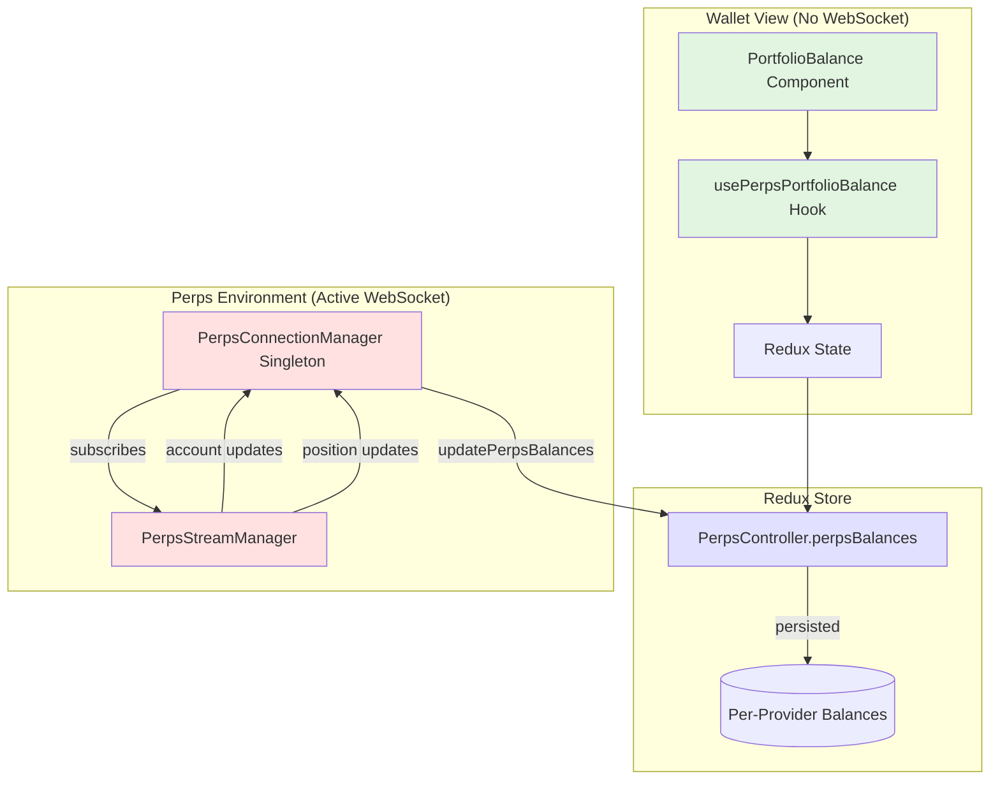
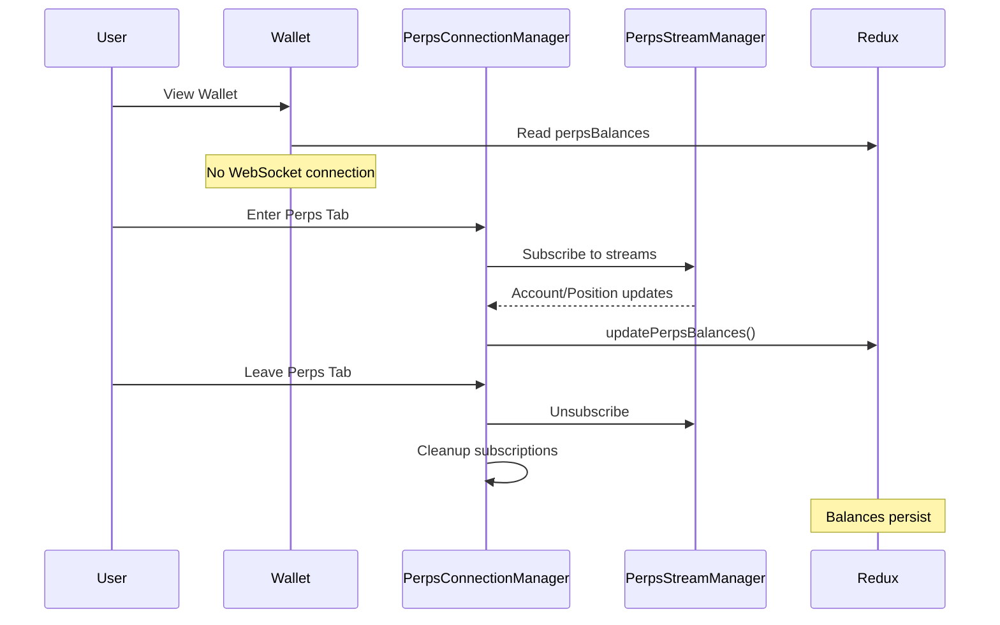

# Perps Balance Integration - Implementation Summary

## Overview

This document summarizes the implementation of TAT-1044 and TAT-1299, which integrate perps account balances into the MetaMask wallet portfolio view without maintaining unnecessary WebSocket connections.

## Key Requirements Implemented

- ✅ Display total unrealized PnL across multiple open positions (TAT-1044)
- ✅ Include perps account balance in total wallet balance (TAT-1299)
- ✅ WebSocket disconnects when leaving perps environment
- ✅ Balances persist for offline viewing
- ✅ Support for multiple perps providers
- ✅ Throttled price updates, immediate position updates

## Architecture Diagram



## Data Flow

### 1. Wallet View (Passive Reading)

```
PortfolioBalance
  ├── usePerpsPortfolioBalance({ fetchOnMount: true })
  │   ├── Reads from Redux: selectPerpsBalances
  │   ├── One-time fetch on mount (if needed)
  │   └── Returns aggregated balance in display currency
  └── Combines with wallet balance for total display
```

### 2. Perps Environment (Active Updates)

```
PerpsConnectionManager (Singleton)
  ├── preloadSubscriptions()
  │   ├── StreamManager.account.subscribe() → throttled 5s
  │   └── StreamManager.positions.subscribe() → immediate
  └── updatePerpsBalances()
      └── Updates Redux state via PerpsController
```

## State Structure

### Redux State (`PerpsController.state.perpsBalances`)

```typescript
{
  "hyperliquid": {
    totalValue: "12500.50",      // USD value
    unrealizedPnl: "-234.12",     // USD P&L
    positions: [...],             // Position details
    lastUpdated: 1735850000000   // Timestamp
  },
  // Future providers...
  "dydx": { ... },
  "gmx": { ... }
}
```

## Key Components

### 1. PerpsConnectionManager (Singleton)

**Location:** `/app/components/UI/Perps/services/PerpsConnectionManager.ts`

**Responsibilities:**

- Manages WebSocket lifecycle
- Updates persisted balances via subscriptions
- Ensures single instance (no duplicate computations)
- Throttles price updates (5s), immediate position updates

**Key Methods:**

- `preloadSubscriptions()` - Sets up balance update subscriptions
- `updatePerpsBalances()` - Updates Redux state with latest data
- `cleanupPreloadedSubscriptions()` - Removes subscriptions on disconnect

### 2. usePerpsPortfolioBalance Hook

**Location:** `/app/components/UI/Perps/hooks/usePerpsPortfolioBalance.ts`

**Responsibilities:**

- Reads persisted balances from Redux
- Aggregates balances across all providers
- Converts USD to display currency
- Optional one-time fetch on mount

**Usage:**

```typescript
// In wallet view (passive reading)
const { perpsBalance } = usePerpsPortfolioBalance({
  fetchOnMount: true,
});

// In perps environment (no fetch needed)
const { perpsBalance, unrealizedPnl } = usePerpsPortfolioBalance();
```

### 3. PortfolioBalance Component

**Location:** `/app/components/UI/Tokens/TokenList/PortfolioBalance/index.tsx`

**Integration:**

```typescript
// Combines wallet + perps balances
if (isPerpsEnabled && isEvmSelected) {
  combinedTotalBalance = BigNumber(walletBalance).plus(perpsBalance).toNumber();
}
```

## Update Throttling Strategy

| Update Type      | Throttle Time | Reason                            |
| ---------------- | ------------- | --------------------------------- |
| Price Updates    | 5 seconds     | Reduce UI flicker, save resources |
| Position Changes | Immediate     | Critical for accurate P&L         |
| Account State    | 5 seconds     | Bundled with price updates        |

## WebSocket Connection Lifecycle



## Migration from Previous Implementation

### Before (Problem)

- PortfolioBalance wrapped in PerpsConnectionProvider
- WebSocket always active on wallet screen
- No persistence between sessions
- Complex multi-hook architecture

### After (Solution)

- PortfolioBalance reads from Redux directly
- WebSocket only in perps environment
- Balances persist per provider
- Single consolidated hook
- Singleton manager for updates

## Testing Verification

### Logging Points

The implementation includes comprehensive DevLogger statements for debugging:

1. **PortfolioBalance Component**

   - Logs when perps balance is checked
   - Logs balance combination calculations

2. **usePerpsPortfolioBalance Hook**

   - Logs eligibility checks
   - Logs balance fetching
   - Logs aggregation calculations

3. **PerpsConnectionManager**
   - Logs balance update triggers
   - Logs subscription lifecycle

### Verification Steps

1. Open wallet view → Check logs for "PortfolioBalance: Perps balance check"
2. Verify no WebSocket connection active
3. Enter perps tab → Check for "PerpsConnectionManager: Pre-loading"
4. Make trades → Verify immediate balance updates
5. Leave perps → Check for "PerpsConnectionManager: Cleaning up"
6. Return to wallet → Verify persisted balance displays

## Future Enhancements

1. **Multi-Provider Support**

   - Architecture ready for dYdX, GMX, etc.
   - Each provider gets own balance entry
   - Automatic aggregation across all

2. **Historical Data**

   - Can add 24h/7d/30d snapshots
   - Store in separate Redux slice
   - Display in portfolio charts

3. **Performance Optimizations**
   - Consider IndexedDB for large position history
   - Implement virtual scrolling for many positions
   - Add balance change animations

## Summary

This implementation successfully decouples the wallet view from the perps WebSocket infrastructure while maintaining accurate, real-time balance updates when in the perps environment. The singleton pattern ensures efficient resource usage, and the Redux persistence provides a seamless user experience across app sessions.
