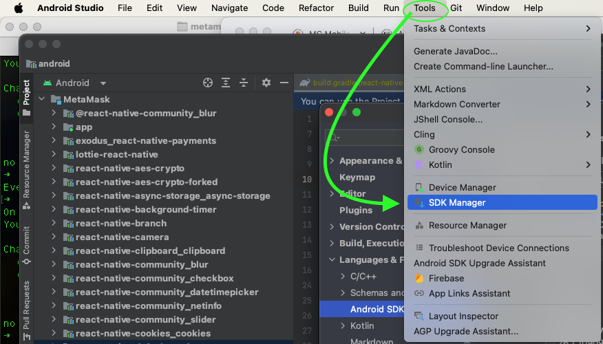
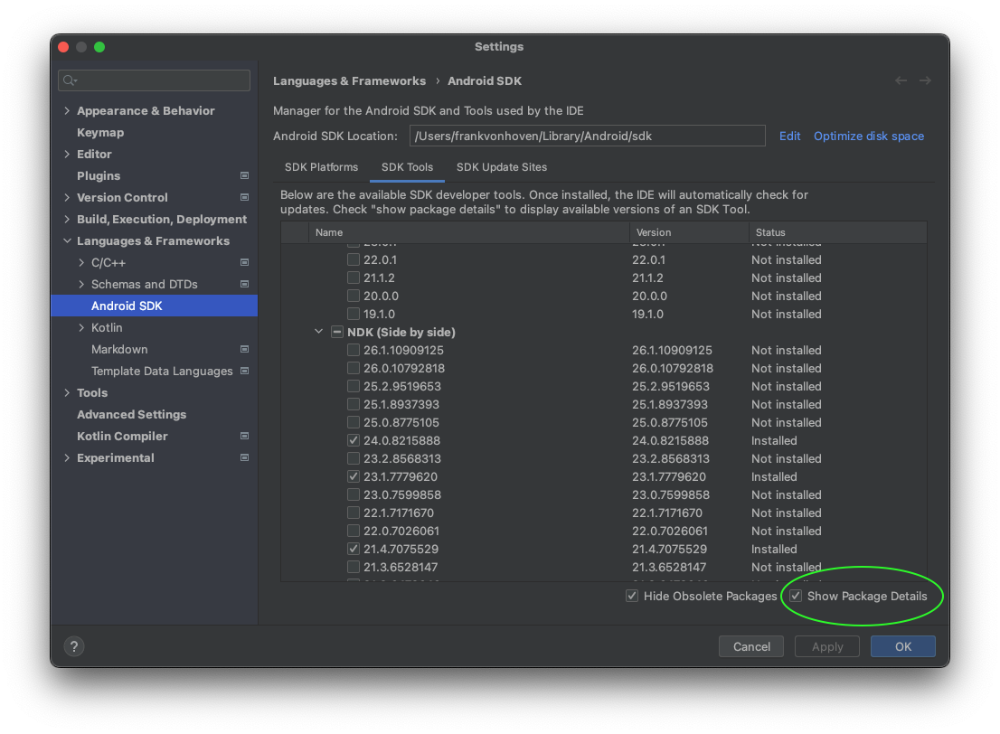
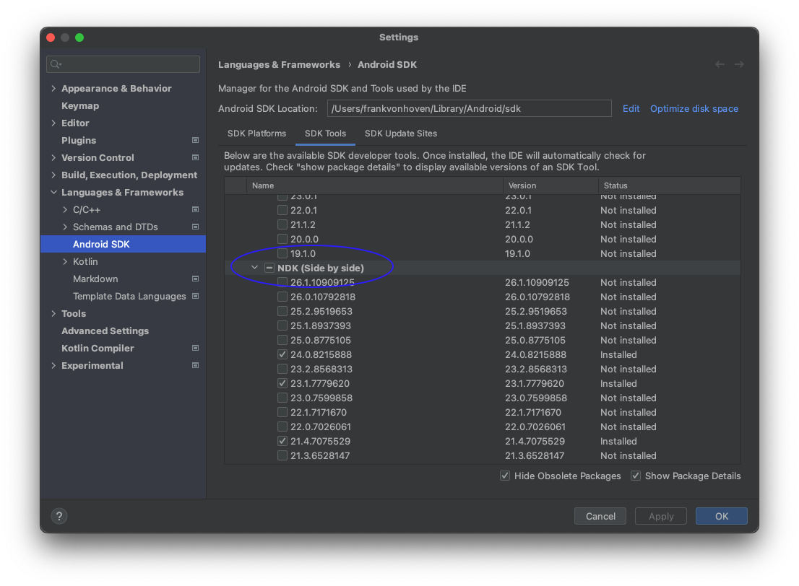
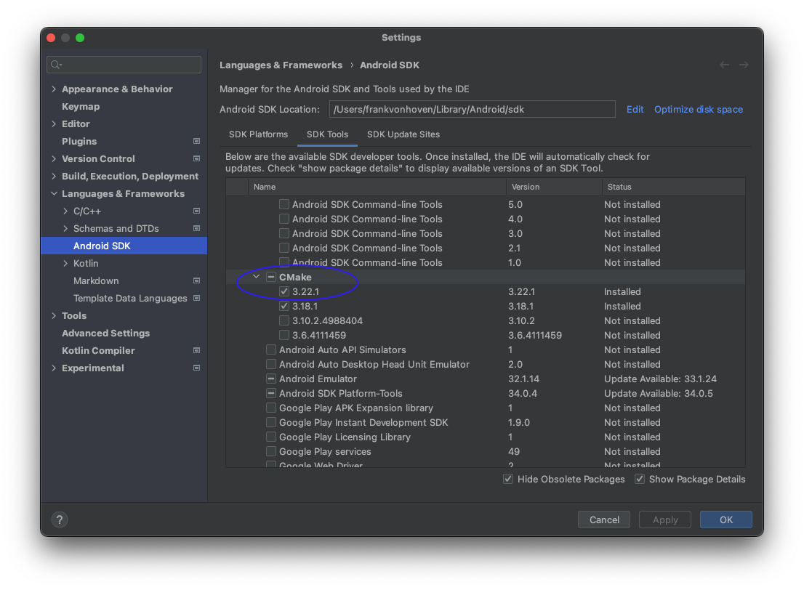
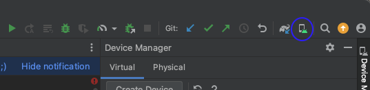

<!-- START doctoc generated TOC please keep comment here to allow auto update -->
<!-- DON'T EDIT THIS SECTION, INSTEAD RE-RUN doctoc TO UPDATE -->

- [MetaMask](#metamask)
  - [Environment Setup](#environment-setup)
    - [Device Environment Setup](#device-environment-setup)
      - [Android](#android)
    - [Building Locally](#building-locally)
      - [Android](#android-1)
      - [iOS](#ios)
      - [Build Troubleshooting](./docs/readme/troubleshooting.md)
    - [Debugging](./docs/readme/debugging.md)
      - [Debugging Physical iOS devices](#debugging-physical-ios-devices)
      - [Debug a website inside the WebView (in-app browser)](#debug-a-website-inside-the-webview-in-app-browser)
    - [Running Tests](./docs/readme/testing.md)
      - [Unit Tests](#unit-tests)
      - [E2E Tests](#e2e-tests)
        - [Platforms](#platforms)
        - [Test wallet](#test-wallet)
        - [Detox](#detox)
    - [iOS](#ios-1)
      - [Appium](#appium)
    - [Changing dependencies](#changing-dependencies)
    - [Architecture](./docs/readme/architecture.md)
    - [Storybook](./docs/readme/storybook.md)
    - [Miscellaneous](./docs/readme/miscellaneous.md)

<!-- END doctoc generated TOC please keep comment here to allow auto update -->


# MetaMask

[](https://github.com/MetaMask/metamask-mobile/actions/workflows/ci.yml) [](https://github.com/MetaMask/metamask-mobile/actions/workflows/cla.yml)

MetaMask is a mobile wallet that provides easy access to websites that use the [Ethereum](https://ethereum.org/) blockchain.

For up to the minute news, follow our [Twitter](https://twitter.com/metamask) or [Medium](https://medium.com/metamask) pages.

To learn how to develop MetaMask-compatible applications, visit our [Developer Docs](https://docs.metamask.io).

## Prerequisites

### Environment Setup

The code is built using React-Native and running code locally requires a Mac or Linux OS.

1. ### Install Node with [nvm](https://github.com/creationix/nvm#installation)

   - `curl -o- https://raw.githubusercontent.com/nvm-sh/nvm/v0.39.7/install.sh | bash`
   - `nvm install 18.18.2`
   - `nvm use 18.18.2`
     - Usage: `nvm alias default 18.18.2` (or whatever version you need - this sets the working version)

2. ### Install [Yarn v1](https://yarnpkg.com/en/docs/install)

   One way to install Yarn v1 is by using brew:

   ```bash
   npm install yarn@1.22.19
   ```

   To check you've installed the right version:

   ```bash
   yarn --version
   ```

3. ### Install Xcode

   - From the [App Store](https://apps.apple.com/us/app/xcode/id497799835?mt=12)
   - Install Command Line Tools - `cmd + ,` to open settings - `Locations` tab - Select the most recent version in the Command Line Tools dropdown
     

4. ### Install [cocoapods](https://guides.cocoapods.org/using/getting-started.html)

   - `sudo gem install cocoapods -v 1.12.1`

5. ### Install [Android Studio](https://developer.android.com/studio)

- Follow the default recommended settings

6. ### Install the Java Developer Kit (JDK)

   ```
     brew tap homebrew/cask-versions

     brew install --cask zulu17
   ```

   - Add these exports to your `.zshrc` or `.bashrc` file:

   ```
      export PATH=~/Library/Android/sdk/tools:$PATH
      export PATH=~/Library/Android/sdk/platform-tools:$PATH
      export ANDROID_HOME=$HOME/Library/Android/sdk
      export PATH=$PATH:$ANDROID_HOME/emulator

      export JAVA_HOME=/Library/Java/JavaVirtualMachines/zulu-17.jdk/Contents/Home
   ```

   - NOTE: _If you have already installed JDK on your system, we recommend JDK 17. You may encounter problems using higher JDK versions._

7. ### Install - Specific Android NDK Verision in Android Studio

   #### In Android Studio

   - NOTE: \_The "Welcome to Android Studio" page will also bring you here.
   - Select `Tools` tab from Android Studio application menu
     - `SDK Manager`
       
   - Check `Show Package Details` option below the tools list to show available versions
     
   - Locate `NDK (Side-by-side)` option in the tools list
     
     - Check NDK version `24.0.8215888`
   - Locate `CMake` option in the tools list
     
     - Check CMake version `3.22.1`
   - Click "Apply" or "OK" to download

   - Finally, start the emulator from Android Studio:
     
     - Open "Virtual Device Manager"
     - Launch emulator for "Pixel 5 <relevant API version mentioned in [React Native Getting Started](https://reactnative.dev/docs/environment-setup#installing-dependencies)>"
       - NOTE: _You might need to create a device_

## Building the App

1. ### Clone this repo:

   ```bash
   git clone git@github.com:MetaMask/metamask-mobile.git
   cd metamask-mobile
   ```

   - _MetaMask Internal Only:_ Rename the `.*.env.example` files (remove the `.example`) in the root of the project and fill in the appropriate values for each key. Get the values from another MetaMask Mobile developer.

   ```
     cp .ios.env.example .ios.env && \
     cp .android.env.example .android.env && \
     cp .js.env.example .js.env
   ```

   - Note: after updating env vars, make sure to run `source .js.env` on the root of the project

2. ### Install the app:

   ```
   yarn setup
   ```

   _Not the usual install command, this will run scripts and a lengthy postinstall flow_

3. ### Start the packager

   ```bash
   yarn watch
   ```

   _Like a local server for the app_

4. ### Run the App on a Local Simulator/Emulator

   #### Android

   ```bash
   yarn start:android
   ```

   #### iOS

   ```bash
   yarn start:ios
   ```
