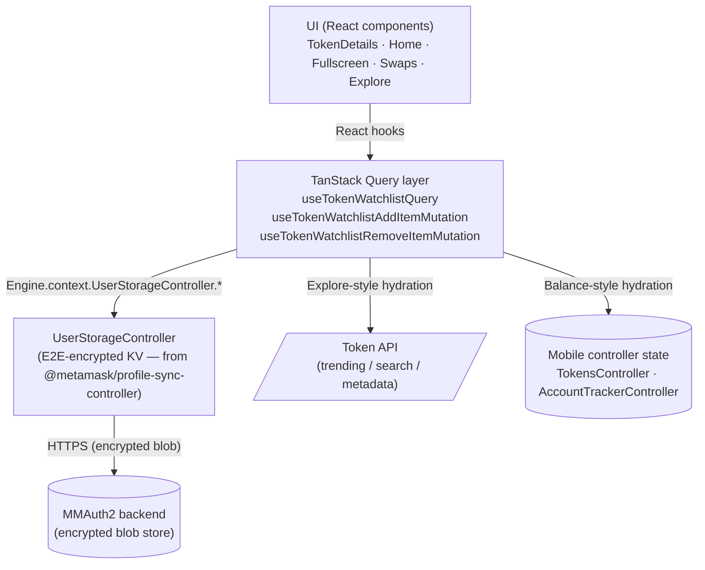
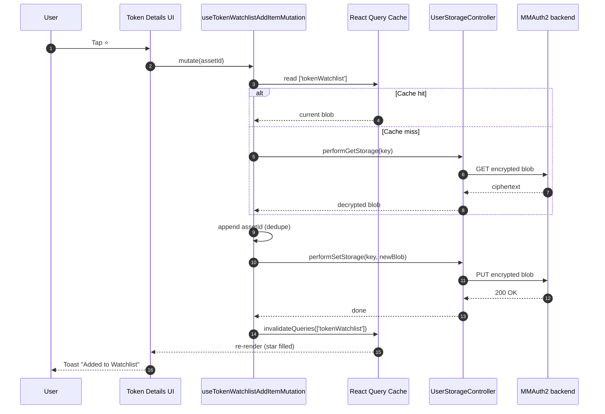
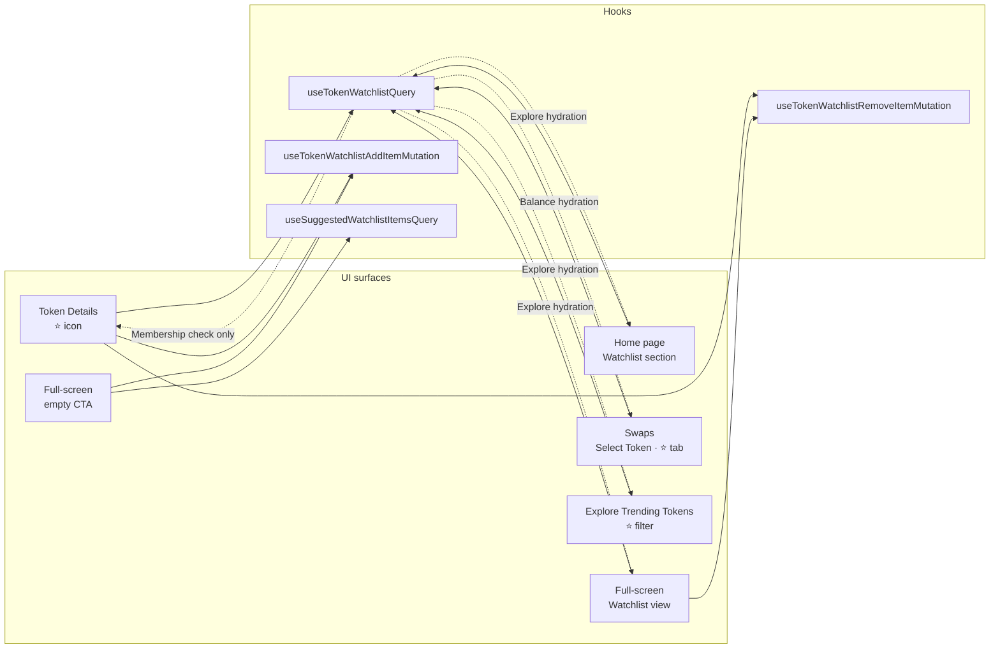

# Token Watchlist — Technical Specification

> **Source:** Transcribed from https://www.loom.com/share/765cee830b104fabb92a7042edba33e9 (recording + SRT).
> **Audience:** Mobile engineering (primary), Extension engineering (secondary — port candidate).
> **Status:** Ready for Jira breakdown. Designs exist in Figma; PM is **Amarildo**.
> **Repo references:** `MetaMask/metamask-mobile` — paths below are conventional (`app/...`) and match the architecture documented in [`AGENTS.md`](https://github.com/MetaMask/metamask-mobile/blob/main/AGENTS.md).

---

## 1. Feature Summary

The **Token Watchlist** lets a user "star" tokens they want to follow without holding a balance. Watchlisted tokens appear in three surfaces:

1. **Home page** — a new "Watchlist" section (top 3 items, Explore-style cards).
2. **Full-screen Watchlist view** — all watchlisted items, sortable, with per-item meatball actions (Swap / Buy / Remove).
3. **Swaps "Select Token" UI** — a new ⭐ tab filtered to watchlisted tokens, hydrated with user balances.

A ⭐ icon on the **Token Details** page is the primary add/remove control.

The data itself is just a **list of CAIP-19 asset IDs** stored on the backend, synced across devices, and hydrated client-side with metadata (market data for Explore-style surfaces, balances for the Swaps surface).

---

## 2. Architecture

### 2.0 High-level layers



### 2.1 Storage

- **Backend-synced, not device-local.** Decided with Amarildo so watchlists persist across devices.
- **Mechanism:** `UserStorageController` from `@metamask/profile-sync-controller` — specifically the **E2E-encrypted** database (not the "authenticated user storage"). Rationale: watchlists are client-only config; server-side visibility is unnecessary.
- **⚠️ Consequence of E2E encryption:** each client generates its own key, so neither Anthropic, MetaMask, nor any other client can read the blob. This is acceptable for this data.
- **Shape:** **one single blob per user** containing a flat list of CAIP-19 asset IDs. No per-item blobs. Keeps CRUD trivial.

Example blob:

```json
{
  "assets": [
    "eip155:1/erc20:0xa0b86991c6218b36c1d19d4a2e9eb0ce3606eb48",
    "eip155:1/slip44:60",
    "solana:5eykt4UsFv8P8NJdTREpY1vzqKqZKvdp/..."
  ],
  "version": 1
}
```

### 2.2 Client integration point

All CRUD goes through the existing Engine pattern (see `app/core/Engine/` in metamask-mobile):

```ts
// conceptual — actual method name depends on the controller's public surface
Engine.context.UserStorageController.performGetStorage(
  'wallet.watchlist.tokens',
);
Engine.context.UserStorageController.performSetStorage(
  'wallet.watchlist.tokens',
  blob,
);
```

No new controller. No new Redux slice. No new messenger events.

> **Open question for kickoff:** confirm the exact method names on the mobile `UserStorageController` instance and whether a new storage-key namespace needs to be registered in `@metamask/profile-sync-controller`. The storage schema is intentionally loose, so the key can likely be client-defined.

### 2.3 State layer — TanStack Query only

TanStack Query is already present in the app. We will **not** build a controller or saga for this feature. All server state lives in the query cache; all UI state lives in component state.

Three+1 hooks:

| Hook                                  | Type                       | Purpose                                                                                                                                                                                                |
| ------------------------------------- | -------------------------- | ------------------------------------------------------------------------------------------------------------------------------------------------------------------------------------------------------ |
| `useTokenWatchlistQuery`              | query                      | Fetch blob → hydrate with metadata (market data **and** balances) → return enriched list. If perf becomes a problem, split into `useTokenWatchlistMarketDataQuery` + `useTokenWatchlistBalancesQuery`. |
| `useTokenWatchlistAddItemMutation`    | mutation                   | Read current blob → append asset ID(s) → write back. Accepts single or array input.                                                                                                                    |
| `useTokenWatchlistRemoveItemMutation` | mutation                   | Read current blob → filter out asset ID(s) → write back. Accepts single or array input.                                                                                                                |
| `useSuggestedWatchlistItemsQuery`     | query (empty-state helper) | Returns 3 curated asset IDs + metadata for the empty-state CTA. Implementation: call Trending Tokens API with 3 curated IDs (BTC / ETH / SOL, or top 3 trending).                                      |

**Why split add/remove into two mutations?** Easier consumer ergonomics — each call site uses exactly one of the two, avoiding conditional action args. Both mutations invalidate the same query key, so React Query auto-refreshes everything.

**Query key convention:**

```ts
['tokenWatchlist'][('tokenWatchlist', 'marketData')][ // the full list // if split
  ('tokenWatchlist', 'balances')
]; // if split
```

### 2.4 Hydration

Two hydration modes, both needed depending on the surface:

| Mode                                                                | Used on                                                                   | Data source                                                                                              |
| ------------------------------------------------------------------- | ------------------------------------------------------------------------- | -------------------------------------------------------------------------------------------------------- |
| **Explore-style** (market cap, 24h volume, price %, sparkline flag) | Home page, Fullscreen view, Explore Trending Tokens filtered-by-watchlist | Token API — trending/search endpoints by asset ID                                                        |
| **Balance-style** (user balance + fiat value)                       | Swaps "Select Token" ⭐ tab                                               | Existing controller state (TokensController / AccountTrackerController) — read-through; show 0 if absent |

The `useTokenWatchlistQuery` hook does **both** hydrations by default. If profiling shows it's too heavy, split into the two sub-queries listed in 2.3.

> **Note on charts (V1 pushback).** Figma shows a mini-chart per watchlist item. **V1 will not render charts** — the Token API has no batch historical-prices endpoint. V1 reuses the existing Trending Token list-item component (no chart). Revisit in V2 once batch price history exists.

### 2.5 Add-item flow (sequence)

The read and remove flows are structurally identical; only the blob transform differs.



---

## 3. UI Surfaces

Quick map of which surface consumes which hook and which hydration mode:



### 3.1 Token Details — ⭐ icon

**File areas to touch:** `app/components/UI/AssetOverview/` (or the current token-details screen), wherever the header action row lives.

- **Icon states:** outline (not watched) / filled (watched). Colour from Figma (pink-purple family — use the token, not a hex).
- **Hooks used:** `useTokenWatchlistQuery` (to know current state for the asset ID on screen), `useTokenWatchlistAddItemMutation`, `useTokenWatchlistRemoveItemMutation`.
- **Interactions:**
  - Add → fire mutation → fire analytics event → show toast "Added to Watchlist" with ✓ icon (reuse the existing mobile toast mechanism; `ToastContext`/equivalent).
  - Remove → fire mutation → fire analytics event → show toast "Removed from Watchlist".
- **Deferred:** the "Manage Watchlist" button inside the toast (Figma shows it but has no target route — confirm with Amarildo in V1+).
- **No manual refetch** — React Query invalidation on the mutation handles it.

### 3.2 Home Page — Watchlist section (top 3)

**File areas to touch:** `app/components/Views/Wallet/` or the homepage section composition (look for existing `SectionHeader` consumers — see recent release notes: _"feat(homepage): add SectionHeader to components-temp and adopt across homepage sections, perps, and activity"_ ([#26976](https://github.com/MetaMask/metamask-mobile/releases))).

- **Hooks used:** `useTokenWatchlistQuery` (take first 3; list is likely already volume-sorted).
- **Components to reuse:** existing home-screen `SectionHeader`; existing `TrendingTokenListItem` (or equivalent).
- **Empty state:** simple inline CTA linking to the full-screen empty CTA (see 3.4). No chart per item in V1.
- **Interactions:**
  - Tap section header → navigate to full-screen Watchlist + fire analytics.
  - Tap an item → open Token Details + fire analytics with `source: 'watchlist_home'`.

### 3.3 Full-screen Watchlist view

- **Scope note:** **EVM tokens only in V1.** Perps integration deferred — do not import Perps code paths until a Perps engineer joins.
- **Hooks used:** `useTokenWatchlistQuery`, `useTokenWatchlistRemoveItemMutation`.
- **Components to reuse:**
  - `ExploreTokenListItem` / `TrendingTokenListItem`.
  - Existing sorting bottom-sheet from Explore/Trending Tokens — **lift as-is**.
- **Per-item meatball menu** (bottom sheet): **Swap** / **Buy** / **Remove from Watchlist**.
  - Swap action: reuse the Swap CTA from Token Details.
  - Buy action: reuse the Buy CTA from Token Details (watch for dependencies).
  - Remove: calls `useTokenWatchlistRemoveItemMutation`.
- **Sticky bottom CTA:** "See more tokens" → navigates to Explore Trending Tokens.
- **Interactions:**
  - Tap item → Token Details, analytics with `source: 'watchlist_fullscreen'`.
  - Sort / filter: client-side, reusing existing logic.

### 3.4 Full-screen empty CTA (its own ticket because of complexity)

- **Hooks used:** `useSuggestedWatchlistItemsQuery`, `useTokenWatchlistAddItemMutation`.
- **UI:**
  - Reuse `TrendingTokenListItem` (or `ExploreTokenListItem`).
  - Right-aligned **checkbox** per row (flex layout tweak on the existing component).
  - Two buttons at the bottom: **Explore** (left) + **Add** (right, primary).
  - All 3 rows checked by default; **Add** disabled when nothing is checked.
- **Interactions:**
  - Add → call `useTokenWatchlistAddItemMutation` with the checked IDs → empty state disappears automatically because the query key re-reads.
  - Explore → open Explore page + analytics.

### 3.5 Swaps — "Select Token" ⭐ tab

**File areas to touch:** Swaps select-token screen (owned by Swaps team — coordinate). This is the `useBalance`-hydrated surface.

- **Hooks used:** `useTokenWatchlistQuery` (balances hydration).
- **UI:**
  - New ⭐ tab next to existing tabs.
  - Uses generic wallet `TokenListItem` (same one the Wallet tab uses, with balances).
  - Search bar on top — **local filter** against the watchlist only, no API call.
  - Empty state (no watchlist at all): reuse the empty CTA from 3.4.
  - Empty state (search with no hits): plain text, no CTA.
- **Interactions:**
  - Tap item → populate the Swaps flow (not Token Details) + fire analytics with a dedicated event indicating the swap originated from the watchlist.
  - Optional V1/V2: consider filtering out zero-balance watchlist items (confirm with PM).
- **V2:** expose the ⭐ tab in the Swaps "Trending Tokens" homepage view too.

### 3.6 Explore Trending Tokens — ⭐ filter

- **Hooks used:** `useTokenWatchlistQuery` (Explore hydration).
- **UI:** reuse `TrendingTokenListItem`; add ⭐ filter chip to restrict list to watchlisted tokens.
- **Empty state:** reuse the full-screen empty CTA (designs don't show it, but consistency wins).
- **Interactions:**
  - Sort / filter / search all run client-side against the watchlist subset.
  - Tap item → Token Details with `source: 'explore_watchlist_filter'`.

---

## 4. Analytics

Every add / remove / open / navigate should fire a Mixpanel event. Event names and properties to be finalized with Amarildo. Required discriminators:

- `source` on every "token details opened" event (`watchlist_home`, `watchlist_fullscreen`, `explore_watchlist_filter`, `swaps_watchlist_tab`).
- A dedicated event when the Swaps flow is initiated from the ⭐ tab (strong signal that the watchlist drove the swap).

Follow the existing mobile analytics pattern (MetaMetrics / `MetricsEventBuilder`).

---

## 5. Feature flag

- **Provider:** LaunchDarkly (consistent with e.g. `rampsUnifiedBuyV2` — see recent release notes for the "simplify … feature flag to single selector" pattern).
- **Flag name (proposal):** `tokenWatchlistEnabled`.
- **Deliverable:** one Redux/selector wrapper (`selectTokenWatchlistEnabled`) used by every entry point (Home section, Fullscreen route, Token Details star, Swaps tab, Explore filter). A single selector makes kill-switching trivial.
- **Default:** `false` until QA passes.

---

## 6. Out of scope (V1)

- Per-item historical price chart on the list items (no batch endpoint).
- Perps assets in the watchlist.
- "Manage Watchlist" link target in the added-to-watchlist toast.
- ⭐ tab in the Swaps homepage "Trending Tokens" view.
- Extension port (same hooks should work — schedule as a follow-up).

---

## 7. Risks / open questions

1. **UserStorageController method surface on mobile** — confirm the exact API (`performGetStorage` / `performSetStorage` or messenger actions) and whether the `wallet.watchlist.tokens` key needs to be registered in `@metamask/profile-sync-controller` schema.
2. **E2E-encrypted blob size** — not a concern for asset-ID lists, but worth a sanity check if users hoard 1000+ items. Consider a soft cap (e.g. 500).
3. **Conflict resolution** — last-write-wins across devices is acceptable per the discussion; document this explicitly in the PR.
4. **Hydration fan-out** — if the token-API calls for 100+ watchlist items are slow, pre-split the query (2.3).
5. **Swaps "Buy" action reuse** — may have internal dependencies (on-ramp provider selection, chain state). Budget investigation time in the full-screen ticket.

---

# 8. Jira task breakdown

Grouped by phase. Tasks within the same phase are parallelizable unless marked `[blocks →]`.

## Phase 0 — Foundation `[blocks → all Phase 2/3 UI]`

### TASK-0.1 — Add LaunchDarkly feature flag `tokenWatchlistEnabled`

- Register the flag in LaunchDarkly (both environments).
- Add the flag to the remote feature flags schema.
- Add selector: `selectTokenWatchlistEnabled(state)` in `app/selectors/featureFlagController/`.
- Unit test the selector with flag on/off.
- **Estimate:** 0.5d

### TASK-0.2 — Confirm & document UserStorage contract for watchlist

- Confirm the exact `UserStorageController` method names available on mobile.
- Decide storage key (`wallet.watchlist.tokens`) — register in `@metamask/profile-sync-controller` if required; otherwise document the client-defined key.
- Write a short design doc / ADR (1 page) inside `docs/`.
- **Estimate:** 0.5d–1d (depends on whether a `@metamask/profile-sync-controller` PR is needed)

---

## Phase 1 — Business logic (TanStack Query hooks) `[blocks → all UI tasks]`

### TASK-1.1 — `useTokenWatchlistQuery`

- New folder: `app/components/hooks/TokenWatchlist/` (or `app/hooks/TokenWatchlist/`).
- Hook fetches the blob via `UserStorageController`, parses, validates with a Zod/Superstruct schema.
- Hydrates with:
  - Token API trending/search data (Explore-style),
  - Controller-state balances (read via existing selectors).
- Returns typed `WatchlistItem[]` (asset ID + metadata + balance).
- Query key: `['tokenWatchlist']`.
- Unit tests: empty blob, malformed blob, successful hydration, partial hydration failure.
- **Estimate:** 1.5d

### TASK-1.2 — `useTokenWatchlistAddItemMutation`

- Accepts `AssetId | AssetId[]`.
- Reads current blob (via cache first, storage fallback), appends, writes back, invalidates `['tokenWatchlist']`.
- De-dupe on add.
- Optimistic update (optional but nice — show the star filled immediately).
- Unit tests: single add, multi add, duplicate add, failure rollback.
- **Estimate:** 1d

### TASK-1.3 — `useTokenWatchlistRemoveItemMutation`

- Mirror of 1.2 but filtering out.
- Unit tests: single remove, multi remove, remove-not-in-list no-op, failure rollback.
- **Estimate:** 1d

### TASK-1.4 — `useSuggestedWatchlistItemsQuery` (empty-state helper)

- Curated list of 3 asset IDs (BTC/ETH/SOL by default; confirm with PM).
- Calls Trending Tokens API to hydrate.
- **Estimate:** 0.5d

---

## Phase 2 — UI surfaces (parallelizable after Phase 1)

### TASK-2.1 — ⭐ icon on Token Details page

- Add star icon button to the Token Details header.
- Outline / filled states, colours from Figma tokens.
- Wire to add/remove mutations + toast.
- Analytics events (`watchlist_item_added`, `watchlist_item_removed`).
- Gate behind `selectTokenWatchlistEnabled`.
- Unit tests + `.view.test.tsx` snapshot for both states.
- **Estimate:** 1d

### TASK-2.2 — Home page Watchlist section (top 3)

- New `WatchlistHomeSection` component under the homepage section composition.
- Reuse `SectionHeader` + `TrendingTokenListItem`.
- Empty-state inline CTA → routes to full-screen empty CTA.
- Navigation: tap header → full-screen; tap item → Token Details (with source).
- Analytics on both taps.
- Gated by flag; hidden entirely when flag off.
- Unit tests + view test.
- **Estimate:** 1.5d

### TASK-2.3 — Full-screen Watchlist route (list view only)

- New route/screen `Watchlist` registered in the navigator.
- Header + sort bottom-sheet (lifted from Explore Trending Tokens).
- List uses `TrendingTokenListItem`.
- Per-item meatball opens bottom sheet with Swap / Buy / Remove.
- Sticky "See more tokens" bottom CTA → Explore Trending Tokens route.
- Gated by flag (hard 404 / redirect if disabled).
- Unit tests + view test + navigation test.
- **Estimate:** 2.5d (the sort sheet lift may surprise us)

### TASK-2.4 — Full-screen empty CTA

- Separate ticket due to the checkbox row layout and default-checked logic.
- Uses `useSuggestedWatchlistItemsQuery` + `useTokenWatchlistAddItemMutation`.
- Flex/checkbox variant of `TrendingTokenListItem`.
- Two buttons (Explore / Add); Add disabled when no selection.
- Analytics event on successful add.
- Unit tests: default 3-checked state, deselect-all disables Add, successful batch add dismisses the empty state.
- **Estimate:** 2d

### TASK-2.5 — Swaps "Select Token" ⭐ tab

- Coordinate with Swaps team; likely a PR into Swaps-owned code.
- New tab in Select Token UI.
- Uses `useTokenWatchlistQuery` (balances hydration).
- Local search (client-side filter).
- Two empty states (no watchlist → full empty CTA; no search results → plain text).
- Tap item → populate Swaps form (not Token Details).
- Dedicated analytics event on swap initiation from this tab.
- Gated by flag.
- Unit tests + view test.
- **Estimate:** 2d

### TASK-2.6 — Explore Trending Tokens ⭐ filter

- Add ⭐ filter chip on the Explore Trending Tokens full-screen page.
- When active: `useTokenWatchlistQuery` + client-side sort/filter/search.
- When inactive: existing behaviour unchanged.
- Reuse empty CTA from TASK-2.4.
- Analytics with `source: 'explore_watchlist_filter'`.
- Gated by flag (chip hidden when flag off).
- **Estimate:** 1d

---

## Phase 3 — QA, analytics review, polish

### TASK-3.1 — Analytics schema review with Amarildo

- Finalize event names + properties across all surfaces.
- Verify Mixpanel receives all expected events in dev.
- **Estimate:** 0.5d

### TASK-3.2 — E2E (Detox) smoke test

- Add token to watchlist from Token Details → see it on home → open full-screen → remove → empty state.
- Tests live under `tests/smoke/`.
- **Estimate:** 1d

### TASK-3.3 — Cross-device sync manual QA

- Sign in on two devices, add on device A, verify on device B after re-fetch.
- Confirm encrypted blob is indeed not readable by the backend (spot-check with team).
- **Estimate:** 0.5d

### TASK-3.4 — Flag rollout plan

- Stage rollout: internal → QA → 1% → 10% → 100%.
- Ownership: who flips the flag, who monitors Sentry.
- **Estimate:** 0.5d

---

## Phase 4 — V2 (backlog, not in this epic unless prioritized)

- [ ] Mini-chart per watchlist item (blocked on batch historical price API).
- [ ] Perps assets in the watchlist (pair with Perps team).
- [ ] ⭐ tab inside Swaps homepage Trending Tokens view.
- [ ] "Manage Watchlist" link in the toast.
- [ ] Port hooks to Extension (same signatures should work).

---

## Rough total (V1)

| Phase     | Days                                                      |
| --------- | --------------------------------------------------------- |
| Phase 0   | ~1.5d                                                     |
| Phase 1   | ~4d                                                       |
| Phase 2   | ~10d (parallelizable — wall-clock ~4–5d with 2 engineers) |
| Phase 3   | ~2.5d                                                     |
| **Total** | **~18d serial / ~10–12d with 2 engineers in parallel**    |
