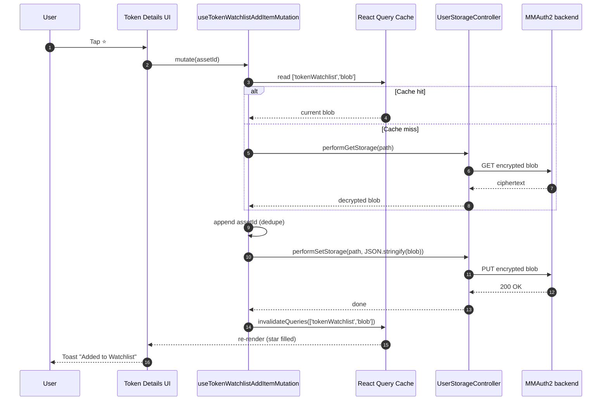
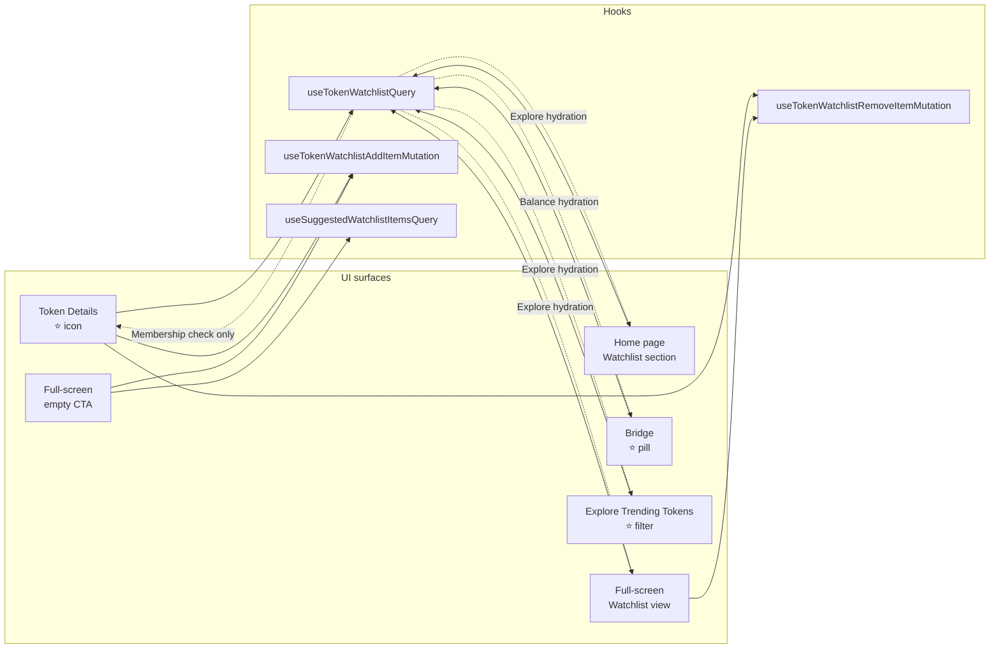

# Token Watchlist — Technical Specification

> **Audience:** Mobile engineering (primary), Extension engineering (port candidate).
> **Status:** Ready for implementation. Figma exists; PM is **Amarildo**.
> **Repo root:** `metamask-mobile`. All paths below have been verified against the branch.

---

## 1. Feature Summary

The **Token Watchlist** lets a user "star" tokens they want to follow without holding a balance. Watchlisted tokens appear in three surfaces:

1. **Home page** — new "Watchlist" section (top 3 items, Explore-style cards).
2. **Full-screen Watchlist view** — all watchlisted items, sortable, with per-item meatball actions (Swap / Buy / Remove).
3. **Bridge "Select Token" UI** — a new ⭐ pill alongside `NetworkPills` to filter to watchlisted tokens, hydrated with user balances.

A ⭐ icon on the **Token Details** page is the primary add/remove control.

The data itself is just a **list of CAIP-19 asset IDs** stored on the backend via `UserStorageController` (E2E-encrypted), synced across devices, and hydrated client-side with metadata.

---

## 2. Architecture

### 2.0 High-level layers

```mermaid
flowchart TD
    UI["UI (React components)<br/>TokenDetails · Home · Fullscreen · Bridge · Explore"]
    Hooks["TanStack Query layer<br/>useTokenWatchlistQuery<br/>useTokenWatchlistAddItemMutation<br/>useTokenWatchlistRemoveItemMutation"]
    Controller["UserStorageController<br/>(E2E-encrypted KV — @metamask/profile-sync-controller)"]
    Backend[("MMAuth2 backend<br/>(encrypted blob store)")]
    TokenAPI[/"Token API<br/>(trending / search / metadata)"/]
    ControllerState[("Mobile controller state<br/>existing selectors under app/selectors/assets/"]

    UI -- "React hooks" --> Hooks
    Hooks -- "Engine.context.UserStorageController.*" --> Controller
    Hooks -- "Explore-style hydration" --> TokenAPI
    Hooks -- "Balance-style hydration" --> ControllerState
    Controller -- "HTTPS (encrypted blob)" --> Backend
```

### 2.1 Storage

- **Mechanism:** `UserStorageController` from `@metamask/profile-sync-controller@^28.0.2` (the E2E-encrypted database).
- **Consequence:** each client holds its own key. Server-side and other clients cannot read the blob. Fine for watchlist data.
- **Shape:** **one single blob per user**, flat list of CAIP-19 asset IDs. No per-item blobs. Keeps CRUD trivial.
- **Path:** `tokenWatchlist.main`. Schema enforcement was deprecated upstream in v28.x, so no upstream PR is needed.

Example blob:

```json
{
  "assets": [
    "eip155:1/erc20:0xa0b86991c6218b36c1d19d4a2e9eb0ce3606eb48",
    "eip155:1/slip44:60",
    "solana:5eykt4UsFv8P8NJdTREpY1vzqKqZKvdp/..."
  ],
  "version": 1
}
```

### 2.2 Client integration point

The controller exposes (from `@metamask/profile-sync-controller/user-storage`):

- `performGetStorage(path: string) => Promise<string | null>` — returns a **JSON string** or `null` if absent.
- `performSetStorage(path: string, value: string) => Promise<void>` — value is a **JSON string** (stringify yourself).

The storage helpers live alongside the hooks. Superstruct (already in `package.json` at `^3.2.1`) validates the blob inline — no separate schema file:

```ts
// app/components/UI/TokenWatchlist/hooks/watchlistStorage.ts
import {
  array,
  create,
  defaulted,
  literal,
  object,
  string,
} from '@metamask/superstruct';
import Engine from '../../../../core/Engine';

export const WATCHLIST_STORAGE_PATH = 'tokenWatchlist.main';
export const EMPTY_BLOB: WatchlistBlob = { assets: [], version: 1 };

const WatchlistBlobSchema = object({
  assets: defaulted(array(string()), () => []),
  version: defaulted(literal(1), () => 1 as const),
});

export type WatchlistBlob = { assets: string[]; version: 1 };

export async function readWatchlistBlob(): Promise<WatchlistBlob> {
  const raw = await Engine.context.UserStorageController.performGetStorage(
    WATCHLIST_STORAGE_PATH,
  );
  if (!raw) return EMPTY_BLOB;
  return create(JSON.parse(raw), WatchlistBlobSchema);
}

export async function writeWatchlistBlob(blob: WatchlistBlob): Promise<void> {
  await Engine.context.UserStorageController.performSetStorage(
    WATCHLIST_STORAGE_PATH,
    JSON.stringify(blob),
  );
}
```

No defensive controller-undefined guards. `UserStorageController` is registered in `Engine.context` (see `app/core/Engine/controllers/identity/user-storage-controller-init.ts`) and is effectively always-on for users; if a read/write ever throws, React Query's `isError` state surfaces it to the UI naturally.

No new controller. No new Redux slice. No new messenger events.

### 2.3 State layer — TanStack Query only

TanStack Query is already wired in the app (`@tanstack/react-query ^4.43.0`, singleton at `app/core/ReactQueryService/ReactQueryService.ts`, provider already mounted in `app/components/Views/Root/index.tsx`). We will **not** build a controller or saga for this feature.

**Hook location:** `app/components/UI/TokenWatchlist/hooks/` (mirrors `app/components/UI/Ramp/hooks/`, `app/components/UI/Card/hooks/`, `app/components/UI/Predict/hooks/`).

Four hooks:

| Hook                                  | Type     | Purpose                                                                         |
| ------------------------------------- | -------- | ------------------------------------------------------------------------------- |
| `useTokenWatchlistQuery`              | query    | Fetch blob → hydrate with metadata + balances → return enriched list.           |
| `useTokenWatchlistAddItemMutation`    | mutation | Read blob → append asset ID(s) → write back. Accepts single or array input.     |
| `useTokenWatchlistRemoveItemMutation` | mutation | Read blob → filter out asset ID(s) → write back. Accepts single or array input. |
| `useSuggestedWatchlistItemsQuery`     | query    | Returns 3 curated asset IDs + metadata for the empty-state CTA (BTC/ETH/SOL).   |

**Why split add/remove into two mutations?** Each call site uses exactly one of the two, avoiding conditional action args. Both mutations invalidate the same query key.

**Query keys** (exported as const so tests and call sites stay in sync):

```ts
// app/components/UI/TokenWatchlist/hooks/useTokenWatchlist.keys.ts
export const tokenWatchlistQueryKeys = {
  all: ['tokenWatchlist'] as const,
  blob: ['tokenWatchlist', 'blob'] as const,
  suggested: ['tokenWatchlist', 'suggested'] as const,
};
```

**Query hook:**

```ts
// app/components/UI/TokenWatchlist/hooks/useTokenWatchlistQuery.ts
import { useQuery } from '@tanstack/react-query';
import { tokenWatchlistQueryKeys } from './useTokenWatchlist.keys';
import { readWatchlistBlob, WatchlistBlob } from './watchlistStorage';

export const useTokenWatchlistQuery = () =>
  useQuery<WatchlistBlob>({
    queryKey: tokenWatchlistQueryKeys.blob,
    queryFn: readWatchlistBlob,
    staleTime: 60_000,
  });
```

**Add mutation** (remove is the mirror with a filter instead of union):

```ts
// app/components/UI/TokenWatchlist/hooks/useTokenWatchlistAddItemMutation.ts
import { useMutation, useQueryClient } from '@tanstack/react-query';
import type { CaipAssetType } from '@metamask/utils';
import { tokenWatchlistQueryKeys } from './useTokenWatchlist.keys';
import {
  readWatchlistBlob,
  writeWatchlistBlob,
  EMPTY_BLOB,
  WatchlistBlob,
} from './watchlistStorage';

export const useTokenWatchlistAddItemMutation = () => {
  const qc = useQueryClient();
  return useMutation<WatchlistBlob, Error, CaipAssetType | CaipAssetType[]>({
    mutationFn: async (input) => {
      const ids = (Array.isArray(input) ? input : [input]).map(String);
      const cached = qc.getQueryData<WatchlistBlob>(
        tokenWatchlistQueryKeys.blob,
      );
      const current = cached ?? (await readWatchlistBlob());
      const next: WatchlistBlob = {
        ...current,
        assets: Array.from(new Set([...current.assets, ...ids])),
      };
      await writeWatchlistBlob(next);
      return next;
    },
    onMutate: async (input) => {
      await qc.cancelQueries({ queryKey: tokenWatchlistQueryKeys.blob });
      const prev = qc.getQueryData<WatchlistBlob>(tokenWatchlistQueryKeys.blob);
      const ids = (Array.isArray(input) ? input : [input]).map(String);
      qc.setQueryData<WatchlistBlob>(tokenWatchlistQueryKeys.blob, (old) => ({
        assets: Array.from(new Set([...(old ?? EMPTY_BLOB).assets, ...ids])),
        version: 1,
      }));
      return { prev };
    },
    onError: (_err, _vars, ctx) => {
      if (ctx?.prev) qc.setQueryData(tokenWatchlistQueryKeys.blob, ctx.prev);
    },
    onSettled: () => {
      qc.invalidateQueries({ queryKey: tokenWatchlistQueryKeys.blob });
    },
  });
};
```

**Convenience hook** for the ⭐ icon call site (keeps Token Details free of cache boilerplate):

```ts
// app/components/UI/TokenWatchlist/hooks/useTokenWatchlist.ts
import type { CaipAssetType } from '@metamask/utils';
import { useTokenWatchlistQuery } from './useTokenWatchlistQuery';
import { useTokenWatchlistAddItemMutation } from './useTokenWatchlistAddItemMutation';
import { useTokenWatchlistRemoveItemMutation } from './useTokenWatchlistRemoveItemMutation';

export const useTokenWatchlist = (assetId: CaipAssetType | null) => {
  const { data } = useTokenWatchlistQuery();
  const add = useTokenWatchlistAddItemMutation();
  const remove = useTokenWatchlistRemoveItemMutation();
  const isWatched = !!assetId && (data?.assets ?? []).includes(assetId);
  const toggle = () => {
    if (!assetId) return;
    (isWatched ? remove : add).mutate(assetId);
  };
  return { isWatched, toggle };
};
```

### 2.4 Hydration

Two hydration modes, both needed depending on the surface:

| Mode                                                                | Used on                                       | Data source                                                                                                                         |
| ------------------------------------------------------------------- | --------------------------------------------- | ----------------------------------------------------------------------------------------------------------------------------------- |
| **Explore-style** (market cap, 24h volume, price %, sparkline flag) | Home page, Fullscreen view, Explore ⭐ filter | `useTrendingRequest` at `app/components/UI/Trending/hooks/useTrendingRequest/useTrendingRequest.ts` (used by `TokensSection.tsx`).  |
| **Balance-style** (user balance + fiat value)                       | Bridge ⭐ pill                                | `selectSortedAssetsBySelectedAccountGroupForChainIdsByBalance` (`app/selectors/assets/assets-list.ts`) + `TokenListItem` component. |

`useTokenWatchlistQuery` does both by default. If profiling shows it's too heavy, split into `useTokenWatchlistMarketDataQuery` + `useTokenWatchlistBalancesQuery`.

> **V1 does not render mini-charts** per watchlist item — the Token API has no batch historical-prices endpoint, and `TrendingTokenRowItem` does not render one either. Revisit in V2.

### 2.5 Add-item flow

Read and remove flows are structurally identical; only the blob transform differs.



---

## 3. UI Surfaces

Quick map of which surface consumes which hook and which hydration mode:



### 3.1 Token Details — ⭐ icon

**Target file:** `app/components/UI/TokenDetails/components/TokenDetailsInlineHeader.tsx` (or the action row at `TokenDetailsActions.tsx` — decide with design). The screen lives at `app/components/UI/TokenDetails/Views/TokenDetails.tsx` and is registered as screen name `'Asset'` in `app/components/Nav/Main/MainNavigator.js`.

**Canonical asset-id is already computed on the screen** (cmd-click target for "how we get the CAIP-19 id"):

```140:151:app/components/UI/TokenDetails/Views/TokenDetails.tsx
  const caip19AssetId = useMemo((): CaipAssetType | null => {
    try {
      if (isCaipAssetType(token.address)) {
        return token.address as CaipAssetType;
      }
      if (!token.chainId) return null;
      return (formatAddressToAssetId(token.address, token.chainId) ??
        null) as CaipAssetType | null;
    } catch {
      return null;
    }
  }, [token.address, token.chainId]);
```

Pass `caip19AssetId` down to the inline header and wire the star:

```tsx
// app/components/UI/TokenDetails/components/TokenDetailsInlineHeader.tsx
import { useTokenWatchlist } from '../../TokenWatchlist/hooks/useTokenWatchlist';
import type { CaipAssetType } from '@metamask/utils';

export const TokenDetailsInlineHeader = ({
  onBackPress,
  assetId,
}: {
  onBackPress: () => void;
  assetId: CaipAssetType | null;
}) => {
  const insets = useSafeAreaInsets();
  const { styles } = useStyles(inlineHeaderStyles, { insets });
  const { isWatched, toggle } = useTokenWatchlist(assetId);

  return (
    <View style={styles.container}>
      <View style={styles.backButtonHitArea}>
        <ButtonIcon
          onPress={onBackPress}
          size={ButtonIconSize.Md}
          iconName={IconName.ArrowLeft}
          testID="back-arrow-button"
        />
      </View>
      {assetId ? (
        <ButtonIcon
          onPress={toggle}
          size={ButtonIconSize.Md}
          iconName={isWatched ? IconName.StarFilled : IconName.Star}
          testID="token-details-watchlist-toggle"
        />
      ) : (
        <View style={styles.rightPlaceholder} />
      )}
    </View>
  );
};
```

- **Icon states:** outline (not watched) / filled (watched). Colour from Figma tokens.
- **Toast:** reuse `ToastContext` (example: `app/components/UI/Rewards/hooks/useRewardsToast.tsx`). "Added to Watchlist" / "Removed from Watchlist".
- **Analytics:** `useAnalytics()` → `MetaMetricsEvents.WATCHLIST_ITEM_ADDED` / `_REMOVED`.
- **Flag gate:** `useTokenWatchlistEnabled()` hides the star entirely when off.

### 3.2 Home page — Watchlist section (top 3)

The Wallet tab renders either the legacy `WalletTokensTabView` or the new modular `Homepage` behind the `isHomepageSectionsV1Enabled` flag (`app/components/Views/Wallet/index.tsx` ~lines 1320–1354). The new section lives in the modular Homepage.

**Register in two files:**

1. Add `WATCHLIST: 'watchlist'` to `HomeSectionNames` in `app/components/Views/Homepage/hooks/useHomeViewedEvent.ts`.
2. Thread the new entry into the `enabledSections` memo in `app/components/Views/Homepage/Homepage.tsx` (both control and separate-trending branches), gated by `useTokenWatchlistEnabled()`.

**Template:** `app/components/Views/Homepage/Sections/Tokens/TokensSection.tsx` — closest sibling (forwardRef + `SectionRefreshHandle` + `useHomeViewedEvent`, uses `SectionHeader`, has a `handleViewAllTokens` for header tap → route).

- New file: `app/components/Views/Homepage/Sections/Watchlist/WatchlistHomeSection.tsx`.
- Rows use `TrendingTokenRowItem` (`app/components/UI/Trending/components/TrendingTokenRowItem/`) — the Explore-style card that Figma shows.
- Header: `SectionHeader` from `app/component-library/components-temp/SectionHeader/` with `onPress` navigating to the fullscreen route.
- Empty state: simple inline CTA → fullscreen empty CTA.
- Interactions:
  - Tap section header → navigate to fullscreen Watchlist + analytics.
  - Tap an item → Token Details + analytics `source: 'watchlist_home'`.

### 3.3 Full-screen Watchlist view

- **Scope:** EVM tokens only in V1. Perps integration deferred.
- **Route:** add `Routes.WATCHLIST.ROOT = 'Watchlist'` in `app/constants/navigation/Routes.ts`. Register a flag-gated `Stack.Screen` in `app/components/Nav/Main/MainNavigator.js` using the existing Perps pattern (~lines 1219–1244):

```js
{
  isTokenWatchlistEnabled && (
    <Stack.Screen
      name={Routes.WATCHLIST.ROOT}
      component={TokenWatchlistScreen}
      options={{ headerShown: false, ...slideFromRightAnimation }}
    />
  );
}
```

- **Reference screen to model after:** `app/components/UI/Trending/Views/TrendingTokensFullView/TrendingTokensFullView.tsx`. Your screen is essentially "`TrendingTokensFullView` with the data source swapped to `useTokenWatchlistQuery`".
- **Page chrome:** wrap with `TokenListPageLayout` (`app/components/UI/Trending/components/TokenListPageLayout/TokenListPageLayout.tsx`) to inherit the network + price-change bottom sheets. Time-range sheet (`TrendingTokenTimeBottomSheet`) is passed in separately if needed.
- **Rows:** `TrendingTokenRowItem`.
- **Per-item meatball menu** (new bottom sheet — no direct analog to lift; pattern after `TrendingTokenTimeBottomSheet`): **Swap** / **Buy** / **Remove from Watchlist**.
  - Swap action: reuse the Swap CTA from Token Details.
  - Buy action: reuse the Buy CTA from Token Details.
  - Remove: `useTokenWatchlistRemoveItemMutation`.
- **Sticky bottom CTA:** "See more tokens" → `navigation.navigate(Routes.TRENDING_FEED)`.
- **Interactions:** tap item → Token Details + analytics `source: 'watchlist_fullscreen'`.

### 3.4 Full-screen empty CTA

- **File:** `app/components/UI/TokenWatchlist/components/WatchlistEmptyState.tsx`.
- **Hooks:** `useSuggestedWatchlistItemsQuery` + `useTokenWatchlistAddItemMutation`.
- **UI:**
  - Reuse `TrendingTokenRowItem`.
  - Right-aligned **Checkbox** per row (from `@metamask/design-system-react-native`).
  - Two buttons at the bottom: **Explore** (left) + **Add** (right, primary).
  - All 3 rows checked by default; **Add** disabled when nothing is checked.
- **Interactions:**
  - Add → `useTokenWatchlistAddItemMutation` with checked IDs → empty state disappears as the query key re-reads.
  - Explore → `navigation.navigate(Routes.TRENDING_FEED)` + analytics.

### 3.5 Bridge — ⭐ pill in `NetworkPills`

**File areas to touch:** `app/components/UI/Bridge/components/BridgeTokenSelector/NetworkPills.tsx` and `BridgeTokenSelector.tsx`. Coordinate with the Bridge team (Swaps was subsumed into Bridge — the old Swaps selector is gone).

The live screen is a single `FlatList` + search bar + `NetworkPills` + network-filter bottom sheet. **No tab bar, and we are not adding one.** Instead, add a ⭐ pill to the existing `NetworkPills` row.

**Implementation:**

- Add a ⭐ `ButtonToggle` to the start of `NetworkPills` (next to the "All" pill). Controlled by a new boolean piece of state — recommend adding `selectTokenSelectorWatchlistFilter` / `setTokenSelectorWatchlistFilter` to `app/core/redux/slices/bridge.ts` alongside the existing network filter.
- When active, swap the data source in `BridgeTokenSelector` from the existing `usePopularTokens` / `useSearchTokens` path to `useTokenWatchlistQuery` (balance hydration) filtered by the local search string.
- ⭐ and the network filter are orthogonal — a user can have both active (⭐ on + "Ethereum" pill) and it just narrows further. The "All" pill clears the network filter but leaves ⭐ untouched.
- Local search already runs client-side against the token list — nothing extra to do.
- **Empty states:**
  - ⭐ active, no watchlist at all → render `WatchlistEmptyState` from 3.4.
  - ⭐ active, search with no hits → existing `NoSearchResults` SVG (no CTA).
- **Interactions:**
  - Tap item → existing Bridge `handleTokenPress` (populates the Bridge flow, not Token Details).
  - Analytics: `MetaMetricsEvents.WATCHLIST_SWAP_INITIATED` fired from `handleTokenPress` when ⭐ is active.
- **Flag gate:** the ⭐ pill is hidden when `useTokenWatchlistEnabled() === false`.

This keeps the change surface small, avoids forcing tab navigation on a team-owned screen, and reuses every existing Bridge component unchanged.

### 3.6 Explore Trending Tokens — ⭐ filter

- **Files:** `app/components/UI/Trending/Views/TrendingTokensFullView/TrendingTokensFullView.tsx` and the `TokenListPageLayout` filter strip.
- **UI:** add a ⭐ filter chip to the existing filter row.
- **Behaviour:** when active, swap to `useTokenWatchlistQuery` (Explore hydration); sort / filter / search all run client-side against the watchlist subset. When inactive, existing behaviour is unchanged.
- **Empty state:** reuse `WatchlistEmptyState`.
- **Interactions:** tap item → Token Details with `source: 'explore_watchlist_filter'`.
- **Flag gate:** chip hidden when flag off.

---

## 4. Analytics

Use the **`useAnalytics`** hook (the current convention — `useMetrics` is legacy). Event names live in `app/core/Analytics/MetaMetrics.events.ts`.

```ts
const { trackEvent, createEventBuilder } = useAnalytics();

trackEvent(
  createEventBuilder(MetaMetricsEvents.WATCHLIST_ITEM_ADDED)
    .addProperties({ asset_id: caip19AssetId, source: 'token_details' })
    .build(),
);
```

**New events to register** in `MetaMetrics.events.ts` (`EVENT_NAME` enum + `events` object via `generateOpt(...)`):

- `WATCHLIST_ITEM_ADDED`
- `WATCHLIST_ITEM_REMOVED`
- `WATCHLIST_VIEWED` (fullscreen)
- `WATCHLIST_ITEM_OPENED` (with `source` discriminator)
- `WATCHLIST_SWAP_INITIATED` (fired from Bridge ⭐ pill)

The home-section "viewed" event is emitted via the existing `useHomeViewedEvent` hook — reuse it, do not roll your own.

**`source` enum values:** `watchlist_home`, `watchlist_fullscreen`, `explore_watchlist_filter`, `bridge_watchlist_pill`, `token_details`.

---

## 5. Feature flag

- **Package:** `@metamask/remote-feature-flag-controller`. Flag values come from LaunchDarkly via the controller wired in `app/core/Engine/controllers/remote-feature-flag-controller-init.ts`.
- **Flag key:** `tokenWatchlistEnabled`.
- **Selector:** create `app/selectors/featureFlagController/tokenWatchlist/index.ts` + `index.test.ts` (mirrors `ramps/rampsUnifiedBuyV2.ts`).
- **Default:** `false` until QA passes.

Drop-in:

```ts
// app/selectors/featureFlagController/tokenWatchlist/index.ts
import { createSelector } from 'reselect';
import { selectRemoteFeatureFlags } from '..';
import {
  validatedVersionGatedFeatureFlag,
  VersionGatedFeatureFlag,
} from '../../../util/remoteFeatureFlag';

export const TOKEN_WATCHLIST_FLAG_KEY = 'tokenWatchlistEnabled';

export const selectTokenWatchlistEnabled = createSelector(
  selectRemoteFeatureFlags,
  (remoteFeatureFlags) => {
    const remoteFlag = remoteFeatureFlags[
      TOKEN_WATCHLIST_FLAG_KEY
    ] as unknown as VersionGatedFeatureFlag;
    return validatedVersionGatedFeatureFlag(remoteFlag) ?? false;
  },
);
```

```ts
// app/components/UI/TokenWatchlist/hooks/useTokenWatchlistEnabled.ts
import { useSelector } from 'react-redux';
import { selectTokenWatchlistEnabled } from '../../../../selectors/featureFlagController/tokenWatchlist';

export const useTokenWatchlistEnabled = () =>
  useSelector(selectTokenWatchlistEnabled);
```

---

## 6. Out of scope (V1)

- Per-item historical price chart on the list items (no batch endpoint).
- Perps assets in the watchlist.
- "Manage Watchlist" link target in the added-to-watchlist toast.
- ⭐ surface inside Bridge "Trending Tokens" homepage view.
- Extension port (same hooks should work — schedule as a follow-up).

---

# 7. Jira task breakdown

Grouped by phase. Tasks within the same phase are parallelizable unless marked `[blocks →]`.

## Phase 0 — Foundation `[blocks → all Phase 2/3 UI]`

### TASK-0.1 — LaunchDarkly flag + selector `tokenWatchlistEnabled`

- Register the flag in LaunchDarkly (both envs).
- Add selector module `app/selectors/featureFlagController/tokenWatchlist/index.ts` (use the snippet in §5 verbatim) + `.test.ts` mirroring `ramps/rampsUnifiedBuyV2.test.ts`.
- Add optional hook `useTokenWatchlistEnabled` at `app/components/UI/TokenWatchlist/hooks/useTokenWatchlistEnabled.ts`.
- **Estimate:** 0.5d

---

## Phase 1 — Business logic (TanStack Query hooks) `[blocks → all UI tasks]`

All files under `app/components/UI/TokenWatchlist/hooks/`.

### TASK-1.1 — `useTokenWatchlistQuery` + storage helpers

- Implement `watchlistStorage.ts` (inline Superstruct schema; see §2.2).
- Implement `useTokenWatchlist.keys.ts`.
- Implement `useTokenWatchlistQuery.ts` (see §2.3).
- Hydrate via `useTrendingRequest` (Explore-style) + `selectSortedAssetsBySelectedAccountGroupForChainIdsByBalance` (balance-style).
- Return typed `WatchlistItem[]` (asset id + metadata + balance).
- Unit tests: empty blob, malformed blob (Superstruct falls back to defaults), successful hydration, partial hydration failure.
- **Estimate:** 1.5d

### TASK-1.2 — `useTokenWatchlistAddItemMutation`

- Accepts `CaipAssetType | CaipAssetType[]`.
- Reads current blob via cache first, storage fallback; dedupes; writes; invalidates `tokenWatchlistQueryKeys.blob`.
- Optimistic update (see §2.3 snippet).
- Reference pattern: `app/components/UI/Card/hooks/useCardFreeze.ts`.
- Unit tests: single add, multi add, duplicate add, failure rollback.
- **Estimate:** 1d

### TASK-1.3 — `useTokenWatchlistRemoveItemMutation`

- Mirror of 1.2 but filtering out.
- Unit tests: single remove, multi remove, remove-not-in-list no-op, failure rollback.
- **Estimate:** 1d

### TASK-1.4 — `useSuggestedWatchlistItemsQuery`

- Curated list of 3 asset IDs (BTC/ETH/SOL — confirm with PM).
- Hydrate via the same Token API client as `useTrendingRequest`.
- **Estimate:** 0.5d

### TASK-1.5 — `useTokenWatchlist(assetId)` convenience hook

- Combines query + add/remove into `{ isWatched, toggle }` for the ⭐ icon call site (see §2.3 snippet).
- **Estimate:** 0.25d

---

## Phase 2 — UI surfaces (parallelizable after Phase 1)

### TASK-2.1 — ⭐ icon on Token Details

- Target: `app/components/UI/TokenDetails/components/TokenDetailsInlineHeader.tsx` (or `TokenDetailsActions.tsx` — decide with design).
- Pass `caip19AssetId` (already computed at `TokenDetails.tsx` lines 140–151) through as a prop.
- Wire `useTokenWatchlist(assetId)`.
- Toast on add/remove (pattern: `app/components/UI/Rewards/hooks/useRewardsToast.tsx`).
- Analytics: `WATCHLIST_ITEM_ADDED` / `_REMOVED`.
- Gate render behind `useTokenWatchlistEnabled()`.
- Unit tests + `.view.test.tsx` snapshot for both states.
- **Estimate:** 1d

### TASK-2.2 — Home page `WatchlistHomeSection` (top 3)

- New file: `app/components/Views/Homepage/Sections/Watchlist/WatchlistHomeSection.tsx` (model on `Sections/Tokens/TokensSection.tsx`).
- Reuse `SectionHeader` + `TrendingTokenRowItem`.
- Register `WATCHLIST: 'watchlist'` in `HomeSectionNames` (`app/components/Views/Homepage/hooks/useHomeViewedEvent.ts`).
- Thread into `enabledSections` memo in `Homepage.tsx` (both branches).
- Empty-state inline CTA → routes to fullscreen empty CTA.
- Analytics: `WATCHLIST_HOME_SECTION_VIEWED` via `useHomeViewedEvent`; `WATCHLIST_ITEM_OPENED` with `source: 'watchlist_home'` on row tap.
- Gated by flag — section filtered out when flag off.
- Unit tests + view test.
- **Estimate:** 1.5d

### TASK-2.3 — Full-screen Watchlist route

- Add `Routes.WATCHLIST.ROOT = 'Watchlist'` in `app/constants/navigation/Routes.ts`.
- Register flag-gated `Stack.Screen` in `app/components/Nav/Main/MainNavigator.js` (Perps pattern ~lines 1219–1244).
- New screen: `app/components/UI/TokenWatchlist/Views/TokenWatchlistScreen.tsx`.
- Wrap with `TokenListPageLayout` to inherit network + price-change sheets.
- New 3-action meatball bottom sheet (Swap / Buy / Remove) — pattern after `TrendingTokenTimeBottomSheet`.
- Sticky "See more tokens" CTA → `Routes.TRENDING_FEED`.
- Analytics: `WATCHLIST_VIEWED` on mount; `WATCHLIST_ITEM_OPENED` with `source: 'watchlist_fullscreen'` on row tap.
- Unit tests + view test + navigation test.
- **Estimate:** 2.5d

### TASK-2.4 — Full-screen empty CTA

- New file: `app/components/UI/TokenWatchlist/components/WatchlistEmptyState.tsx`.
- Uses `useSuggestedWatchlistItemsQuery` + `useTokenWatchlistAddItemMutation`.
- Flex/Checkbox variant of `TrendingTokenRowItem`.
- Two buttons (Explore / Add); Add disabled when nothing checked.
- Unit tests: default 3-checked state, deselect-all disables Add, successful batch add dismisses the empty state.
- **Estimate:** 2d

### TASK-2.5 — Bridge "Select Token" ⭐ pill

- Coordinate with the Bridge team (not Swaps — Swaps was subsumed).
- Add `selectTokenSelectorWatchlistFilter` / `setTokenSelectorWatchlistFilter` to `app/core/redux/slices/bridge.ts`.
- Add a ⭐ `ButtonToggle` to the start of `NetworkPills` (`app/components/UI/Bridge/components/BridgeTokenSelector/NetworkPills.tsx`) — flag-gated.
- In `BridgeTokenSelector.tsx`, when ⭐ active swap the data source to `useTokenWatchlistQuery` (balance hydration); local search still runs client-side.
- Empty states: `WatchlistEmptyState` (no watchlist) / existing no-search SVG (no hits).
- Analytics: `WATCHLIST_SWAP_INITIATED` fired from `handleTokenPress` when ⭐ active.
- Unit tests + view test.
- **Estimate:** 1.5d

### TASK-2.6 — Explore Trending Tokens ⭐ filter

- Add ⭐ chip to the `TokenListPageLayout` filter row on `TrendingTokensFullView`.
- When active: `useTokenWatchlistQuery` + client-side sort/filter/search.
- Reuse `WatchlistEmptyState` on empty.
- Analytics: `source: 'explore_watchlist_filter'`.
- Gated by flag.
- **Estimate:** 1d

---

## Phase 3 — QA, analytics review, polish

### TASK-3.1 — Analytics schema review with Amarildo

- Finalize event names + properties across all surfaces in `app/core/Analytics/MetaMetrics.events.ts`.
- Verify Mixpanel receives all expected events in dev.
- **Estimate:** 0.5d

### TASK-3.2 — E2E (Detox) smoke test

- Lives under `e2e/` (follow `.cursor/rules/e2e-testing-guidelines.mdc`).
- Scenario: add token on Token Details → home top-3 shows it → fullscreen → remove → empty state.
- **Estimate:** 1d

### TASK-3.3 — Cross-device sync manual QA

- Sign in on two devices; add on device A; verify on device B after re-fetch.
- **Estimate:** 0.5d

### TASK-3.4 — Flag rollout plan

- Stage rollout: internal → QA → 1% → 10% → 100%.
- Ownership: who flips the flag, who monitors Sentry.
- **Estimate:** 0.5d

---

## Phase 4 — V2 (backlog)

- [ ] Mini-chart per watchlist item (blocked on batch historical price API).
- [ ] Perps assets in the watchlist (pair with Perps team).
- [ ] ⭐ surface inside Bridge "Trending Tokens" homepage view.
- [ ] "Manage Watchlist" link in the toast.
- [ ] Port hooks to Extension (same signatures should work).

---

## Rough total (V1)

| Phase     | Days                                                     |
| --------- | -------------------------------------------------------- |
| Phase 0   | ~0.5d                                                    |
| Phase 1   | ~4.25d                                                   |
| Phase 2   | ~9.5d (parallelizable — wall-clock ~4–5d w/ 2 engineers) |
| Phase 3   | ~2.5d                                                    |
| **Total** | **~16.75d serial / ~9–10d with 2 engineers in parallel** |

---

## Appendix — Copy-paste cheat sheet

| Thing                                   | File path                                                                             | Symbol                                      |
| --------------------------------------- | ------------------------------------------------------------------------------------- | ------------------------------------------- |
| UserStorageController                   | `Engine.context.UserStorageController`                                                | `performGetStorage` / `performSetStorage`   |
| Token Details screen                    | `app/components/UI/TokenDetails/Views/TokenDetails.tsx`                               | `TokenDetailsRouteWrapper`                  |
| Token Details inline header (⭐ target) | `app/components/UI/TokenDetails/components/TokenDetailsInlineHeader.tsx`              | `TokenDetailsInlineHeader`                  |
| CAIP-19 on Token Details                | `app/components/UI/TokenDetails/Views/TokenDetails.tsx` lines 140–151                 | `caip19AssetId`                             |
| Trending row component                  | `app/components/UI/Trending/components/TrendingTokenRowItem/TrendingTokenRowItem.tsx` | default export                              |
| Page layout w/ network + price sheets   | `app/components/UI/Trending/components/TokenListPageLayout/TokenListPageLayout.tsx`   | `TokenListPageLayout`                       |
| Homepage container                      | `app/components/Views/Homepage/Homepage.tsx`                                          | `Homepage`                                  |
| Home section names enum                 | `app/components/Views/Homepage/hooks/useHomeViewedEvent.ts`                           | `HomeSectionNames`                          |
| Home section template                   | `app/components/Views/Homepage/Sections/Tokens/TokensSection.tsx`                     | default                                     |
| SectionHeader                           | `app/component-library/components-temp/SectionHeader/SectionHeader.tsx`               | default                                     |
| Bridge token selector                   | `app/components/UI/Bridge/components/BridgeTokenSelector/BridgeTokenSelector.tsx`     | `BridgeTokenSelector`                       |
| Bridge network pills (⭐ target)        | `app/components/UI/Bridge/components/BridgeTokenSelector/NetworkPills.tsx`            | `NetworkPills`                              |
| Bridge redux slice                      | `app/core/redux/slices/bridge.ts`                                                     | `selectTokenSelectorNetworkFilter`          |
| Main navigator                          | `app/components/Nav/Main/MainNavigator.js`                                            | `MainNavigator`                             |
| Route constants                         | `app/constants/navigation/Routes.ts`                                                  | `Routes`                                    |
| QueryClient singleton                   | `app/core/ReactQueryService/ReactQueryService.ts`                                     | default                                     |
| Feature-flag root selector              | `app/selectors/featureFlagController/index.ts`                                        | `selectRemoteFeatureFlags`                  |
| Feature-flag selector template          | `app/selectors/featureFlagController/ramps/rampsUnifiedBuyV2.ts`                      | `selectRampsUnifiedBuyV2Enabled`            |
| Analytics hook                          | `app/components/hooks/useAnalytics/useAnalytics.ts`                                   | `useAnalytics`                              |
| Analytics events catalog                | `app/core/Analytics/MetaMetrics.events.ts`                                            | `EVENT_NAME`, `events`, `MetaMetricsEvents` |
| Toast context                           | `app/component-library/components/Toast/Toast.context.tsx`                            | `ToastContext`                              |
| Toast call-site example                 | `app/components/UI/Rewards/hooks/useRewardsToast.tsx`                                 | `useRewardsToast`                           |
| Superstruct                             | `@metamask/superstruct` (`^3.2.1` in `package.json`)                                  | `object`, `array`, `defaulted`, `create`    |
| `useMutation` reference                 | `app/components/UI/Card/hooks/useCardFreeze.ts`                                       | `useCardFreeze`                             |
| `useQuery` reference                    | `app/components/UI/Ramp/hooks/useRampsPaymentMethods.ts`                              | `paymentMethodsQuery`                       |
