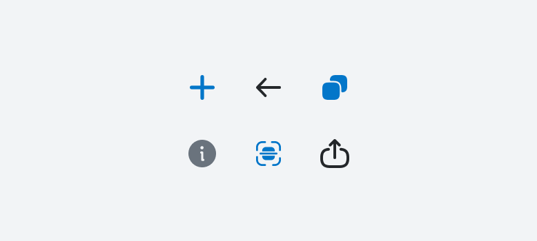

# [ButtonIcon](https://metamask-consensys.notion.site/Button-Icon-52fa285ebd8b4d56a22b6eabd08a8cf0)



ButtonIcon is a icon component in the form of a button.

## Props

This component extends `TouchableOpacityProps` from React Native's [TouchableOpacity](https://reactnative.dev/docs/touchableopacity) component.

### `iconName`

Icon name of the icon that will be displayed.

| <span style="color:gray;font-size:14px">TYPE</span> | <span style="color:gray;font-size:14px">REQUIRED</span> |
| :-------------------------------------------------- | :------------------------------------------------------ |
| [IconName](../Icons/Icon.types.ts)                  | Yes                                                     |

### `size`

Optional prop to configure the size of the buttonIcon.

| <span style="color:gray;font-size:14px">TYPE</span> | <span style="color:gray;font-size:14px">REQUIRED</span> |
| :-------------------------------------------------- | :------------------------------------------------------ |
| [ButtonIconSizes](./ButtonIcon.types.ts)            | No                                                      |

### `onPress`

Function to trigger when pressed.

| <span style="color:gray;font-size:14px">TYPE</span> | <span style="color:gray;font-size:14px">REQUIRED</span> |
| :-------------------------------------------------- | :------------------------------------------------------ |
| function                                            | No                                                      |

### `iconColor`

Optional prop for the color of the icon.

| <span style="color:gray;font-size:14px">TYPE</span>   | <span style="color:gray;font-size:14px">REQUIRED</span> | <span style="color:gray;font-size:14px">DEFAULT</span> |
| :---------------------------------------------------- | :------------------------------------------------------ | :----------------------------------------------------- |
| [IconColor](../../Icons/Icon/Icon.types.ts) or string | No                                                      | IconColor.Default                                      |

## Usage

```javascript
// Applying different icon names
<ButtonIcon
  iconName={IconName.Bank}
/>
<ButtonIcon
  iconName={IconName.Add}
/>
<ButtonIcon
  iconName={IconName.ArrowDown}
/>

// Applying different sizes
<ButtonIcon
  iconName={IconName.Bank}
  size={ButtonIconSizes.Sm}
/>
<ButtonIcon
  iconName={IconName.Bank}
  size={ButtonIconSizes.Md}
/>
<ButtonIcon
  iconName={IconName.Bank}
  size={ButtonIconSizes.Lg}
/>

// Attaching onPress handlers
<ButtonIcon
  iconName={IconName.Bank}
  onPress={ONPRESS_HANDLER}
/>

// Applying different icon colors
<ButtonIcon
  iconName={IconName.Bank}
  onPress={ONPRESS_HANDLER}
  color={IconColor.Default}
  isDisabled
/>
<ButtonIcon
  iconName={IconName.Bank}
  onPress={ONPRESS_HANDLER}
  color={IconColor.Primary}
/>

// Applying isDisabled state
<ButtonIcon
  iconName={IconName.Bank}
  isDisabled
/>
```
