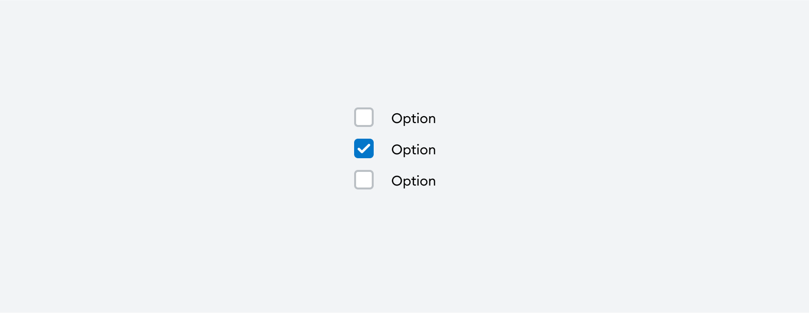

# [Checkbox](https://metamask-consensys.notion.site/Checkbox-359c236367eb4058876fc12189c06824)



Checkbox is a graphical element that allows users to select one or more options from a set of choices.

## Props

This component extends [TouchableOpacityProps](https://reactnative.dev/docs/touchableopacity#props) from React Native's [TouchableOpacity](https://reactnative.dev/docs/touchableopacity) component.

### `label`

Optional label for the Checkbox.

| <span style="color:gray;font-size:14px">TYPE</span> | <span style="color:gray;font-size:14px">REQUIRED</span> |
| :-------------------------------------------------- | :------------------------------------------------------ |
| string | ReactNode                                    | No                                                     |

### `isChecked`

Optional prop to configure the checked state.

| <span style="color:gray;font-size:14px">TYPE</span> | <span style="color:gray;font-size:14px">REQUIRED</span> | <span style="color:gray;font-size:14px">DEFAULT</span> |
| :-------------------------------------------------- | :------------------------------------------------------ | :----------------------------------------------------- |
| boolean                                             | No                                                     | false                                                 |

### `isIndeterminate`

Optional prop to configure the indeterminate state.

| <span style="color:gray;font-size:14px">TYPE</span> | <span style="color:gray;font-size:14px">REQUIRED</span> | <span style="color:gray;font-size:14px">DEFAULT</span> |
| :-------------------------------------------------- | :------------------------------------------------------ | :----------------------------------------------------- |
| boolean                                             | No                                                     | false                                                 |

### `isDisabled`

Optional prop to configure the disabled state.

| <span style="color:gray;font-size:14px">TYPE</span> | <span style="color:gray;font-size:14px">REQUIRED</span> | <span style="color:gray;font-size:14px">DEFAULT</span> |
| :-------------------------------------------------- | :------------------------------------------------------ | :----------------------------------------------------- |
| boolean                                             | No                                                     | false                                                 |

### `isReadonly`

Optional prop to configure the readonly state.

| <span style="color:gray;font-size:14px">TYPE</span> | <span style="color:gray;font-size:14px">REQUIRED</span> | <span style="color:gray;font-size:14px">DEFAULT</span> |
| :-------------------------------------------------- | :------------------------------------------------------ | :----------------------------------------------------- |
| boolean                                             | No                                                     | false                                                 |

### `isDanger`

Optional prop to configure the readonly state.

| <span style="color:gray;font-size:14px">TYPE</span> | <span style="color:gray;font-size:14px">REQUIRED</span> | <span style="color:gray;font-size:14px">DEFAULT</span> |
| :-------------------------------------------------- | :------------------------------------------------------ | :----------------------------------------------------- |
| boolean                                             | No                                                     | false                                                 |

## Usage

```javascript
<Checkbox 
    label={SAMPLE_CHECKBOX_LABEL}
    isChecked
    isIndeterminate 
    isDisabled 
    isReadonly
    isDanger/>;
```
