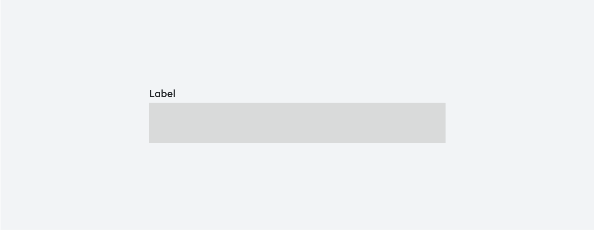

# [Label](https://metamask-consensys.notion.site/Label-d6aa56ac40044195a5078d37d3118223)



Label is a [Text](../../Texts/Text/Text.tsx) component, used to describe the purpose of form field.

## Props

This component extends [TextProps](../../Texts/Text/Text.types.ts).

## Usage

```javascript
<Label>{SAMPLE_TEXT}</Label>;
```
