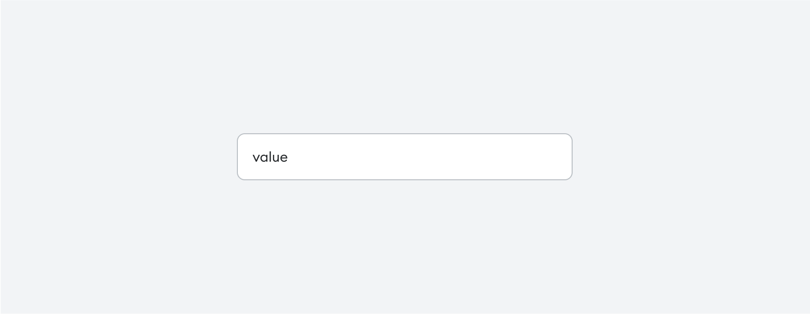

# [TextField](https://metamask-consensys.notion.site/Text-Field-73e2b9b748404901ab2c9fba13eb7785)



TextField is an input component that lets user enter a text data into a boxed field. It can sometimes contain related information or controls.

## Props

This component extends [Input](./foundation/Input/Input.tsx) component.

### `startAccessory`

Optional content to display before the Input.

| <span style="color:gray;font-size:14px">TYPE</span> | <span style="color:gray;font-size:14px">REQUIRED</span> |
| :-------------------------------------------------- | :------------------------------------------------------ |
| React.ReactNode                                     | No                                                      |

### `endAccessory`

Optional content to display after the Input.

| <span style="color:gray;font-size:14px">TYPE</span> | <span style="color:gray;font-size:14px">REQUIRED</span> |
| :-------------------------------------------------- | :------------------------------------------------------ |
| React.ReactNode                                     | No                                                      |

### `error`

Optional boolean to show the error state.

| <span style="color:gray;font-size:14px">TYPE</span> | <span style="color:gray;font-size:14px">REQUIRED</span> | <span style="color:gray;font-size:14px">DEFAULT</span> |
| :-------------------------------------------------- | :------------------------------------------------------ | :----------------------------------------------------- |
| boolean                                             | No                                                      | false                                                  |

### `inputElement`

Optional prop to replace defaulted input with custom Input.

| <span style="color:gray;font-size:14px">TYPE</span> | <span style="color:gray;font-size:14px">REQUIRED</span> |
| :-------------------------------------------------- | :------------------------------------------------------ |
| React.ReactNode                                     | No                                                      |

## Input Props

### `textVariant`

Optional enum to select between Typography variants.

| <span style="color:gray;font-size:14px">TYPE</span> | <span style="color:gray;font-size:14px">REQUIRED</span> | <span style="color:gray;font-size:14px">DEFAULT</span> |
| :-------------------------------------------------- | :------------------------------------------------------ | :----------------------------------------------------- |
| [TextVariant](../../../../Texts/Text/Text.types.ts) | No                                                      | TextVariant.BodyMd                                     |

### `isDisabled`

Optional boolean to disable Input.

| <span style="color:gray;font-size:14px">TYPE</span> | <span style="color:gray;font-size:14px">REQUIRED</span> | <span style="color:gray;font-size:14px">DEFAULT</span> |
| :-------------------------------------------------- | :------------------------------------------------------ | :----------------------------------------------------- |
| boolean                                             | No                                                      | false                                                  |

### `isReadonly`

Optional boolean to show readonly input.

| <span style="color:gray;font-size:14px">TYPE</span> | <span style="color:gray;font-size:14px">REQUIRED</span> | <span style="color:gray;font-size:14px">DEFAULT</span> |
| :-------------------------------------------------- | :------------------------------------------------------ | :----------------------------------------------------- |
| boolean                                             | No                                                      | false                                                  |

### `isStateStylesDisabled`

Optional boolean to disable state styles.

| <span style="color:gray;font-size:14px">TYPE</span> | <span style="color:gray;font-size:14px">REQUIRED</span> | <span style="color:gray;font-size:14px">DEFAULT</span> |
| :-------------------------------------------------- | :------------------------------------------------------ | :----------------------------------------------------- |
| boolean                                             | No                                                      | false                                                  |

## Usage

```javascript
<TextField
  startAccessory={SAMPLE_COMPONENT}
  endAccessory={SAMPLE_COMPONENT}
  isError={false}
  labelTextVariant={TextVariant.BodyMD}
  isReadonly
  isDisabled
  isStateStylesDisabled
  placeholder={SAMPLE_PLACEHOLDER}
  value={SAMPLE_VALUE}
```
