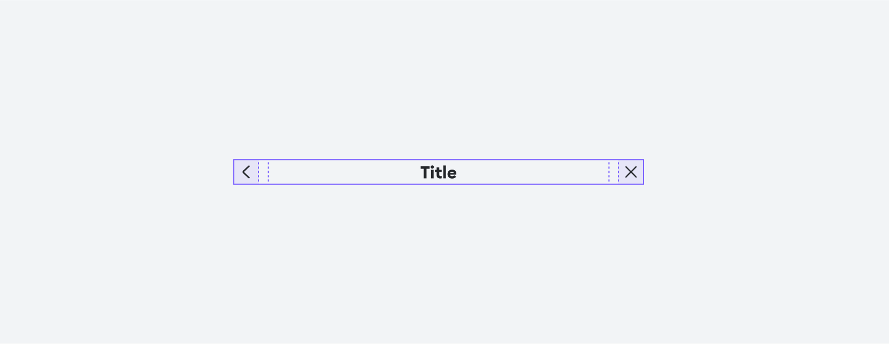

# [HeaderBase](https://metamask-consensys.notion.site/Header-Base-2e96e1ac4c2b4816bb7bd3c594c72538)



The HeaderBase component is a reusable UI component for displaying a header with optional startAccessory, children (title) and endAccessory content areas. It is designed to be flexible and customizable for various use cases to keep a visually balanced appearance.

## Props

This component extends React Native's [ViewProps](https://reactnative.dev/docs/view) component.

### `children`

Content to wrap to display.

| <span style="color:gray;font-size:14px">TYPE</span> | <span style="color:gray;font-size:14px">REQUIRED</span> |
| :-------------------------------------------------- | :------------------------------------------------------ |
| string \| ReactNode                                 | No                                                      |

### `variant`

Optional variant to control alignment and text size.

- `Compact`: center-aligned with HeadingSm text (default)
- `Display`: left-aligned with HeadingLg text

| <span style="color:gray;font-size:14px">TYPE</span> | <span style="color:gray;font-size:14px">REQUIRED</span> | <span style="color:gray;font-size:14px">DEFAULT</span> |
| :-------------------------------------------------- | :------------------------------------------------------ | :----------------------------------------------------- |
| HeaderBaseVariant                                   | No                                                      | HeaderBaseVariant.Compact                              |

### `startAccessory`

Optional prop to include content to be displayed before the title. Takes priority over `startButtonIconProps` if both are provided.

| <span style="color:gray;font-size:14px">TYPE</span> | <span style="color:gray;font-size:14px">REQUIRED</span> |
| :-------------------------------------------------- | :------------------------------------------------------ |
| ReactNode                                           | No                                                      |

### `endAccessory`

Optional prop to include content to be displayed after the title. Takes priority over `endButtonIconProps` if both are provided.

| <span style="color:gray;font-size:14px">TYPE</span> | <span style="color:gray;font-size:14px">REQUIRED</span> |
| :-------------------------------------------------- | :------------------------------------------------------ |
| ReactNode                                           | No                                                      |

### `startButtonIconProps`

Optional ButtonIcon props to render a ButtonIcon as the start accessory. Only used if `startAccessory` is not provided.

| <span style="color:gray;font-size:14px">TYPE</span> | <span style="color:gray;font-size:14px">REQUIRED</span> | <span style="color:gray;font-size:14px">DEFAULT</span> |
| :-------------------------------------------------- | :------------------------------------------------------ | :----------------------------------------------------- |
| ButtonIconProps                                     | No                                                      | size: ButtonIconSize.Md                                |

### `endButtonIconProps`

Optional array of ButtonIcon props to render multiple ButtonIcons as end accessories. Rendered in reverse order (first item appears rightmost). Only used if `endAccessory` is not provided.

| <span style="color:gray;font-size:14px">TYPE</span> | <span style="color:gray;font-size:14px">REQUIRED</span> | <span style="color:gray;font-size:14px">DEFAULT</span> |
| :-------------------------------------------------- | :------------------------------------------------------ | :----------------------------------------------------- |
| ButtonIconProps[]                                   | No                                                      | size: ButtonIconSize.Md for each                       |

### `includesTopInset`

Optional prop to include the top inset to make sure the header is visible below device's notch.

| <span style="color:gray;font-size:14px">TYPE</span> | <span style="color:gray;font-size:14px">REQUIRED</span> | <span style="color:gray;font-size:14px">DEFAULT</span> |
| :-------------------------------------------------- | :------------------------------------------------------ | :----------------------------------------------------- |
| boolean                                             | No                                                      | false                                                  |

### `twClassName`

Optional Tailwind class names for the header container.

| <span style="color:gray;font-size:14px">TYPE</span> | <span style="color:gray;font-size:14px">REQUIRED</span> |
| :-------------------------------------------------- | :------------------------------------------------------ |
| string                                              | No                                                      |

### `style`

Optional style for the header container.

| <span style="color:gray;font-size:14px">TYPE</span> | <span style="color:gray;font-size:14px">REQUIRED</span> |
| :-------------------------------------------------- | :------------------------------------------------------ |
| StyleProp\<ViewStyle\>                              | No                                                      |

## Usage

```javascript
// HeaderBase with String title and ButtonIcon props
<HeaderBase
  startButtonIconProps={{ iconName: IconName.ArrowLeft, onPress: handleBack }}
  endButtonIconProps={[{ iconName: IconName.Close, onPress: handleClose }]}
>
  Page Title
</HeaderBase>;

// HeaderBase with multiple end icons (first item appears rightmost)
<HeaderBase
  startButtonIconProps={{ iconName: IconName.ArrowLeft, onPress: handleBack }}
  endButtonIconProps={[
    { iconName: IconName.Search, onPress: handleSearch },
    { iconName: IconName.Setting, onPress: handleSettings },
    { iconName: IconName.Close, onPress: handleClose },
  ]}
>
  Header with Multiple Icons
</HeaderBase>;

// HeaderBase with custom accessories (legacy pattern)
<HeaderBase
  startAccessory={<CustomBackButton />}
  endAccessory={<CustomCloseButton />}
>
  {SAMPLE_TITLE_STRING}
</HeaderBase>;

// HeaderBase with custom title content
<HeaderBase
  startAccessory={SAMPLE_STARTACCESSORY}
  endAccessory={SAMPLE_ENDACCESSORY}
>
  {CUSTOM_TITLE_NODE}
</HeaderBase>;

// HeaderBase with Display variant (left-aligned, larger text)
<HeaderBase variant={HeaderBaseVariant.Display}>
  Large Left-Aligned Title
</HeaderBase>;
```
