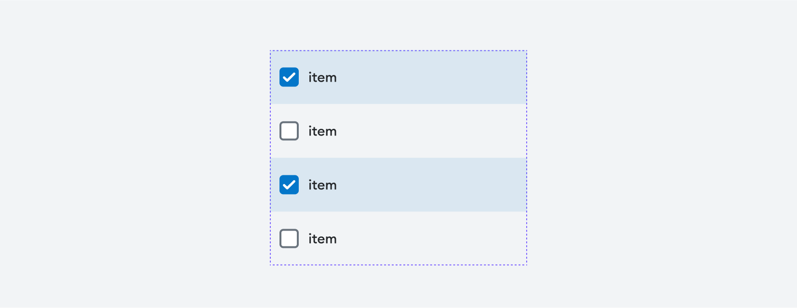

# [ListItemMultiSelect](https://metamask-consensys.notion.site/List-Item-MultiSelect-8ffafd9e99114e588c5c28ee5e4f0b10)



ListItemMultiSelect is a wrapper component typically used for multi item selection scenarios.

## Props

This component extends `TouchableOpacityProps` from React Native's [TouchableOpacityProps](https://reactnative.dev/docs/touchableopacity) component and [ListItemProps](../ListItem/ListItem.types.ts).

### `isSelected`

Optional prop to determine if the item is selected.

| <span style="color:gray;font-size:14px">TYPE</span> | <span style="color:gray;font-size:14px">REQUIRED</span> | <span style="color:gray;font-size:14px">DEFAULT</span> |
| :-------------------------------------------------- | :------------------------------------------------------ | :----------------------------------------------------- |
| boolean    | No                                                     | false                                               |

### `isDisabled`

Optional prop to determine if the item is disabled.

| <span style="color:gray;font-size:14px">TYPE</span> | <span style="color:gray;font-size:14px">REQUIRED</span> | <span style="color:gray;font-size:14px">DEFAULT</span> |
| :-------------------------------------------------- | :------------------------------------------------------ | :----------------------------------------------------- |
| boolean    | No                                                     | false                                               |

### `gap`

Optional prop to configure the gap between items inside the ListItem.

| <span style="color:gray;font-size:14px">TYPE</span> | <span style="color:gray;font-size:14px">REQUIRED</span> | <span style="color:gray;font-size:14px">DEFAULT</span> |
| :-------------------------------------------------- | :------------------------------------------------------ | :----------------------------------------------------- |
| number or string                                            | No                                                     |                   16                                         |

### `verticalAlignment`

Optional prop to configure the vertical alignment between items inside the ListItem.

| <span style="color:gray;font-size:14px">TYPE</span> | <span style="color:gray;font-size:14px">REQUIRED</span> | <span style="color:gray;font-size:14px">DEFAULT</span> |
| :-------------------------------------------------- | :------------------------------------------------------ | :----------------------------------------------------- |
| VerticalAlignment                                            | No                                                     |                   VerticalAlignment.Top                                         |

## Usage

```javascript
<ListItemMultiSelect 
  onPress={ONPRESS_HANDLER} 
  isSelected 
  isDisabled={false}
  gap={8} 
  verticalAlignment={VerticalAlignment.Center}>
  {SAMPLE_CHILDREN_COMPONENT}
</ListItemMultiSelect>;
```