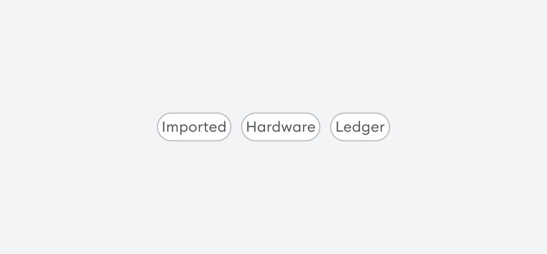

# [Tag](https://metamask-consensys.notion.site/Tag-da4bf064ab854b318b083febb978eb23)



Tag is a component used to display text within a container.

## Props

This component extends [ViewProps](https://reactnative.dev/docs/view-style-props) from React Native's [View](https://reactnative.dev/docs/view) component.

### `label`

Label within the tag.

| <span style="color:gray;font-size:14px">TYPE</span> | <span style="color:gray;font-size:14px">REQUIRED</span> |
| :-------------------------------------------------- | :------------------------------------------------------ |
| string                                              | Yes                                                     |

```javascript
// Replace import with relative path.
import Tag from 'app/component-library/components/Tags/Tag';

<Tag label={TAG_LABEL} />;
```
