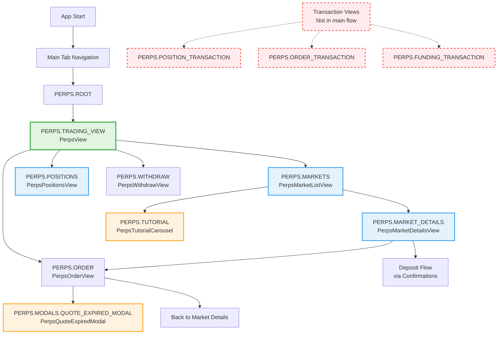
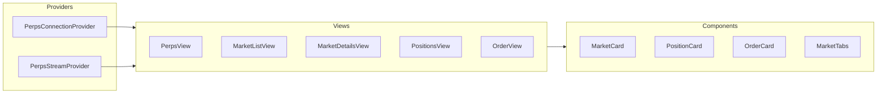

# Perps Navigation Architecture

> Visual documentation of the MetaMask Mobile Perps feature navigation flow and screen relationships

## 📊 Navigation Flow Diagram



## 🏗️ Screen Hierarchy

### Main Stack

```
Routes.PERPS.ROOT
├── Routes.PERPS.TRADING_VIEW (PerpsView) - Main Hub
│   ├── → Routes.PERPS.MARKETS
│   ├── → Routes.PERPS.POSITIONS
│   ├── → Routes.PERPS.WITHDRAW
│   └── → Routes.PERPS.ORDER
│
├── Routes.PERPS.MARKETS (PerpsMarketListView)
│   ├── → Routes.PERPS.MARKET_DETAILS
│   └── → Routes.PERPS.TUTORIAL
│
├── Routes.PERPS.MARKET_DETAILS (PerpsMarketDetailsView)
│   ├── → Routes.PERPS.ORDER (Long/Short)
│   └── → Deposit Flow (via Confirmations)
│
├── Routes.PERPS.ORDER (PerpsOrderView)
│   └── → Routes.PERPS.MODALS.QUOTE_EXPIRED_MODAL
│
└── Routes.PERPS.WITHDRAW (PerpsWithdrawView)
```

### Modal Stack

```
Routes.PERPS.MODALS.ROOT
└── Routes.PERPS.MODALS.QUOTE_EXPIRED_MODAL (PerpsQuoteExpiredModal)
```

## 📋 Route Usage Analysis

| Route                              | Component                    | Used In          | Status      |
| ---------------------------------- | ---------------------------- | ---------------- | ----------- |
| `PERPS.ROOT`                       | Navigation Root              | App entry        | ✅ Active   |
| `PERPS.TRADING_VIEW`               | PerpsView                    | Initial route    | ✅ Active   |
| `PERPS.MARKETS`                    | PerpsMarketListView          | PerpsView        | ✅ Active   |
| `PERPS.MARKET_DETAILS`             | PerpsMarketDetailsView       | MarketListView   | ✅ Active   |
| `PERPS.POSITIONS`                  | PerpsPositionsView           | PerpsView        | ✅ Active   |
| `PERPS.ORDER`                      | PerpsOrderView               | Multiple screens | ✅ Active   |
| `PERPS.WITHDRAW`                   | PerpsWithdrawView            | PerpsView        | ✅ Active   |
| `PERPS.TUTORIAL`                   | PerpsTutorialCarousel        | MarketListView   | ✅ Active   |
| `PERPS.MODALS.QUOTE_EXPIRED_MODAL` | PerpsQuoteExpiredModal       | OrderView        | ✅ Active   |
| `PERPS.DEPOSIT`                    | -                            | Routes only      | ⚠️ Unused   |
| `PERPS.POSITION_DETAILS`           | -                            | Routes only      | ⚠️ Unused   |
| `PERPS.ORDER_HISTORY`              | -                            | Routes only      | ⚠️ Unused   |
| `PERPS.ORDER_DETAILS`              | -                            | Routes only      | ⚠️ Unused   |
| `PERPS.POSITION_TRANSACTION`       | PerpsPositionTransactionView | TransactionsView | ❓ Orphaned |
| `PERPS.ORDER_TRANSACTION`          | PerpsOrderTransactionView    | TransactionsView | ❓ Orphaned |
| `PERPS.FUNDING_TRANSACTION`        | PerpsFundingTransactionView  | TransactionsView | ❓ Orphaned |

## 🔄 Navigation Patterns

### 1. **Main Trading Hub Pattern**

```
PerpsView (Trading View)
    ├── View Markets → PerpsMarketListView
    ├── View Positions → PerpsPositionsView
    ├── Withdraw → PerpsWithdrawView
    └── Quick Trade → PerpsOrderView
```

### 2. **Market Discovery Pattern**

```
PerpsMarketListView
    ├── Select Market → PerpsMarketDetailsView
    └── Tutorial → PerpsTutorialCarousel
```

### 3. **Trading Execution Pattern**

```
PerpsMarketDetailsView
    ├── Long → PerpsOrderView (direction: 'long')
    ├── Short → PerpsOrderView (direction: 'short')
    └── Add Funds → Confirmations Screen
```

## 🧩 Key Components Usage

### Tab Components (PerpsTabView)

- **Location**: Embedded in PerpsView
- **Purpose**: Main navigation hub with tabs
- **Tabs**: Portfolio, Markets, Orders, Transactions

### Market Components

- **PerpsMarketCard**: Used in MarketListView
- **PerpsMarketHeader**: Used in MarketDetailsView
- **PerpsMarketTabs**: Used in MarketDetailsView (Position/Orders/Stats)

### Position Components

- **PerpsPositionCard**: Used in PositionsView, MarketTabs
- **PerpsPositionSummary**: Used in PerpsView

### Order Components

- **PerpsOpenOrderCard**: Used in MarketTabs, OrdersView
- **PerpsOrderConfirmation**: Used in OrderView

## 🔍 Potential Cleanup Opportunities

### 1. **Unused Routes** (Can be removed from Routes.ts)

- `PERPS.DEPOSIT` - No implementation found
- `PERPS.POSITION_DETAILS` - No implementation found
- `PERPS.ORDER_HISTORY` - No implementation found
- `PERPS.ORDER_DETAILS` - No implementation found

### 2. **Orphaned Transaction Views**

- `PerpsTransactionsView` - Parent component exists but not navigated to
- `PerpsPositionTransactionView` - Child view not accessible
- `PerpsOrderTransactionView` - Child view not accessible
- `PerpsFundingTransactionView` - Child view not accessible

**Note**: These transaction views might be intended for future use or are accessed through a different flow not visible in the main navigation.

### 3. **Refactoring Opportunities**

- **PerpsTabView**: Consider if this needs to be a separate view or can be integrated
- **Transaction Views**: Either implement navigation or remove if not needed

## 📱 Screen Flow Examples

### Example 1: Opening a Position

```
1. PerpsView (Trading View)
2. → PerpsMarketListView (Browse Markets)
3. → PerpsMarketDetailsView (Select SOL)
4. → PerpsOrderView (Long/Short)
5. → Confirm → Back to PerpsMarketDetailsView
```

### Example 2: Managing Positions

```
1. PerpsView (Trading View)
2. → PerpsPositionsView (View All Positions)
3. → Select Position → Actions (Close/Edit)
```

### Example 3: First Time User

```
1. PerpsView (Trading View)
2. → PerpsMarketListView
3. → PerpsTutorialCarousel (Tutorial)
4. → Back to Markets
```

## 🎯 Recommendations

1. **Remove unused routes** from `Routes.ts` to clean up the codebase
2. **Investigate transaction views** - Either implement proper navigation or remove if deprecated
3. **Consider consolidating** PerpsTabView functionality if it's only used in one place
4. **Document intended use** for transaction views if they're for future features
5. **Add navigation tests** to ensure all routes are accessible and working

## 📊 Component Dependencies



---

_Last Updated: January 2025_
_Note: This documentation reflects the current state of the codebase. Some routes exist in Routes.ts but have no corresponding implementation._
