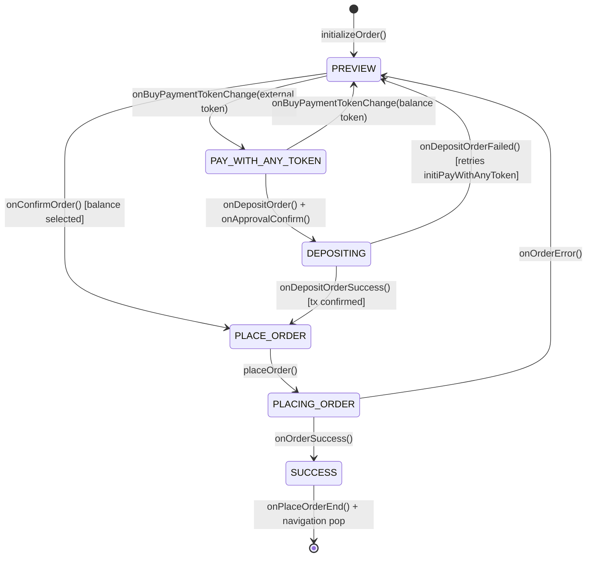

# Prediction markets

The Predict feature enables users to participate in prediction markets within MetaMask Mobile. This document reflects the current implementation architecture and structure.

## Architecture Layers

```
┌─────────────────────────────────────┐
│           Components (UI)           │
├─────────────────────────────────────┤
│            Hooks (React)            │
├─────────────────────────────────────┤
│         Controller (Business)       │
├─────────────────────────────────────┤
│         Providers (Protocol)        │
└─────────────────────────────────────┘
```

## File Structure

```
/Predict
├── /components                  # Reusable UI components
│   ├── /MarketListContent       # Market list display component
│   ├── /MarketsWonCard          # Won markets display card
│   ├── /PredictHome             # Homepage components (positions, featured markets)
│   ├── /PredictMarket           # Market wrapper component (routes to single/multiple)
│   ├── /PredictMarketSingle     # Single outcome market card component
│   ├── /PredictMarketMultiple   # Multiple outcome market selection component
│   ├── /PredictNewButton        # New prediction creation button
│   ├── /PredictPosition         # Position display component
│   └── /SearchBox               # Market search component
├── /controllers                 # Controllers for PredictMarket
│   └── PredictController.ts     # Main controller with tests
├── /hooks                       # React integration hooks (6 hooks)
│   ├── usePredictBuy.ts         # Buy order placement hook
│   ├── usePredictSell.ts        # Sell order placement hook
│   ├── usePredictTrading.ts     # Core trading operations
│   ├── usePredictMarketData.tsx # Market data fetching with pagination
│   ├── usePredictPositions.ts   # User positions management
│   └── usePredictOrders.tsx     # Order state management and notifications
├── /mocks                       # Test mocks and fixtures
│   └── remoteFeatureFlagMocks.ts
├── /providers                   # Protocol implementations
│   ├── /polymarket              # Polymarket provider implementation
│   │   ├── PolymarketProvider.t s
│   │   ├── constants.ts
│   │   ├── types.ts
│   │   └── utils.ts
│   └── types.ts                 # Provider interface definitions
├── /routes                      # Navigation route definitions
│   └── index.tsx
├── /selectors                   # Redux state selectors
│   └── /featureFlags            # Feature flag selectors
│       └── index.ts
├── /types                       # TypeScript type definitions
│   ├── index.ts                 # Core types and interfaces
│   └── navigation.ts            # Navigation type definitions
├── /utils                       # Utility functions
│   ├── format.ts                # Price, percentage, and volume formatting
│   └── orders.ts                # Order ID generation utilities
├── /views                       # Main screen components
│   ├── /PredictBuyWithAnyToken  # Buy/order flow (single-route architecture)
│   ├── /PredictCashOut          # Cash out/redeem positions screen
│   ├── /PredictMarketDetails    # Individual market details screen
│   ├── /PredictMarketList       # Market listing screen
│   └── /PredictTabView          # Main tabbed view container
└── index.ts                     # Main entry point
```

## Hooks - Current Implementation

### Trading Operations

- `usePredictBuy` - Buy order placement with loading states, callbacks, and toast notifications
- `usePredictSell` - Sell order placement with loading states, callbacks, and toast notifications
- `usePredictTrading` - Core trading operations (buy/sell/getPositions) via PredictController

### Data Management

- `usePredictMarketData` - Market data fetching with pagination, search, infinite scroll, and retry logic
- `usePredictPositions` - User positions management with focus refresh, loading states, and refresh capabilities
- `usePredictOrders` - Order state management with automatic toast notifications for status changes

### Implementation Details

#### Trading Hooks (`usePredictBuy`, `usePredictSell`)

- **Loading states**: `placing`, `completed`, `error`
- **Toast notifications**: Automatic notifications for order placement, completion, and failures
- **Callbacks**: `onComplete`, `onError`
- **Order tracking**: Real-time order status via Redux state selectors
- **Utilities**: `isOutcomeLoading()` for UI state, `reset()` for cleanup

#### Data Management Hooks

- **`usePredictMarketData`**: Supports category filtering, search, pagination with `fetchMore()`, and exponential backoff retry logic
- **`usePredictPositions`**: Implements `useFocusEffect` for screen refresh, separate loading states for initial load vs refresh
- **`usePredictOrders`**: Automatic toast notifications based on Redux state changes, manages notification queue

## Duplication Prevention

Before creating a new hook:

1. Check existing hooks in relevant category
2. Consider composing existing hooks
3. Follow naming: `usePredict[Feature][Action]`
4. Keep single responsibility

## Key Patterns

### Validation Flow

Provider validation (protocol rules) → Hook adds UI rules → Component displays errors

### Data Flow

Controller → Redux Store → Hooks → Components

### Real-time Updates

WebSocket → Controller → Redux → Hooks with subscription

### Form Management

Component input → Hook state → Validation → Controller action

## Quick Hook Selection Guide

| Need                     | Use Hook                 | Key Features                                                                     |
| ------------------------ | ------------------------ | -------------------------------------------------------------------------------- |
| Place buy orders         | `usePredictBuy`          | Loading states, toast notifications, callbacks                                   |
| Place sell orders        | `usePredictSell`         | Loading states, toast notifications, callbacks                                   |
| Direct controller access | `usePredictTrading`      | Core buy/sell/getPositions operations                                            |
| Market data with search  | `usePredictMarketData`   | Pagination, infinite scroll, category filtering                                  |
| User positions           | `usePredictPositions`    | Focus refresh, loading states, account-based                                     |
| Market data              | `usePredictMarket`       | Market data fetching with pagination, search, infinite scroll, and retry logic   |
| Price history            | `usePredictPriceHistory` | Price history fetching with pagination, search, infinite scroll, and retry logic |
| Order notifications      | `usePredictOrders`       | Automatic toast notifications, status tracking                                   |

## PredictBuyWithAnyToken

The buy/order flow lives in `views/PredictBuyWithAnyToken/`. This is the primary screen where users place prediction market orders. Everything — direct orders, deposit-and-order flows, and pay-with-any-token flows — happens on a **single route** without navigation redirects.

### Single-Route Architecture

All order states (preview, token selection, deposit, order placement) are managed by `PredictController` and rendered inline within `PredictBuyWithAnyToken`. The confirmation transaction (`PredictPayWithAnyTokenInfo`) is mounted as a headless component that syncs deposit amounts and payment tokens via effects, rather than living on a separate navigation screen. When an external payment token is selected, `initiPayWithAnyToken()` fires on the initial `transitionEnd` event to prepare the deposit-and-order batch in the background.

### Components

| Component                    | Description                                                                                                                                |
| ---------------------------- | ------------------------------------------------------------------------------------------------------------------------------------------ |
| `PredictBuyActionButton`     | Main CTA button with loading/disabled states tied to order lifecycle                                                                       |
| `PredictBuyAmountSection`    | Keypad and amount input for entering bet size; disables input interaction while order is placing                                           |
| `PredictBuyBottomContent`    | Bottom area layout (fee summary, action button, errors)                                                                                    |
| `PredictBuyMinimumError`     | Error display for minimum bet violations and insufficient balance (shows max usable amount when above minimum)                             |
| `PredictBuyPreviewHeader`    | Header showing market/outcome info with `outcomeToken` prop for direct token resolution (falls back to route param token, not first token) |
| `PredictFeeSummary`          | Breakdown of MetaMask fee, provider fee, deposit fee, and total                                                                            |
| `PredictPayWithAnyTokenInfo` | Headless component that syncs deposit amount and payment token to the confirmation transaction; renders only when `transactionMeta` exists |
| `PredictPayWithRow`          | Payment token selector row — always visible (Predict balance or external tokens); falls back to Predict balance when payToken is null      |

### Hooks

| Hook                            | Description                                                                                                                                                               |
| ------------------------------- | ------------------------------------------------------------------------------------------------------------------------------------------------------------------------- |
| `usePredictBuyPreviewActions`   | Core orchestrator — reacts to `activeOrder.state` changes via effects to drive deposit, order placement, and success/dismiss. Returns only `handleConfirm`                |
| `usePredictBuyConditions`       | Derives boolean flags (`canPlaceBet`, `isPlacingOrder`, `isBelowMinimum`, `isInsufficientBalance`, `maxBetAmount`, `isPayFeesLoading`, etc.) from order and preview state |
| `usePredictBuyInfo`             | Computes display values (toWin, fees, total, depositAmount, errorMessage) from preview, pay totals, and Predict balance                                                   |
| `usePredictBuyInputState`       | Manages keypad input value, user-change tracking, and input focus state                                                                                                   |
| `usePredictBuyAvailableBalance` | Resolves the available balance as a raw number — Predict balance when using balance, or Predict balance + external token balance when using an external token             |

## Active Order Lifecycle

The `activeOrder` in `PredictControllerState` tracks the full lifecycle of a single order from preview to completion. Only one order can be active at a time. All state transitions are owned by `PredictController` methods — hooks react to state changes via effects rather than driving transitions themselves.

### State Shape

```typescript
activeOrder?: {
  batchId?: string;          // Transaction batch ID (for deposit-and-order flow)
  state: ActiveOrderState;   // Current lifecycle state
  error?: string;            // Error message from failed operations
} | null;
```

### ActiveOrderState

```typescript
enum ActiveOrderState {
  PREVIEW = 'preview', // User is editing amount on the keypad
  PAY_WITH_ANY_TOKEN = 'pay_with_any_token', // External token selected, deposit-and-order tx prepared in background
  DEPOSIT = 'deposit', // Deposit step initiated via approval confirm
  DEPOSITING = 'depositing', // Deposit transaction in progress
  DEPOSIT_FAILED = 'deposit_failed', // Deposit failed (retries via initiPayWithAnyToken)
  PLACE_ORDER = 'place_order', // Ready to submit order to provider
  PLACING_ORDER = 'placing_order', // Order submission in flight
  SUCCESS = 'success', // Order completed, about to dismiss
}
```

### State Machine



Notes:

- Back navigation or approval rejection clears the active order and returns the flow to `null`.
- Deposit failure resets to `PREVIEW`, stores the error, deletes `batchId`, and automatically retries `initiPayWithAnyToken()`.
- The `transitionEnd` listener in `usePredictBuyPreviewActions` triggers `initiPayWithAnyToken()` once on initial mount to prepare the deposit-and-order batch when an external token is selected.
- Transaction status events (`TransactionController:transactionStatusUpdated`) for `predictDepositAndOrder` drive `onDepositOrderSuccess`, `onDepositOrderFailed`, and rejection handling directly in the controller.

### Controller Methods (State Transitions)

| Method                      | Transition                      | Notes                                                                         |
| --------------------------- | ------------------------------- | ----------------------------------------------------------------------------- |
| `initializeOrder()`         | `-> PREVIEW`                    | Clears payment token and tracks `INITIATED`                                   |
| `onConfirmOrder()`          | `-> PLACE_ORDER`                | Clears error before continuing (balance-selected path)                        |
| `onDepositOrder()`          | `-> DEPOSITING`                 | Marks deposit transaction as in flight                                        |
| `onDepositOrderSuccess()`   | `-> PLACE_ORDER`                | Called when deposit tx confirmed                                              |
| `onDepositOrderFailed()`    | `-> PREVIEW`                    | Stores error, deletes `batchId`, retries `initiPayWithAnyToken()`             |
| `onOrderSuccess()`          | `-> SUCCESS`                    | Waits for dismissal                                                           |
| `onOrderError()`            | `-> PREVIEW`                    | Clears payment token                                                          |
| `onOrderCancelled()`        | `-> null`                       | Clears active order and payment token                                         |
| `onPlaceOrderEnd()`         | `-> null`                       | Clears active order and payment token                                         |
| `onBuyPaymentTokenChange()` | `PREVIEW -> PAY_WITH_ANY_TOKEN` | Selecting an external token; sets `selectedPaymentToken` and clears error     |
| `onBuyPaymentTokenChange()` | `PAY_WITH_ANY_TOKEN -> PREVIEW` | Selecting Predict balance; clears `selectedPaymentToken` and error            |
| `clearOrderError()`         | (no state change)               | Removes error from active order                                               |
| `initiPayWithAnyToken()`    | Sets `batchId` on active order  | Prepares deposit-and-order batch via provider; guards against duplicate calls |

## Core Types and Utilities

### Key Types (`/types/index.ts`)

- `PredictMarket` - Market data structure with outcomes, status, categories
- `PredictPosition` - User position with P&L calculations and status
- `PredictOrder` - Order structure with status tracking and trade parameters
- `BuyParams` / `SellParams` - Trading operation parameters

### Utility Functions (`/utils/`)

- **`format.ts`**: Price, percentage, and volume formatting with locale support
- **`orders.ts`**: Unique order ID generation utilities
