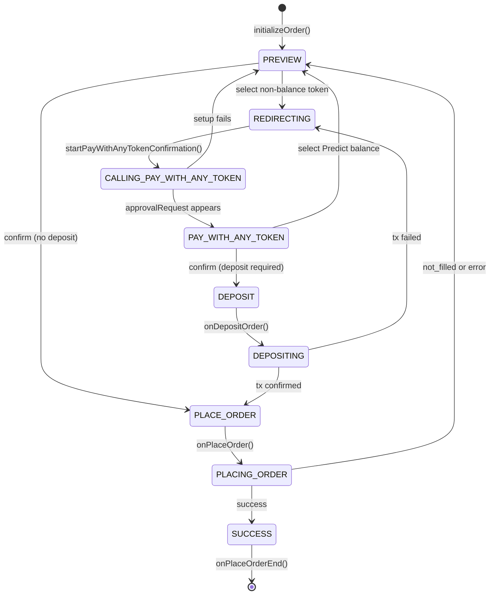

# Prediction markets

The Predict feature enables users to participate in prediction markets within MetaMask Mobile. This document reflects the current implementation architecture and structure.

## Architecture Layers

```
┌─────────────────────────────────────┐
│           Components (UI)           │
├─────────────────────────────────────┤
│            Hooks (React)            │
├─────────────────────────────────────┤
│         Controller (Business)       │
├─────────────────────────────────────┤
│         Providers (Protocol)        │
└─────────────────────────────────────┘
```

## File Structure

```
/Predict
├── /components                  # Reusable UI components
│   ├── /MarketListContent       # Market list display component
│   ├── /MarketsWonCard          # Won markets display card
│   ├── /PredictHome             # Homepage components (positions, featured markets)
│   ├── /PredictMarket           # Market wrapper component (routes to single/multiple)
│   ├── /PredictMarketSingle     # Single outcome market card component
│   ├── /PredictMarketMultiple   # Multiple outcome market selection component
│   ├── /PredictNewButton        # New prediction creation button
│   ├── /PredictPosition         # Position display component
│   └── /SearchBox               # Market search component
├── /controllers                 # Controllers for PredictMarket
│   └── PredictController.ts     # Main controller with tests
├── /hooks                       # React integration hooks (6 hooks)
│   ├── usePredictBuy.ts         # Buy order placement hook
│   ├── usePredictSell.ts        # Sell order placement hook
│   ├── usePredictTrading.ts     # Core trading operations
│   ├── usePredictMarketData.tsx # Market data fetching with pagination
│   ├── usePredictPositions.ts   # User positions management
│   └── usePredictOrders.tsx     # Order state management and notifications
├── /mocks                       # Test mocks and fixtures
│   └── remoteFeatureFlagMocks.ts
├── /providers                   # Protocol implementations
│   ├── /polymarket              # Polymarket provider implementation
│   │   ├── PolymarketProvider.t s
│   │   ├── constants.ts
│   │   ├── types.ts
│   │   └── utils.ts
│   └── types.ts                 # Provider interface definitions
├── /routes                      # Navigation route definitions
│   └── index.tsx
├── /selectors                   # Redux state selectors
│   └── /featureFlags            # Feature flag selectors
│       └── index.ts
├── /types                       # TypeScript type definitions
│   ├── index.ts                 # Core types and interfaces
│   └── navigation.ts            # Navigation type definitions
├── /utils                       # Utility functions
│   ├── format.ts                # Price, percentage, and volume formatting
│   └── orders.ts                # Order ID generation utilities
├── /views                       # Main screen components
│   ├── /PredictCashOut          # Cash out/redeem positions screen
│   ├── /PredictMarketDetails    # Individual market details screen
│   ├── /PredictMarketList       # Market listing screen
│   └── /PredictTabView          # Main tabbed view container
└── index.ts                     # Main entry point
```

## Hooks - Current Implementation

### Trading Operations

- `usePredictBuy` - Buy order placement with loading states, callbacks, and toast notifications
- `usePredictSell` - Sell order placement with loading states, callbacks, and toast notifications
- `usePredictTrading` - Core trading operations (buy/sell/getPositions) via PredictController

### Data Management

- `usePredictMarketData` - Market data fetching with pagination, search, infinite scroll, and retry logic
- `usePredictPositions` - User positions management with focus refresh, loading states, and refresh capabilities
- `usePredictOrders` - Order state management with automatic toast notifications for status changes

### Implementation Details

#### Trading Hooks (`usePredictBuy`, `usePredictSell`)

- **Loading states**: `placing`, `completed`, `error`
- **Toast notifications**: Automatic notifications for order placement, completion, and failures
- **Callbacks**: `onComplete`, `onError`
- **Order tracking**: Real-time order status via Redux state selectors
- **Utilities**: `isOutcomeLoading()` for UI state, `reset()` for cleanup

#### Data Management Hooks

- **`usePredictMarketData`**: Supports category filtering, search, pagination with `fetchMore()`, and exponential backoff retry logic
- **`usePredictPositions`**: Implements `useFocusEffect` for screen refresh, separate loading states for initial load vs refresh
- **`usePredictOrders`**: Automatic toast notifications based on Redux state changes, manages notification queue

## Duplication Prevention

Before creating a new hook:

1. Check existing hooks in relevant category
2. Consider composing existing hooks
3. Follow naming: `usePredict[Feature][Action]`
4. Keep single responsibility

## Key Patterns

### Validation Flow

Provider validation (protocol rules) → Hook adds UI rules → Component displays errors

### Data Flow

Controller → Redux Store → Hooks → Components

### Real-time Updates

WebSocket → Controller → Redux → Hooks with subscription

### Form Management

Component input → Hook state → Validation → Controller action

## Quick Hook Selection Guide

| Need                     | Use Hook                 | Key Features                                                                     |
| ------------------------ | ------------------------ | -------------------------------------------------------------------------------- |
| Place buy orders         | `usePredictBuy`          | Loading states, toast notifications, callbacks                                   |
| Place sell orders        | `usePredictSell`         | Loading states, toast notifications, callbacks                                   |
| Direct controller access | `usePredictTrading`      | Core buy/sell/getPositions operations                                            |
| Market data with search  | `usePredictMarketData`   | Pagination, infinite scroll, category filtering                                  |
| User positions           | `usePredictPositions`    | Focus refresh, loading states, account-based                                     |
| Market data              | `usePredictMarket`       | Market data fetching with pagination, search, infinite scroll, and retry logic   |
| Price history            | `usePredictPriceHistory` | Price history fetching with pagination, search, infinite scroll, and retry logic |
| Order notifications      | `usePredictOrders`       | Automatic toast notifications, status tracking                                   |

## PredictBuyWithAnyToken

The buy/order flow lives in `views/PredictBuyWithAnyToken/`. This is the primary screen where users place prediction market orders, handling direct orders, deposit-and-order flows, and pay-with-any-token flows.

### Components

| Component                    | Description                                                          |
| ---------------------------- | -------------------------------------------------------------------- |
| `PredictBuyActionButton`     | Main CTA button with loading/disabled states tied to order lifecycle |
| `PredictBuyAmountSection`    | Keypad and amount input for entering bet size                        |
| `PredictBuyBottomContent`    | Bottom area layout (fee summary, action button, errors)              |
| `PredictBuyMinimumError`     | Error display when amount is below the minimum bet                   |
| `PredictBuyPreviewHeader`    | Header showing market/outcome info and back navigation               |
| `PredictFeeSummary`          | Breakdown of MetaMask fee, provider fee, deposit fee, and total      |
| `PredictPayWithAnyTokenInfo` | Confirmation screen info component for deposit-and-order tx type     |
| `PredictPayWithRow`          | Payment token selector row (Predict balance or external tokens)      |

### Hooks

| Hook                            | Description                                                                                                                                 |
| ------------------------------- | ------------------------------------------------------------------------------------------------------------------------------------------- |
| `usePredictBuyPreviewActions`   | Core orchestrator — wires `activeOrder` state transitions to navigation and side effects, including redirect-first pay-with-any-token setup |
| `usePredictBuyConditions`       | Derives boolean flags (`canPlaceBet`, `isPlacingOrder`, `isBelowMinimum`, `isPayFeesLoading`, etc.) from order and preview state            |
| `usePredictBuyInfo`             | Computes display values (toWin, fees, total, errorMessage) from preview and pay totals                                                      |
| `usePredictBuyInputState`       | Manages keypad input value, user-change tracking, and input focus state                                                                     |
| `usePredictBuyAvailableBalance` | Resolves the available balance for the selected payment method (Predict balance or external token)                                          |
| `usePredictBuyBackSwipe`        | Handles iOS swipe-back gesture to cancel the active order                                                                                   |

## Active Order Lifecycle

The `activeOrder` in `PredictControllerState` tracks the full lifecycle of a single order from preview to completion. Only one order can be active at a time.

### State Shape

```typescript
activeOrder?: {
  amount?: number;           // USD amount for the order
  batchId?: string;          // Transaction batch ID (for deposit-and-order flow)
  isInputFocused?: boolean;  // Whether the keypad is focused
  state: ActiveOrderState;   // Current lifecycle state
  error?: string;            // Error message from failed operations
} | null;
```

### ActiveOrderState

```typescript
enum ActiveOrderState {
  PREVIEW = 'preview', // User is editing amount on the keypad
  DEPOSIT = 'deposit', // Deposit step initiated (confirm route)
  DEPOSITING = 'depositing', // Deposit transaction in progress
  PLACE_ORDER = 'place_order', // Ready to submit order to provider
  PLACING_ORDER = 'placing_order', // Order submission in flight
  REDIRECTING = 'redirecting', // Navigating to confirmation screen
  CALLING_PAY_WITH_ANY_TOKEN = 'calling_pay_with_any_token', // Confirmation route mounted, deposit-and-order approval being created
  PAY_WITH_ANY_TOKEN = 'pay_with_any_token', // On confirmation screen with external token
  SUCCESS = 'success', // Order completed, about to dismiss
}
```

### State Machine



Notes:

- Back/swipe or approval rejection clears the active order and returns the flow to `null`.
- Deposit failure retries through `REDIRECTING -> CALLING_PAY_WITH_ANY_TOKEN -> PAY_WITH_ANY_TOKEN`.

### Controller Methods (State Transitions)

| Method                                 | Transition                                         | Notes                                                                |
| -------------------------------------- | -------------------------------------------------- | -------------------------------------------------------------------- |
| `initializeOrder()`                    | `-> PREVIEW`                                       | Clears payment token and tracks `INITIATED`                          |
| `onConfirmOrder(isDeposit)`            | `-> DEPOSIT` or `-> PLACE_ORDER`                   | Clears error before continuing                                       |
| `onDepositOrder()`                     | `-> DEPOSITING`                                    | Marks deposit transaction as in flight                               |
| `onDepositOrderSuccess()`              | `-> PLACE_ORDER`                                   | Clears payment token                                                 |
| `onDepositOrderFailed()`               | `-> REDIRECTING`                                   | Stores error and deletes `batchId`                                   |
| `onPlaceOrder()`                       | `-> PLACING_ORDER`                                 | Starts provider order submission                                     |
| `onOrderSuccess()`                     | `-> SUCCESS`                                       | Waits for dismissal                                                  |
| `onOrderError()`                       | `-> PREVIEW`                                       | Clears payment token                                                 |
| `onOrderCancelled()`                   | `-> null`                                          | Clears payment token                                                 |
| `onPlaceOrderEnd()`                    | `-> null`                                          | Clears payment token                                                 |
| `onBuyPaymentTokenChange()`            | `PAY_WITH_ANY_TOKEN -> PREVIEW`                    | Selecting Predict balance clears error                               |
| `onBuyPaymentTokenChange()`            | `PREVIEW -> REDIRECTING`                           | Selecting an external token defers tx startup to the redirect effect |
| `startPayWithAnyTokenConfirmation()`   | `REDIRECTING -> CALLING_PAY_WITH_ANY_TOKEN`        | Starts background `payWithAnyTokenConfirmation()`                    |
| `onPayWithAnyTokenConfirmationReady()` | `CALLING_PAY_WITH_ANY_TOKEN -> PAY_WITH_ANY_TOKEN` | Runs when `approvalRequest` exists on the confirmation route         |

## Core Types and Utilities

### Key Types (`/types/index.ts`)

- `PredictMarket` - Market data structure with outcomes, status, categories
- `PredictPosition` - User position with P&L calculations and status
- `PredictOrder` - Order structure with status tracking and trade parameters
- `BuyParams` / `SellParams` - Trading operation parameters

### Utility Functions (`/utils/`)

- **`format.ts`**: Price, percentage, and volume formatting with locale support
- **`orders.ts`**: Unique order ID generation utilities
