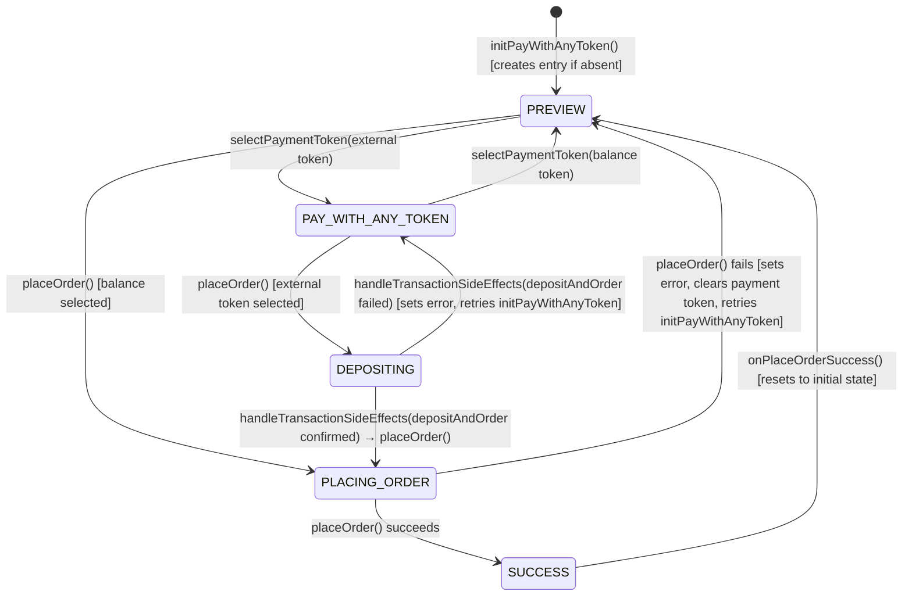

# Prediction markets

The Predict feature enables users to participate in prediction markets within MetaMask Mobile. This document reflects the current implementation architecture and structure.

## Architecture Layers

```
┌─────────────────────────────────────┐
│           Components (UI)           │
├─────────────────────────────────────┤
│            Hooks (React)            │
├─────────────────────────────────────┤
│         Controller (Business)       │
├─────────────────────────────────────┤
│         Providers (Protocol)        │
└─────────────────────────────────────┘
```

## File Structure

```
/Predict
├── /components                  # Reusable UI components
│   ├── /MarketListContent       # Market list display component
│   ├── /MarketsWonCard          # Won markets display card
│   ├── /PredictHome             # Homepage components (positions, featured markets)
│   ├── /PredictMarket           # Market wrapper component (routes to single/multiple)
│   ├── /PredictMarketSingle     # Single outcome market card component
│   ├── /PredictMarketMultiple   # Multiple outcome market selection component
│   ├── /PredictNewButton        # New prediction creation button
│   ├── /PredictPosition         # Position display component
│   └── /SearchBox               # Market search component
├── /controllers                 # Controllers for PredictMarket
│   └── PredictController.ts     # Main controller with tests
├── /hooks                       # React integration hooks (6 hooks)
│   ├── usePredictBuy.ts         # Buy order placement hook
│   ├── usePredictSell.ts        # Sell order placement hook
│   ├── usePredictTrading.ts     # Core trading operations
│   ├── usePredictMarketData.tsx # Market data fetching with pagination
│   ├── usePredictPositions.ts   # User positions management
│   └── usePredictOrders.tsx     # Order state management and notifications
├── /mocks                       # Test mocks and fixtures
│   └── remoteFeatureFlagMocks.ts
├── /providers                   # Protocol implementations
│   ├── /polymarket              # Polymarket provider implementation
│   │   ├── PolymarketProvider.t s
│   │   ├── constants.ts
│   │   ├── types.ts
│   │   └── utils.ts
│   └── types.ts                 # Provider interface definitions
├── /routes                      # Navigation route definitions
│   └── index.tsx
├── /selectors                   # Redux state selectors
│   └── /featureFlags            # Feature flag selectors
│       └── index.ts
├── /types                       # TypeScript type definitions
│   ├── index.ts                 # Core types and interfaces
│   └── navigation.ts            # Navigation type definitions
├── /utils                       # Utility functions
│   ├── format.ts                # Price, percentage, and volume formatting
│   └── orders.ts                # Order ID generation utilities
├── /views                       # Main screen components
│   ├── /PredictBuyWithAnyToken  # Buy/order flow (single-route architecture)
│   ├── /PredictCashOut          # Cash out/redeem positions screen
│   ├── /PredictMarketDetails    # Individual market details screen
│   ├── /PredictMarketList       # Market listing screen
│   └── /PredictTabView          # Main tabbed view container
└── index.ts                     # Main entry point
```

## Hooks - Current Implementation

### Trading Operations

- `usePredictBuy` - Buy order placement with loading states, callbacks, and toast notifications
- `usePredictSell` - Sell order placement with loading states, callbacks, and toast notifications
- `usePredictTrading` - Core trading operations (buy/sell/getPositions) via PredictController

### Data Management

- `usePredictMarketData` - Market data fetching with pagination, search, infinite scroll, and retry logic
- `usePredictPositions` - User positions management with focus refresh, loading states, and refresh capabilities
- `usePredictOrders` - Order state management with automatic toast notifications for status changes

### Implementation Details

#### Trading Hooks (`usePredictBuy`, `usePredictSell`)

- **Loading states**: `placing`, `completed`, `error`
- **Toast notifications**: Automatic notifications for order placement, completion, and failures
- **Callbacks**: `onComplete`, `onError`
- **Order tracking**: Real-time order status via Redux state selectors
- **Utilities**: `isOutcomeLoading()` for UI state, `reset()` for cleanup

#### Data Management Hooks

- **`usePredictMarketData`**: Supports category filtering, search, pagination with `fetchMore()`, and exponential backoff retry logic
- **`usePredictPositions`**: Implements `useFocusEffect` for screen refresh, separate loading states for initial load vs refresh
- **`usePredictOrders`**: Automatic toast notifications based on Redux state changes, manages notification queue

## Duplication Prevention

Before creating a new hook:

1. Check existing hooks in relevant category
2. Consider composing existing hooks
3. Follow naming: `usePredict[Feature][Action]`
4. Keep single responsibility

## Key Patterns

### Validation Flow

Provider validation (protocol rules) → Hook adds UI rules → Component displays errors

### Data Flow

Controller → Redux Store → Hooks → Components

### Real-time Updates

WebSocket → Controller → Redux → Hooks with subscription

### Form Management

Component input → Hook state → Validation → Controller action

## Quick Hook Selection Guide

| Need                     | Use Hook                 | Key Features                                                                     |
| ------------------------ | ------------------------ | -------------------------------------------------------------------------------- |
| Place buy orders         | `usePredictBuy`          | Loading states, toast notifications, callbacks                                   |
| Place sell orders        | `usePredictSell`         | Loading states, toast notifications, callbacks                                   |
| Direct controller access | `usePredictTrading`      | Core buy/sell/getPositions operations                                            |
| Market data with search  | `usePredictMarketData`   | Pagination, infinite scroll, category filtering                                  |
| User positions           | `usePredictPositions`    | Focus refresh, loading states, account-based                                     |
| Market data              | `usePredictMarket`       | Market data fetching with pagination, search, infinite scroll, and retry logic   |
| Price history            | `usePredictPriceHistory` | Price history fetching with pagination, search, infinite scroll, and retry logic |
| Order notifications      | `usePredictOrders`       | Automatic toast notifications, status tracking                                   |

## PredictBuyWithAnyToken

The buy/order flow lives in `views/PredictBuyWithAnyToken/`. This is the primary screen where users place prediction market orders. Everything — direct orders, deposit-and-order flows, and pay-with-any-token flows — happens on a **single route** without navigation redirects.

### Single-Route Architecture

All order states (preview, token selection, deposit, order placement) are managed by `PredictController` and rendered inline within `PredictBuyWithAnyToken`. The confirmation transaction (`PredictPayWithAnyTokenInfo`) is mounted as a headless component that syncs deposit amounts and payment tokens via effects, rather than living on a separate navigation screen. When an external payment token is selected, `initPayWithAnyToken()` fires on the initial `transitionEnd` event to prepare the deposit-and-order batch in the background.

Flow logic (deposit → order chaining, error handling, state transitions) lives in `PredictController` — hooks react to `activeOrder.state` changes via effects rather than driving transitions themselves.

### Components

| Component                    | Description                                                                                                                                |
| ---------------------------- | ------------------------------------------------------------------------------------------------------------------------------------------ |
| `PredictBuyActionButton`     | Main CTA button with loading/disabled states tied to order lifecycle                                                                       |
| `PredictBuyAmountSection`    | Keypad and amount input for entering bet size; disables input interaction while order is placing                                           |
| `PredictBuyBottomContent`    | Bottom area layout (fee summary, action button)                                                                                            |
| `PredictBuyError`            | Generic error display for all buy-flow errors (minimum bet, insufficient balance, order failures, insufficient pay token balance)          |
| `PredictBuyPreviewHeader`    | Header showing market/outcome info with `outcomeToken` prop for direct token resolution (falls back to route param token, not first token) |
| `PredictFeeSummary`          | Breakdown of MetaMask fee, provider fee, deposit fee, and total                                                                            |
| `PredictPayWithAnyTokenInfo` | Headless component that syncs deposit amount and payment token to the confirmation transaction; renders only when `transactionMeta` exists |
| `PredictPayWithRow`          | Payment token selector row — always visible (Predict balance or external tokens); falls back to Predict balance when payToken is null      |

### Hooks

| Hook                            | Description                                                                                                                                                                                                                                                                                                    |
| ------------------------------- | -------------------------------------------------------------------------------------------------------------------------------------------------------------------------------------------------------------------------------------------------------------------------------------------------------------- |
| `usePredictBuyActions`          | Orchestrates buy flow lifecycle: analytics tracking on mount, `transitionEnd` initialization for `initPayWithAnyToken()`, back-navigation cleanup, confirm/deposit/order logic, and SUCCESS → dismiss. Returns `handleConfirm` and `placeOrder`                                                                |
| `usePredictBuyConditions`       | Derives boolean flags (`canPlaceBet`, `isBelowMinimum`, `isInsufficientBalance`, `isInsufficientPayTokenBalance`, `isRateLimited`, `maxBetAmount`, `isPayFeesLoading`, `isBalancePulsing`, etc.) from order and preview state. Includes stale-quote detection to bridge `TransactionPayController` timing gaps |
| `usePredictBuyError`            | Derives error messages from active order state, preview errors, minimum bet violations, insufficient balance, and insufficient pay token balance. Detects order-not-filled errors for the retry flow                                                                                                           |
| `usePredictBuyInfo`             | Computes display values (`toWin`, `metamaskFee`, `providerFee`, `depositFee`, `depositAmount`, `total`, `rewardsFeeAmount`) from preview, `TransactionPayController` totals, and Predict balance                                                                                                               |
| `usePredictBuyInputState`       | Manages keypad input value, user-change tracking, input focus state, and `isConfirming` flag. Clears active order errors on user input change                                                                                                                                                                  |
| `usePredictBuyAvailableBalance` | Resolves the available balance as a raw number — Predict balance when using balance, or Predict balance + external token balance when using an external token                                                                                                                                                  |

## Active Order Lifecycle

The `activeBuyOrders` map in `PredictControllerState` tracks the full lifecycle of buy orders **per account address**. Each address can have at most one active order at a time. All state transitions are owned by `PredictController` methods — hooks react to state changes via effects rather than driving transitions themselves.

The active order **persists across navigation**. When a user places a deposit-and-order bet and navigates away, the order state (DEPOSITING, PLACING_ORDER) is preserved. The user cannot place a second order while one is in-flight — the UI blocks interaction via `isPlacingOrder`. When the background order completes, `onPlaceOrderSuccess()` resets the entry to PREVIEW (never null).

When the active order enters `PAY_WITH_ANY_TOKEN` and `placeOrder()` is called, the controller stores the preview and analytics in an in-memory `pendingOrderPreviews` map keyed by `transactionId`. After the deposit transaction confirms, `handleTransactionSideEffects()` looks up the stored preview and automatically calls `placeOrder()` to complete the order.

### State Shape

```typescript
activeBuyOrders: {
  [address: string]: {
    transactionId?: string;    // Transaction ID linking deposit to order (deposit-and-order flow only)
    state: ActiveOrderState;   // Current lifecycle state
    error?: string;            // Error message from failed operations
  };
};
```

Entries are lazily created by `initPayWithAnyToken()` on first buy screen mount for a given address. Default state is `{}` (empty map). The selector `selectPredictActiveBuyOrder` resolves the current account address to read the correct entry.

### ActiveOrderState

```typescript
enum ActiveOrderState {
  PREVIEW = 'preview', // User is editing amount on the keypad
  PAY_WITH_ANY_TOKEN = 'pay_with_any_token', // External token selected, deposit-and-order tx prepared in background
  DEPOSITING = 'depositing', // Deposit transaction in progress (set by placeOrder when state is PAY_WITH_ANY_TOKEN)
  PLACING_ORDER = 'placing_order', // Order submission in flight
  SUCCESS = 'success', // Order completed, about to reset
}
```

### State Machine



Notes:

- The active order is **never set to null** during normal flows. On SUCCESS, `onPlaceOrderSuccess()` resets the entry to `{ state: PREVIEW }` instead of removing it. On navigation back, `beforeRemove` clears only the `transactionId` (via `clearActiveOrderTransactionId()`) and rejects pending approvals — it does not clear the order entry.
- Deposit failure resets to `PAY_WITH_ANY_TOKEN`, stores the error on `activeBuyOrders[address].error`, clears `transactionId`, and automatically retries `initPayWithAnyToken()`.
- Order failure resets to `PREVIEW`, stores the error, clears `selectedPaymentToken`, and if a `transactionId` was present, clears it and retries `initPayWithAnyToken()`.
- The `transitionEnd` listener in `usePredictBuyActions` triggers `resetSelectedPaymentToken()` then `initPayWithAnyToken()` once on initial mount to prepare the deposit-and-order batch. This ensures each new buy screen starts with Predict balance selected.
- `initPayWithAnyToken()` guards against duplicate calls: if the order is already in DEPOSITING or PLACING_ORDER, it returns early. If the order is in stale SUCCESS (from a background completion), it resets via `onPlaceOrderSuccess()` first.
- Transaction status events (`TransactionController:transactionStatusUpdated`) for `predictDepositAndOrder` are handled by `handleTransactionSideEffects()` in the controller, which chains deposit confirmation into `placeOrder()` automatically using the preview stored in `pendingOrderPreviews`.
- When `placeOrder()` is called while the active order state is `PAY_WITH_ANY_TOKEN`, it transitions to `DEPOSITING`, stores the preview in `pendingOrderPreviews[transactionId]`, and returns early. The actual order placement happens when the deposit transaction confirms.

### Foreground vs Background Notification

Order success always publishes a `PredictController:transactionStatusChanged` event (for toast + query invalidation). Order **failure** events use `transactionId` matching to distinguish foreground from background:

- **Foreground** (user on buy screen): `params.transactionId` matches `activeBuyOrders[address].transactionId` → error shown inline on screen, no toast.
- **Background** (user navigated away): `transactionId` was cleared on navigation back via `clearActiveOrderTransactionId()`, so no match → toast fires.
- **Balance flow** (no `transactionId`): error always shown inline, no toast (balance orders complete fast).

The `didInitiateOrderRef` in `usePredictBuyActions` tracks whether the current screen instance initiated the order. On SUCCESS, navigation only pops if the ref is true — preventing a background completion from dismissing a different buy screen.

- State transitions are gated behind the `predictWithAnyToken` feature flag — when disabled, `placeOrder()` behaves as a direct order without active order state management.

### Controller Methods (State Transitions)

| Method                            | Transition                            | Notes                                                                                                                                          |
| --------------------------------- | ------------------------------------- | ---------------------------------------------------------------------------------------------------------------------------------------------- |
| `initPayWithAnyToken()`           | Creates entry or resets stale SUCCESS | Prepares deposit-and-order batch via provider; creates `{ state: PREVIEW }` entry if absent; guards against DEPOSITING/PLACING_ORDER in-flight |
| `selectPaymentToken()`            | `PREVIEW ↔ PAY_WITH_ANY_TOKEN`       | Toggles between balance and external token; sets/clears `selectedPaymentToken` and clears error                                                |
| `placeOrder()`                    | `PAY_WITH_ANY_TOKEN -> DEPOSITING`    | When external token selected: stores preview in `pendingOrderPreviews`, transitions to `DEPOSITING`, returns early                             |
| `placeOrder()`                    | `PREVIEW -> PLACING_ORDER`            | When balance selected: submits order directly to provider                                                                                      |
| `placeOrder()`                    | `PLACING_ORDER -> SUCCESS`            | On successful order completion; optimistically updates balance; always publishes order confirmed event                                         |
| `placeOrder()`                    | `PLACING_ORDER -> PREVIEW`            | On order failure; stores error, clears payment token; publishes failed event only for background orders (transactionId mismatch)               |
| `onPlaceOrderSuccess()`           | `-> PREVIEW`                          | Resets active order entry to `{ state: PREVIEW }` and clears `selectedPaymentToken`                                                            |
| `clearActiveOrderTransactionId()` | (clears transactionId only)           | Called on navigation back to signal the screen is no longer handling the order; enables background toast for subsequent failures               |
| `clearOrderError()`               | (no state change)                     | Removes error from active order                                                                                                                |
| `setSelectedPaymentToken()`       | (no state change)                     | Directly sets or clears the selected payment token in state                                                                                    |

## Core Types and Utilities

### Key Types (`/types/index.ts`)

- `PredictMarket` - Market data structure with outcomes, status, categories
- `PredictPosition` - User position with P&L calculations and status
- `PredictOrder` - Order structure with status tracking and trade parameters
- `BuyParams` / `SellParams` - Trading operation parameters

### Utility Functions (`/utils/`)

- **`format.ts`**: Price, percentage, and volume formatting with locale support
- **`orders.ts`**: Unique order ID generation utilities
