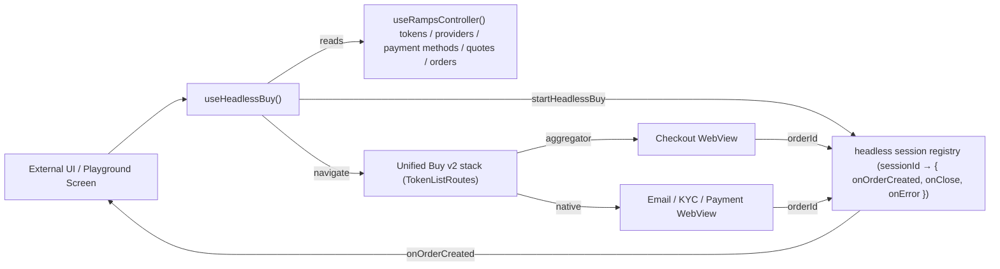
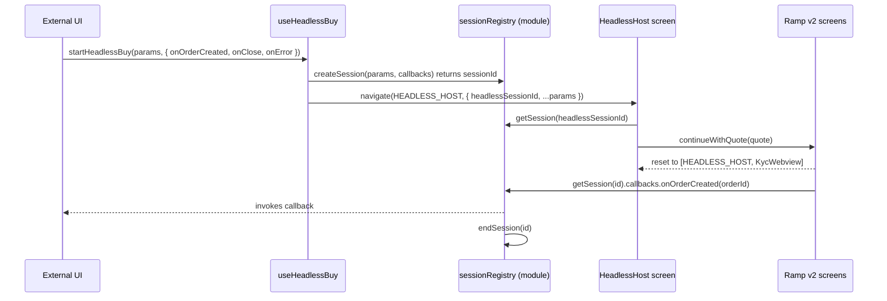
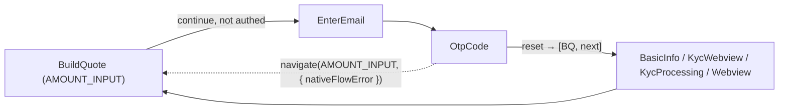

# Headless Buy — Incremental Plan

> Introduce a dev-only "Headless Buy" playground under Ramp Settings that consumes a new `useHeadlessBuy` hook, then incrementally evolve the Unified Buy v2 flow so external UIs can drive it end-to-end without the Ramp UI (skip token/amount screens, bypass the order-processing redirect, surface orderIds through callbacks).

## Phases checklist

- [ ] **Phase 1** — Scaffold Headless Playground screen + route + entry row in Ramp Settings (gated by `isInternalBuild`)
- [ ] **Phase 2** — Implement `useHeadlessBuy` v0 read-only facade (tokens, providers, payment methods, `getQuotes`) and wire playground inputs/quotes list
- [ ] **Phase 3** — Add headless session registry + `startHeadlessBuy` API that navigates into existing BuildQuote with `headlessSessionId`
- [ ] **Phase 4** — Refactor BuildQuote to extract `handleWidgetProviderContinue` / `handleNativeProviderContinue` into `useContinueWithQuote` hook
- [ ] **Phase 4b** — Introduce Headless Host screen as stack base for the headless flow + parameterize `useTransakRouting` reset helpers with `baseRoute`
- [ ] **Phase 5** — Skip BuildQuote in headless mode — Headless Host fetches the quote, picks one, calls `continueWithQuote`, and re-orchestrates after auth loops return to it
- [ ] **Phase 6** — Bypass order-processing redirect in Transak/aggregator routing when headless; fire `onOrderCreated` and end session
- [ ] **Phase 7** — Extract UI-coupled error/limit surfacing; route errors through `onError` as typed `HeadlessBuyError`
- [ ] **Phase 8** — Cancellation + `onClose` semantics (including user-dismissed detection)
- [ ] **Phase 9** — Expose `getOrder` / `refreshOrder` from hook and show in playground
- [ ] **Phase 10** — Playground polish — event log, input persistence, aggregator/native presets

---

Each phase below is sized to be merged and tested independently. Scope is kept small per phase so we can pick them up one at a time, validate in the playground, and discover the refactors the mainstream flow needs along the way.

---

## Architecture at a glance



Key idea: the hook orchestrates by (a) pre-seeding RampsController selections, (b) navigating into the existing v2 screens with a `headlessSessionId` param, and (c) having existing routing callbacks detect the session and fire the callback instead of navigating to order-details.

---

## Phase 1 — Playground scaffolding (read-only)

Goal: land an empty playground screen wired to the existing `useRampsController`. No behavior changes.

- Add `Routes.RAMP.HEADLESS_PLAYGROUND = 'RampHeadlessPlayground'` in [app/constants/navigation/Routes.ts](../../../../constants/navigation/Routes.ts) (line ~8–22 block).
- Create `app/components/UI/Ramp/Views/HeadlessPlayground/HeadlessPlayground.tsx` — a plain `ScrollView` that renders the current `userRegion`, first 5 `tokens`, `providers`, `paymentMethods`, using the existing composition hook at [app/components/UI/Ramp/hooks/useRampsController.ts](../hooks/useRampsController.ts).
- Register screen in [app/components/Nav/Main/MainNavigator.js](../../../../Nav/Main/MainNavigator.js) next to the `RampSettings` registration (lines 491–500), no env gate on the stack itself — only the entry point is gated.
- Add entry row in [app/components/UI/Ramp/Aggregator/Views/Settings/Settings.tsx](../Aggregator/Views/Settings/Settings.tsx) next to `ActivationKeys` (lines 134–138), reusing the `isInternalBuild` guard:

```tsx
{
  isInternalBuild ? (
    <Row>
      <HeadlessPlaygroundLink />
    </Row>
  ) : null;
}
```

- Add i18n keys (`app_settings.fiat_on_ramp.headless_playground.*`) in [locales/languages/en.json](../../../../../../locales/languages/en.json).
- Unit tests: one render test for the new screen, one assertion in `Settings.test.tsx` that the row only renders when `isInternalBuild`.

---

## Phase 2 — `useHeadlessBuy` v0 (read-only facade)

Goal: expose a stable public API surface that only reads data. No side effects yet.

- Create `app/components/UI/Ramp/headless/` directory with:
  - `useHeadlessBuy.ts` — facade around `useRampsController` exposing: `tokens`, `providers`, `paymentMethods`, `userRegion`, `orders`, `getOrderById`, `getQuotes(params)`, `isLoading`, `errors`.
  - `types.ts` — `HeadlessBuyParams`, `HeadlessSession`, `HeadlessBuyResult`, `HeadlessBuyCallbacks`.
  - `index.ts` — barrel.
- `getQuotes(params)` wraps [app/components/UI/Ramp/hooks/useRampsQuotes.ts](../hooks/useRampsQuotes.ts) but accepts all inputs as arguments (assetId, amount, paymentMethodId, providerId, regionCode) so the caller does not need to pre-seed controller state.
- Wire the playground screen to render: region picker (from `countries`), token dropdown (from `tokens`), payment method dropdown, amount input, a "Get quotes" button, and a list of returned quotes.
- Unit tests around `useHeadlessBuy` (mock controller) asserting it forwards data correctly.

Deliverable: a dev can open Ramp Settings → Headless Playground, pick inputs, and see quotes. Nothing starts a real flow yet.

---

## Phase 3 — Headless session registry + Start API

Goal: define the lifecycle primitive that lets the existing flow fire a callback back to the consumer.

### Why a module-level registry (not Redux / not Context)

- Callbacks are functions — **not serializable**, so they can't live in Redux state or in route params.
- The lifetime is **per-attempt**, not per-app — Redux persistence would be wrong.
- Multiple consumers in different parts of the tree must all see the same session — Context wouldn't reach across navigators reliably.
- This is how MetaMask Mobile already handles "shared, ephemeral, non-serializable" state. Direct analog: [app/core/SDKConnectV2/services/connection-registry.ts](../../../../core/SDKConnectV2/services/connection-registry.ts) lines 63–87 (`private connections = new Map<string, Connection>()` plus `disconnect(id)` lifecycle). A second precedent is `@metamask/approval-controller` (`addApprovalRequest` / `acceptApproval`), used throughout [app/core/RPCMethods/RPCMethodMiddleware.ts](../../../../core/RPCMethods/RPCMethodMiddleware.ts) — same id-keyed "register a request, resolve it later from the UI" shape. The existing Ramp aggregator already does a smaller version of this with `customOrderId` + `getOrderFromCallback` in [app/components/UI/Ramp/Aggregator/Views/Checkout/Checkout.tsx](../Aggregator/Views/Checkout/Checkout.tsx) (line 21, 49, 74).

### End-to-end flow



The `sessionId` is the only thing that travels through navigation params; everything else (callbacks, status) is looked up by id at the point of use.

### Implementation

- Create `app/components/UI/Ramp/headless/sessionRegistry.ts`:
  - Module-level `Map<sessionId, HeadlessSession>`.
  - `createSession(params, callbacks): HeadlessSession`, `getSession(id)`, `setStatus(id, status)`, `endSession(id)`.
  - Session shape: `{ id, status: 'pending' | 'quoting' | 'continued' | 'completed' | 'cancelled', params, callbacks: { onOrderCreated, onClose, onError }, createdAt }`.
  - GC stale sessions (>1h) on each `createSession` to avoid leaks.
  - `getSession(undefined)` returns `undefined` (no-op) so call-sites can write `getSession(route.params?.headlessSessionId)?.callbacks.onOrderCreated(orderId)`.
- Extend `useHeadlessBuy` with:

```ts
startHeadlessBuy(
  params: HeadlessBuyParams,
  callbacks: HeadlessBuyCallbacks,
): { sessionId: string; cancel(): void }
```

- `params` include: `assetId`, `amount`, `paymentMethodId`, `providerId?`, `regionCode?`.
- Implementation (this phase only does the plumbing, no UI bypass yet):
  1. `createSession(params, callbacks)` returns `sessionId`.
  2. Set RampsController state (`setSelectedToken`, `setSelectedProvider`, `setSelectedPaymentMethod`, `setUserRegion`) so downstream screens read consistent values.
  3. Navigate to `BuildQuote` via `createBuildQuoteNavDetails({ assetId, amount, headlessSessionId })` from [app/components/UI/Ramp/Views/BuildQuote/BuildQuote.tsx](../Views/BuildQuote/BuildQuote.tsx) (lines 112–147) — i.e. reuse the existing entry.
- Add `headlessSessionId?: string` to `BuildQuoteParams` (BuildQuote.tsx line 112).
- Unit tests around the registry (create/get/end, collisions, dangling sessions).

Deliverable: playground can call `startHeadlessBuy` and land on the BuildQuote screen (still the full UI) — validates plumbing without breaking anything.

---

## Phase 4 — Extract continue-with-quote logic (refactor)

Goal: make the "what to do after we have a quote" logic reusable outside the `BuildQuote` component.

- Extract from [app/components/UI/Ramp/Views/BuildQuote/BuildQuote.tsx](../Views/BuildQuote/BuildQuote.tsx):
  - `handleWidgetProviderContinue` (lines ~700–821, aggregator path → Checkout WebView / InAppBrowser).
  - `handleNativeProviderContinue` (lines ~636–681, native Transak path).
- Move into `app/components/UI/Ramp/hooks/useContinueWithQuote.ts`:

```ts
useContinueWithQuote(): {
  continueWithQuote: (quote: Quote, context: { amount: number; assetId: string }) => Promise<void>;
}
```

- Internally delegates to existing [app/components/UI/Ramp/hooks/useTransakRouting.ts](../hooks/useTransakRouting.ts) and aggregator widget logic.
- Refactor `BuildQuote` to use the new hook — identical behavior.
- Both the BuildQuote screen AND `useHeadlessBuy` will call `useContinueWithQuote` from the next phase on.
- Update/add unit tests so BuildQuote tests keep passing and `useContinueWithQuote` is covered.

No user-visible change — purely a refactor to unblock Phase 5.

---

## Phase 4b — Headless Host screen + parameterized reset base

Goal: solve the "auth loop" problem before we try to skip BuildQuote.

Today every reset in [app/components/UI/Ramp/hooks/useTransakRouting.ts](../hooks/useTransakRouting.ts) puts `Routes.RAMP.AMOUNT_INPUT` (BuildQuote) at the bottom of the stack, e.g.:

```ts
navigation.reset({
  index: 1,
  routes: [
    { name: Routes.RAMP.AMOUNT_INPUT, params: { amount } },
    { name: routeName, params: routeParams },
  ],
});
```

This is intentional — BuildQuote is the "base camp" of the native flow loop:



[OtpCode.tsx](../Views/NativeFlow/OtpCode.tsx) lines 252–260 also navigates back to `AMOUNT_INPUT` with a `nativeFlowError` param to surface auth errors. So if we just skip BuildQuote, post-login resets land on a missing screen and errors disappear.

Solution — introduce a Headless Host that takes BuildQuote's role in the headless stack:

- New route `Routes.RAMP.HEADLESS_HOST = 'RampHeadlessHost'`. Screen at `app/components/UI/Ramp/Views/HeadlessHost/HeadlessHost.tsx`.
- The Host is a transparent / minimal loader (spinner + cancel button) and never shows ramp UI. It accepts:

```ts
interface HeadlessHostParams {
  headlessSessionId: string;
  // serialized just enough to re-orchestrate after the loop returns to base
  assetId: string;
  amount: number;
  paymentMethodId: string;
  providerId?: string;
  nativeFlowError?: string; // mirrors BuildQuote's param so OtpCode's existing surface keeps working
}
```

- On focus, the Host re-runs the orchestration: fetch (or reuse) the quote and call `continueWithQuote(...)` from Phase 4. This naturally handles the loop case — when `OtpCode` resets to `[HEADLESS_HOST, KycWebview]` (Phase 5 wires this), focus on Host briefly fires before the reset settles on the next screen, and on subsequent loop returns Host kicks off the next step.
- If `nativeFlowError` is present, fire `onError('AUTH_FAILED', { message })` via the session registry instead of rendering it.
- Back-press on Host → `endSession` + `onClose({ reason: 'user_dismissed' })`.

Parameterize `useTransakRouting` reset helpers with a `baseRoute`:

- Update `useTransakRouting(config?)` to accept `{ baseRoute?: string; baseRouteParams?: object }` (default `Routes.RAMP.AMOUNT_INPUT`).
- All reset helpers swap the first route in the `routes` array to `baseRoute` with `baseRouteParams`.
- Affected helpers in [useTransakRouting.ts](../hooks/useTransakRouting.ts): `navigateToVerifyIdentityCallback` (164–177), `navigateToBasicInfoCallback` (179–204), `navigateToAdditionalVerificationCallback` (242–269), `navigateToWebviewModalCallback` (358–377), `navigateToKycProcessingCallback` (379–393), `navigateToKycWebviewCallback` (395–429).
- `navigateToBankDetailsCallback` (206–225) and `navigateToOrderProcessingCallback` (227–240) reset to a single screen — no base — so unaffected by this phase but will be touched in Phase 6.
- BuildQuote keeps using `useTransakRouting()` with no config (back-compatible).
- Headless Host calls `useTransakRouting({ baseRoute: Routes.RAMP.HEADLESS_HOST, baseRouteParams: { headlessSessionId, ...hostParams } })`.

Also patch the OtpCode error-navigate at [OtpCode.tsx](../Views/NativeFlow/OtpCode.tsx) line 252:

```ts
const baseRoute = headlessSessionId
  ? Routes.RAMP.HEADLESS_HOST
  : Routes.RAMP.AMOUNT_INPUT;
navigation.navigate(baseRoute, {
  nativeFlowError,
  headlessSessionId,
  ...hostParamsIfHeadless,
});
```

The `headlessSessionId` is read from current route params (threaded by Phase 5 navigation) or via a small `useHeadlessSession()` helper that reads it from the deepest ramp route's params.

Tests:

- `useTransakRouting.test.ts`: existing assertions pass; new assertions that with `baseRoute: 'RampHeadlessHost'` the resets land on the host.
- `HeadlessHost.test.tsx`: renders loader; on focus calls `continueWithQuote`; back-press fires `onClose`; `nativeFlowError` param fires `onError`.

No public-API change to `useHeadlessBuy` yet — this is the wiring that makes Phase 5 safe.

---

## Phase 5 — Skip BuildQuote when headless

Goal: when `startHeadlessBuy` is invoked, bypass the amount/token UI and jump straight to provider continuation, using the Host as the base.

- Change `startHeadlessBuy` (from Phase 3) to navigate to `Routes.RAMP.HEADLESS_HOST` (instead of BuildQuote) with `{ headlessSessionId, assetId, amount, paymentMethodId, providerId? }`.
- The Host's first focus runs:
  1. `getQuotes(...)`.
  2. Pick the quote (default: cheapest, or `providerId`-matched).
  3. `continueWithQuote(quote, { amount, assetId })` — aggregator → Checkout WebView; native → routeAfterAuthentication which now resets onto `[HEADLESS_HOST, next]`.
- Loop semantics:
  - Unauthenticated native → `EnterEmail` → `OtpCode` → on success, `routeAfterAuthentication` resets to `[HEADLESS_HOST, KycWebview|...]`. The Host's focus effect re-runs but sees a non-base screen on top and stays idle (no double-call).
  - To prevent re-entry races, the Host tracks `currentSessionStatus` in the session registry (`pending → quoting → continued`), and only re-orchestrates when status is `pending` or after a back-to-base detection.
- Fallbacks / errors: if no quote, fire `onError('NO_QUOTES')` and `endSession`; if limits exceeded → `onError('LIMIT_EXCEEDED', details)` (no toasts) — these are wired more thoroughly in Phase 7.
- Tests:
  - Aggregator quote → navigates to Checkout route with correct session id and Host underneath.
  - Native unauthenticated quote → navigates to EnterEmail with Host as base.
  - Authenticated + KYC approved → navigates to Webview with Host as base.
  - Re-focus on Host while a child screen is in foreground does not re-trigger orchestration.

---

## Phase 6 — Bypass order-processing redirect & fire callback

Goal: when the flow produces an orderId under a headless session, call the callback and leave screen management to the caller.

- Thread `headlessSessionId` through navigation params for: `Checkout`, `KycWebview`, `EnterEmail`, `BasicInfo`, `VerifyIdentity`, `AdditionalVerification` (see [app/components/UI/Ramp/routes.tsx](../routes.tsx) lines 37–97).
- In [app/components/UI/Ramp/hooks/useTransakRouting.ts](../hooks/useTransakRouting.ts):
  - Modify `navigateToOrderProcessingCallback` (lines 227–240) and `handleNavigationStateChange` (lines 271–356) to check for `headlessSessionId` in route params:
    - If headless → `getSession(id).callbacks.onOrderCreated(orderId)` then `endSession(id)` and `navigation.pop(N)` (or `goBack`) to unwind to the caller.
    - Otherwise → existing behavior (reset to `RAMPS_ORDER_DETAILS`).
- Same treatment for aggregator Checkout WebView success in `app/components/UI/Ramp/Views/Checkout/Checkout.tsx`.
- Tests:
  - Given a session, the callback fires with the correct orderId and no navigation to `RAMPS_ORDER_DETAILS`.
  - Without a session, behavior is unchanged.

---

## Phase 7 — Surface errors/limits as data (extract UI coupling)

Goal: headless consumers should not rely on toasts/banners; they need structured results.

- Audit error/limit surfaces:
  - `checkUserLimits` `LimitExceededError` throw paths in [app/components/UI/Ramp/hooks/useTransakRouting.ts](../hooks/useTransakRouting.ts) lines 99–161.
  - `showV2OrderToast` calls in `useTransakRouting.ts` lines 311–316.
  - Quote error surfacing in `BuildQuote.tsx` (`rampsError` state, lines 168+, `nativeFlowError` effect lines 170–175).
- Introduce a typed `HeadlessBuyError` union (`NO_QUOTES`, `LIMIT_EXCEEDED`, `KYC_REQUIRED`, `AUTH_FAILED`, `QUOTE_FAILED`, `USER_CANCELLED`, `UNKNOWN`).
- In the headless path, route these through `onError` instead of the existing UI surfaces. Keep existing UI surfaces intact for the non-headless path.
- Tests assert that UI side-effects (toasts) are NOT called when `headlessSessionId` is present.

---

## Phase 8 — Cancellation + `onClose`

Goal: close/cancel semantics.

- `startHeadlessBuy` returns a `cancel()` that `endSession`s and pops the headless-initiated screens off the stack.
- Detect user dismissal of a headless stack (e.g., back-button from Checkout WebView before orderId) → fire `onClose({ reason: 'user_dismissed' })`.
- Tests around cancel paths.

---

## Phase 9 — Expose `getOrder` + polling helpers

Goal: complete the hook surface.

- Add `getOrder(orderId)` using `useRampsOrders.getOrderById` (already available via [app/components/UI/Ramp/hooks/useRampsOrders.ts](../hooks/useRampsOrders.ts)).
- Add `refreshOrder(providerCode, providerOrderId)` passthrough for polling after a callback.
- Document the hook in a JSDoc at top of `useHeadlessBuy.ts` with a full example.
- Extend playground: after `onOrderCreated` fires, show the orderId and a "Refresh order" button using these helpers.

---

## Phase 10 — Playground polish & discoverability

Goal: make the playground actually useful for exploring the API.

- Pretty-print session events (`onOrderCreated`, `onError`, `onClose`) in a scrolling log panel.
- Persist the last playground input to `AsyncStorage` to speed iteration.
- Add a quick "Try aggregator" vs "Try native" preset pair.

---

## Out of scope for now

- Exporting `useHeadlessBuy` outside of Ramp (stays internal; other teams import directly from `app/components/UI/Ramp/headless`).
- Non-React consumers (imperative/global API).
- Sell flow parity — headless Sell is a follow-up.
- Migrating the existing BuildQuote to use the headless primitives (we only extract what's strictly necessary).
