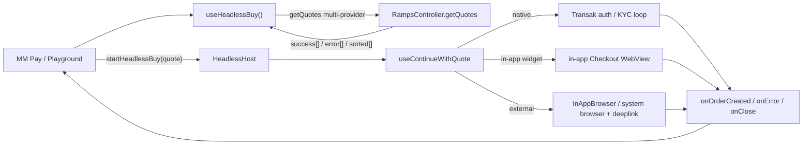

# Headless Buy: All Providers Support Plan

> Take Headless Buy (and its MM Pay / Money Account consumer) from native-only to all-provider support in two checkpointable phases. Phase 1 ships a quick-win MVP for in-app WebView providers only, filtered at the quote layer, behind one scoped flag. Phase 2 adds external-browser and custom-action providers (headless-aware checkout, deeplink reconciliation, custom actions), then widens the same flag. Each phase is shippable on its own: Phase 1 needs none of the Phase 2 checkout work because external/custom quotes are filtered out.

This is a companion to [PLAN.md](./PLAN.md) (the original Headless Buy plan) and follows its style.

## Phases checklist

The work is split into two phases plus a deferred tail. Phase 1 is shippable on its own: it widens quoting to in-app WebView providers, filters out everything that needs external-browser or custom-action handling, and activates behind a multi-value scoped flag set to `in-app`. Phase 2 makes the external/custom checkout paths headless-aware and then widens the SAME flag to `all`. The native-only flow is never broken in either phase: the flag's `off` state falls back to native-only.

**Phase 1 - Quick-win MVP (in-app WebView providers only):**

- [ ] **P1.M0** - `failSession`-terminal must-fix (OTP typed-code de-scoped as native-only / optional)
- [ ] **P1.M1** - In-app-only quoting capability (in-app filter, reliability-then-price selection in `RampsController`, re-specified WebView fail-safe, per-provider WebView smoke check, analytics tagging, limits decision)
- [ ] **P1.M2** - Activation behind a multi-value scoped flag (`off | in-app | all`), with MM Pay passing allowed `providerIds`

**Phase 2 - External-browser + custom-action providers (Coinbase, PayPal, etc.):**

- [ ] **P2.M1** - Headless-aware `continueWidget` external-browser branch
- [ ] **P2.M2** - Headless deeplink path in `handleRampReturnUrl` + correlation record `{sessionId, walletAddress, chainId}`
- [ ] **P2.M3** - E1/E2/E3 reconciliation
- [ ] **P2.M4** - Custom-action (PayPal) support
- [ ] **P2.M5** - Widen the flag to `all`
- [ ] **P2.M6** - Add back the preferred-provider (order-history) recommendation rung
- [ ] **P2.M7** - Typed errors + analytics parity for external-browser

**Deferred (after Phase 2):**

- [ ] TPC multi-provider wiring; DRY cleanup ("UB2 becomes dumb"); broad typed-error taxonomy on demand

P1.M0 is a precondition for everything else: the terminal-callback contract fix (see Must-fix preconditions) must land before typed errors expand or before any consumer relies on terminal outcomes. The OTP typed-code fix is native-flow-only and is de-scoped (optional) for the in-app MVP.

---

## Scope (confirmed: full cross-repo)

Enabling all providers spans three layers. Phase 1 touches only the subset needed for in-app WebView providers; Phase 2 finishes the rest.

- **`@metamask/core` - `TransactionPayController`** (the MM Pay fiat quote path). `getRampsQuote` calls `RampsController:getQuotes` with `autoSelectProvider: true` (line ~113) + `restrictToKnownOrNativeProviders: true` (line ~116) and takes only `quotes.success?.[0]` (line ~124) (source: `packages/transaction-pay-controller/src/strategy/fiat/utils.ts`, the `getRampsQuote` function around lines 95 to 131 on `origin/main`). This is the native-only gate's quote-side enforcement.
- **`@metamask/ramps-controller`** - home for the shared smart selection (the deferred `getSmartSelectedQuote`). Phase 1 puts the in-app filter plus reliability-then-price selection here so that BOTH `transaction-pay-controller` `getRampsQuote` and the mobile headless path call one implementation instead of forking selection between core and a separate mobile `recommendQuotes` util (drift hazard). Pure callback parsing / status helpers extract here only once 2+ consumers justify it.
- **`metamask-mobile`** - relax the native-only availability gate (`app/components/Views/confirmations/hooks/pay/useIsFiatPaymentAvailable.ts`, lines 19 to 23; `app/components/UI/Ramp/hooks/useHasNativeFiatProvider.ts`, lines 23 to 26); consume the shared selection; own the in-app `Checkout` WebView fail-safe (Phase 1); make `useContinueWithQuote`'s external-browser branch headless-aware, plus typed errors, analytics, and all navigation/session and redirect/deeplink policy (Phase 2).

---

## Sequencing and safety: capability vs activation

**Risk:** widening live MM Pay / HeadlessBuy quoting to providers whose checkout path is not headless-aware would land users in the broken external-browser branch (silent BuildQuote reset, no terminal callback). That is the "user backed out vs provider broke" confusion we must avoid.

**Rule:** widening is staged by provider class, not deferred wholesale. In-app vs external is knowable at the quote layer (see the B1 finding and the "In-app WebView vs external-browser providers" concern), so Phase 1 can safely ship in-app WebView providers in production behind a flag while the external/custom checkout work is still pending.

- **Phase 1 ships in-app behind the flag.** The in-app filter (`!isCustomAction(quote)` and `quote.quote?.buyWidget?.browser !== 'IN_APP_OS_BROWSER'`) is the safety boundary: external-browser and custom-action quotes are filtered out before continuation, so the broken external branch is never reached. Three layers make this safe together (B1): MM Pay passes allowed `providerIds`, the in-app filter, and a mandatory in-app `Checkout` WebView fail-safe.
- **Phase 2 makes external/custom safe, then widens the SAME flag.** Only after `continueWidget`'s external-browser branch and the headless deeplink path emit terminal callbacks does the flag move from `in-app` to `all`. Because it is a flag VALUE flip (not a deploy-time filter removal), it is staged and roll-back-able independently of the Phase 2 deploy.

---

## Design principles

Inherited from [PLAN.md](./PLAN.md), with one addition:

1. **Callbacks-only, three terminal events.** A session ends in exactly one of `onOrderCreated`, `onError`, `onClose`. No intermediate progress callbacks. KYC stays terminal-only for consumers: native Transak may surface auth/limit/KYC-specific typed errors, but non-native provider KYC stays inside the provider checkout unless it produces a terminal callback, cancellation, or load failure.
2. **The consumer renders all visible UI.** `useHeadlessBuy` is a behavior provider, not a UI provider.
3. **Callback-routing rule (new).** `onError` is reserved for technical / provider failures only. User-driven and consumer-driven exits terminate via `onClose`, not `onError`:
   - User in-flow exit (browser cancel, WebView close, back-press, inferred abandonment): `onClose({ reason: 'user_dismissed' })`.
   - Consumer programmatic cancel (`cancel()` / session replacement): `onClose({ reason: 'consumer_cancelled' })`.
   - The `USER_CANCELLED` error code is retired for in-session exits. If retained at all, it is reserved only for a pre-session cancellation error and never emitted for in-flow user closes. Otherwise MM Pay cannot distinguish "user backed out" from "provider broke".

---

## Must-fix preconditions (before expanding errors)

**Terminal-callback contract bug.** `failSession` fires `onError(...)` then `closeSession({ reason: 'unknown' })`, which fires `onClose(...)` (`app/components/UI/Ramp/headless/sessionRegistry.ts`, lines 235 to 264). MM Pay's `onClose` currently clears the error set by `onError` (`app/components/Views/confirmations/hooks/pay/useFiatConfirm.ts`, the `onClose` handler at lines 129 to 132 calls `setHeadlessBuyError(undefined)`), so the error is lost.

**Decision (chosen contract):** `onError` is terminal on its own. `failSession` fires `onError` and then ends the session WITHOUT a trailing `onClose`. A session ends in exactly one of `onOrderCreated`, `onError`, or `onClose`, with no pairing. This keeps "provider broke" (`onError`) cleanly separable from "user/consumer exited" (`onClose`).

Implementation: `failSession` stops calling `closeSession`; it sets the terminal status (`failed`) and removes the session from the registry directly, without invoking `onClose`. `onClose` remains the terminal event only for `user_dismissed` / `consumer_cancelled` / `completed` paths.

Caveat to confirm with MM Pay before building broad typed errors: if MM Pay relies on a single cleanup hook regardless of outcome, we instead carry the `HeadlessBuyError` on the close info and fire one `onClose({ reason: 'errored', error })` after `onError`. Default is the no-trailing-`onClose` contract above unless MM Pay asks for the cleanup variant.

This is a precondition for the typed-error work, not an afterthought, and is implemented as P1.M0. The companion OTP typed-code fix is native-flow-only and is de-scoped (optional) for the in-app MVP.

---

## UB2 behavior to preserve

- The `QuotesResponse` contract `{ success, error, sorted, customActions }` from `@metamask/ramps-controller`. No client-side `Promise.all` fan-out is needed: the existing single `getQuotes` call already models partial failure via `success[]` plus per-provider `error[]`. (In practice custom actions ride inside `success[]` flagged by `isCustomAction`; the separate `customActions[]` array is empty in UB2 usage, and custom actions are out of scope in Phase 1, see the "Getting multiple quotes" concern.)
- Provider-level quote errors are non-terminal: they are surfaced as partial errors and only become terminal when every provider fails or no usable quote can be selected.
- Existing UB2 quote ordering, recommended-quote selection, WebView retry behavior, and OrderDetails routing must remain unchanged (regression-tested).

---

## Concerns addressed

A direct answer to each open question that motivated this plan. Findings are UB2-vs-Headless; decisions feed the phases below.

### Getting multiple quotes; partial vs full failure

UB2 does not fan out to providers with `Promise.all`. One `RampsController.getQuotes()` call returns `{ success[], sorted[], error[], customActions[] }`; multi-provider parallelism is server-side. A single provider failing is non-terminal: its message lands in `error[]` while other providers stay in `success[]`. Only HTTP / validation / malformed-shape failures reject the promise.

Custom actions are NOT a separate candidate array in practice. UB2 carries custom actions INSIDE `success[]`, flagged by `quote.isCustomAction` (`isCustomAction()` reads `quote.quote.isCustomAction`, `app/components/UI/Ramp/types/index.ts`, lines 43 to 45). The separate `customActions[]` array is empty in UB2 usage and tests. UB2 already EXCLUDES `isCustomAction` entries from provider / payment matching (`app/components/UI/Ramp/Views/Modals/ProviderSelectionModal/ProviderSelection.tsx`, lines 262 to 274). In Phase 1 custom-action entries are OUT of scope: headless candidate selection must filter them out of `success[]` the same way, so that removing `restrictToKnownOrNativeProviders` cannot surface an unhandled custom-action path. Phase 2 brings custom actions into scope.

- Partial failure: at least one usable non-customAction `success[]` entry exists. Keep it.
- Full failure: no usable non-customAction `success[]` entry. This is NOT `success.length === 0 && customActions.length === 0`. Map to `NO_QUOTES`.

Decision: there is no union candidate model. Selection, "no quotes", and continuation operate over `success[]` with `isCustomAction` entries filtered out (in Phase 1).

### Sorting / ordering quotes like UB2

There are two existing UB2 behaviors:

- **Modal ordering** in `app/components/UI/Ramp/Views/Modals/ProviderSelectionModal/ProviderSelection.tsx` (lines 205 to 228): reliability-only sort of providers-with-quotes.
- **Recommendation ladder** in legacy `app/components/UI/Ramp/Aggregator/hooks/useSortedQuotes.ts` (lines 43 to 69): previously-used provider, then reliability, then price.

Phase 1 needs only reliability-then-price to pick one quote for the MM Pay MVP, so the previously-used-provider (order-history) rung is CUT from Phase 1. The order-history rung DOES exist in the controller (`#getPreferredProviderIdsFromOrders` / `#resolveProviderIdsForQuote`) but is `#private` and runs only in the single-provider auto-select branch; the all-provider path never invokes it (`node_modules/@metamask/ramps-controller/dist/RampsController.mjs`: the `else if (autoSelectProvider || restrictToKnownOrNativeProviders)` branch, lines 1003 to 1024, versus the all-provider `else` branch that quotes `state.providers.data`, line 1026). Phase 2 adds the preferred-provider rung back when there is a real returning-user requirement (P2.M6).

### Routing for native vs non-native

`useContinueWithQuote` branches on `isNativeProvider(quote)` (`app/components/UI/Ramp/types/index.ts`, lines 33 to 35). Native uses the Transak auth/KYC loop via `useTransakRouting`. Non-native fetches `getBuyWidgetData` then opens either an in-app `Checkout` WebView or an external browser.

### KYC for native vs non-native

Native KYC is fully in-app (NativeFlow screens plus Transak APIs: email, OTP, BasicInfo, KycWebview, KycProcessing, AdditionalVerification). Non-native KYC happens inside the provider's WebView or external browser; MetaMask only learns the outcome at callback / deeplink time.

### In-app WebView providers vs external-browser providers

The decision is made at the QUOTE LAYER, before `getBuyWidgetData`. `getWidgetRedirectConfig` / `getAggregatorRedirectConfig` read `quote.quote?.buyWidget?.browser === 'IN_APP_OS_BROWSER'` and `isCustomAction` directly off the quote (`app/components/UI/Ramp/utils/buildQuoteWithRedirectUrl.ts`, the redirect-config helpers around lines 35 to 71), and `getAggregatorRedirectConfig` is called at `useContinueWithQuote.ts:249` BEFORE `getBuyWidgetData` at `:257`. So whether a quote is in-app or external is knowable at selection time, not only after `getBuyWidgetData`. Custom actions and `buyWidget.browser === 'IN_APP_OS_BROWSER'` go to an external browser with a deeplink redirect; otherwise an in-app `Checkout` WebView with a callback-base redirect. This is why Phase 1 can pre-filter to in-app providers at the quote layer: keep a quote only if `!isCustomAction(quote)` AND `quote.quote?.buyWidget?.browser !== 'IN_APP_OS_BROWSER'`. In-app success is detected via `getOrderFromCallback` on the callback URL; external success returns via iOS `InAppBrowser.openAuth` result or an Android deeplink (`handleRampReturnUrl`), both handled in Phase 2.

Caveat (B1): this is the right MECHANISM, but `buyWidget.browser` is optional, mobile still fetches the widget URL via the deprecated `buyURL` + `getBuyWidgetData` path, and an aggregator quote MISSING `buyWidget.browser` would be classified in-app. So Phase 1 safety comes from THREE layers together, not from the field alone (see the B1 finding).

### Load failure handling and notifying MM Pay

In-app `Checkout` handles `onHttpError` (terminal failure routes to `failHeadlessCheckout`, which fires `RAMPS_ORDER_FAILED` and `failSession`). This is the Phase 1 fail-safe for newly-enabled in-app providers. The external-browser path has no load-failure handling and no headless notification today; Phase 2 routes external-browser open / load / cancel / bail outcomes through `failSession` (technical) or `closeSession` (user exit) so MM Pay always receives a terminal callback.

### Analytics abandon vs failed

Abandon is tracked via `RAMPS_CHECKOUT_CLOSED.close_source` plus the headless `onClose` reason. Failure is tracked via terminal `RampsController:orderStatusChanged` (`RAMPS_TRANSACTION_FAILED`) and in-flow headless `RAMPS_ORDER_FAILED`. Phase 1 confirms the existing in-app `Checkout` instrumentation already tags the new in-app providers; external-browser abandon is currently untracked and is brought to parity in Phase 2 (P2.M7).

### Gaps in the external-browser branch of `useContinueWithQuote`

The branch (`app/components/UI/Ramp/hooks/useContinueWithQuote.ts`, lines 289 to 335) ignores `ctx.headlessSessionId`: cancel, Android `Linking.openURL`, and iOS success all call `navigateAfterExternalBrowser({ returnDestination: 'buildQuote' | 'order' })` (`app/components/UI/Ramp/utils/rampsNavigation.ts`, lines 50 to 75), landing on BuildQuote / OrderDetails with no `onOrderCreated` / `onError` / `onClose`. `addPrecreatedOrder` is conditional, and OrderDetails has no headless path. This is Phase 2 work; Phase 1 never reaches this branch because external quotes are filtered out.

### Specific non-native errors UB2 handles that Headless does not

Missing wallet / providerCode, null or bailed order (`isBailedOrderStatus`), `getOrderFromCallback` throw, terminal HTTP error, `getBuyWidgetData` failure, static min/max limits, and no-quotes. Most map to a coarse `UNKNOWN` in headless today; `NO_QUOTES` / `QUOTE_FAILED` are defined but unemitted; and the OTP `nativeFlowError` string path force-maps post-auth failures (including limit / KYC) to `AUTH_FAILED`. (An empty callback query is NOT in this technical-error set: `app/components/UI/Ramp/Views/Checkout/Checkout.tsx`, lines 386 to 393, already treats an empty query as `closeSession({ reason: 'user_dismissed' })`, so it stays a user-exit via `onClose`.)

### DRY: logic to move out of UB2 UI

Quote selection / recommendation, min/max validation, callback parsing/status, and bailed-status checks are pure and should be shared. Redirect / browser-mode decision and deeplink-scheme construction are platform policy and stay mobile-side. See Deferred for the precise core-vs-mobile split.

---

## Architecture at a glance

In Phase 1 only the `native` and `in-app widget` branches are reachable for production traffic; the `external` branch is filtered out at the quote layer and made headless-aware in Phase 2.

---

## Conflicts resolved

Reconciliations that shaped the phasing; capturing them so we do not re-litigate during implementation:

- **In-app widening can ship in Phase 1; only external/custom widening waits for Phase 2.** Earlier framing claimed gate removal "must be LAST" because external-vs-in-app was thought to be decided only AFTER `getBuyWidgetData`. That is corrected: `getAggregatorRedirectConfig` reads `quote.quote?.buyWidget?.browser` and `isCustomAction` off the quote BEFORE `getBuyWidgetData` (`buildQuoteWithRedirectUrl.ts:39-65`, `useContinueWithQuote.ts:249` vs `:257`). So the quote layer CAN pre-filter to in-app-WebView providers, and Phase 1 widens in-app in production behind a flag. Phase 2 makes external/custom checkout headless-aware first, then widens the same flag to `all`.
- **Shared smart selection lives in `RampsController`.** MM Pay's single-quote pick is core-side (`transaction-pay-controller` `getRampsQuote` returns `success?.[0]`). Rather than embedding the in-app filter + reliability-then-price logic into `transaction-pay-controller` and forking a separate mobile `recommendQuotes` util (drift hazard), the shared selection goes in `RampsController` (the team's deferred `getSmartSelectedQuote`, per Goktug / Matthew Walsh, #confirmations-ramps-collab 2026-05-27) so BOTH `getRampsQuote` and the mobile headless path call one implementation.
- **A distinct multi-value scoped flag is required.** The existing `MetaMaskPayFiatFlags` cannot scope provider-widening (`enabledTransactionTypes: []` kills all fiat), so activation needs a new scoped flag whose "off" state falls back to native-only, not "no fiat" (P1.M2). It is multi-value (`off | in-app | all`) so the Phase 2 widening is a controlled flag flip, not a deploy-time jump.

---

## Verified findings (B1-B3)

These three findings were verified against code history plus Slack, and they unlock the phase split. They replace the earlier "open blockers" framing.

- **B1 - Mechanism sound; residual risk handled by the gate, NOT by assuming the field is always present** (downgraded from "resolved" after verification). The quote-layer read is real: `getAggregatorRedirectConfig` reads `quote.quote.buyWidget?.browser` and `isCustomAction` before `getBuyWidgetData` (`buildQuoteWithRedirectUrl.ts:39-65`, `useContinueWithQuote.ts:249` vs `:257`). Core commit `6e0a31c9a` documents the V2 API embedding `buyWidget` on quotes. BUT this is not a safe "always embedded" invariant: `buyWidget.browser` is optional (`RampsService.d.mts:193-206`), mobile still fetches the URL via the deprecated `buyURL` + `getBuyWidgetData` path (`buildQuoteWithRedirectUrl.ts:13-14`, `useContinueWithQuote.ts:257,271`), and custom actions arrive in a separate `customActions[]` array with no `buyWidget` (caught by the `isCustomAction` prong). So an aggregator quote missing `buyWidget.browser` would be classed in-app. This is made safe by the gating decision below (MM Pay passes allowed provider IDs) PLUS the in-app filter PLUS the mandatory WebView fail-safe - not by the field alone.
- **B2 - Provider-agnostic headless, gate at the distribution layer** (confirmed: Lorenzo DM 2026-05-26 "gate providers at the distribution layer (i.e., MM Pay)... deprecate [the provider field] later to avoid sister teams overfitting"). DECISION (Shane): use BOTH gates - MM Pay PASSES allowed provider IDs (the team's documented mechanism: `providerIds` via feature flag, so only known in-app providers are quoted) AND core applies the in-app filter as defense-in-depth. This supersedes the earlier "dynamic filter, no allowlist" framing. Categorization: PayPal + Robinhood = "checkout outside of MetaMask" -> Phase 2; MoonPay / Revolut = top in-app providers in Phase 1 scope.
- **B3 - (a) and (b) confirmed in code; framing corrected.** (a) An empty catalog in the no-restriction path does NOT throw: `RampsController.getQuotes` omits the provider filter and quotes every provider server-side (`RampsController.mjs:1039-1046`; only the `restrictToKnownOrNativeProviders` path returns empty). (b) MM Pay's single-quote pick is core-side: `transaction-pay-controller` `getRampsQuote` returns `quotes.success?.[0]` (`strategy/fiat/utils.ts:124`). Correction: do NOT cite the Apr 28 thread as support - it DEFERRED "fetch all providers and pick best" as too complex. Ownership: align with the team's stated intent (Goktug / Matthew Walsh, #confirmations-ramps-collab 2026-05-27) to put smart selection in `RampsController` (the deferred `getSmartSelectedQuote`) consumed by BOTH `transaction-pay-controller` and the mobile headless path, rather than embedding ramp business logic in `transaction-pay-controller` and forking a separate mobile `recommendQuotes` (drift hazard). Direction unblock: the Jun 7 #money-movement-sca-collab decision ("native-only for v0, disable aggregators on all flows until after Money Account launch") was time-boxed to the launch and is now SUPERSEDED (Money Account has launched), so enabling in-app aggregators is in scope.

---

## Phase 1 - Quick-win MVP: in-app WebView providers only

Ships to production behind one scoped flag set to `in-app`; external-browser and custom-action providers are filtered out, so none of the Phase 2 checkout work is required to ship.

### P1.M0 - Must-fix: `failSession` terminal

`onError` fires, the session is removed, and there is NO trailing `onClose`. See the Must-fix preconditions section for the full contract. `failSession` (`app/components/UI/Ramp/headless/sessionRegistry.ts`, lines 235 to 264) currently calls `closeSession({ reason: 'unknown' }, { terminalStatus: 'failed' })` after `onError`, and the MM Pay consumer (`app/components/Views/confirmations/hooks/pay/useFiatConfirm.ts`, lines 123 to 132) clears the error in its `onClose` handler. Fix: `failSession` sets the terminal status and removes the session directly, without invoking `onClose`.

The OTP typed-code fix (stop force-mapping `nativeFlowError` to `AUTH_FAILED` in `HeadlessHost.tsx`, lines 136 to 147) is native-flow-only and therefore de-scoped (optional) for the in-app MVP; it can ride along with the broad typed-error work later.

Tests: `failSession` fires exactly one `onError` and no `onClose`; the session is removed from the registry; the MM Pay consumer retains the error after a failure.

### P1.M1 - In-app-only quoting capability

Build everything needed to request, filter, and recommend in-app WebView quotes, and consume it through one shared selection.

- **Widen `getRampsQuote`.** Drop both `autoSelectProvider` and `restrictToKnownOrNativeProviders` so `getQuotes` falls back to `state.providers.data` (`node_modules/@metamask/ramps-controller/dist/RampsController.mjs`, line 1026) and quotes every provider server-side; switch the pick off `success?.[0]`. Gated by B3 catalog hydration (verify the provider catalog is hydrated in the TPC context, or pass an explicit `providers` list, otherwise all-provider quoting could return zero providers).
- **In-app filter.** Keep a quote only if `!isCustomAction(quote)` AND `quote.quote?.buyWidget?.browser !== 'IN_APP_OS_BROWSER'` (the same predicate the routing uses). This removes external-browser and custom-action quotes before continuation.
- **Selection: reliability-then-price off `sorted[]` only.** CUT the preferred-provider (order-history) rung from Phase 1 - it is not needed to pick one quote for the MM Pay MVP. It is added back in Phase 2 (P2.M6) when there is a real returning-user requirement.
- **Selection ownership in `RampsController`.** Put the in-app filter + reliability-then-price selection in `RampsController` (the team's deferred `getSmartSelectedQuote`), consumed by BOTH `transaction-pay-controller` `getRampsQuote` and the mobile headless path, rather than embedding ramp business logic in `transaction-pay-controller` and forking a separate mobile `recommendQuotes` util (drift hazard, per Goktug / Matthew Walsh). Gating per B2: MM Pay passes allowed `providerIds`, and the selection applies the in-app filter as defense-in-depth.
- **Re-specified WebView fail-safe** (the original was aimed at the wrong branch): a quote that OMITS `buyWidget.browser` is classified in-app and routes to the in-app `Checkout` WebView, NOT the external branch. So the real Phase 1 safety net is the WebView's existing terminal-failure path: confirm `Checkout`'s `onHttpError` / load-failure routes through `failHeadlessCheckout` -> `failSession` (`app/components/UI/Ramp/Views/Checkout/Checkout.tsx`, ~241) for the newly-enabled in-app providers, so a provider that fails to load in the WebView produces a clean terminal `onError` rather than a stranded session.
- **Per-provider WebView smoke check.** "Regression-test only" understates this: the SET of providers hitting the in-app `Checkout` WebView is new. Add a smoke check per newly-enabled in-app provider, including `getQuoteBuyUserAgent` (`app/components/UI/Ramp/types/index.ts`, ~81-87) custom-user-agent needs.
- **Analytics tagging confirmation.** Confirm the existing `RAMPS_CHECKOUT_CLOSED` / `RAMPS_ORDER_FAILED` instrumentation in `Checkout.tsx` already tags `ramp_type: 'HEADLESS'` for the new providers, so Phase 1 does not ship a production flow with an observability blind spot (full external-browser analytics parity stays Phase 2).
- **Min/max limits decision.** `useRampsBuyLimits` reads limits from the native preferred provider and its own doc warns this breaks once non-native providers are in scope (`app/components/UI/Ramp/hooks/useRampsBuyLimits.ts`, ~15-20, 42-50). For MM Pay the amount is deposit-driven, so decide explicitly: enforce per-provider limits up front, or accept provider-side mid-checkout rejection, and ensure that rejection is a clean terminal callback (ties to the fail-safe above), not a stranded WebView.

Tests: multi-provider request returns multiple non-customAction in-app candidates; the in-app filter drops external/custom quotes; reliability-then-price picks one quote; partial failure keeps usable candidates plus `error[]`; full failure (no usable in-app `success[]` entry) maps to `NO_QUOTES`; a quote missing `buyWidget.browser` routes to the in-app WebView and a load failure fires `failSession`; per-provider WebView smoke check for each newly-enabled in-app provider.

### P1.M2 - Activation behind a multi-value scoped flag

- **Add one scoped flag whose `off` state falls back to native-only**, not "no fiat" (existing `MetaMaskPayFiatFlags` cannot scope this, `app/selectors/featureFlagController/confirmations/index.ts`, lines 87 to 90).
- **Make it multi-value (`off | in-app | all`), NOT a boolean.** Phase 1 ships the `in-app` value (filter on). This keeps "one flag" while making the Phase 2 widening a controlled, staged, roll-back-able flip to `all` rather than an implicit deploy-time behavior change.
- **Gate composition (per B2 "both").** The flag enables non-native and sets scope; within that, MM Pay passes the allowed `providerIds` (the team's distribution-layer mechanism), and the shared selection applies the in-app filter as defense-in-depth. The flag and the passed provider IDs are complementary, not redundant: the flag is the kill switch / scope, the provider IDs are the per-feature allowlist.
- **Relax the mobile gates behind the flag.** Relax `useHasNativeFiatProvider` / `useIsFiatPaymentAvailable` (`app/components/Views/confirmations/hooks/pay/useIsFiatPaymentAvailable.ts`, lines 19 to 23; `app/components/UI/Ramp/hooks/useHasNativeFiatProvider.ts`, lines 23 to 26) and activate the widened + filtered quote path.
- Safe to activate once the fail-safe is verified; the Jun 7 native-only gate is superseded (Money Account launched), so direction is unblocked.

Tests: with the flag set to `in-app`, in-app non-native quotes reach the consumer and complete via the in-app `Checkout` WebView callbacks; external/custom quotes are filtered out; with the flag `off`, behavior is identical to today's native-only (native fiat still available).

---

## Phase 2 - External-browser and custom-action providers (Coinbase, PayPal, etc.)

Makes the external/custom checkout paths headless-aware, then widens the SAME flag to its `all` value (one flag, controlled widening; no second product flag).

### P2.M1 - Make `continueWidget`'s external-browser branch headless-aware

Thread `ctx.headlessSessionId` into the external-browser branch (`app/components/UI/Ramp/hooks/useContinueWithQuote.ts`, lines 289 to 335) so it routes to `onOrderCreated` / `onClose` / `failSession` instead of `navigateAfterExternalBrowser` to BuildQuote / OrderDetails (`app/components/UI/Ramp/utils/rampsNavigation.ts`, lines 50 to 75):

- iOS `InAppBrowser.openAuth` success: today the success path calls `navigateAfterExternalBrowser({ returnDestination: 'order', callbackUrl, ... })` (lines 325 to 330), landing on `RAMPS_ORDER_DETAILS` with no headless path. Headless: resolve `openAuth` success into `onOrderCreated`.
- Cancel: `onClose({ reason: 'user_dismissed' })`.
- Error / open-rejection: `failSession`.

**Redirect URL: name one source of truth.** Today `getQuotes` accepts a `redirectUrl` override, but `HeadlessHost` does not pass `HeadlessBuyParams.redirectUrl` into `useContinueWithQuote`, and `continueWidget` recomputes the redirect URL via the mobile redirect-policy util. Decision: the mobile redirect-policy util (`getWidgetRedirectConfig` / `getAggregatorRedirectConfig`) is the source of truth at checkout continuation. `HeadlessBuyParams.redirectUrl` is an optional override that must be threaded from the session onto `ContinueWithQuoteContext` and honored by `continueWidget` when present; when absent, the policy util computes it. The quote-fetch `redirectUrl` and the continuation `redirectUrl` must resolve from this same rule so they cannot diverge.

Observability is only partial; document the three cases explicitly:

- **iOS `InAppBrowser.openAuth`**: returns success / cancel / error synchronously, but is NOT headless-aware today and iOS external success is NOT "already handled". Must be resolved into the headless callbacks above.
- **`Linking.openURL` (Android / no InAppBrowser)**: we can only catch the OPEN failure (promise rejection, which fires `failSession`). We cannot observe provider page load.
- **Android / system browser**: provider-side load failure is unknowable. Success arrives via deeplink return. Abandonment is inferred by the existing dismissal machinery (below), not guaranteed.

Tests: each branch routes to the correct terminal callback; iOS `openAuth` success fires `onOrderCreated`; cancel fires `onClose({ reason: 'user_dismissed' })`; open-rejection fires `failSession`.

### P2.M2 - Give `handleRampReturnUrl.ts` a headless path

Today `handleRampReturnUrl` only parses `orderId` and navigates to `RAMPS_ORDER_DETAILS`. The redirect URL is `metamask://on-ramp/providers/${providerCode}` (`app/components/UI/Ramp/utils/buildQuoteWithRedirectUrl.ts`, the `getProviderDeeplinkRedirectUrl` helper around lines 27 to 28), so the deeplink DOES carry the provider code in its path. It does NOT carry the wallet address, chainId, or session id.

Concrete design:

1. At external-browser launch (P2.M1), record a pending external-order correlation in the session registry: `{ sessionId, walletAddress, chainId }`. The provider code is recoverable from the deeplink path, so it need not be stored. The session registry already holds the single active session, so the active session id is the correlation key; do not rely on the deeplink to carry it.
2. On deeplink return, `handleRampReturnUrl` first checks for an active headless session. If one exists and is `continued`, it takes the headless path: resolve the order via the shared callback resolver using the `providerCode` parsed from the deeplink path plus `walletAddress` from the correlation record (plus any `orderId` from the deeplink query), then fire `onOrderCreated` and end the session. No active headless session means today's behavior (navigate to `RAMPS_ORDER_DETAILS`).
3. Build on the just-landed cached / internal order-id resolution (mobile #32372 `app/components/UI/Ramp/hooks/useRampsOrders.ts`, core #9159) rather than re-deriving order lookup.

Core-vs-mobile split: core may own only the pure parsing/status helpers (parse callback URL, classify bailed/terminal status). The correlation record, deeplink routing, and the focus-dismissal pre-emption stay mobile-side.

Tests: shared callback resolver returns identical results for `Checkout` and `OrderDetails`; a deeplink return with a live `continued` session fires `onOrderCreated`; a no-order deeplink with no live session falls back to `RAMPS_ORDER_DETAILS`; native loop unchanged (regression).

### P2.M3 - E1/E2/E3 reconciliation (money-losing if skipped)

Three hazards must be reconciled, all reusing the EXISTING dismissal machinery `HeadlessHost` already wires (`app/components/UI/Ramp/Views/HeadlessHost/HeadlessHost.tsx`, lines 86 to 99: `useHeadlessSessionDismissal`, `useHeadlessSessionFocusDismissal`, and the `beforeRemove` listener), NOT a parallel new grace timer, so there are not two competing dismissal paths.

- **E1 - iOS `openAuth` success resolves into the headless callback.** The iOS success path must terminate via `onOrderCreated` (covered by P2.M1), never silently land on `RAMPS_ORDER_DETAILS`.
- **E2 - A SUCCESS deeplink must WIN even if the session was already dismissed or GC'd.** Because MM Pay's two-step intent transaction is gated on `onOrderCreated` (`app/components/Views/confirmations/hooks/pay/useFiatConfirm.ts`, lines 112 to 122), a real fiat order can complete (the user paid) while the intent leg never fires if the focus-dismissal, the `beforeRemove` listener, or the 1-hour stale GC (`STALE_SESSION_TTL_MS`, `app/components/UI/Ramp/headless/sessionRegistry.ts`, line 110) terminated the session first. Reconciliation rule: a success deeplink must still complete the order through the consumer's `onOrderCreated` (re-opening or directly completing the dismissed session) rather than being silently dropped to `RAMPS_ORDER_DETAILS`. Only a deeplink with no order / no recoverable success and no live session falls back to `RAMPS_ORDER_DETAILS` so the order is still recoverable manually.
- **E3 - Pre-empt the existing zero-delay focus-dismissal timer, do not add a parallel grace timer.** On re-focus, `useHeadlessSessionFocusDismissal` schedules dismissal via `setTimeout(..., 0)` (`app/components/UI/Ramp/headless/useHeadlessSessionFocusDismissal.ts`, line 51) and bails if the session is already gone or the focus / session id changed. The only addition is to ensure a real deeplink callback can PRE-EMPT this existing path: a deeplink-success must terminate the session before, or take precedence over, focus-dismissal. It does NOT emit `onError`, and the consumer's `cancel()` and the registry's stale-session GC remain as backstops. The remaining product / MM Pay decision is whether the existing zero-delay focus dismissal needs a deliberate grace delay to avoid racing a slow-but-successful deeplink; record the chosen behavior before implementation.

Tests: iOS `openAuth` success completes via `onOrderCreated` (E1); a success deeplink arriving AFTER the session was dismissed still completes via `onOrderCreated` and is not dropped to `RAMPS_ORDER_DETAILS` (E2); a deeplink-success pre-empts the existing focus-dismissal so a slow-but-successful return is not closed as `user_dismissed` (E3).

### P2.M4 - Custom-action (PayPal) support

Bring `isCustomAction` quotes into scope with their external CTA path: remove them from the Phase 1 filter exclusion and route their continuation through the now-headless-aware external/custom path (custom-action flows always use the system / in-app browser, per Patrick Kowalski, #money-movement-core 2026-04-17). Typed errors and analytics for these flows are covered by P2.M7.

Tests: a custom-action quote is selectable, continues through the external CTA path, and terminates via `onOrderCreated` / `onClose` / `failSession`.

### P2.M5 - Widen via the flag's `all` value

When the flag reads `all`, relax the in-app filter so external / custom quotes flow. Because it is a flag VALUE flip (not a deploy-time filter removal), it can be staged and rolled back independently of the Phase 2 deploy. Lands after P2.M1-P2.M4 are proven.

Tests: with the flag set to `all`, external and custom quotes reach the consumer and complete via headless callbacks; with it `in-app`, only in-app quotes flow; with it `off`, native-only.

### P2.M6 - Add back the preferred-provider recommendation rung

Add back the previously-used-provider (order-history) recommendation rung deferred from Phase 1, if a returning-user requirement exists. The order-history rung is `#private` in `RampsController` and runs only in the single-provider auto-select branch, so it must be re-derived and supplied as an explicit input to the shared selection, then layered ahead of reliability-then-price.

Tests: ladder order with and without preferred provider ids; deterministic output for UB2 and MM Pay callers.

### P2.M7 - Typed errors + analytics parity for external-browser

- Emit `NO_QUOTES` and `QUOTE_FAILED` for technical / quote failures (widget-URL, load, callback-parse, order-lookup, external-open failures). Depends on the P1.M0 terminal-callback contract.
- Route user exits to `onClose` per the callback-routing rule (`user_dismissed` for in-flow user closes, `consumer_cancelled` for programmatic cancel). Do not emit `USER_CANCELLED` for in-flow exits. An empty callback query is a user-exit, not a typed error: `Checkout.tsx` (lines 386 to 393) already treats it as `closeSession({ reason: 'user_dismissed' })`.
- Bring external-browser providers to analytics parity: `RAMPS_CHECKOUT_CLOSED` (abandon), `RAMPS_ORDER_FAILED` (in-flow), provider cancellation, HTTP / load failures, and terminal `RampsController:orderStatusChanged` (failed / cancelled), all tagged `ramp_type: 'HEADLESS'` plus `ramp_surface`.
- Export reality check (must-do, not assume): on core `origin/main`, `@metamask/ramps-controller`'s `index.ts` exports `getTransakApiMessage`, `isTransakPhoneRegisteredError`, and `RAMPS_ERROR_CODES` / `RampsErrorCode`, but it does NOT export `TRANSAK_ERROR_CODES` / `TransakErrorCode` (they exist in `packages/ramps-controller/src/transakErrorCodes.ts` but are unexported). So a consumer that must branch on `TRANSAK_ERROR_CODES` / `TransakErrorCode` first needs a core sub-task to export them from the package; otherwise depend only on the already-exported helpers (`getTransakApiMessage`, `isTransakPhoneRegisteredError`) plus `RAMPS_ERROR_CODES`. Do not import `TRANSAK_ERROR_CODES` from mobile until that export lands. Re-verify against `origin/main` / the published package before relying on it.
- Scope the taxonomy. The broader typed-code taxonomy (e.g. `KYC_REQUIRED` and other granular provider codes) is implement-on-demand: add a code when a consumer actually needs to branch on it, not up front.

---

## Deferred (after Phase 2)

These are intentionally deferred. They are not required to ship all-provider support behind the scoped flag, and several refactor working code with regression risk.

### Wire TPC to consume multi-provider quotes

Wire core (`TransactionPayController`) to consume multi-provider quotes via the shared `RampsController` selection instead of `success[0]`, and keep the MM Pay terminal-callback contract. This depends ONLY on the P1.M0 terminal-callback contract; there is no upstream wait, because the `transaction-pay-controller` fiat second-leg hardening PRs are merged and published (see Upstream context).

### DRY cleanup (UB2 UI becomes "dumb")

Deferred until AFTER Phase 2 activation is stable. This refactors working UB2 code (regression risk) with no production benefit before all-providers ships.

- **Move to core (`@metamask/ramps-controller`), pure only:** quote selection / recommendation ladder (already shared via `getSmartSelectedQuote`); pure callback parsing and status classification; bailed-status checks; min/max amount validation as a pure `validateBuyAmount()`.
- **Keep in shared mobile Ramp utils:** platform redirect policy and deeplink-scheme construction (`app/components/UI/Ramp/utils/buildQuoteWithRedirectUrl.ts`); all navigation / session behavior. Core must not learn mobile deeplink schemes. The only exception: if the controller API is extended to accept redirect / browser options as inputs, the browser-mode decision can move down; otherwise it stays mobile-side.
- Refactor BuildQuote / ProviderSelection into dumb consumers of the shared helpers. ("UB2 becomes dumb.")

Tests: UB2 regression proves ordering, recommended selection, WebView retry, and OrderDetails routing are unchanged after the extraction.

### Broad typed-error taxonomy on demand

Beyond the external-browser typed errors in P2.M7, the broader provider-code taxonomy stays implement-on-demand: add a code when a consumer actually needs to branch on it. The native-flow OTP typed-code fix (de-scoped from P1.M0) rides along here.

---

## Test plan (consolidated)

- ramps-controller / core: all-provider quote requests, partial failures, all-provider failures, and shared `getSmartSelectedQuote` selection (in-app filter + reliability-then-price) consumed by both `getRampsQuote` and the mobile headless path.
- Transaction Pay: the widened selector picking the recommended successful ramps quote and ignoring provider-level failures when another quote succeeds.
- Phase 1 mobile: `useHeadlessBuy` in-app filter and selection, in-app `Checkout` WebView fail-safe (`failHeadlessCheckout` -> `failSession`), per-provider WebView smoke check, analytics tagging confirmation, limits decision.
- Phase 2 mobile: `useContinueWithQuote` external-browser branch, `HeadlessHost`, external-browser deeplink return, E1/E2/E3 reconciliation, custom-action continuation.
- UB2 regression: quote ordering, recommended quote selection, WebView retry behavior, and order-details routing unchanged.
- Analytics: `RAMPS_CHECKOUT_CLOSED`, `RAMPS_ORDER_FAILED`, provider cancellation, checkout HTTP / load failures, and order terminal failed / cancelled events.

---

## Upstream context

Time-sensitive references that informed sequencing; verify before relying on them.

- Auto-selection internals are already on core main and published (`#resolveProviderIdsForQuote`, `autoSelectProvider` / `preferredProviderIds` / `restrictToKnownOrNativeProviders`), so Phase 1 adds no new controller logic for the request itself.
- Transak error helpers are exported (core #9135): `getTransakApiMessage` and `isTransakPhoneRegisteredError` (plus `RAMPS_ERROR_CODES` / `RampsErrorCode`), confirmed on `origin/main`. Note: `TRANSAK_ERROR_CODES` / `TransakErrorCode` exist in `packages/ramps-controller/src/transakErrorCodes.ts` but are NOT re-exported from `index.ts` on `main`; the typed-error export sub-task (P2.M7) must add that export before depending on it from mobile.
- Order-id resolution refinements: mobile #32372 (resolve order details by cached order id) and core #9159 (compare internal order ids) inform P2.M2.
- The MM Pay fiat second-leg hardening PRs (core #9267 locked-keyring / CHOMP race guard, #9279 preserve isExternalSign when no quotes, #9250 / #9216 EIP-7702 / relay, plus #9159 and #9135) are MERGED and published (core ~release 1082.0.0). There is no upstream wait: the MM Pay integration (Deferred TPC wiring) now depends only on the P1.M0 terminal-callback contract, not on an in-flight upstream sequence.
- A stale-branch caveat: the core branch `headless-buy-ramps-auto-selection` is unmerged and far behind main, yet main already carries equivalent auto-selection logic; verify it is not redundant before building on it.

---

## Open risks and assumptions

Assumptions:

- Ship behind a multi-value scoped flag (`off | in-app | all`) whose `off` state keeps native-only working (not one that disables the whole fiat path). A distinct scoped flag / config bit is REQUIRED: the existing `MetaMaskPayFiatFlags` cannot scope provider-widening (it only has `enabledTransactionTypes` / `maxDelayMinutesForPaymentMethods`, and `enabledTransactionTypes: []` kills all fiat), so a non-native provider-scope flag must be added (P1.M2). Phase 1 ships `in-app`; Phase 2 flips to `all`. No new product flag beyond this kill switch unless product asks.
- Headless consumers still receive only terminal callbacks: `onOrderCreated`, `onError`, `onClose`.
- System-browser external checkout cannot be observed synchronously; rely on deeplink return for success, `Linking.openURL` rejection for open failure, and the existing focus-dismissal machinery for inferred cancellation (Phase 2).
- Provider quote failures are logged and surfaced as partial errors, becoming terminal only when every provider fails or no quote can be selected.

Risks:

- `buyWidget.browser` is optional, so an aggregator quote missing it would be classed in-app; Phase 1 safety relies on the THREE layers together (MM Pay allowed `providerIds`, the in-app filter, the WebView fail-safe), not on the field alone (B1).
- Cross-repo sequencing (core publish before mobile bump) for the shared `RampsController` selection.
- Android foreground-without-callback heuristic reliability (built on the existing focus-dismissal) and whether it needs a deliberate grace delay (Phase 2).
- Slow-but-successful deeplink returning AFTER the session was dismissed (focus-dismissal / `beforeRemove` / 1-hour stale GC): the fiat order completes but `onOrderCreated` never fires and MM Pay's gated two-step intent leg never runs, losing money unless the success-deeplink-wins reconciliation rule (P2.M3, E2) is implemented.

---

## Out of scope

- Sell flow parity (headless Sell is a follow-up).
- Non-React / imperative global consumers.
- Wholesale migration of BuildQuote to the headless primitives.
- Exporting `useHeadlessBuy` outside of Ramp.
