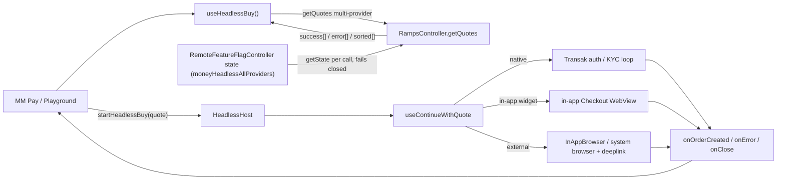

# Headless Buy: All Providers Support Plan

Take Headless Buy (and its MM Pay / Money Account consumer) from native-only to all-provider support in two shippable phases:

- **Phase 1** (implemented; in review) widens headless quoting behind one boolean remote flag, `moneyHeadlessAllProviders`, consumed by `RampsController` itself. The literal `true` widens the auto-selection quote path to every provider class (native, in-app WebView aggregator, external-browser / custom-action); anything else resolves native-only. Production serves `false`, so there is no user-facing change until the flag flips.
- **Phase 2** makes the external-browser and custom-action checkout paths headless-aware (they are quotable when the flag is `true`, but their continuation is not headless-aware until P2.M1-P2.M4), and adds granular LaunchDarkly provider control for QA (P2.M5).

Native-only is never broken: `false`, a missing flag, a non-boolean value, or an unwired flag read all resolve native-only.

Companion to [PLAN.md](./PLAN.md) (the original Headless Buy plan).

## Phases checklist

**Phase 1 - MVP (widened quoting behind the boolean flag):**

- [x] **P1.M0** - `failSession`-terminal must-fix (merged: mobile #32810)
- [ ] **P1.M1** - Widened quoting capability (widened auto-selection, reliability-then-price pick with fiat-limit enforcement in `RampsController`, default redirect URL, WebView fail-safe, per-provider smoke check, analytics tagging): core #9353 merged; mobile #32682 and the core #9409 / mobile #32890 rework in review
- [ ] **P1.M2** - Activation behind the boolean `moneyHeadlessAllProviders` remote flag, consumed controller-side (core #9409 / mobile #32890, in review)

**Phase 2 - External-browser + custom-action providers (Coinbase, PayPal, etc.):**

- [ ] **P2.M1** - Headless-aware `continueWidget` external-browser branch
- [ ] **P2.M2** - Headless deeplink path in `handleRampReturnUrl` + correlation record `{sessionId, walletAddress, chainId}`
- [ ] **P2.M3** - E1/E2/E3 reconciliation
- [ ] **P2.M4** - Custom-action (PayPal) support
- [ ] **P2.M5** - Granular LaunchDarkly provider control (optional allowlist companion flag, per-surface lists)
- [ ] **P2.M6** - Promote the pick to a public shared `getSmartSelectedQuote` (add back the order-history rung; extract `validateBuyAmount`)
- [ ] **P2.M7** - Typed errors + analytics parity for external-browser
- [ ] **P2.M8** - Retire Money V0 native-only scaffolding (deprecate/remove `restrictToKnownOrNativeProviders`)

**Deferred (after Phase 2):**

- [ ] TPC multi-provider wiring; DRY cleanup (UB2 becomes a dumb consumer); broad typed-error taxonomy on demand

P1.M0 was the precondition for everything else and has landed (mobile #32810): the terminal-callback contract fix is in before typed errors expand or any consumer relies on terminal outcomes. The OTP typed-code fix is native-flow-only and de-scoped (optional) for the Phase 1 MVP.

---

## Background

In-app vs external is knowable at the quote layer (before `getBuyWidgetData`), and the risk that drove the original phasing still stands: widening live quoting to providers whose checkout is not headless-aware can land users in the broken external-browser branch (silent BuildQuote reset, no terminal callback), making "user backed out" indistinguishable from "provider broke". The implemented design handles this through distribution rather than an in-app-only filter: the boolean flag stays `false` in production until the Phase 2 checkout work lands, and a `true` flag (QA / dev builds) accepts the external-branch gap in the meantime.

Context for the phasing decisions:

- The earlier "native-only for v0, disable aggregators" decision was time-boxed to the Money Account launch. Money Account has launched, so enabling in-app aggregators is in scope.
- Provider gating happens in the `RampsController` selection (the widened pick) that `getRampsQuote` consumes; the boolean `moneyHeadlessAllProviders` remote flag, read by the controller itself, is the distribution-layer control. MM Pay itself forwards no `providerIds` today (see the P1.M2 gate-composition note), so gating is not relied on there.
- Selection today is the private `#pickWidenedQuote` (renamed from `#pickInAppQuote` in core #9409) plus `#resolveProviderIdsForQuote`, reachable only via the `autoSelectProvider` / `restrictToKnownOrNativeProviders` widened path (used by TPC's `getRampsQuote`). The mobile headless `getQuotes` facade (`useHeadlessBuy.ts`) does not trigger that path, so selection is **currently forked**: the headless UI would re-derive ordering. There is no public shared `getSmartSelectedQuote` yet; P2.M6 promotes the pick into one and unifies both callers.
- PayPal and Robinhood are "checkout outside of MetaMask" (Phase 2). MoonPay and Revolut are top in-app providers in Phase 1 scope.

## Scope (full cross-repo)

Three layers. Phase 1 delivered the widened quote path and flag activation; Phase 2 finishes the checkout side.

- **`@metamask/core` - `TransactionPayController`** (MM Pay fiat quote path). `getRampsQuote` calls `RampsController:getQuotes` with `autoSelectProvider: true` and `restrictToKnownOrNativeProviders: true`, taking only `quotes.success?.[0]` (`packages/transaction-pay-controller/src/strategy/fiat/utils.ts`, `getRampsQuote` ~lines 95-131). With the flag `false` this is the native-only gate's quote-side enforcement; with the flag `true` the same call returns the widened pick at `success[0]` with no TPC change.
- **`@metamask/ramps-controller`** - home for the selection and the flag read. The pick is the private `#pickWidenedQuote` (renamed from `#pickInAppQuote` in core #9409) plus `#resolveProviderIdsForQuote`, reachable only via the `autoSelectProvider` / `restrictToKnownOrNativeProviders` widened path when `#isAllProvidersEnabled()` resolves the `moneyHeadlessAllProviders` flag to `true`; there is no public shared `getSmartSelectedQuote` yet. Phase 1 put the widened reliability-then-price selection and the controller-side flag read here; P2.M6 promotes the pick to a public `getSmartSelectedQuote` consumed by both callers.
- **`metamask-mobile`** - the native-only availability gates are relaxed in mobile #32682 / #32890 (`useHasNativeFiatProvider` for the confirmation screen, the relocated asset-aware `useRegionHasFiatProvider` for Money deposit entry, both fed the flag boolean by `useHeadlessAllProvidersEnabled`); own the in-app `Checkout` WebView fail-safe (Phase 1); consume the shared selection once P2.M6 lands; make `useContinueWithQuote`'s external-browser branch headless-aware plus typed errors, analytics, and navigation/session/deeplink policy (Phase 2).

---

## Design principles

Inherited from [PLAN.md](./PLAN.md), with two additions:

1. **Callbacks-only, three terminal events.** A session ends in exactly one of `onOrderCreated`, `onError`, `onClose`. No intermediate progress callbacks. Native Transak may surface auth/limit/KYC-specific typed errors, but non-native provider KYC stays inside the provider checkout unless it produces a terminal callback, cancellation, or load failure.
2. **The consumer renders all visible UI.** `useHeadlessBuy` is a behavior provider, not a UI provider.
3. **Callback-routing rule (new).** `onError` is reserved for technical / provider failures only. User-driven and consumer-driven exits terminate via `onClose`:
   - User in-flow exit (browser cancel, WebView close, back-press, inferred abandonment): `onClose({ reason: 'user_dismissed' })`.
   - Consumer programmatic cancel (`cancel()` / session replacement): `onClose({ reason: 'consumer_cancelled' })`.
   - `USER_CANCELLED` is retired for in-session exits (at most reserved for a pre-session cancellation error). Otherwise MM Pay cannot distinguish "user backed out" from "provider broke".
4. **The flag is the only native-only gate (new).** The native-only constraint lives only in `moneyHeadlessAllProviders` not resolving to the literal `true`; there is no native/known allowlist. `true` widens across provider classes, then ranks via the controller pick, promoted to `getSmartSelectedQuote` (see P2.M8).

---

## Quote-layer behavior (the foundation for filtering)

These facts make the widened pick and the phase split possible.

- **One `getQuotes` call, no client fan-out.** `RampsController.getQuotes()` returns `{ success[], sorted[], error[], customActions[] }`; multi-provider parallelism is server-side. A single provider failing is non-terminal (lands in `error[]`); other providers stay in `success[]`. Only HTTP / validation / malformed-shape failures reject the promise.
- **Custom actions ride inside `success[]`**, flagged by `quote.isCustomAction` (reads `quote.quote.isCustomAction`, `app/components/UI/Ramp/types/index.ts:43-45`). The separate `customActions[]` array is empty in UB2 usage. UB2 already excludes `isCustomAction` entries from provider/payment matching (`app/components/UI/Ramp/Views/Modals/ProviderSelectionModal/ProviderSelection.tsx:262-274`). The widened headless pick keeps them eligible when the flag is `true`; Phase 2 makes their continuation headless-aware (P2.M4).
- **Partial vs full failure** is computed over non-customAction `success[]` entries. Full failure (no usable entry) maps to `NO_QUOTES`; it is not `success.length === 0 && customActions.length === 0`.
- **In-app vs external is decided at the quote layer.** `getAggregatorRedirectConfig` reads `quote.quote?.buyWidget?.browser` and `isCustomAction` off the quote (`app/components/UI/Ramp/utils/buildQuoteWithRedirectUrl.ts:35-71`) and is called at `useContinueWithQuote.ts:249`, before `getBuyWidgetData` at `:257`. Custom actions and `buyWidget.browser === 'IN_APP_OS_BROWSER'` go to an external browser with a deeplink redirect; otherwise an in-app `Checkout` WebView with a callback-base redirect. Core #9409 owns this classification as pure exported predicates (`isExternalBrowserQuote`, `isCustomActionQuote`, `isInAppOnlyQuote`). The implemented pick does not pre-filter to in-app (external and custom quotes stay eligible when the flag is `true`), so the predicates matter at continuation-routing time, not as a quote-layer filter.
- **`buyWidget.browser` is optional.** Mobile still fetches the widget URL via the deprecated `buyURL` + `getBuyWidgetData` path, and an aggregator quote missing `buyWidget.browser` is classified in-app. So Phase 1 safety comes from two layers together: (1) the boolean flag, served `false` in production and failing closed on missing / non-boolean values or an unwired flag read, and (2) the selection in `RampsController` (`#pickWidenedQuote`, the pick that P2.M6 promotes to a public `getSmartSelectedQuote`) that `getRampsQuote` consumes, backed by the mandatory in-app `Checkout` WebView fail-safe.

### Selection (ordering like UB2)

Two existing UB2 behaviors:

- **Modal ordering** (`ProviderSelection.tsx:205-228`): reliability-only sort of providers-with-quotes.
- **Recommendation ladder** (legacy `app/components/UI/Ramp/Aggregator/hooks/useSortedQuotes.ts:43-69`): previously-used provider, then reliability, then price.

Phase 1 needs only reliability-then-price to pick one quote for the MM Pay MVP, so the order-history rung is cut from Phase 1. Selection today is the private `#pickWidenedQuote` plus `#resolveProviderIdsForQuote`, reachable only via the `autoSelectProvider` / `restrictToKnownOrNativeProviders` widened path that TPC's `getRampsQuote` uses (and only when the flag is `true`); the mobile headless `getQuotes` facade (`useHeadlessBuy.ts`) does not trigger it, so selection is currently forked and the headless UI would re-derive ordering. The order-history rung lives in the controller (`#getPreferredProviderIdsFromOrders` / `#resolveProviderIdsForQuote`) but is `#private` and runs only in the single-provider auto-select branch; the all-provider path never invokes it. P2.M6 promotes the pick to a public shared `getSmartSelectedQuote` and adds the order-history rung back when there is a real returning-user requirement.

### Routing and KYC, native vs non-native

`useContinueWithQuote` branches on `isNativeProvider(quote)` (`app/components/UI/Ramp/types/index.ts:33-35`). Native uses the Transak auth/KYC loop (`useTransakRouting`); KYC is fully in-app (NativeFlow screens plus Transak APIs). Non-native fetches `getBuyWidgetData` then opens either an in-app `Checkout` WebView or an external browser; KYC happens inside the provider WebView/browser and MetaMask only learns the outcome at callback / deeplink time.

In-app success is detected via `getOrderFromCallback` on the callback URL. External success returns via iOS `InAppBrowser.openAuth` result or an Android deeplink (`handleRampReturnUrl`), both handled in Phase 2.

---

## UB2 behavior to preserve

- The `QuotesResponse` contract `{ success, error, sorted, customActions }` from `@metamask/ramps-controller`.
- Provider-level quote errors are non-terminal: surfaced as partial errors, terminal only when every provider fails or no usable quote can be selected.
- Existing UB2 quote ordering, recommended-quote selection, WebView retry behavior, and OrderDetails routing remain unchanged (regression-tested).

---

## Must-fix precondition: terminal-callback contract (P1.M0)

Landed in mobile #32810. `failSession` used to fire `onError(...)` then `closeSession({ reason: 'unknown' })`, which fired `onClose(...)` (`app/components/UI/Ramp/headless/sessionRegistry.ts:235-264`). MM Pay's `onClose` cleared the error set by `onError` (`app/components/Views/confirmations/hooks/pay/useFiatConfirm.ts:129-132` calls `setHeadlessBuyError(undefined)`), so the error was lost.

**Contract:** `onError` is terminal on its own. `failSession` sets the terminal status (`failed`) and removes the session from the registry directly, without invoking `onClose`. A session ends in exactly one of `onOrderCreated`, `onError`, or `onClose`, with no pairing. `onClose` remains terminal only for `user_dismissed` / `consumer_cancelled` / `completed`.

Confirm with MM Pay before building broad typed errors: if MM Pay relies on a single cleanup hook regardless of outcome, instead carry the `HeadlessBuyError` on the close info and fire one `onClose({ reason: 'errored', error })` after `onError`. Default is the no-trailing-`onClose` contract unless MM Pay asks for the cleanup variant.

The OTP typed-code fix (stop force-mapping `nativeFlowError` to `AUTH_FAILED` in `HeadlessHost.tsx:136-147`) is native-flow-only and de-scoped (optional) for the Phase 1 MVP.

---

## Architecture at a glance



With the flag `false` (production today) only the `native` branch is reachable. With the flag `true` all three branches are quotable; the `external` branch's continuation is made headless-aware in Phase 2, so until then a `true` flag is for QA / dev builds only.

---

## Phase 1 - MVP: widened quoting behind `moneyHeadlessAllProviders`

Ships with the flag served `false` in production (native-only, no user-facing change); dev and QA builds activate widening through the Settings feature-flag override or an LD environment serving `true`.

### P1.M0 - `failSession` terminal (done: mobile #32810)

`failSession` (`sessionRegistry.ts:235-264`) used to call `closeSession({ reason: 'unknown' }, { terminalStatus: 'failed' })` after `onError`, and MM Pay (`useFiatConfirm.ts:123-132`) cleared the error in its `onClose` handler. The fix, merged in mobile #32810: `failSession` sets the terminal status and removes the session directly, without invoking `onClose`. See the must-fix precondition section for the full contract.

Tests (landed with #32810): `failSession` fires exactly one `onError` and no `onClose`; the session is removed from the registry; the MM Pay consumer retains the error after a failure.

### P1.M1 - Widened quoting capability

Implemented across core #9353 (merged), mobile #32682 (in review), and the core #9409 / mobile #32890 rework (in review).

- **Widened auto-selection in `RampsController`.** When the flag resolves `true`, the `autoSelectProvider` / `restrictToKnownOrNativeProviders` path quotes every supporting provider server-side and returns the single best quote at `success[0]`, so TPC's `getRampsQuote` picks it up at `success?.[0]` with no Confirmations change. The existing `getProviders` hydration fallback keeps an empty catalog from silently quoting nothing.
- **The pick.** The private `#pickWidenedQuote` (named `#pickInAppQuote` in core #9353; renamed in core #9409) orders by reliability then price using the server-provided `sorted`, and enforces per-provider fiat limits up front. External-browser and custom-action quotes stay eligible when the flag is `true`: the #9353 in-app-only exclusion was removed together with the `in-app` scope value, so there is no in-app pre-filter (continuation for those quotes becomes headless-aware in Phase 2).
- **Default redirect URL.** MM Pay's quote fetch omits `redirectUrl`, which left aggregator quotes without a buy-widget URL ("No widget URL available for provider", TRAM-3698). `RampsController`'s `getDefaultRedirectUrl` option (core #9353, wired in mobile #32682) fills it on the widened path; an explicit caller `redirectUrl` still wins.
- **Relaxed availability gates.** The Money "Add funds" entry gate was native-only, hiding the button in aggregator-only regions. Mobile #32682 moved the gate into the Ramp tree as the asset-aware `useRegionHasFiatProvider` (plus `useMoneyAccountDepositAssetId` / `getMoneyAccountDepositAssetId`) and made `useHasNativeFiatProvider` widening-aware; mobile #32890 has both feed the flag boolean into core's `regionHasProviderForAsset` / `isFiatDepositAvailable`.
- **WebView fail-safe.** A quote omitting `buyWidget.browser` is classified in-app and routes to the in-app `Checkout` WebView, so the real safety net is the WebView's terminal-failure path: `Checkout`'s `onHttpError` / load-failure routes through `failHeadlessCheckout` -> `failSession` (`app/components/UI/Ramp/Views/Checkout/Checkout.tsx` ~241), producing a clean terminal `onError` rather than a stranded session (terminal contract from P1.M0).
- **Per-provider WebView smoke check.** The set of providers hitting the in-app `Checkout` WebView is new. Keep a smoke check per newly-enabled in-app provider, including `getQuoteBuyUserAgent` custom-user-agent needs (`app/components/UI/Ramp/types/index.ts` ~81-87). Verified on-device so far for the UK / Brazil aggregator path (mobile #32682).
- **Analytics tagging.** Confirm the existing `RAMPS_CHECKOUT_CLOSED` / `RAMPS_ORDER_FAILED` instrumentation in `Checkout.tsx` already tags `ramp_type: 'HEADLESS'` for the new providers (full external-browser parity stays Phase 2, P2.M7).
- **Min/max limits.** Decided and implemented controller-side: the pick enforces per-provider fiat limits up front (kept through the #9409 rework), so an out-of-limits provider is never selected. The up-front UI limit display (`app/components/UI/Ramp/hooks/useRampsBuyLimits.ts` ~15-20, 42-50) still reads the native preferred provider and remains a known gap for non-native providers.

Tests: multi-provider request returns multiple candidates; the pick orders reliability-then-price and rejects out-of-limits quotes; partial failure keeps usable candidates plus `error[]`; full failure maps to `NO_QUOTES`; a quote missing `buyWidget.browser` routes to the in-app WebView and a load failure fires `failSession`; per-provider WebView smoke check.

### P1.M2 - Activation behind the boolean `moneyHeadlessAllProviders` flag

Implemented in core #9409 / mobile #32890 (in review). This replaces both the multi-value scoped design this section originally specified (`off | in-app | all`, the `ProviderScope` type, the `getProviderScope` constructor injection from core #9353) and the interim client-side gate from mobile #32682 (the persisted `fiatOrders.providerScope` Redux setting, `getEffectiveProviderScope` / `useFiatProviderScope` with the production hard-off, and the HeadlessPlayground provider-scope toggle). All of that is deleted.

- **One boolean remote flag, not a multivariate scope.** Key `moneyHeadlessAllProviders` (exported as `MONEY_HEADLESS_ALL_PROVIDERS_FLAG_KEY`). The literal `true` widens auto-selection quoting to every provider class; `false`, missing, or any non-boolean value resolves native-only, in every environment. There is no in-app-only intermediate state. A distinct flag is still required because the existing `MetaMaskPayFiatFlags` cannot scope provider-widening (`enabledTransactionTypes: []` kills all fiat; `app/selectors/featureFlagController/confirmations/index.ts:87-90`), and this flag's non-`true` fallback is native-only, not "no fiat".
- **Consumed in core, not mobile.** `RampsController` resolves the flag itself, per auto-selection `getQuotes` call, via the `RemoteFeatureFlagController:getState` messenger action (private `#isAllProvidersEnabled()`), so remote fetches and dev overrides take effect at runtime. The read fails closed: an undelegated action means native-only.
- **Mobile is a dumb pass-through.** `useHeadlessAllProvidersEnabled` feeds `RemoteFeatureFlagController` state into the core-exported `isHeadlessAllProvidersEnabled(remoteFeatureFlagState)` helper (core #9409's new `featureFlags.ts`); `useHasNativeFiatProvider` / `useRegionHasFiatProvider` pass the resulting boolean into the core availability helpers. No flag-interpretation logic lives in mobile, so the UI gates and the controller cannot drift.
- **Dev override, no playground toggle.** The core helper merges `localOverrides` over `remoteFeatureFlags`, so Settings > Feature flag override (available when `METAMASK_ENVIRONMENT !== 'production'`) flips the flag for both the UI gates and the controller widening.
- **Gate composition.** The flag is the kill switch; within that, the `RampsController` pick (the private `#pickWidenedQuote`, which `getRampsQuote` consumes; promoted to the public `getSmartSelectedQuote` in P2.M6) is the quote-side enforcement. Note: MM Pay CAN pass `providerIds` but does not today (leftover artifact; consumers have no provider preferences). `getRampsQuote` calls `RampsController:getQuotes` with `autoSelectProvider: true` + `restrictToKnownOrNativeProviders: true` and forwards no `providers` / `providerIds`; the headless `getQuotes` facade CAN take `providerIds`, but MM Pay calls `startHeadlessBuy` (whose `HeadlessBuyParams` has no `providerIds`), so it never reaches that facade. Turning `providerIds` into a real gate would need net-new plumbing: either `getRampsQuote` forwards a `providers` allowlist, or MM Pay routes through the headless `getQuotes`. P2.M5 takes the LaunchDarkly route instead.

Tests: with the flag `true`, non-native quotes reach the consumer and complete via the in-app `Checkout` WebView callbacks; with `false`, missing, or a garbage value, behavior is identical to today's native-only; `localOverrides` wins in both directions; an unwired `RemoteFeatureFlagController:getState` fails closed to native-only.

### Phase 1 acceptance criteria

- A user can complete a Transak (Aggregator) buy in Brazil end to end through the headless flow.

---

## Phase 2 - External-browser and custom-action providers (Coinbase, PayPal, etc.)

Makes the external/custom checkout paths headless-aware (the flag already quotes them when `true`; their continuation is not headless-aware yet), and adds granular LaunchDarkly provider control for QA (P2.M5).

**Cross-repo precondition.** The committed base delivered by core #9409: the shared pure helpers (`featureFlags`, `providerAvailability`, `quoteClassification`, `errorNormalization`), the controller-side `moneyHeadlessAllProviders` read (`#isAllProvidersEnabled()` via `RemoteFeatureFlagController:getState`), and `#pickWidenedQuote`. Core #9409 is a breaking `@metamask/ramps-controller` major (16.0.0; `getProviderScope` and `ProviderScope` are removed), and mobile #32890 consumes it as the npm preview `@metamask-previews/ramps-controller@15.1.0-preview-68fc14e1c` until it publishes. Phase 2's core additions (the public `getSmartSelectedQuote`, `validateBuyAmount()`, and the P2.M8 gate re-keying) ship as a follow-on PR stacked on #9409, following the core-publish-then-mobile-bump sequence (a preview build to consume it, then RC to lock the version). Re-run the "export reality check" (see P2.M7) against `origin/main` at implementation time, since the exported surface can change before this lands.

**Core / mobile boundary.** Core owns only provider-agnostic pure helpers: flag resolution (`isHeadlessAllProvidersEnabled`), classification, callback-to-order resolution, error extraction, quote selection, and amount validation. Mobile keeps deeplink schemes, correlation records, navigation, dismissal/focus timing, analytics wiring, and the error-code taxonomy values; it feeds core the `RemoteFeatureFlagController` state but interprets no flag itself.

### P2.M1 - Make `continueWidget`'s external-browser branch headless-aware

Thread `ctx.headlessSessionId` into the external-browser branch (`app/components/UI/Ramp/hooks/useContinueWithQuote.ts:289-335`) so it routes to terminal callbacks instead of `navigateAfterExternalBrowser` to BuildQuote / OrderDetails (`app/components/UI/Ramp/utils/rampsNavigation.ts:50-75`):

- iOS `InAppBrowser.openAuth` success (today calls `navigateAfterExternalBrowser({ returnDestination: 'order', ... })`, lines 325-330): resolve into `onOrderCreated`. This is not headless-aware today; iOS external success is not "already handled".
- Cancel: `onClose({ reason: 'user_dismissed' })`.
- Error / open-rejection: `failSession`.

**Redirect URL source of truth.** `getQuotes` accepts a `redirectUrl` override, but `HeadlessHost` does not pass `HeadlessBuyParams.redirectUrl` into `useContinueWithQuote`, and `continueWidget` recomputes the redirect via the mobile redirect-policy util. Decision: the mobile redirect-policy util (`getWidgetRedirectConfig` / `getAggregatorRedirectConfig`) is the source of truth at continuation; `HeadlessBuyParams.redirectUrl` is an optional override that must be threaded from the session onto `ContinueWithQuoteContext` and honored when present. The quote-fetch and continuation redirect URLs resolve from this same rule so they cannot diverge.

Observability is only partial:

- **iOS `InAppBrowser.openAuth`**: returns success / cancel / error synchronously; must be resolved into the headless callbacks above.
- **`Linking.openURL` (Android / no InAppBrowser)**: only the OPEN failure is catchable (promise rejection fires `failSession`); provider page load is unobservable.
- **Android / system browser**: provider-side load failure is unknowable; success arrives via deeplink; abandonment is inferred via the existing dismissal machinery.

Tests: each branch routes to the correct terminal callback; iOS `openAuth` success fires `onOrderCreated`; cancel fires `onClose({ reason: 'user_dismissed' })`; open-rejection fires `failSession`.

### P2.M2 - Give `handleRampReturnUrl.ts` a headless path

Today `handleRampReturnUrl` only parses `orderId` and navigates to `RAMPS_ORDER_DETAILS`. The redirect URL is `metamask://on-ramp/providers/${providerCode}` (`buildQuoteWithRedirectUrl.ts`, `getProviderDeeplinkRedirectUrl` ~lines 27-28), so the deeplink carries the provider code in its path but not the wallet address, chainId, or session id.

Provider-agnostic callback-to-order resolution already exists as `RampsController:getOrderFromCallback`, so no new core helper is needed here. The only new pieces are mobile: the deeplink-scheme parsing (`providerCode` from `metamask://on-ramp/providers/...`) and the correlation record; both stay mobile-side.

1. At external-browser launch (P2.M1), record a pending correlation in the session registry: `{ sessionId, walletAddress, chainId }`. The session registry holds the single active session, so the active session id is the correlation key; do not rely on the deeplink to carry it. Reconcile this with the existing `addPrecreatedOrder({ orderId, providerCode, walletAddress, chainId })` correlation already used in `useContinueWithQuote.ts` rather than treating correlation as greenfield: prefer extending or reusing that record over adding a parallel one.
2. On deeplink return, `handleRampReturnUrl` checks for an active headless session. If one exists and is `continued`, take the headless path: resolve the order via `RampsController:getOrderFromCallback` using the `providerCode` from the deeplink path plus `walletAddress` from the correlation record (plus any `orderId` from the query), then fire `onOrderCreated` and end the session. No active session means today's behavior (navigate to `RAMPS_ORDER_DETAILS`).
3. Build on the cached / internal order-id resolution (mobile #32372 `app/components/UI/Ramp/hooks/useRampsOrders.ts`, core #9159) rather than re-deriving order lookup.

Core-vs-mobile split: core already owns the provider-agnostic callback-to-order resolution (`RampsController:getOrderFromCallback`). The deeplink-scheme parsing, correlation record, deeplink routing, and focus-dismissal pre-emption stay mobile-side.

Tests: shared callback resolver returns identical results for `Checkout` and `OrderDetails`; a deeplink return with a live `continued` session fires `onOrderCreated`; a no-order deeplink with no live session falls back to `RAMPS_ORDER_DETAILS`; native loop unchanged (regression).

### P2.M3 - E1/E2/E3 reconciliation (money-losing if skipped)

All three reuse the EXISTING dismissal machinery `HeadlessHost` wires (`app/components/UI/Ramp/Views/HeadlessHost/HeadlessHost.tsx:86-99`: `useHeadlessSessionDismissal`, `useHeadlessSessionFocusDismissal`, the `beforeRemove` listener), not a parallel grace timer.

- **E1 - iOS `openAuth` success resolves into `onOrderCreated`** (covered by P2.M1), never silently lands on `RAMPS_ORDER_DETAILS`.
- **E2 - A success deeplink must win even if the session was already dismissed or GC'd.** MM Pay's two-step intent transaction is gated on `onOrderCreated` (`useFiatConfirm.ts:112-122`), so a real fiat order can complete (the user paid) while the intent leg never fires if focus-dismissal, the `beforeRemove` listener, or the 1-hour stale GC (`STALE_SESSION_TTL_MS`, `sessionRegistry.ts:110`) terminated the session first. Rule: a success deeplink completes the order through `onOrderCreated` (re-opening or directly completing the dismissed session). Only a deeplink with no recoverable success and no live session falls back to `RAMPS_ORDER_DETAILS`.
- **E3 - Pre-empt the existing zero-delay focus-dismissal timer.** On re-focus, `useHeadlessSessionFocusDismissal` schedules dismissal via `setTimeout(..., 0)` (`useHeadlessSessionFocusDismissal.ts:51`) and bails if the session is gone or the focus / session id changed. Ensure a real deeplink-success terminates the session before, or takes precedence over, focus-dismissal; it does not emit `onError`, and `cancel()` plus stale-session GC remain backstops. Open product decision: whether the zero-delay focus dismissal needs a deliberate grace delay to avoid racing a slow-but-successful deeplink; record the chosen behavior before implementation.

Tests: E1 iOS `openAuth` success completes via `onOrderCreated`; E2 a success deeplink after dismissal still completes via `onOrderCreated`; E3 a deeplink-success pre-empts focus-dismissal so a slow-but-successful return is not closed as `user_dismissed`.

### P2.M4 - Custom-action (PayPal) support

The controller side is already implemented: `#pickWidenedQuote` keeps custom-action / external quotes eligible when the flag is `true` (core #9409). So the remaining work is mobile continuation routing, made headless-aware by P2.M1.

Bring `isCustomAction` quotes into scope on the checkout side: route their continuation through the now-headless-aware external/custom path (custom-action flows always use the system / in-app browser), branching on the #9409 predicates `isCustomActionQuote` / `isInAppOnlyQuote`. Typed errors and analytics are covered by P2.M7.

Tests: a custom-action quote is selectable, continues through the external CTA path, and terminates via `onOrderCreated` / `onClose` / `failSession`.

### P2.M5 - Granular LaunchDarkly provider control

The original milestone here ("widen via the flag's `all` value") is obsolete: there is no `all` value, and the boolean `moneyHeadlessAllProviders` already covers widening (P1.M2). What is missing is a way for QA to force a specific provider mix (for example external-browser-only) without a code change per test configuration. This milestone adds one-time client support for an optional companion flag; after it lands, every test-mix change is a LaunchDarkly dashboard edit only.

- **Companion flag, not a JSON evolution of the boolean.** Add `moneyHeadlessProviderAllowlists` (JSON) next to the boolean. Keeping the boolean untouched preserves its shipped kill-switch semantics (only the literal `true` enables; everything else fails closed) and keeps test-mix edits from ever touching the production kill switch. Evolving `moneyHeadlessAllProviders` itself into a JSON variation was considered and rejected: shipped clients coerce any non-boolean value to `false`, so the same key cannot serve JSON to new clients without turning widening off for old ones.
- **Payload shape.** A top-level provider-id allowlist plus optional per-surface lists, keyed by consumer surface (money account, perps, predictions), so each surface's test matrix can be tuned independently:

  ```json
  {
    "providerIds": ["/providers/moonpay", "/providers/coinbasepay"],
    "surfaces": {
      "money": ["/providers/transak"],
      "perps": ["/providers/coinbasepay"],
      "predictions": ["/providers/paypal"]
    }
  }
  ```

- **Semantics.** The boolean stays the gate: flag `false` is native-only regardless of the companion. With the boolean `true`: a companion that is absent, empty, or malformed means no restriction (today's all-providers behavior); a companion that is present means the pick (`#pickWidenedQuote`, later `getSmartSelectedQuote`) drops candidates whose provider id is not listed; a surface entry overrides the top-level list for that surface; unknown keys and non-string entries are ignored (the same defensive coercion style as `isHeadlessAllProvidersEnabled`).
- **Client support (one-time).** Core: a pure `getHeadlessProviderAllowlist(remoteFeatureFlagState, surface?)` next to `isHeadlessAllProvidersEnabled` in `featureFlags.ts` (merging `localOverrides` the same way), plus an allowlist filter in the widened pick. Mobile: thread an optional surface tag through the headless `getQuotes` params, reusing the `ramp_surface` vocabulary. No other mobile logic.
- **LD-dashboard-only afterwards.** Once this support ships, an external-browser-only pass is "list only external-browser provider ids for that surface" in the LD dashboard; per-surface matrices are independent LD edits; no client release per configuration.

Tests: no companion means selection identical to today's flag-`true` behavior; a top-level list restricts candidates; a surface list overrides the top-level list for that surface only; malformed payloads are ignored; the boolean `false` stays native-only regardless of the companion.

### P2.M6 - Promote the pick to a public shared `getSmartSelectedQuote`

Selection today is the private `#pickWidenedQuote` plus `#resolveProviderIdsForQuote`, reachable only via the `autoSelectProvider` / `restrictToKnownOrNativeProviders` widened path (and only when the flag is `true`); the mobile headless `getQuotes` facade does not trigger it, so selection is currently forked. This milestone unifies it.

- **Promote the pick.** Promote `#pickWidenedQuote` to a public pure `getSmartSelectedQuote(response, { allProvidersEnabled, amount, fiat, providers, preferredProviderIds })` in a new core `@metamask/ramps-controller` module, shipped as a follow-on PR stacked on core #9409. Reuse the #9409 `isInAppOnlyQuote` / `isCustomActionQuote` predicates for classification, and honor the P2.M5 allowlist when present.
- **Ranking.** Rank `preferredProviderIds -> reliability -> price -> first`. Inject the order-history preference as a ranking rung; the source `#getPreferredProviderIdsFromOrders` stays controller-side and is fed in as `preferredProviderIds` (added back when there is a real returning-user requirement).
- **Make the headless path consume it.** Require the mobile headless `getQuotes` to trigger the shared pick (pass `autoSelectProvider: true` or a `smartSelect` option, or call a `RampsController:getSmartSelectedQuote` action) so the UI never sorts or ranks locally.
- **Extract amount validation.** Extract the limit-fit check as a public pure `validateBuyAmount()` / `fitsProviderLimits()` (currently inlined in `#pickWidenedQuote`).

Tests: ladder order with and without preferred provider ids; deterministic output for UB2 and MM Pay callers; the mobile headless path and `getRampsQuote` produce identical selection from the same response; `validateBuyAmount()` / `fitsProviderLimits()` accept and reject at provider-limit bounds.

### P2.M7 - Typed errors + analytics parity for external-browser

- Emit `NO_QUOTES` and `QUOTE_FAILED` for technical / quote failures (widget-URL, load, callback-parse, order-lookup, external-open). Depends on the P1.M0 terminal-callback contract.
- Route user exits to `onClose` per the callback-routing rule. Do not emit `USER_CANCELLED` for in-flow exits. An empty callback query is a user-exit: `Checkout.tsx:386-393` already treats it as `closeSession({ reason: 'user_dismissed' })`.
- Bring external-browser providers to analytics parity: `RAMPS_CHECKOUT_CLOSED` (abandon), `RAMPS_ORDER_FAILED` (in-flow), provider cancellation, and HTTP / load failures, tagged `ramp_type: 'HEADLESS'` plus `ramp_surface`. Note: today MM Pay / TPC detects an order's terminal state by polling `RampsController:getOrder` (in `transaction-pay-controller` `strategy/fiat/fiat-submit.ts`), not via a `RampsController:orderStatusChanged` subscription. The headless session ends at `onOrderCreated` (order created); the order's terminal state is observed afterward by that TPC polling. So hanging Phase 2 analytics off `orderStatusChanged` would be new subscription work, not existing behavior.
- **Export reality check.** On core `origin/main`, `@metamask/ramps-controller`'s `index.ts` exports `getTransakApiMessage`, `isTransakPhoneRegisteredError`, and `RAMPS_ERROR_CODES` / `RampsErrorCode`, but `RAMPS_ERROR_CODES` currently holds only `CIRCUIT_BREAKER_OPEN`, so mapping the mobile headless taxonomy onto core codes is effectively a no-op today. Instead reuse the #9409 error helpers: `sessionRegistry.ts`'s `toHeadlessBuyError` already uses `extractExplicitTypedError` / `getErrorMessage`, and P2.M7 can use `normalizeToTypedError` (available but not yet consumed) for the new external-browser failure sites. Keep the `HeadlessBuyErrorCode` union and the `LimitExceededError` special-case mobile-side. `TRANSAK_ERROR_CODES` / `TransakErrorCode` remain unexported (they exist in `packages/ramps-controller/src/transakErrorCodes.ts`); add the export as a small core sub-task only if a consumer must branch on them. Re-verify against `origin/main` before relying on it.
- **Scope the taxonomy.** Granular provider codes (e.g. `KYC_REQUIRED`) are implement-on-demand: add a code when a consumer needs to branch on it.

### P2.M8 - Retire Money V0 native-only scaffolding

`restrictToKnownOrNativeProviders` (added for headless-buy v0; set in TPC `getRampsQuote`, consumed across `RampsController.getQuotes` and `#resolveProviderIdsForQuote`) is a native/known allowlist that the `moneyHeadlessAllProviders` flag plus `getSmartSelectedQuote` ranking now supersede.

- **Make the flag the sole gate.** On the core follow-on (stacked on #9409, with P2.M6): make the controller's `moneyHeadlessAllProviders` read the sole gate (not `true` = native-only kill switch; `true` = widen, then `getSmartSelectedQuote`). The widening gate itself already runs on `#isAllProvidersEnabled()` (core #9409); re-key the empty-response guard and any remaining `restrictToKnownOrNativeProviders` checks off the flag read, and mark the option `@deprecated` while still honoring it for one release.
- **Migrate TPC.** Migrate TPC `getRampsQuote` off `restrictToKnownOrNativeProviders` + `success[0]` onto the shared selection (this absorbs the deferred "Wire TPC to consume multi-provider quotes" item).
- **Remove the option.** Remove the option in a later `@metamask/ramps-controller` major once no consumer passes it (a breaking change with its own release). Keep `autoSelectProvider`, `#filterProviderIdsBySupport` support filtering, and the native / preferred rungs.
- **Sequencing.** Split the sub-steps by dependency. The `@deprecated` marking plus re-keying the empty-response guard off the flag read do not need `getSmartSelectedQuote`, so that sub-step can land first (the widening itself already runs on the flag since core #9409). The TPC migration onto the shared pick depends on P2.M6. Overall order: core deprecate + re-key + preview, then P2.M6 lands the shared pick, then TPC / mobile migrate onto it, then core RC, then the core major removal.

Tests: a `false` or missing flag still resolves native-only after `restrictToKnownOrNativeProviders` is deprecated; TPC picks the ranked survivor under partial failure; deleting the option changes no native-only behavior.

Mobile rename debt (optional, deferred): `useHasNativeFiatProvider` is misnamed (it returns flag-aware availability), and `useIsFiatPaymentAvailable.ts` carries a stale "native-only for v0" comment.

---

## Deferred (after Phase 2)

Not required to ship all-provider support behind the `moneyHeadlessAllProviders` flag; several refactor working code with regression risk.

### Wire TPC to consume multi-provider quotes

Promoted into P2.M8 (Step B of the flag deprecation): TPC `getRampsQuote` migrates off `restrictToKnownOrNativeProviders` + `success[0]` onto the shared selection there.

### DRY cleanup (UB2 UI becomes "dumb")

Deferred until after Phase 2 activation is stable; refactors working UB2 code (regression risk) with no production benefit before all-providers ships.

- **Move to core (`@metamask/ramps-controller`), pure only:** quote selection / recommendation ladder is promoted into P2.M6 (the public `getSmartSelectedQuote`); it is not shared or public today. Callback-to-order resolution is already core via `RampsController:getOrderFromCallback`, so only mobile deeplink-scheme parsing stays mobile. Status classification and bailed-status checks. `validateBuyAmount()` comes along with the P2.M6 selection extraction, not as separate work here.
- **Keep in shared mobile Ramp utils:** platform redirect policy and deeplink-scheme construction (`buildQuoteWithRedirectUrl.ts`); all navigation / session behavior. Core must not learn mobile deeplink schemes (unless the controller API is extended to accept redirect / browser options, in which case the browser-mode decision can move down).
- Still deferred: the broad BuildQuote / ProviderSelection dumb-consumer refactor and the broad typed-error taxonomy.

Tests: UB2 regression proves ordering, recommended selection, WebView retry, and OrderDetails routing are unchanged after extraction.

### Broad typed-error taxonomy on demand

Beyond P2.M7, the broader provider-code taxonomy stays implement-on-demand. The native-flow OTP typed-code fix (de-scoped from P1.M0) rides along here.

---

## Test plan (consolidated)

- ramps-controller / core: all-provider quote requests, partial failures, all-provider failures, the reliability-then-price pick (today the private `#pickWidenedQuote` consumed by `getRampsQuote` when the flag is `true`; promoted to the public `getSmartSelectedQuote` in P2.M6, consumed by both `getRampsQuote` and the mobile headless path once it lands), and the flag read (widening on/off, `localOverrides` both directions, garbage values coerced to `false`, unwired messenger action fails closed).
- Transaction Pay: the widened selector picking the recommended successful ramps quote and ignoring provider-level failures when another quote succeeds.
- Phase 1 mobile: the flag pass-through (`useHeadlessAllProvidersEnabled` feeding the core availability helpers), in-app `Checkout` WebView fail-safe (`failHeadlessCheckout` -> `failSession`), per-provider WebView smoke check, analytics tagging.
- Phase 2 mobile: `useContinueWithQuote` external-browser branch, `HeadlessHost`, external-browser deeplink return, E1/E2/E3 reconciliation, custom-action continuation.
- UB2 regression: quote ordering, recommended quote selection, WebView retry behavior, and order-details routing unchanged.
- Analytics: `RAMPS_CHECKOUT_CLOSED`, `RAMPS_ORDER_FAILED`, provider cancellation, checkout HTTP / load failures, and order terminal failed / cancelled events.

---

## Open risks and assumptions

Assumptions:

- Ship behind the boolean `moneyHeadlessAllProviders` remote flag: only the literal `true` widens; `false`, missing, or a non-boolean value keeps native-only working, and the controller's flag read fails closed if `RemoteFeatureFlagController:getState` is not delegated (P1.M2). No new product flag beyond this kill switch unless product asks; the P2.M5 allowlist companion is a QA control, not a product flag.
- Headless consumers still receive only terminal callbacks: `onOrderCreated`, `onError`, `onClose`.
- System-browser external checkout cannot be observed synchronously; rely on deeplink return for success, `Linking.openURL` rejection for open failure, and the existing focus-dismissal machinery for inferred cancellation (Phase 2).
- Provider quote failures are surfaced as partial errors, terminal only when every provider fails or no quote can be selected.

Risks:

- `buyWidget.browser` is optional, so an aggregator quote missing it is classed in-app and routed to the `Checkout` WebView; Phase 1 safety relies on the flag staying `false` in production plus the WebView fail-safe (P1.M1).
- Cross-repo sequencing (core publish before mobile bump) for the shared `RampsController` selection.
- Android foreground-without-callback heuristic reliability (built on the existing focus-dismissal) and whether it needs a deliberate grace delay (Phase 2).
- Slow-but-successful deeplink returning after the session was dismissed: the fiat order completes but `onOrderCreated` never fires and MM Pay's gated two-step intent leg never runs, losing money unless the success-deeplink-wins rule (P2.M3, E2) is implemented.

---

## Out of scope

- Sell flow parity (headless Sell is a follow-up).
- Non-React / imperative global consumers.
- Wholesale migration of BuildQuote to the headless primitives.
- Exporting `useHeadlessBuy` outside of Ramp.
