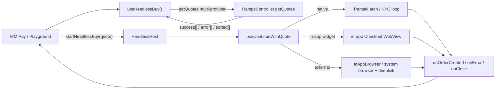

# Headless Buy: All Providers Support Plan

> Take Headless Buy (and its MM Pay / Money Account consumer) from native-only to all-provider support: multi-provider quoting, headless-aware non-native checkout (in-app WebView and external-browser providers), typed error outcomes, analytics parity, and DRY shared logic between Unified Buy v2 (UB2) and Headless Buy. The native-only gate stays closed in production the entire time we build; widening to all providers happens last, behind a flag.

This is a companion to [PLAN.md](./PLAN.md) (the original Headless Buy plan) and follows its style.

## Phases checklist

Phases 1 to 8 are capability work, built behind the still-closed native-only gate and exercised only via the dev playground plus unit/integration tests. Phase 9 is the only production-widening phase, flag-gated, landing last.

- [ ] **Phase 1** - All-provider quoting capability (gated, NOT activated)
- [ ] **Phase 2** - Shared quote selection / recommendation helper
- [ ] **Phase 3** - WebView + external-browser headless support (pulled early)
- [ ] **Phase 4** - Native and non-native routing alignment
- [ ] **Phase 5** - MM Pay (`TransactionPayController`) integration (dormant behind the gate)
- [ ] **Phase 6** - Typed error handling
- [ ] **Phase 7** - Analytics parity
- [ ] **Phase 8** - DRY cleanup (UB2 UI becomes "dumb")
- [ ] **Phase 9** - Activation / rollout (flag-gated gate-flip)

Pre-phase: a terminal-callback contract fix (see Must-fix preconditions) must land before typed errors expand.

---

## Scope (confirmed: full cross-repo)

Enabling all providers spans three layers, and this plan documents all three as coordinated phases:

- **`@metamask/core` - `TransactionPayController`** (the MM Pay fiat quote path). `getRampsQuote` calls `RampsController:getQuotes` with `autoSelectProvider: true` + `restrictToKnownOrNativeProviders: true` and takes only `quotes.success?.[0]` (source: `packages/transaction-pay-controller/src/strategy/fiat/utils.ts`, around lines 61 to 78). This is the native-only gate's quote-side enforcement.
- **`@metamask/ramps-controller`** - home for the shared, PURE quote filter/sort/recommend helper and pure callback parsing/status helpers.
- **`metamask-mobile`** - relax the native-only availability gate (`useIsFiatPaymentAvailable`, lines 19 to 23; `useHasNativeFiatProvider`, lines 23 to 26); make `useContinueWithQuote`'s external-browser branch headless-aware; typed errors; analytics; DRY; and own all navigation/session and redirect/deeplink policy.

---

## Sequencing and safety: capability vs activation

**Risk:** removing the native-only gate early would route live MM Pay / HeadlessBuy users to aggregator / external-browser quotes before the logic to handle them (Phases 3, 4, 6, 7) exists, landing them in the broken external-browser branch (silent BuildQuote reset, no terminal callback). That is the "user backed out vs provider broke" confusion we must avoid.

**Rule:** the native-only gate stays CLOSED for production the entire time we build capability. We never widen what real users get until the supporting logic is in and verified.

- **Capability phases (1 to 8)** add all-provider quoting, selection, external-browser headless support, typed errors, and analytics, but are exercised only via the dev playground and unit/integration tests. The live MM Pay path keeps `restrictToKnownOrNativeProviders: true`, and `useHasNativeFiatProvider` keeps gating.
- **Activation phase (9, flag-gated)** is the only phase that widens production. It flips `getRampsQuote` and relaxes the mobile gate, behind the existing MM Pay fiat feature flags, and lands last, after Phases 3, 4, 6, 7 are proven.
- Within the capability phases, land external-browser headless support (Phase 3) and typed errors (Phase 6) before any wiring that could surface non-native quotes to a consumer.

---

## Design principles

Inherited from [PLAN.md](./PLAN.md), with one addition:

1. **Callbacks-only, three terminal events.** A session ends in exactly one of `onOrderCreated`, `onError`, `onClose`. No intermediate progress callbacks. KYC stays terminal-only for consumers: native Transak may surface auth/limit/KYC-specific typed errors, but non-native provider KYC stays inside the provider checkout unless it produces a terminal callback, cancellation, or load failure.
2. **The consumer renders all visible UI.** `useHeadlessBuy` is a behavior provider, not a UI provider.
3. **Callback-routing rule (new).** `onError` is reserved for technical / provider failures only. User-driven and consumer-driven exits terminate via `onClose`, not `onError`:
   - User in-flow exit (browser cancel, WebView close, back-press, inferred abandonment): `onClose({ reason: 'user_dismissed' })`.
   - Consumer programmatic cancel (`cancel()` / session replacement): `onClose({ reason: 'consumer_cancelled' })`.
   - The `USER_CANCELLED` error code is retired for in-session exits. If retained at all, it is reserved only for a pre-session cancellation error and never emitted for in-flow user closes. Otherwise MM Pay cannot distinguish "user backed out" from "provider broke".

---

## Must-fix preconditions (before expanding errors)

**Terminal-callback contract bug.** `failSession` fires `onError(...)` then `closeSession({ reason: 'unknown' })`, which fires `onClose(...)` (`app/components/UI/Ramp/headless/sessionRegistry.ts`, lines 235 to 263). MM Pay's `onClose` currently clears the error set by `onError`, so the error is lost.

**Decision (chosen contract):** `onError` is terminal on its own. `failSession` fires `onError` and then ends the session WITHOUT a trailing `onClose`. A session ends in exactly one of `onOrderCreated`, `onError`, or `onClose`, with no pairing. This keeps "provider broke" (`onError`) cleanly separable from "user/consumer exited" (`onClose`).

Implementation: `failSession` stops calling `closeSession`; it sets the terminal status (`failed`) and removes the session from the registry directly, without invoking `onClose`. `onClose` remains the terminal event only for `user_dismissed` / `consumer_cancelled` / `completed` paths.

Caveat to confirm with MM Pay before building Phase 6: if MM Pay relies on a single cleanup hook regardless of outcome, we instead carry the `HeadlessBuyError` on the close info and fire one `onClose({ reason: 'errored', error })` after `onError`. Default is the no-trailing-`onClose` contract above unless MM Pay asks for the cleanup variant.

This is a precondition for Phase 6, not an afterthought.

---

## UB2 behavior to preserve

- The `QuotesResponse` contract `{ success, error, sorted, customActions }` from `@metamask/ramps-controller`. No client-side `Promise.all` fan-out is needed: the existing single `getQuotes` call already models partial failure via `success[]` plus per-provider `error[]`.
- Provider-level quote errors are non-terminal: they are surfaced as partial errors and only become terminal when every provider fails or no usable quote can be selected.
- Existing UB2 quote ordering, recommended-quote selection, WebView retry behavior, and OrderDetails routing must remain unchanged (regression-tested).

---

## Concerns addressed

A direct answer to each open question that motivated this plan. Findings are UB2-vs-Headless; decisions feed the phases below.

### Getting multiple quotes; partial vs full failure

UB2 does not fan out to providers with `Promise.all`. One `RampsController.getQuotes()` call returns `{ success[], sorted[], error[], customActions[] }`; multi-provider parallelism is server-side. A single provider failing is non-terminal: its message lands in `error[]` while other providers stay in `success[]`. Only HTTP / validation / malformed-shape failures reject the promise.

`customActions[]` matters here: UB2 can still render `customActions` (e.g. PayPal-style providers) even when `success[]` is empty, and those use a separate CTA / external-browser path rather than a normal `Quote`. So "no quotes" is NOT just `success.length === 0`.

- Partial failure: at least one usable candidate exists. Keep it.
- Full failure: `success.length === 0 && customActions.length === 0`. Map to `NO_QUOTES`.

Decision: custom-action providers are IN scope for all-providers. The candidate set is a union of `success[]` (`Quote`) and `customActions[]` (custom-action), so selection, "no quotes", and continuation must operate over a unified candidate model, not over `success[]` alone.

### Sorting / ordering quotes like UB2

There are two existing UB2 behaviors:

- **Modal ordering** in `app/components/UI/Ramp/Views/Modals/ProviderSelectionModal/ProviderSelection.tsx` (lines 205 to 228): reliability-only sort of providers-with-quotes.
- **Recommendation ladder** in legacy `app/components/UI/Ramp/Aggregator/hooks/useSortedQuotes.ts` (lines 43 to 69): previously-used provider, then reliability, then price.

Headless / MM Pay need the recommendation ladder (to replace core's current `success[0]` pick), not just modal ordering. Provider preference-from-order-history already exists in the controller (`#getPreferredProviderIdsFromOrders` / `#resolveProviderIdsForQuote`), so the new build is the reliability-then-price recommendation among the returned `success[]`.

### Routing for native vs non-native

`useContinueWithQuote` branches on `isNativeProvider(quote)` (`app/components/UI/Ramp/types/index.ts`, lines 33 to 35). Native uses the Transak auth/KYC loop via `useTransakRouting`. Non-native fetches `getBuyWidgetData` then opens either an in-app `Checkout` WebView or an external browser.

### KYC for native vs non-native

Native KYC is fully in-app (NativeFlow screens plus Transak APIs: email, OTP, BasicInfo, KycWebview, KycProcessing, AdditionalVerification). Non-native KYC happens inside the provider's WebView or external browser; MetaMask only learns the outcome at callback / deeplink time.

### In-app WebView providers vs external-browser providers

The decision lives in `getWidgetRedirectConfig` (`app/components/UI/Ramp/utils/buildQuoteWithRedirectUrl.ts`, lines 35 to 65): custom actions and `buyWidget.browser === 'IN_APP_OS_BROWSER'` go to an external browser with a deeplink redirect; otherwise an in-app `Checkout` WebView with a callback-base redirect. In-app success is detected via `getOrderFromCallback` on the callback URL; external success returns via iOS `InAppBrowser.openAuth` result or an Android deeplink (`handleRampReturnUrl`).

### Load failure handling and notifying MM Pay

In-app `Checkout` handles `onHttpError` (terminal failure routes to `failHeadlessCheckout`, which fires `RAMPS_ORDER_FAILED` and `failSession`). The external-browser path has no load-failure handling and no headless notification today. Decision: route external-browser open / load / cancel / bail outcomes through `failSession` (technical) or `closeSession` (user exit), so MM Pay always receives a terminal callback. See the named observability policy in Phase 3.

### Analytics abandon vs failed

Abandon is tracked via `RAMPS_CHECKOUT_CLOSED.close_source` plus the headless `onClose` reason. Failure is tracked via terminal `RampsController:orderStatusChanged` (`RAMPS_TRANSACTION_FAILED`) and in-flow headless `RAMPS_ORDER_FAILED`. External-browser abandon is currently untracked (Phase 7).

### Gaps in the external-browser branch of `useContinueWithQuote`

The branch (`app/components/UI/Ramp/hooks/useContinueWithQuote.ts`, lines 289 to 335) ignores `ctx.headlessSessionId`: cancel, Android `Linking.openURL`, and iOS success all call `navigateAfterExternalBrowser({ returnDestination: 'buildQuote' | 'order' })` (`app/components/UI/Ramp/utils/rampsNavigation.ts`, lines 50 to 75), landing on BuildQuote / OrderDetails with no `onOrderCreated` / `onError` / `onClose`. `addPrecreatedOrder` is conditional, and OrderDetails has no headless path.

### Specific non-native errors UB2 handles that Headless does not

Empty callback query, missing wallet / providerCode, null or bailed order (`isBailedOrderStatus`), `getOrderFromCallback` throw, terminal HTTP error, `getBuyWidgetData` failure, static min/max limits, and no-quotes. Most map to a coarse `UNKNOWN` in headless today; `NO_QUOTES` / `QUOTE_FAILED` are defined but unemitted; and the OTP `nativeFlowError` string path force-maps post-auth failures (including limit / KYC) to `AUTH_FAILED`.

### DRY: logic to move out of UB2 UI

Quote selection / recommendation, min/max validation, callback parsing/status, and bailed-status checks are pure and should be shared. Redirect / browser-mode decision and deeplink-scheme construction are platform policy and stay mobile-side. See Phase 8 for the precise core-vs-mobile split.

---

## Architecture at a glance



---

## Phase 1 - All-provider quoting capability (gated, NOT activated)

Build the capability without widening production. `RampsController.getQuotes` already supports all-provider quoting by omitting the gating flags (auto-selection internals are already on core main and published), so no new controller work is required. Mobile: confirm `useHeadlessBuy.getQuotes` can pass no restriction and supports multi-provider `providerIds`, exercised in the dev playground only. Preserve `QuotesResponse`.

Define a **candidate model** up front: a discriminated union over `success[]` (`Quote`, normal checkout path) and `customActions[]` (custom-action, separate CTA / external-browser path). Selection and "no quotes" operate over candidates, not over `success[]` alone. Full failure is `success.length === 0 && customActions.length === 0`, which maps to `NO_QUOTES`.

Do not touch the live MM Pay path here: `getRampsQuote` keeps `autoSelectProvider` / `restrictToKnownOrNativeProviders`, and `useHasNativeFiatProvider` keeps gating until Phase 9.

Tests: multi-provider request returns multiple candidates; partial failure keeps usable candidates plus `error[]`; a `customActions`-only response is NOT `NO_QUOTES`; full failure (no success, no custom actions) maps to `NO_QUOTES`; playground renders all providers including custom actions.

---

## Phase 2 - Shared quote selection / recommendation helper

Extract a pure quote filter/sort/recommend helper into `@metamask/ramps-controller`, consumed by UB2, headless, and MM Pay so ordering and recommendation never diverge. The new build is the reliability-then-price recommendation among candidates (the provider preference-from-order-history rung already exists in the controller's `getQuotes` provider resolution).

The helper must be PURE, with explicit inputs (it cannot read controller-private order history or mobile Redux). Proposed signature:

```ts
recommendQuotes(input: {
  response: QuotesResponse;           // success[], sorted[], error[], customActions[]
  preferredProviderIds?: string[];    // caller supplies order-history / preference, in priority order
}): { ordered: Candidate[]; recommended?: Candidate };
```

Defined behavior the helper must specify:

- Ladder: first a candidate whose provider id is in `preferredProviderIds` (in order), then `sorted` with `sortBy === 'reliability'`, then `sorted` with `sortBy === 'price'`.
- `sorted` handling: map provider ids to candidates; ids missing from `sorted` are appended after sorted ones in a stable, documented order (e.g. original `success[]` order, then `customActions[]`).
- Price fallback: when no `reliability` sort entry exists, fall back to the `price` sort entry; when neither exists, preserve input order.
- Provider id normalization: match on normalized provider code so `/providers/x` and `x` are equivalent.

Scope guard: only this pure selection / order resolution moves to core. No mobile deeplink schemes or redirect policy (Phase 8).

Tests: ladder order with and without `preferredProviderIds`; missing `sorted` entries; price fallback; custom-action candidates included; identical output for UB2 and MM Pay callers.

---

## Phase 3 - WebView + external-browser headless support (pulled early)

Make `continueWidget` fully headless-aware: thread `ctx.headlessSessionId` into the external-browser branch so it routes to `onOrderCreated` / `closeSession` / `failSession` instead of `navigateAfterExternalBrowser` to BuildQuote / OrderDetails (`useContinueWithQuote.ts`, lines 289 to 335; `rampsNavigation.ts`, lines 50 to 75).

**Redirect URL: name one source of truth.** Today `getQuotes` accepts a `redirectUrl` override, but `HeadlessHost` does not pass `HeadlessBuyParams.redirectUrl` into `useContinueWithQuote`, and `continueWidget` recomputes the redirect URL via the mobile redirect-policy util. Decision: the mobile redirect-policy util (`getWidgetRedirectConfig` / `getAggregatorRedirectConfig`) is the source of truth at checkout continuation. `HeadlessBuyParams.redirectUrl` is an optional override that must be threaded from the session onto `ContinueWithQuoteContext` and honored by `continueWidget` when present; when absent, the policy util computes it. The quote-fetch `redirectUrl` and the continuation `redirectUrl` must resolve from this same rule so they cannot diverge.

Observability is only partial; document the three cases explicitly:

- **iOS `InAppBrowser.openAuth`**: returns success / cancel / error synchronously. Success resolves the order; cancel fires `onClose({ reason: 'user_dismissed' })`; error fires `failSession`.
- **`Linking.openURL` (Android / no InAppBrowser)**: we can only catch the OPEN failure (promise rejection, which fires `failSession`). We cannot observe provider page load.
- **Android / system browser**: provider-side load failure is unknowable. Success arrives via deeplink return. Abandonment is inferred by a named policy (below), not guaranteed.

### Android foreground-without-callback policy (named, must be decided)

A concrete policy is required, not a vague "timeout":

- **Trigger:** app returns to foreground (`AppState` transition from `background`/`inactive` to `active`) while a headless session is still `continued` and no deeplink callback has arrived.
- **Grace window:** wait a defined duration after foreground (proposed default 2000 ms) for a late deeplink before deciding, to avoid racing a real callback.
- **Outcome:** after the grace window with no callback, fire `onClose({ reason: 'user_dismissed' })` and end the session. It does NOT emit `onError`, and it does NOT leave MM Pay pending indefinitely.
- **Escape hatch:** the consumer's `cancel()` and the registry's stale-session GC remain as backstops.

The exact grace duration and whether to auto-dismiss vs leave pending is a product/MM Pay decision; the doc must record the chosen values before implementation.

Tests: each of the three cases routes to the correct terminal callback; the Android policy fires `user_dismissed` only after the grace window and never pre-empts a real deeplink callback.

---

## Phase 4 - Native and non-native routing alignment

Unify callback order resolution shared by `Checkout` and `OrderDetails` (`getOrderFromCallback`, `isBailedOrderStatus`); give the Android deeplink return (`app/components/UI/Ramp/deeplink/handleRampReturnUrl.ts`) a headless path; keep the native Transak auth/KYC loop unchanged via the existing `useTransakRouting` base-route param.

**Android deeplink correlation (concrete design).** Today `handleRampReturnUrl` only parses `orderId` and navigates to `RAMPS_ORDER_DETAILS`; the provider deeplink carries provider path plus query, not the session id, providerCode, or wallet. The return must map back to the active headless session without racing the Phase 3 foreground-dismiss policy:

1. At external-browser launch (Phase 3), record a pending external-order correlation in the session registry: `{ headlessSessionId, providerCode, walletAddress, chainId }`. The session registry already holds the single active session, so the active session id is the correlation key; do not rely on the deeplink to carry it.
2. On deeplink return, `handleRampReturnUrl` first checks for an active headless session. If one exists and is `continued`, it takes the headless path: it CANCELS the foreground-dismiss grace timer (correlation wins over the abandonment heuristic), resolves the order via the shared callback resolver using `providerCode` / `walletAddress` from the correlation record (plus any `orderId` from the deeplink query), then fires `onOrderCreated` and ends the session. No active headless session means today's behavior (navigate to `RAMPS_ORDER_DETAILS`).
3. Ambiguity guard: because only one headless session is active at a time, there is no multi-session matching. If the deeplink arrives with no live session (already dismissed/GC'd), fall back to the non-headless `RAMPS_ORDER_DETAILS` path so the order is still recoverable.

Core-vs-mobile split for the unification: core may own only the pure parsing/status helpers (parse callback URL, classify bailed/terminal status). The correlation record, deeplink routing, and the grace-timer cancel stay mobile-side. Build on the just-landed cached / internal order-id matching (mobile #32372 `useRampsOrders.ts`, core #9159) rather than re-deriving order lookup.

Tests: shared callback resolver returns identical results for `Checkout` and `OrderDetails`; Android deeplink return with a live session fires `onOrderCreated` and cancels the grace timer; deeplink with no live session falls back to `RAMPS_ORDER_DETAILS`; native loop unchanged (regression).

---

## Phase 5 - MM Pay (`TransactionPayController`) integration (dormant behind the gate)

Wire core to consume multi-provider quotes via the Phase 2 shared selector instead of `success[0]`, but keep this path dormant behind the still-closed native-only gate (the gate relaxation itself is Phase 9). Keep the MM Pay terminal-callback contract.

To prevent the dormant path from rotting, tests must exercise the new core selector directly (selecting the recommended successful quote, ignoring provider-level failures when another quote succeeds) without production activation.

Upstream coordination: sequence against the in-flight `transaction-pay-controller` fiat second-leg hardening (core #9267 locked-keyring / CHOMP race guard, #9279 preserve isExternalSign when no quotes, #9250 / #9216 EIP-7702 / relay). That two-step fiat-to-intent flow depends on the terminal-callback contract fixed in the Must-fix section, so Phase 5 lands after the Must-fix and after those changes are merged and published.

Tests: core selector picks the recommended quote and ignores partial failures; dormant path proven by tests while production stays native-only.

---

## Phase 6 - Typed error handling

Depends on the Must-fix terminal-callback contract. Then:

- Emit `NO_QUOTES` and `QUOTE_FAILED` for technical / quote failures (widget-URL, load, callback-parse, order-lookup, external-open failures).
- Route user exits to `onClose` per the callback-routing rule (`user_dismissed` for in-flow user closes, `consumer_cancelled` for programmatic cancel). Do not emit `USER_CANCELLED` for in-flow exits.
- Carry typed native route errors; do not stringify all post-auth failures into `AUTH_FAILED`. Direct `LimitExceededError` is already mapped correctly by `toHeadlessBuyError` (the `error.name` check). The actual bug is the OTP path: `OtpCode` hands back a bare `nativeFlowError` string and `HeadlessHost.tsx` (lines 139 to 147) forces it to `AUTH_FAILED`, so a post-auth `LIMIT_EXCEEDED` / `KYC_REQUIRED` is mislabeled. Fix by threading a typed code (not a string) through the native route-back param.
- Export reality check (must-do, not assume): on core `origin/main`, `@metamask/ramps-controller`'s `index.ts` exports `getTransakApiMessage`, `isTransakPhoneRegisteredError`, and `RAMPS_ERROR_CODES` / `RampsErrorCode`, but it does NOT export `TRANSAK_ERROR_CODES` / `TransakErrorCode` (they exist in `transakErrorCodes.ts` but are unexported). So Phase 6 must either (a) add a core sub-task to export `TRANSAK_ERROR_CODES` / `TransakErrorCode` from the package, or (b) depend only on the already-exported helpers (`getTransakApiMessage`, `isTransakPhoneRegisteredError`) plus `RAMPS_ERROR_CODES`. Do not import `TRANSAK_ERROR_CODES` from mobile until (a) lands.

Tests: each technical failure maps to its typed code; user exits never emit error codes; a post-auth limit failure surfaces `LIMIT_EXCEEDED`, not `AUTH_FAILED`.

---

## Phase 7 - Analytics parity

Bring external-browser providers to parity: `RAMPS_CHECKOUT_CLOSED` (abandon), `RAMPS_ORDER_FAILED` (in-flow), provider cancellation, HTTP / load failures, and terminal `RampsController:orderStatusChanged` (failed / cancelled), all tagged `ramp_type: 'HEADLESS'` plus `ramp_surface`.

Tests: external-browser abandon and failure emit the expected events with headless tags; terminal failed / cancelled events fire once.

---

## Phase 8 - DRY cleanup (UB2 UI becomes "dumb")

- **Move to core (`@metamask/ramps-controller`), pure only:** quote selection / recommendation ladder (Phase 2); pure callback parsing and status classification (Phase 4); bailed-status checks; min/max amount validation as a pure `validateBuyAmount()`.
- **Keep in shared mobile Ramp utils:** platform redirect policy and deeplink-scheme construction (`app/components/UI/Ramp/utils/buildQuoteWithRedirectUrl.ts`); all navigation / session behavior. Core must not learn mobile deeplink schemes. The only exception: if the controller API is extended to accept redirect / browser options as inputs, the browser-mode decision can move down; otherwise it stays mobile-side.
- Refactor BuildQuote / ProviderSelection into dumb consumers of the shared helpers.

Tests: UB2 regression proves ordering, recommended selection, WebView retry, and OrderDetails routing are unchanged after the extraction.

---

## Phase 9 - Activation / rollout (the only production-widening phase)

Lands last, after Phases 3, 4, 6, 7 are proven. Flip the gate behind the existing MM Pay fiat feature flags for staged rollout:

- Core: remove `restrictToKnownOrNativeProviders` / `autoSelectProvider` from `getRampsQuote` (or make them all-provider) and switch the pick to the Phase 2 shared selector (`packages/transaction-pay-controller/src/strategy/fiat/utils.ts`, lines 61 to 78).
- Mobile: relax the native-only availability gate (`useIsFiatPaymentAvailable` / `useHasNativeFiatProvider`).

**Validate the kill switch before assuming the existing flag works.** The required kill switch is "keep native-only working, disable only non-native widening", NOT "disable the whole fiat path". The existing MM Pay fiat flag may do the latter. First task of Phase 9: confirm what `useMMPayFiatConfig` / the existing fiat flags actually gate. If toggling them off disables native fiat too, introduce a distinct config bit or provider-scope flag (e.g. `allProvidersEnabled` / a non-native provider scope) so that "off" falls back to native-only rather than removing fiat entirely. Roll out incrementally via that scoped flag; no new product flag beyond the kill switch unless product asks.

Tests: with the scoped flag on, non-native quotes reach the consumer and complete via headless callbacks; with it off, behavior is identical to today's native-only (native fiat still available).

---

## Test plan (consolidated)

- ramps-controller / core: all-provider quote requests, partial failures, all-provider failures, and shared recommendation order.
- Transaction Pay: selecting the recommended successful ramps quote and ignoring provider-level failures when another quote succeeds; dormant-path coverage before activation.
- Mobile hooks: `useHeadlessBuy`, `useContinueWithQuote`, `HeadlessHost`, `Checkout`, and external-browser deeplink return.
- UB2 regression: quote ordering, recommended quote selection, WebView retry behavior, and order-details routing unchanged.
- Analytics: `RAMPS_CHECKOUT_CLOSED`, `RAMPS_ORDER_FAILED`, provider cancellation, checkout HTTP / load failures, and order terminal failed / cancelled events.

---

## Upstream context

Time-sensitive references that informed sequencing; verify before relying on them.

- Auto-selection internals are already on core main and published (`#resolveProviderIdsForQuote`, `autoSelectProvider` / `preferredProviderIds` / `restrictToKnownOrNativeProviders`), so Phase 1 adds no new controller logic.
- Transak error helpers are exported (core #9135): `getTransakApiMessage` and `isTransakPhoneRegisteredError` (plus `RAMPS_ERROR_CODES`). Note: `TRANSAK_ERROR_CODES` / `TransakErrorCode` exist in `transakErrorCodes.ts` but are NOT re-exported from `index.ts`; Phase 6 must add that export before depending on it from mobile.
- Order-id resolution refinements: mobile #32372 (resolve order details by cached order id) and core #9159 (compare internal order ids) inform Phase 4.
- In-flight MM Pay fiat second-leg hardening (core #9267, #9279, #9250, #9216) is coordinated by Phase 5.
- A stale-branch caveat: the core branch `headless-buy-ramps-auto-selection` is unmerged and far behind main, yet main already carries equivalent auto-selection logic; verify it is not redundant before building on it.

---

## Open risks and assumptions

Assumptions:

- Ship behind a flag whose "off" state keeps native-only working (not one that disables the whole fiat path). Reuse an existing MM Pay fiat flag only if it has that scope; otherwise add a non-native provider-scope flag (validated in Phase 9). No new product flag beyond the kill switch unless product asks.
- Headless consumers still receive only terminal callbacks: `onOrderCreated`, `onError`, `onClose`.
- System-browser external checkout cannot be observed synchronously; rely on deeplink return for success, `Linking.openURL` rejection for open failure, and the named Android foreground policy for cancellation.
- Provider quote failures are logged and surfaced as partial errors, becoming terminal only when every provider fails or no quote can be selected.

Risks:

- Cross-repo sequencing (core publish before mobile bump).
- Android foreground-without-callback heuristic reliability and the chosen grace duration.
- Migrating pure helpers into core without dragging platform policy along.

---

## Out of scope

- Sell flow parity (headless Sell is a follow-up).
- Non-React / imperative global consumers.
- Wholesale migration of BuildQuote to the headless primitives.
- Exporting `useHeadlessBuy` outside of Ramp.
