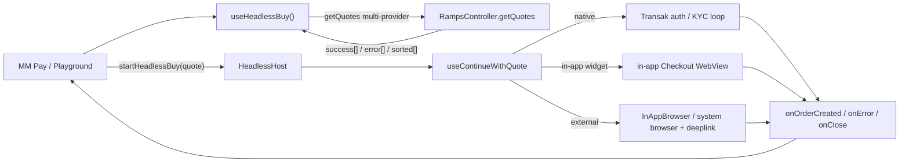

# Headless Buy: All Providers Support Plan

> Take Headless Buy (and its MM Pay / Money Account consumer) from native-only to all-provider support: multi-provider quoting, headless-aware non-native checkout (in-app WebView and external-browser providers), typed error outcomes, analytics parity, and DRY shared logic between Unified Buy v2 (UB2) and Headless Buy. The native-only gate stays closed in production the entire time we build; widening to all providers happens last, behind a flag.

This is a companion to [PLAN.md](./PLAN.md) (the original Headless Buy plan) and follows its style.

## Milestones checklist

Milestones 0 to 2 are capability work, built behind the still-closed native-only gate and exercised only via the dev playground plus unit/integration tests. Milestone 3 is the only production-widening milestone, flag-gated, landing last. Milestone 4+ is deferred follow-up.

- [ ] **Milestone 0** - Must-fix preconditions (no production behavior change)
- [ ] **Milestone 1** - All-provider quoting capability (built but gated OFF)
- [ ] **Milestone 2** - Headless checkout for non-native providers (makes widening safe)
- [ ] **Milestone 3** - Activation behind a required scoped flag
- [ ] **Milestone 4+** - Deferred (broad typed errors, analytics parity, TPC multi-provider wiring, DRY cleanup)

Milestone 0 is a precondition for everything else: the terminal-callback contract fix (see Must-fix preconditions) and the OTP typed-code fix must land before typed errors expand or before any consumer relies on terminal outcomes.

---

## Scope (confirmed: full cross-repo)

Enabling all providers spans three layers, and this plan documents all three as coordinated milestones:

- **`@metamask/core` - `TransactionPayController`** (the MM Pay fiat quote path). `getRampsQuote` calls `RampsController:getQuotes` with `autoSelectProvider: true` (line ~113) + `restrictToKnownOrNativeProviders: true` (line ~116) and takes only `quotes.success?.[0]` (line ~124) (source: `packages/transaction-pay-controller/src/strategy/fiat/utils.ts`, the `getRampsQuote` function around lines 95 to 131 on `origin/main`). This is the native-only gate's quote-side enforcement.
- **`@metamask/ramps-controller`** - eventual home for the PURE quote filter/sort/recommend helper and pure callback parsing/status helpers, but only once 2+ consumers justify extraction. The selection / recommendation util starts mobile-side (see Milestone 1.2), since the order-history rung cannot be reused from core and there is one real consumer today.
- **`metamask-mobile`** - relax the native-only availability gate (`app/components/Views/confirmations/hooks/pay/useIsFiatPaymentAvailable.ts`, lines 19 to 23; `app/components/UI/Ramp/hooks/useHasNativeFiatProvider.ts`, lines 23 to 26); make `useContinueWithQuote`'s external-browser branch headless-aware; typed errors; analytics; DRY; and own all navigation/session and redirect/deeplink policy.

---

## Sequencing and safety: capability vs activation

**Risk:** removing the native-only gate early would route live MM Pay / HeadlessBuy users to aggregator / external-browser quotes before the logic to handle them (Milestone 2, and the typed-error / analytics follow-ups) exists, landing them in the broken external-browser branch (silent BuildQuote reset, no terminal callback). That is the "user backed out vs provider broke" confusion we must avoid.

**Rule:** the native-only gate stays CLOSED for production the entire time we build capability. We never widen what real users get until the supporting logic is in and verified.

- **Capability milestones (0 to 2)** add all-provider quoting, selection, external-browser headless support, and the headless deeplink path, but are exercised only via the dev playground and unit/integration tests. The live MM Pay path keeps `restrictToKnownOrNativeProviders: true`, and `useHasNativeFiatProvider` keeps gating.
- **Activation milestone (3, flag-gated)** is the only milestone that widens production. It flips `getRampsQuote` and relaxes the mobile gate, behind a distinct scoped flag, and lands last, after Milestone 2 is proven.
- Within the capability milestones, land external-browser headless support and the headless deeplink path (Milestone 2) before any wiring that could surface non-native quotes to a consumer.

---

## Design principles

Inherited from [PLAN.md](./PLAN.md), with one addition:

1. **Callbacks-only, three terminal events.** A session ends in exactly one of `onOrderCreated`, `onError`, `onClose`. No intermediate progress callbacks. KYC stays terminal-only for consumers: native Transak may surface auth/limit/KYC-specific typed errors, but non-native provider KYC stays inside the provider checkout unless it produces a terminal callback, cancellation, or load failure.
2. **The consumer renders all visible UI.** `useHeadlessBuy` is a behavior provider, not a UI provider.
3. **Callback-routing rule (new).** `onError` is reserved for technical / provider failures only. User-driven and consumer-driven exits terminate via `onClose`, not `onError`:
   - User in-flow exit (browser cancel, WebView close, back-press, inferred abandonment): `onClose({ reason: 'user_dismissed' })`.
   - Consumer programmatic cancel (`cancel()` / session replacement): `onClose({ reason: 'consumer_cancelled' })`.
   - The `USER_CANCELLED` error code is retired for in-session exits. If retained at all, it is reserved only for a pre-session cancellation error and never emitted for in-flow user closes. Otherwise MM Pay cannot distinguish "user backed out" from "provider broke".

---

## Must-fix preconditions (before expanding errors)

**Terminal-callback contract bug.** `failSession` fires `onError(...)` then `closeSession({ reason: 'unknown' })`, which fires `onClose(...)` (`app/components/UI/Ramp/headless/sessionRegistry.ts`, lines 235 to 264). MM Pay's `onClose` currently clears the error set by `onError` (`app/components/Views/confirmations/hooks/pay/useFiatConfirm.ts`, the `onClose` handler at lines 129 to 132 calls `setHeadlessBuyError(undefined)`), so the error is lost.

**Decision (chosen contract):** `onError` is terminal on its own. `failSession` fires `onError` and then ends the session WITHOUT a trailing `onClose`. A session ends in exactly one of `onOrderCreated`, `onError`, or `onClose`, with no pairing. This keeps "provider broke" (`onError`) cleanly separable from "user/consumer exited" (`onClose`).

Implementation: `failSession` stops calling `closeSession`; it sets the terminal status (`failed`) and removes the session from the registry directly, without invoking `onClose`. `onClose` remains the terminal event only for `user_dismissed` / `consumer_cancelled` / `completed` paths.

Caveat to confirm with MM Pay before building broad typed errors: if MM Pay relies on a single cleanup hook regardless of outcome, we instead carry the `HeadlessBuyError` on the close info and fire one `onClose({ reason: 'errored', error })` after `onError`. Default is the no-trailing-`onClose` contract above unless MM Pay asks for the cleanup variant.

This is a precondition for the typed-error work (Milestone 4), not an afterthought, and is implemented as Milestone 0.1.

---

## UB2 behavior to preserve

- The `QuotesResponse` contract `{ success, error, sorted, customActions }` from `@metamask/ramps-controller`. No client-side `Promise.all` fan-out is needed: the existing single `getQuotes` call already models partial failure via `success[]` plus per-provider `error[]`. (In practice custom actions ride inside `success[]` flagged by `isCustomAction`; the separate `customActions[]` array is empty in UB2 usage, and custom actions are out of scope here, see the "Getting multiple quotes" concern.)
- Provider-level quote errors are non-terminal: they are surfaced as partial errors and only become terminal when every provider fails or no usable quote can be selected.
- Existing UB2 quote ordering, recommended-quote selection, WebView retry behavior, and OrderDetails routing must remain unchanged (regression-tested).

---

## Concerns addressed

A direct answer to each open question that motivated this plan. Findings are UB2-vs-Headless; decisions feed the milestones below.

### Getting multiple quotes; partial vs full failure

UB2 does not fan out to providers with `Promise.all`. One `RampsController.getQuotes()` call returns `{ success[], sorted[], error[], customActions[] }`; multi-provider parallelism is server-side. A single provider failing is non-terminal: its message lands in `error[]` while other providers stay in `success[]`. Only HTTP / validation / malformed-shape failures reject the promise.

Custom actions are NOT a separate candidate array in practice. UB2 carries custom actions INSIDE `success[]`, flagged by `quote.isCustomAction` (`isCustomAction()` reads `quote.quote.isCustomAction`, `app/components/UI/Ramp/types/index.ts`, lines 43 to 45). The separate `customActions[]` array is empty in UB2 usage and tests. UB2 already EXCLUDES `isCustomAction` entries from provider / payment matching (`app/components/UI/Ramp/Views/Modals/ProviderSelectionModal/ProviderSelection.tsx`, lines 262 to 274). For this effort custom-action entries are OUT of scope: headless candidate selection must filter them out of `success[]` the same way, so that removing `restrictToKnownOrNativeProviders` cannot surface an unhandled custom-action path.

- Partial failure: at least one usable non-customAction `success[]` entry exists. Keep it.
- Full failure: no usable non-customAction `success[]` entry. This is NOT `success.length === 0 && customActions.length === 0`. Map to `NO_QUOTES`.

Decision: there is no union candidate model. Selection, "no quotes", and continuation operate over `success[]` with `isCustomAction` entries filtered out.

### Sorting / ordering quotes like UB2

There are two existing UB2 behaviors:

- **Modal ordering** in `app/components/UI/Ramp/Views/Modals/ProviderSelectionModal/ProviderSelection.tsx` (lines 205 to 228): reliability-only sort of providers-with-quotes.
- **Recommendation ladder** in legacy `app/components/UI/Ramp/Aggregator/hooks/useSortedQuotes.ts` (lines 43 to 69): previously-used provider, then reliability, then price.

Headless / MM Pay need the recommendation ladder (to replace core's current `success[0]` pick), not just modal ordering. Provider preference-from-order-history DOES exist in the controller (`#getPreferredProviderIdsFromOrders` / `#resolveProviderIdsForQuote`), but those are `#private` and run only in the single-provider auto-select branch; the all-provider path never invokes them (`node_modules/@metamask/ramps-controller/dist/RampsController.mjs`: the `else if (autoSelectProvider || restrictToKnownOrNativeProviders)` branch, lines 1003 to 1024, versus the all-provider `else` branch that quotes `state.providers.data`, line 1026). So that order-history rung CANNOT be reused by a pure / mobile helper: the previously-used-provider rung must be re-derived mobile-side. The new build is that re-derived preference rung plus the reliability-then-price recommendation among the returned `success[]`.

### Routing for native vs non-native

`useContinueWithQuote` branches on `isNativeProvider(quote)` (`app/components/UI/Ramp/types/index.ts`, lines 33 to 35). Native uses the Transak auth/KYC loop via `useTransakRouting`. Non-native fetches `getBuyWidgetData` then opens either an in-app `Checkout` WebView or an external browser.

### KYC for native vs non-native

Native KYC is fully in-app (NativeFlow screens plus Transak APIs: email, OTP, BasicInfo, KycWebview, KycProcessing, AdditionalVerification). Non-native KYC happens inside the provider's WebView or external browser; MetaMask only learns the outcome at callback / deeplink time.

### In-app WebView providers vs external-browser providers

The decision lives in `getWidgetRedirectConfig` / `getAggregatorRedirectConfig` (`app/components/UI/Ramp/utils/buildQuoteWithRedirectUrl.ts`, the redirect-config helpers around lines 35 to 71): custom actions and `buyWidget.browser === 'IN_APP_OS_BROWSER'` go to an external browser with a deeplink redirect; otherwise an in-app `Checkout` WebView with a callback-base redirect. This is the reason the gate removal must be LAST: external-vs-in-app is decided per-quote AFTER `getBuyWidgetData`, so you cannot limit quote-widening to only in-app-WebView providers at the quote layer (see "Conflicts resolved"). In-app success is detected via `getOrderFromCallback` on the callback URL; external success returns via iOS `InAppBrowser.openAuth` result or an Android deeplink (`handleRampReturnUrl`).

### Load failure handling and notifying MM Pay

In-app `Checkout` handles `onHttpError` (terminal failure routes to `failHeadlessCheckout`, which fires `RAMPS_ORDER_FAILED` and `failSession`). The external-browser path has no load-failure handling and no headless notification today. Decision: route external-browser open / load / cancel / bail outcomes through `failSession` (technical) or `closeSession` (user exit), so MM Pay always receives a terminal callback. See the observability policy in Milestone 2.

### Analytics abandon vs failed

Abandon is tracked via `RAMPS_CHECKOUT_CLOSED.close_source` plus the headless `onClose` reason. Failure is tracked via terminal `RampsController:orderStatusChanged` (`RAMPS_TRANSACTION_FAILED`) and in-flow headless `RAMPS_ORDER_FAILED`. External-browser abandon is currently untracked (Milestone 5).

### Gaps in the external-browser branch of `useContinueWithQuote`

The branch (`app/components/UI/Ramp/hooks/useContinueWithQuote.ts`, lines 289 to 335) ignores `ctx.headlessSessionId`: cancel, Android `Linking.openURL`, and iOS success all call `navigateAfterExternalBrowser({ returnDestination: 'buildQuote' | 'order' })` (`app/components/UI/Ramp/utils/rampsNavigation.ts`, lines 50 to 75), landing on BuildQuote / OrderDetails with no `onOrderCreated` / `onError` / `onClose`. `addPrecreatedOrder` is conditional, and OrderDetails has no headless path.

### Specific non-native errors UB2 handles that Headless does not

Missing wallet / providerCode, null or bailed order (`isBailedOrderStatus`), `getOrderFromCallback` throw, terminal HTTP error, `getBuyWidgetData` failure, static min/max limits, and no-quotes. Most map to a coarse `UNKNOWN` in headless today; `NO_QUOTES` / `QUOTE_FAILED` are defined but unemitted; and the OTP `nativeFlowError` string path force-maps post-auth failures (including limit / KYC) to `AUTH_FAILED`. (An empty callback query is NOT in this technical-error set: `app/components/UI/Ramp/Views/Checkout/Checkout.tsx`, lines 386 to 393, already treats an empty query as `closeSession({ reason: 'user_dismissed' })`, so it stays a user-exit via `onClose`.)

### DRY: logic to move out of UB2 UI

Quote selection / recommendation, min/max validation, callback parsing/status, and bailed-status checks are pure and should be shared. Redirect / browser-mode decision and deeplink-scheme construction are platform policy and stay mobile-side. See Milestone 7 for the precise core-vs-mobile split.

---

## Architecture at a glance



---

## Conflicts resolved

Three reconciliations that shaped this milestone ordering; capturing them so we do not re-litigate during implementation:

- **Gate removal is LAST.** You cannot limit quote-widening to only in-app-WebView providers at the quote layer, because external-vs-in-app is decided PER-QUOTE by `buyWidget.browser === 'IN_APP_OS_BROWSER'` only AFTER `getBuyWidgetData` runs at continuation (`getWidgetRedirectConfig` / `getAggregatorRedirectConfig` in `app/components/UI/Ramp/utils/buildQuoteWithRedirectUrl.ts`). So the quote layer cannot pre-filter to "safe" providers; the only safe ordering is to make external-browser checkout headless-aware first (Milestone 2), then widen quoting in production (Milestone 3).
- **The recommendation ladder is mobile-side.** The order-history preference rung is `#private` in `RampsController` and only runs in the single-provider auto-select branch, so it cannot be reused from core. The selection util is built mobile-side first (Milestone 1.2); extraction to `@metamask/ramps-controller` waits for a second consumer (Milestone 6).
- **A distinct scoped flag is required.** The existing `MetaMaskPayFiatFlags` cannot scope provider-widening (`enabledTransactionTypes: []` kills all fiat), so activation needs a new scoped flag whose "off" state falls back to native-only, not "no fiat" (Milestone 3.1).

---

## Milestone 0 - Must-fix preconditions (no production behavior change)

Goal: fix the two correctness bugs that any downstream typed-error / terminal-callback work depends on. Neither changes production behavior for today's native-only flow.

### M0.1 - Make `failSession` terminal

`onError` fires, the session is removed, and there is NO trailing `onClose`. See the Must-fix preconditions section for the full contract. `failSession` (`app/components/UI/Ramp/headless/sessionRegistry.ts`, lines 235 to 264) currently calls `closeSession({ reason: 'unknown' }, { terminalStatus: 'failed' })` after `onError`, and the MM Pay consumer (`app/components/Views/confirmations/hooks/pay/useFiatConfirm.ts`, lines 123 to 132) clears the error in its `onClose` handler. Fix: `failSession` sets the terminal status and removes the session directly, without invoking `onClose`.

Tests: `failSession` fires exactly one `onError` and no `onClose`; the session is removed from the registry; the MM Pay consumer retains the error after a failure.

### M0.2 - OTP typed-code fix

Stop force-mapping `nativeFlowError` to `AUTH_FAILED`. `HeadlessHost.tsx` (the `nativeFlowError` effect at lines 136 to 147) hard-codes `code: 'AUTH_FAILED'` and the `'AUTH_FAILED'` fallback for any `nativeFlowError` string. The OTP path (`OtpCode`) hands back a bare `nativeFlowError` string, so a post-auth `LIMIT_EXCEEDED` / `KYC_REQUIRED` is mislabeled as `AUTH_FAILED`. (Direct `LimitExceededError` is already mapped correctly by `toHeadlessBuyError` via the `error.name` check.) Fix: thread a typed code (not a string) through the native route-back param so post-auth failures keep their real code.

Tests: a post-auth limit failure surfaces `LIMIT_EXCEEDED`, not `AUTH_FAILED`; a genuine auth failure still surfaces `AUTH_FAILED`.

---

## Milestone 1 - All-provider quoting capability (built but gated OFF)

Goal: build everything needed to request, filter, and recommend multi-provider quotes, plus the core widening, but DO NOT activate any of it in production. The live MM Pay path keeps both gating flags; `useHasNativeFiatProvider` keeps gating. Exercised only via the dev playground and unit/integration tests.

### M1.1 - Filter `isCustomAction` out of headless candidate selection

`RampsController.getQuotes` already supports all-provider quoting by omitting the gating flags (auto-selection internals are already on core main and published), so no new controller logic is required for the request itself. Mobile: confirm `useHeadlessBuy.getQuotes` can pass no restriction and supports multi-provider `providerIds`. Candidate selection operates over `success[]` only, with `isCustomAction` entries filtered out (`isCustomAction`, `app/components/UI/Ramp/types/index.ts`, lines 43 to 45). Custom actions are OUT of scope (see the "Getting multiple quotes" concern): there is no union candidate model. Full failure is "no usable non-customAction `success[]` entry", which maps to `NO_QUOTES`. Filtering custom actions out is what keeps removing `restrictToKnownOrNativeProviders` from surfacing an unhandled custom-action path.

Tests: multi-provider request returns multiple non-customAction candidates; partial failure keeps usable candidates plus `error[]`; `isCustomAction` `success[]` entries are filtered out of candidate selection; full failure (no usable non-customAction `success[]` entry) maps to `NO_QUOTES`; playground renders all non-custom providers.

### M1.2 - Build a mobile-side `recommendQuotes` util

Build the selection / recommendation ladder as a PURE mobile-side util. Do NOT extract a shared helper into `@metamask/ramps-controller` up front: there is a single real consumer today (headless / MM Pay), and the order-history rung cannot be pulled from core (`#getPreferredProviderIdsFromOrders` / `#resolveProviderIdsForQuote` are `#private` and run only in the single-provider auto-select branch, `node_modules/@metamask/ramps-controller/dist/RampsController.mjs`, lines 1003 to 1024; the all-provider path takes the `else` branch and quotes `state.providers.data`, line 1026). The previously-used-provider rung must be re-derived mobile-side and supplied as an explicit input. Extract to core only once 2+ confirmed consumers justify it (Milestone 6).

The util must be PURE, with explicit inputs (it cannot read controller-private order history or mobile Redux). Proposed signature:

```ts
recommendQuotes(input: {
  response: QuotesResponse;           // success[], sorted[], error[]
  preferredProviderIds?: string[];    // caller derives order-history / preference, in priority order
}): { ordered: Quote[]; recommended?: Quote };
```

Defined behavior the util must specify:

- Ladder: first a quote whose provider id is in `preferredProviderIds` (in order), then `sorted` with `sortBy === 'reliability'`, then `sorted` with `sortBy === 'price'`.
- Custom actions: filter out `isCustomAction` entries before ranking (out of scope this effort).
- `sorted` handling: map provider ids to `success[]` entries; ids missing from `sorted` are appended after sorted ones in a stable, documented order (original `success[]` order).
- Price fallback: when no `reliability` sort entry exists, fall back to the `price` sort entry; when neither exists, preserve input order.
- Provider id normalization: match on normalized provider code so `/providers/x` and `x` are equivalent.

Tests: ladder order with and without `preferredProviderIds`; missing `sorted` entries; price fallback; `isCustomAction` entries excluded; deterministic output for UB2 and MM Pay callers.

### M1.3 - Core `getRampsQuote` widening (built but NOT activated)

Build the core widening but leave it gated behind the Milestone 3 flag; do not flip it here. In `getRampsQuote` (`packages/transaction-pay-controller/src/strategy/fiat/utils.ts`, lines 95 to 131), the production call passes `autoSelectProvider: true` (line ~113) and `restrictToKnownOrNativeProviders: true` (line ~116) and takes `quotes.success?.[0]` (line ~124). True all-provider quoting requires dropping BOTH flags so `getQuotes` falls back to `state.providers.data` (`node_modules/@metamask/ramps-controller/dist/RampsController.mjs`, line 1026). Dropping ONLY the restriction is not enough: `#resolveProviderIdsForQuote` returns a SINGLE provider id even when `restrictToKnownOrNative` is false, so the auto-select branch still yields one provider. So the widened path must drop both flags and switch the pick from `success?.[0]` to the Milestone 1.2 selection logic.

- **Catalog hydration (must verify).** Falling back to `state.providers.data` presumes the controller provider catalog is hydrated in the `TransactionPayController` context. TPC currently relies on auto-select, not on `state.providers.data`, so verify catalog hydration in the TPC context or pass an explicit `providers` list; otherwise all-provider quoting could return zero providers.

Tests: the widened selector (off the production flag) picks the recommended successful quote and ignores provider-level failures when another quote succeeds; the dormant path is proven by tests while production stays native-only.

---

## Milestone 2 - Headless checkout for non-native providers (makes widening safe)

Goal: make the non-native checkout paths (in-app WebView and external browser) emit terminal headless callbacks, so that widening quoting in Milestone 3 cannot strand a user in a callback-less branch. This is the milestone that must land before any production widening.

### M2.1 - Make `continueWidget`'s external-browser branch headless-aware

Thread `ctx.headlessSessionId` into the external-browser branch (`app/components/UI/Ramp/hooks/useContinueWithQuote.ts`, lines 289 to 335) so it routes to `onOrderCreated` / `onClose` / `failSession` instead of `navigateAfterExternalBrowser` to BuildQuote / OrderDetails (`app/components/UI/Ramp/utils/rampsNavigation.ts`, lines 50 to 75):

- iOS `InAppBrowser.openAuth` success: today the success path calls `navigateAfterExternalBrowser({ returnDestination: 'order', callbackUrl, ... })` (lines 325 to 330), landing on `RAMPS_ORDER_DETAILS` with no headless path. Headless: resolve `openAuth` success into `onOrderCreated`.
- Cancel: `onClose({ reason: 'user_dismissed' })`.
- Error / open-rejection: `failSession`.

**Redirect URL: name one source of truth.** Today `getQuotes` accepts a `redirectUrl` override, but `HeadlessHost` does not pass `HeadlessBuyParams.redirectUrl` into `useContinueWithQuote`, and `continueWidget` recomputes the redirect URL via the mobile redirect-policy util. Decision: the mobile redirect-policy util (`getWidgetRedirectConfig` / `getAggregatorRedirectConfig`) is the source of truth at checkout continuation. `HeadlessBuyParams.redirectUrl` is an optional override that must be threaded from the session onto `ContinueWithQuoteContext` and honored by `continueWidget` when present; when absent, the policy util computes it. The quote-fetch `redirectUrl` and the continuation `redirectUrl` must resolve from this same rule so they cannot diverge.

Observability is only partial; document the three cases explicitly:

- **iOS `InAppBrowser.openAuth`**: returns success / cancel / error synchronously, but is NOT headless-aware today and iOS external success is NOT "already handled". Must be resolved into the headless callbacks above.
- **`Linking.openURL` (Android / no InAppBrowser)**: we can only catch the OPEN failure (promise rejection, which fires `failSession`). We cannot observe provider page load.
- **Android / system browser**: provider-side load failure is unknowable. Success arrives via deeplink return. Abandonment is inferred by the existing dismissal machinery (below), not guaranteed.

Tests: each branch routes to the correct terminal callback; iOS `openAuth` success fires `onOrderCreated`; cancel fires `onClose({ reason: 'user_dismissed' })`; open-rejection fires `failSession`.

### M2.2 - Give `handleRampReturnUrl.ts` a headless path

Today `handleRampReturnUrl` only parses `orderId` and navigates to `RAMPS_ORDER_DETAILS`. The redirect URL is `metamask://on-ramp/providers/${providerCode}` (`app/components/UI/Ramp/utils/buildQuoteWithRedirectUrl.ts`, the `getProviderDeeplinkRedirectUrl` helper around lines 27 to 28), so the deeplink DOES carry the provider code in its path. It does NOT carry the wallet address, chainId, or session id.

Concrete design:

1. At external-browser launch (Milestone 2.1), record a pending external-order correlation in the session registry: `{ sessionId, walletAddress, chainId }`. The provider code is recoverable from the deeplink path, so it need not be stored. The session registry already holds the single active session, so the active session id is the correlation key; do not rely on the deeplink to carry it.
2. On deeplink return, `handleRampReturnUrl` first checks for an active headless session. If one exists and is `continued`, it takes the headless path: resolve the order via the shared callback resolver using the `providerCode` parsed from the deeplink path plus `walletAddress` from the correlation record (plus any `orderId` from the deeplink query), then fire `onOrderCreated` and end the session. No active headless session means today's behavior (navigate to `RAMPS_ORDER_DETAILS`).
3. Build on the just-landed cached / internal order-id resolution (mobile #32372 `app/components/UI/Ramp/hooks/useRampsOrders.ts`, core #9159) rather than re-deriving order lookup.

Core-vs-mobile split: core may own only the pure parsing/status helpers (parse callback URL, classify bailed/terminal status). The correlation record, deeplink routing, and the focus-dismissal pre-emption stay mobile-side.

Tests: shared callback resolver returns identical results for `Checkout` and `OrderDetails`; a deeplink return with a live `continued` session fires `onOrderCreated`; a no-order deeplink with no live session falls back to `RAMPS_ORDER_DETAILS`; native loop unchanged (regression).

### M2.3 - E1/E2/E3 reconciliation (money-losing if skipped)

Three hazards must be reconciled, all reusing the EXISTING dismissal machinery `HeadlessHost` already wires (`app/components/UI/Ramp/Views/HeadlessHost/HeadlessHost.tsx`, lines 86 to 99: `useHeadlessSessionDismissal`, `useHeadlessSessionFocusDismissal`, and the `beforeRemove` listener), NOT a parallel new grace timer, so there are not two competing dismissal paths.

- **E1 - iOS `openAuth` success resolves into the headless callback.** The iOS success path must terminate via `onOrderCreated` (covered by Milestone 2.1), never silently land on `RAMPS_ORDER_DETAILS`.
- **E2 - A SUCCESS deeplink must WIN even if the session was already dismissed or GC'd.** Because MM Pay's two-step intent transaction is gated on `onOrderCreated` (`app/components/Views/confirmations/hooks/pay/useFiatConfirm.ts`, lines 112 to 122), a real fiat order can complete (the user paid) while the intent leg never fires if the focus-dismissal, the `beforeRemove` listener, or the 1-hour stale GC (`STALE_SESSION_TTL_MS`, `app/components/UI/Ramp/headless/sessionRegistry.ts`, line 110) terminated the session first. Reconciliation rule: a success deeplink must still complete the order through the consumer's `onOrderCreated` (re-opening or directly completing the dismissed session) rather than being silently dropped to `RAMPS_ORDER_DETAILS`. Only a deeplink with no order / no recoverable success and no live session falls back to `RAMPS_ORDER_DETAILS` so the order is still recoverable manually.
- **E3 - Pre-empt the existing zero-delay focus-dismissal timer, do not add a parallel grace timer.** On re-focus, `useHeadlessSessionFocusDismissal` schedules dismissal via `setTimeout(..., 0)` (`app/components/UI/Ramp/headless/useHeadlessSessionFocusDismissal.ts`, line 51) and bails if the session is already gone or the focus / session id changed. The only addition is to ensure a real deeplink callback can PRE-EMPT this existing path: a deeplink-success must terminate the session before, or take precedence over, focus-dismissal. It does NOT emit `onError`, and the consumer's `cancel()` and the registry's stale-session GC remain as backstops. The remaining product / MM Pay decision is whether the existing zero-delay focus dismissal needs a deliberate grace delay to avoid racing a slow-but-successful deeplink; record the chosen behavior before implementation.

Tests: iOS `openAuth` success completes via `onOrderCreated` (E1); a success deeplink arriving AFTER the session was dismissed still completes via `onOrderCreated` and is not dropped to `RAMPS_ORDER_DETAILS` (E2); a deeplink-success pre-empts the existing focus-dismissal so a slow-but-successful return is not closed as `user_dismissed` (E3).

---

## Milestone 3 - Activation behind a required scoped flag

Goal: the only production-widening milestone. Lands last, after Milestone 2 is proven. Flip the gate behind a distinct scoped flag for staged rollout.

### M3.1 - Add a distinct scoped flag / config bit

**A distinct scoped flag is REQUIRED; the existing flag cannot scope provider-widening.** The required kill switch is "keep native-only working, disable only non-native widening", NOT "disable the whole fiat path". The existing `MetaMaskPayFiatFlags` only carries `enabledTransactionTypes` and `maxDelayMinutesForPaymentMethods` (`app/selectors/featureFlagController/confirmations/index.ts`, lines 87 to 90); there is NO native-vs-all-providers bit, and setting `enabledTransactionTypes: []` disables ALL fiat. So a distinct scoped flag / config bit (e.g. `allProvidersEnabled` / a non-native provider scope) is REQUIRED so that "off" falls back to native-only rather than killing fiat entirely. Roll out incrementally via that scoped flag; no new product flag beyond it unless product asks.

### M3.2 - Flip the two gates and activate Milestone 1.3 behind the flag

Lands after Milestone 2 is proven. Behind the scoped flag from Milestone 3.1:

- Mobile: relax the native-only availability gate (`app/components/Views/confirmations/hooks/pay/useIsFiatPaymentAvailable.ts`, lines 19 to 23; `app/components/UI/Ramp/hooks/useHasNativeFiatProvider.ts`, lines 23 to 26).
- Core: activate the Milestone 1.3 widening in `getRampsQuote` (drop both flags, switch the pick to the selection util), gated on the same scoped rollout.

Tests: with the scoped flag on, non-native quotes reach the consumer and complete via headless callbacks; with it off, behavior is identical to today's native-only (native fiat still available).

---

## Milestone 4+ - Deferred follow-up

These are intentionally deferred. They are not required to ship all-provider support behind the Milestone 3 flag, and several refactor working code with regression risk.

### M4 - Broad typed errors

Depends on Milestone 0.1 (terminal-callback contract). The Milestone 0.2 OTP typed-code fix is already in scope at Milestone 0. Then, on demand:

- Emit `NO_QUOTES` and `QUOTE_FAILED` for technical / quote failures (widget-URL, load, callback-parse, order-lookup, external-open failures).
- Route user exits to `onClose` per the callback-routing rule (`user_dismissed` for in-flow user closes, `consumer_cancelled` for programmatic cancel). Do not emit `USER_CANCELLED` for in-flow exits. An empty callback query is a user-exit, not a typed error: `Checkout.tsx` (lines 386 to 393) already treats it as `closeSession({ reason: 'user_dismissed' })`.
- Export reality check (must-do, not assume): on core `origin/main`, `@metamask/ramps-controller`'s `index.ts` exports `getTransakApiMessage`, `isTransakPhoneRegisteredError`, and `RAMPS_ERROR_CODES` / `RampsErrorCode`, but it does NOT export `TRANSAK_ERROR_CODES` / `TransakErrorCode` (they exist in `packages/ramps-controller/src/transakErrorCodes.ts` but are unexported). So a consumer that must branch on `TRANSAK_ERROR_CODES` / `TransakErrorCode` first needs a core sub-task to export them from the package; otherwise depend only on the already-exported helpers (`getTransakApiMessage`, `isTransakPhoneRegisteredError`) plus `RAMPS_ERROR_CODES`. Do not import `TRANSAK_ERROR_CODES` from mobile until that export lands. Re-verify against `origin/main` / the published package before relying on it.
- Scope the taxonomy. The broader typed-code taxonomy (e.g. `KYC_REQUIRED` and other granular provider codes) is implement-on-demand: add a code when a consumer actually needs to branch on it, not up front.

### M5 - Analytics parity for external-browser providers

Bring external-browser providers to parity: `RAMPS_CHECKOUT_CLOSED` (abandon), `RAMPS_ORDER_FAILED` (in-flow), provider cancellation, HTTP / load failures, and terminal `RampsController:orderStatusChanged` (failed / cancelled), all tagged `ramp_type: 'HEADLESS'` plus `ramp_surface`.

### M6 - Wire TPC to consume multi-provider quotes

Wire core (`TransactionPayController`) to consume multi-provider quotes via the Milestone 1.2 selection logic instead of `success[0]`, and keep the MM Pay terminal-callback contract. This depends ONLY on the Milestone 0.1 terminal-callback contract; there is no upstream wait, because the `transaction-pay-controller` fiat second-leg hardening PRs are merged and published (see Upstream context). Extract a shared helper into `@metamask/ramps-controller` only once there are 2+ confirmed consumers to justify the cross-repo publish / version coupling cost.

### M7 - DRY cleanup (UB2 UI becomes "dumb")

Deferred until AFTER Milestone 3 activation is stable. This refactors working UB2 code (regression risk) with no production benefit before all-providers ships.

- **Move to core (`@metamask/ramps-controller`), pure only:** quote selection / recommendation ladder (once 2+ consumers justify extraction); pure callback parsing and status classification; bailed-status checks; min/max amount validation as a pure `validateBuyAmount()`.
- **Keep in shared mobile Ramp utils:** platform redirect policy and deeplink-scheme construction (`app/components/UI/Ramp/utils/buildQuoteWithRedirectUrl.ts`); all navigation / session behavior. Core must not learn mobile deeplink schemes. The only exception: if the controller API is extended to accept redirect / browser options as inputs, the browser-mode decision can move down; otherwise it stays mobile-side.
- Refactor BuildQuote / ProviderSelection into dumb consumers of the shared helpers.

Tests: UB2 regression proves ordering, recommended selection, WebView retry, and OrderDetails routing are unchanged after the extraction.

---

## Test plan (consolidated)

- ramps-controller / core: all-provider quote requests, partial failures, all-provider failures, and shared recommendation order.
- Transaction Pay: the widened selector picking the recommended successful ramps quote and ignoring provider-level failures when another quote succeeds; dormant-path coverage before activation.
- Mobile hooks: `useHeadlessBuy`, `useContinueWithQuote`, `HeadlessHost`, `Checkout`, and external-browser deeplink return.
- UB2 regression: quote ordering, recommended quote selection, WebView retry behavior, and order-details routing unchanged.
- Analytics: `RAMPS_CHECKOUT_CLOSED`, `RAMPS_ORDER_FAILED`, provider cancellation, checkout HTTP / load failures, and order terminal failed / cancelled events.

---

## Upstream context

Time-sensitive references that informed sequencing; verify before relying on them.

- Auto-selection internals are already on core main and published (`#resolveProviderIdsForQuote`, `autoSelectProvider` / `preferredProviderIds` / `restrictToKnownOrNativeProviders`), so Milestone 1 adds no new controller logic.
- Transak error helpers are exported (core #9135): `getTransakApiMessage` and `isTransakPhoneRegisteredError` (plus `RAMPS_ERROR_CODES` / `RampsErrorCode`), confirmed on `origin/main`. Note: `TRANSAK_ERROR_CODES` / `TransakErrorCode` exist in `packages/ramps-controller/src/transakErrorCodes.ts` but are NOT re-exported from `index.ts` on `main`; the typed-error export sub-task (Milestone 4) must add that export before depending on it from mobile.
- Order-id resolution refinements: mobile #32372 (resolve order details by cached order id) and core #9159 (compare internal order ids) inform Milestone 2.2.
- The MM Pay fiat second-leg hardening PRs (core #9267 locked-keyring / CHOMP race guard, #9279 preserve isExternalSign when no quotes, #9250 / #9216 EIP-7702 / relay, plus #9159 and #9135) are MERGED and published (core ~release 1082.0.0). There is no upstream wait: the MM Pay integration (Milestone 6) now depends only on the Milestone 0.1 terminal-callback contract, not on an in-flight upstream sequence.
- A stale-branch caveat: the core branch `headless-buy-ramps-auto-selection` is unmerged and far behind main, yet main already carries equivalent auto-selection logic; verify it is not redundant before building on it.

---

## Open risks and assumptions

Assumptions:

- Ship behind a flag whose "off" state keeps native-only working (not one that disables the whole fiat path). A distinct scoped flag / config bit is REQUIRED: the existing `MetaMaskPayFiatFlags` cannot scope provider-widening (it only has `enabledTransactionTypes` / `maxDelayMinutesForPaymentMethods`, and `enabledTransactionTypes: []` kills all fiat), so a non-native provider-scope flag must be added (Milestone 3.1). No new product flag beyond the kill switch unless product asks.
- Headless consumers still receive only terminal callbacks: `onOrderCreated`, `onError`, `onClose`.
- System-browser external checkout cannot be observed synchronously; rely on deeplink return for success, `Linking.openURL` rejection for open failure, and the existing focus-dismissal machinery for inferred cancellation.
- Provider quote failures are logged and surfaced as partial errors, becoming terminal only when every provider fails or no quote can be selected.

Risks:

- Cross-repo sequencing (core publish before mobile bump) for the eventual core extraction.
- Android foreground-without-callback heuristic reliability (built on the existing focus-dismissal) and whether it needs a deliberate grace delay.
- Slow-but-successful deeplink returning AFTER the session was dismissed (focus-dismissal / `beforeRemove` / 1-hour stale GC): the fiat order completes but `onOrderCreated` never fires and MM Pay's gated two-step intent leg never runs, losing money unless the success-deeplink-wins reconciliation rule (Milestone 2.3, E2) is implemented.
- Migrating pure helpers into core without dragging platform policy along (and the cross-repo publish / version coupling cost of doing it before a second consumer exists).

---

## Out of scope

- Sell flow parity (headless Sell is a follow-up).
- Non-React / imperative global consumers.
- Wholesale migration of BuildQuote to the headless primitives.
- Exporting `useHeadlessBuy` outside of Ramp.
