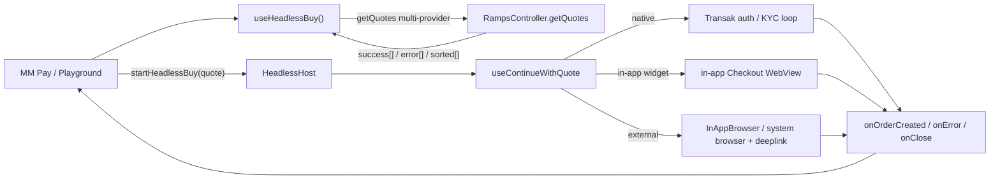

# Headless Buy: All Providers Support Plan

Take Headless Buy (and its MM Pay / Money Account consumer) from native-only to all-provider support in two shippable phases:

- **Phase 1** widens quoting to in-app WebView providers only, filtered at the quote layer, behind one scoped flag set to `in-app`. It needs none of the Phase 2 checkout work because external and custom-action quotes are filtered out.
- **Phase 2** makes the external-browser and custom-action checkout paths headless-aware, then widens the same flag to `all`.

Native-only is never broken: the flag's `off` state falls back to native-only.

Companion to [PLAN.md](./PLAN.md) (the original Headless Buy plan).

## Phases checklist

**Phase 1 - MVP (in-app WebView providers only):**

- [ ] **P1.M0** - `failSession`-terminal must-fix
- [ ] **P1.M1** - In-app-only quoting capability (in-app filter, reliability-then-price selection in `RampsController`, WebView fail-safe, per-provider smoke check, analytics tagging, limits decision)
- [ ] **P1.M2** - Activation behind a multi-value scoped flag (`off | in-app | all`)

**Phase 2 - External-browser + custom-action providers (Coinbase, PayPal, etc.):**

- [ ] **P2.M1** - Headless-aware `continueWidget` external-browser branch
- [ ] **P2.M2** - Headless deeplink path in `handleRampReturnUrl` + correlation record `{sessionId, walletAddress, chainId}`
- [ ] **P2.M3** - E1/E2/E3 reconciliation
- [ ] **P2.M4** - Custom-action (PayPal) support
- [ ] **P2.M5** - Widen the flag to `all`
- [ ] **P2.M6** - Add back the preferred-provider (order-history) recommendation rung
- [ ] **P2.M7** - Typed errors + analytics parity for external-browser

**Deferred (after Phase 2):**

- [ ] TPC multi-provider wiring; DRY cleanup (UB2 becomes a dumb consumer); broad typed-error taxonomy on demand

P1.M0 is a precondition for everything else: the terminal-callback contract fix must land before typed errors expand or any consumer relies on terminal outcomes. The OTP typed-code fix is native-flow-only and de-scoped (optional) for the in-app MVP.

---

## Background

In-app vs external is knowable at the quote layer (before `getBuyWidgetData`), so widening can be staged by provider class rather than deferred wholesale. The risk this avoids: widening live quoting to providers whose checkout is not headless-aware would land users in the broken external-browser branch (silent BuildQuote reset, no terminal callback), making "user backed out" indistinguishable from "provider broke".

Context for the phasing decisions:

- The earlier "native-only for v0, disable aggregators" decision was time-boxed to the Money Account launch. Money Account has launched, so enabling in-app aggregators is in scope.
- Provider gating happens in the shared `RampsController` selection (the in-app filter plus `getSmartSelectedQuote`) that `getRampsQuote` consumes; the scoped flag is the distribution-layer control. MM Pay itself forwards no `providerIds` today (see the P1.M2 gate-composition note), so gating is not relied on there.
- Smart selection lives in `RampsController` (the deferred `getSmartSelectedQuote`), consumed by both `transaction-pay-controller` and the mobile headless path, so selection is not forked between core and a separate mobile `recommendQuotes` util.
- PayPal and Robinhood are "checkout outside of MetaMask" (Phase 2). MoonPay and Revolut are top in-app providers in Phase 1 scope.

## Scope (full cross-repo)

Three layers. Phase 1 touches only the in-app WebView subset; Phase 2 finishes the rest.

- **`@metamask/core` - `TransactionPayController`** (MM Pay fiat quote path). `getRampsQuote` calls `RampsController:getQuotes` with `autoSelectProvider: true` and `restrictToKnownOrNativeProviders: true`, taking only `quotes.success?.[0]` (`packages/transaction-pay-controller/src/strategy/fiat/utils.ts`, `getRampsQuote` ~lines 95-131). This is the native-only gate's quote-side enforcement.
- **`@metamask/ramps-controller`** - home for the shared selection (`getSmartSelectedQuote`). Phase 1 puts the in-app filter plus reliability-then-price selection here.
- **`metamask-mobile`** - relax the native-only availability gate (`app/components/Views/confirmations/hooks/pay/useIsFiatPaymentAvailable.ts:19-23`; `app/components/UI/Ramp/hooks/useHasNativeFiatProvider.ts:23-26`); consume the shared selection; own the in-app `Checkout` WebView fail-safe (Phase 1); make `useContinueWithQuote`'s external-browser branch headless-aware plus typed errors, analytics, and navigation/session/deeplink policy (Phase 2).

---

## Design principles

Inherited from [PLAN.md](./PLAN.md), with one addition:

1. **Callbacks-only, three terminal events.** A session ends in exactly one of `onOrderCreated`, `onError`, `onClose`. No intermediate progress callbacks. Native Transak may surface auth/limit/KYC-specific typed errors, but non-native provider KYC stays inside the provider checkout unless it produces a terminal callback, cancellation, or load failure.
2. **The consumer renders all visible UI.** `useHeadlessBuy` is a behavior provider, not a UI provider.
3. **Callback-routing rule (new).** `onError` is reserved for technical / provider failures only. User-driven and consumer-driven exits terminate via `onClose`:
   - User in-flow exit (browser cancel, WebView close, back-press, inferred abandonment): `onClose({ reason: 'user_dismissed' })`.
   - Consumer programmatic cancel (`cancel()` / session replacement): `onClose({ reason: 'consumer_cancelled' })`.
   - `USER_CANCELLED` is retired for in-session exits (at most reserved for a pre-session cancellation error). Otherwise MM Pay cannot distinguish "user backed out" from "provider broke".

---

## Quote-layer behavior (the foundation for filtering)

These facts make the in-app filter and the phase split possible.

- **One `getQuotes` call, no client fan-out.** `RampsController.getQuotes()` returns `{ success[], sorted[], error[], customActions[] }`; multi-provider parallelism is server-side. A single provider failing is non-terminal (lands in `error[]`); other providers stay in `success[]`. Only HTTP / validation / malformed-shape failures reject the promise.
- **Custom actions ride inside `success[]`**, flagged by `quote.isCustomAction` (reads `quote.quote.isCustomAction`, `app/components/UI/Ramp/types/index.ts:43-45`). The separate `customActions[]` array is empty in UB2 usage. UB2 already excludes `isCustomAction` entries from provider/payment matching (`app/components/UI/Ramp/Views/Modals/ProviderSelectionModal/ProviderSelection.tsx:262-274`). Phase 1 filters them out the same way; Phase 2 brings them into scope.
- **Partial vs full failure** is computed over non-customAction `success[]` entries. Full failure (no usable entry) maps to `NO_QUOTES`; it is not `success.length === 0 && customActions.length === 0`.
- **In-app vs external is decided at the quote layer.** `getAggregatorRedirectConfig` reads `quote.quote?.buyWidget?.browser` and `isCustomAction` off the quote (`app/components/UI/Ramp/utils/buildQuoteWithRedirectUrl.ts:35-71`) and is called at `useContinueWithQuote.ts:249`, before `getBuyWidgetData` at `:257`. Custom actions and `buyWidget.browser === 'IN_APP_OS_BROWSER'` go to an external browser with a deeplink redirect; otherwise an in-app `Checkout` WebView with a callback-base redirect. So Phase 1 can pre-filter to in-app: keep a quote only if `!isCustomAction(quote)` AND `quote.quote?.buyWidget?.browser !== 'IN_APP_OS_BROWSER'`.
- **`buyWidget.browser` is optional.** Mobile still fetches the widget URL via the deprecated `buyURL` + `getBuyWidgetData` path, and an aggregator quote missing `buyWidget.browser` would be classified in-app. So Phase 1 safety comes from two layers together: (1) the multi-value scoped flag (`off | in-app | all`), and (2) the in-app filter and selection in the shared `RampsController` (`getSmartSelectedQuote`) that `getRampsQuote` consumes, backed by the mandatory in-app `Checkout` WebView fail-safe.

### Selection (ordering like UB2)

Two existing UB2 behaviors:

- **Modal ordering** (`ProviderSelection.tsx:205-228`): reliability-only sort of providers-with-quotes.
- **Recommendation ladder** (legacy `app/components/UI/Ramp/Aggregator/hooks/useSortedQuotes.ts:43-69`): previously-used provider, then reliability, then price.

Phase 1 needs only reliability-then-price to pick one quote for the MM Pay MVP, so the order-history rung is cut from Phase 1. That rung exists in the controller (`#getPreferredProviderIdsFromOrders` / `#resolveProviderIdsForQuote`) but is `#private` and runs only in the single-provider auto-select branch; the all-provider path never invokes it. Phase 2 adds it back when there is a real returning-user requirement (P2.M6).

### Routing and KYC, native vs non-native

`useContinueWithQuote` branches on `isNativeProvider(quote)` (`app/components/UI/Ramp/types/index.ts:33-35`). Native uses the Transak auth/KYC loop (`useTransakRouting`); KYC is fully in-app (NativeFlow screens plus Transak APIs). Non-native fetches `getBuyWidgetData` then opens either an in-app `Checkout` WebView or an external browser; KYC happens inside the provider WebView/browser and MetaMask only learns the outcome at callback / deeplink time.

In-app success is detected via `getOrderFromCallback` on the callback URL. External success returns via iOS `InAppBrowser.openAuth` result or an Android deeplink (`handleRampReturnUrl`), both handled in Phase 2.

---

## UB2 behavior to preserve

- The `QuotesResponse` contract `{ success, error, sorted, customActions }` from `@metamask/ramps-controller`.
- Provider-level quote errors are non-terminal: surfaced as partial errors, terminal only when every provider fails or no usable quote can be selected.
- Existing UB2 quote ordering, recommended-quote selection, WebView retry behavior, and OrderDetails routing remain unchanged (regression-tested).

---

## Must-fix precondition: terminal-callback contract (P1.M0)

`failSession` currently fires `onError(...)` then `closeSession({ reason: 'unknown' })`, which fires `onClose(...)` (`app/components/UI/Ramp/headless/sessionRegistry.ts:235-264`). MM Pay's `onClose` clears the error set by `onError` (`app/components/Views/confirmations/hooks/pay/useFiatConfirm.ts:129-132` calls `setHeadlessBuyError(undefined)`), so the error is lost.

**Contract:** `onError` is terminal on its own. `failSession` sets the terminal status (`failed`) and removes the session from the registry directly, without invoking `onClose`. A session ends in exactly one of `onOrderCreated`, `onError`, or `onClose`, with no pairing. `onClose` remains terminal only for `user_dismissed` / `consumer_cancelled` / `completed`.

Confirm with MM Pay before building broad typed errors: if MM Pay relies on a single cleanup hook regardless of outcome, instead carry the `HeadlessBuyError` on the close info and fire one `onClose({ reason: 'errored', error })` after `onError`. Default is the no-trailing-`onClose` contract unless MM Pay asks for the cleanup variant.

The OTP typed-code fix (stop force-mapping `nativeFlowError` to `AUTH_FAILED` in `HeadlessHost.tsx:136-147`) is native-flow-only and de-scoped (optional) for the in-app MVP.

---

## Architecture at a glance

In Phase 1 only the `native` and `in-app widget` branches are reachable for production traffic; the `external` branch is filtered out at the quote layer and made headless-aware in Phase 2.

---

## Phase 1 - MVP: in-app WebView providers only

Ships to production behind one scoped flag set to `in-app`; external-browser and custom-action providers are filtered out.

### P1.M0 - `failSession` terminal

`failSession` (`sessionRegistry.ts:235-264`) currently calls `closeSession({ reason: 'unknown' }, { terminalStatus: 'failed' })` after `onError`, and MM Pay (`useFiatConfirm.ts:123-132`) clears the error in its `onClose` handler. Fix: `failSession` sets the terminal status and removes the session directly, without invoking `onClose`. See the must-fix precondition section for the full contract.

Tests: `failSession` fires exactly one `onError` and no `onClose`; the session is removed from the registry; the MM Pay consumer retains the error after a failure.

### P1.M1 - In-app-only quoting capability

- **Widen `getRampsQuote`.** Drop both `autoSelectProvider` and `restrictToKnownOrNativeProviders` so `getQuotes` falls back to `state.providers.data` and quotes every provider server-side; switch the pick off `success?.[0]`. Verify the provider catalog is hydrated in the TPC context (or pass an explicit `providers` list), otherwise all-provider quoting could return zero providers.
- **In-app filter.** Keep a quote only if `!isCustomAction(quote)` AND `quote.quote?.buyWidget?.browser !== 'IN_APP_OS_BROWSER'` (the same predicate the routing uses).
- **Selection.** Reliability-then-price off `sorted[]`; the order-history rung is cut from Phase 1 (added back in P2.M6).
- **Selection ownership.** Put the in-app filter plus reliability-then-price selection in `RampsController` (`getSmartSelectedQuote`), consumed by both `transaction-pay-controller` `getRampsQuote` and the mobile headless path.
- **WebView fail-safe.** A quote omitting `buyWidget.browser` is classified in-app and routes to the in-app `Checkout` WebView, so the real safety net is the WebView's terminal-failure path: confirm `Checkout`'s `onHttpError` / load-failure routes through `failHeadlessCheckout` -> `failSession` (`app/components/UI/Ramp/Views/Checkout/Checkout.tsx` ~241) for the newly-enabled in-app providers, producing a clean terminal `onError` rather than a stranded session.
- **Per-provider WebView smoke check.** The set of providers hitting the in-app `Checkout` WebView is new. Add a smoke check per newly-enabled in-app provider, including `getQuoteBuyUserAgent` custom-user-agent needs (`app/components/UI/Ramp/types/index.ts` ~81-87).
- **Analytics tagging.** Confirm the existing `RAMPS_CHECKOUT_CLOSED` / `RAMPS_ORDER_FAILED` instrumentation in `Checkout.tsx` already tags `ramp_type: 'HEADLESS'` for the new providers (full external-browser parity stays Phase 2).
- **Min/max limits decision.** `useRampsBuyLimits` reads limits from the native preferred provider and breaks once non-native providers are in scope (`app/components/UI/Ramp/hooks/useRampsBuyLimits.ts` ~15-20, 42-50). For MM Pay the amount is deposit-driven, so decide explicitly: enforce per-provider limits up front, or accept provider-side mid-checkout rejection and ensure that rejection is a clean terminal callback (ties to the fail-safe).

Tests: multi-provider request returns multiple non-customAction in-app candidates; the in-app filter drops external/custom quotes; reliability-then-price picks one quote; partial failure keeps usable candidates plus `error[]`; full failure maps to `NO_QUOTES`; a quote missing `buyWidget.browser` routes to the in-app WebView and a load failure fires `failSession`; per-provider WebView smoke check.

### P1.M2 - Activation behind a multi-value scoped flag

- **Add one scoped flag whose `off` state falls back to native-only**, not "no fiat". The existing `MetaMaskPayFiatFlags` cannot scope provider-widening (`enabledTransactionTypes: []` kills all fiat; `app/selectors/featureFlagController/confirmations/index.ts:87-90`).
- **Make it multi-value (`off | in-app | all`), not a boolean.** Phase 1 ships `in-app` (filter on); Phase 2 widening is a controlled flag flip to `all`, not a deploy-time behavior change.
- **Gate composition.** The flag is the kill switch / scope; within that, the shared `RampsController` selection applies the in-app filter plus `getSmartSelectedQuote` (which `getRampsQuote` consumes) as the quote-side enforcement. Note: MM Pay CAN pass `providerIds` but does not today (leftover artifact; consumers have no provider preferences). `getRampsQuote` calls `RampsController:getQuotes` with `autoSelectProvider: true` + `restrictToKnownOrNativeProviders: true` and forwards no `providers` / `providerIds`; the headless `getQuotes` facade CAN take `providerIds`, but MM Pay calls `startHeadlessBuy` (whose `HeadlessBuyParams` has no `providerIds`), so it never reaches that facade. Turning `providerIds` into a real gate would need net-new plumbing: either `getRampsQuote` forwards a `providers` allowlist, or MM Pay routes through the headless `getQuotes`.
- **Relax the mobile gates behind the flag.** `useHasNativeFiatProvider` (`:23-26`) and `useIsFiatPaymentAvailable` (`:19-23`), then activate the widened + filtered quote path.

Tests: with the flag `in-app`, in-app non-native quotes reach the consumer and complete via the in-app `Checkout` WebView callbacks, and external/custom quotes are filtered out; with the flag `off`, behavior is identical to today's native-only.

---

## Phase 2 - External-browser and custom-action providers (Coinbase, PayPal, etc.)

Makes the external/custom checkout paths headless-aware, then widens the same flag to `all`.

### P2.M1 - Make `continueWidget`'s external-browser branch headless-aware

Thread `ctx.headlessSessionId` into the external-browser branch (`app/components/UI/Ramp/hooks/useContinueWithQuote.ts:289-335`) so it routes to terminal callbacks instead of `navigateAfterExternalBrowser` to BuildQuote / OrderDetails (`app/components/UI/Ramp/utils/rampsNavigation.ts:50-75`):

- iOS `InAppBrowser.openAuth` success (today calls `navigateAfterExternalBrowser({ returnDestination: 'order', ... })`, lines 325-330): resolve into `onOrderCreated`. This is not headless-aware today; iOS external success is not "already handled".
- Cancel: `onClose({ reason: 'user_dismissed' })`.
- Error / open-rejection: `failSession`.

**Redirect URL source of truth.** `getQuotes` accepts a `redirectUrl` override, but `HeadlessHost` does not pass `HeadlessBuyParams.redirectUrl` into `useContinueWithQuote`, and `continueWidget` recomputes the redirect via the mobile redirect-policy util. Decision: the mobile redirect-policy util (`getWidgetRedirectConfig` / `getAggregatorRedirectConfig`) is the source of truth at continuation; `HeadlessBuyParams.redirectUrl` is an optional override that must be threaded from the session onto `ContinueWithQuoteContext` and honored when present. The quote-fetch and continuation redirect URLs resolve from this same rule so they cannot diverge.

Observability is only partial:

- **iOS `InAppBrowser.openAuth`**: returns success / cancel / error synchronously; must be resolved into the headless callbacks above.
- **`Linking.openURL` (Android / no InAppBrowser)**: only the OPEN failure is catchable (promise rejection fires `failSession`); provider page load is unobservable.
- **Android / system browser**: provider-side load failure is unknowable; success arrives via deeplink; abandonment is inferred via the existing dismissal machinery.

Tests: each branch routes to the correct terminal callback; iOS `openAuth` success fires `onOrderCreated`; cancel fires `onClose({ reason: 'user_dismissed' })`; open-rejection fires `failSession`.

### P2.M2 - Give `handleRampReturnUrl.ts` a headless path

Today `handleRampReturnUrl` only parses `orderId` and navigates to `RAMPS_ORDER_DETAILS`. The redirect URL is `metamask://on-ramp/providers/${providerCode}` (`buildQuoteWithRedirectUrl.ts`, `getProviderDeeplinkRedirectUrl` ~lines 27-28), so the deeplink carries the provider code in its path but not the wallet address, chainId, or session id.

1. At external-browser launch (P2.M1), record a pending correlation in the session registry: `{ sessionId, walletAddress, chainId }`. The session registry holds the single active session, so the active session id is the correlation key; do not rely on the deeplink to carry it.
2. On deeplink return, `handleRampReturnUrl` checks for an active headless session. If one exists and is `continued`, take the headless path: resolve the order via the shared callback resolver using the `providerCode` from the deeplink path plus `walletAddress` from the correlation record (plus any `orderId` from the query), then fire `onOrderCreated` and end the session. No active session means today's behavior (navigate to `RAMPS_ORDER_DETAILS`).
3. Build on the cached / internal order-id resolution (mobile #32372 `app/components/UI/Ramp/hooks/useRampsOrders.ts`, core #9159) rather than re-deriving order lookup.

Core-vs-mobile split: core may own only the pure parsing/status helpers. The correlation record, deeplink routing, and focus-dismissal pre-emption stay mobile-side.

Tests: shared callback resolver returns identical results for `Checkout` and `OrderDetails`; a deeplink return with a live `continued` session fires `onOrderCreated`; a no-order deeplink with no live session falls back to `RAMPS_ORDER_DETAILS`; native loop unchanged (regression).

### P2.M3 - E1/E2/E3 reconciliation (money-losing if skipped)

All three reuse the EXISTING dismissal machinery `HeadlessHost` wires (`app/components/UI/Ramp/Views/HeadlessHost/HeadlessHost.tsx:86-99`: `useHeadlessSessionDismissal`, `useHeadlessSessionFocusDismissal`, the `beforeRemove` listener), not a parallel grace timer.

- **E1 - iOS `openAuth` success resolves into `onOrderCreated`** (covered by P2.M1), never silently lands on `RAMPS_ORDER_DETAILS`.
- **E2 - A success deeplink must win even if the session was already dismissed or GC'd.** MM Pay's two-step intent transaction is gated on `onOrderCreated` (`useFiatConfirm.ts:112-122`), so a real fiat order can complete (the user paid) while the intent leg never fires if focus-dismissal, the `beforeRemove` listener, or the 1-hour stale GC (`STALE_SESSION_TTL_MS`, `sessionRegistry.ts:110`) terminated the session first. Rule: a success deeplink completes the order through `onOrderCreated` (re-opening or directly completing the dismissed session). Only a deeplink with no recoverable success and no live session falls back to `RAMPS_ORDER_DETAILS`.
- **E3 - Pre-empt the existing zero-delay focus-dismissal timer.** On re-focus, `useHeadlessSessionFocusDismissal` schedules dismissal via `setTimeout(..., 0)` (`useHeadlessSessionFocusDismissal.ts:51`) and bails if the session is gone or the focus / session id changed. Ensure a real deeplink-success terminates the session before, or takes precedence over, focus-dismissal; it does not emit `onError`, and `cancel()` plus stale-session GC remain backstops. Open product decision: whether the zero-delay focus dismissal needs a deliberate grace delay to avoid racing a slow-but-successful deeplink; record the chosen behavior before implementation.

Tests: E1 iOS `openAuth` success completes via `onOrderCreated`; E2 a success deeplink after dismissal still completes via `onOrderCreated`; E3 a deeplink-success pre-empts focus-dismissal so a slow-but-successful return is not closed as `user_dismissed`.

### P2.M4 - Custom-action (PayPal) support

Bring `isCustomAction` quotes into scope: remove them from the Phase 1 filter exclusion and route their continuation through the now-headless-aware external/custom path (custom-action flows always use the system / in-app browser). Typed errors and analytics are covered by P2.M7.

Tests: a custom-action quote is selectable, continues through the external CTA path, and terminates via `onOrderCreated` / `onClose` / `failSession`.

### P2.M5 - Widen via the flag's `all` value

When the flag reads `all`, relax the in-app filter so external / custom quotes flow. Because it is a flag value flip (not a deploy-time filter removal), it can be staged and rolled back independently of the Phase 2 deploy. Lands after P2.M1-P2.M4 are proven.

Tests: with the flag `all`, external and custom quotes complete via headless callbacks; with `in-app`, only in-app quotes flow; with `off`, native-only.

### P2.M6 - Add back the preferred-provider recommendation rung

Add back the order-history rung deferred from Phase 1, if a returning-user requirement exists. The rung is `#private` in `RampsController` and runs only in the single-provider auto-select branch, so it must be re-derived and supplied as an explicit input to the shared selection, layered ahead of reliability-then-price.

Tests: ladder order with and without preferred provider ids; deterministic output for UB2 and MM Pay callers.

### P2.M7 - Typed errors + analytics parity for external-browser

- Emit `NO_QUOTES` and `QUOTE_FAILED` for technical / quote failures (widget-URL, load, callback-parse, order-lookup, external-open). Depends on the P1.M0 terminal-callback contract.
- Route user exits to `onClose` per the callback-routing rule. Do not emit `USER_CANCELLED` for in-flow exits. An empty callback query is a user-exit: `Checkout.tsx:386-393` already treats it as `closeSession({ reason: 'user_dismissed' })`.
- Bring external-browser providers to analytics parity: `RAMPS_CHECKOUT_CLOSED` (abandon), `RAMPS_ORDER_FAILED` (in-flow), provider cancellation, and HTTP / load failures, tagged `ramp_type: 'HEADLESS'` plus `ramp_surface`. Note: today MM Pay / TPC detects an order's terminal state by polling `RampsController:getOrder` (in `transaction-pay-controller` `strategy/fiat/fiat-submit.ts`), not via a `RampsController:orderStatusChanged` subscription. The headless session ends at `onOrderCreated` (order created); the order's terminal state is observed afterward by that TPC polling. So hanging Phase 2 analytics off `orderStatusChanged` would be new subscription work, not existing behavior.
- **Export reality check.** On core `origin/main`, `@metamask/ramps-controller`'s `index.ts` exports `getTransakApiMessage`, `isTransakPhoneRegisteredError`, and `RAMPS_ERROR_CODES` / `RampsErrorCode`, but not `TRANSAK_ERROR_CODES` / `TransakErrorCode` (they exist in `packages/ramps-controller/src/transakErrorCodes.ts` but are unexported). A consumer that must branch on those first needs a core sub-task to export them; otherwise depend only on the already-exported helpers plus `RAMPS_ERROR_CODES`. Re-verify against `origin/main` before relying on it.
- **Scope the taxonomy.** Granular provider codes (e.g. `KYC_REQUIRED`) are implement-on-demand: add a code when a consumer needs to branch on it.

---

## Deferred (after Phase 2)

Not required to ship all-provider support behind the scoped flag; several refactor working code with regression risk.

### Wire TPC to consume multi-provider quotes

Wire `TransactionPayController` to consume multi-provider quotes via the shared `RampsController` selection instead of `success[0]`, keeping the MM Pay terminal-callback contract. Depends only on the P1.M0 contract; the `transaction-pay-controller` fiat second-leg hardening PRs are merged and published.

### DRY cleanup (UB2 UI becomes "dumb")

Deferred until after Phase 2 activation is stable; refactors working UB2 code (regression risk) with no production benefit before all-providers ships.

- **Move to core (`@metamask/ramps-controller`), pure only:** quote selection / recommendation ladder (already shared via `getSmartSelectedQuote`); pure callback parsing and status classification; bailed-status checks; min/max validation as a pure `validateBuyAmount()`.
- **Keep in shared mobile Ramp utils:** platform redirect policy and deeplink-scheme construction (`buildQuoteWithRedirectUrl.ts`); all navigation / session behavior. Core must not learn mobile deeplink schemes (unless the controller API is extended to accept redirect / browser options, in which case the browser-mode decision can move down).
- Refactor BuildQuote / ProviderSelection into dumb consumers of the shared helpers.

Tests: UB2 regression proves ordering, recommended selection, WebView retry, and OrderDetails routing are unchanged after extraction.

### Broad typed-error taxonomy on demand

Beyond P2.M7, the broader provider-code taxonomy stays implement-on-demand. The native-flow OTP typed-code fix (de-scoped from P1.M0) rides along here.

---

## Test plan (consolidated)

- ramps-controller / core: all-provider quote requests, partial failures, all-provider failures, and shared `getSmartSelectedQuote` selection consumed by both `getRampsQuote` and the mobile headless path.
- Transaction Pay: the widened selector picking the recommended successful ramps quote and ignoring provider-level failures when another quote succeeds.
- Phase 1 mobile: `useHeadlessBuy` in-app filter and selection, in-app `Checkout` WebView fail-safe (`failHeadlessCheckout` -> `failSession`), per-provider WebView smoke check, analytics tagging, limits decision.
- Phase 2 mobile: `useContinueWithQuote` external-browser branch, `HeadlessHost`, external-browser deeplink return, E1/E2/E3 reconciliation, custom-action continuation.
- UB2 regression: quote ordering, recommended quote selection, WebView retry behavior, and order-details routing unchanged.
- Analytics: `RAMPS_CHECKOUT_CLOSED`, `RAMPS_ORDER_FAILED`, provider cancellation, checkout HTTP / load failures, and order terminal failed / cancelled events.

---

## Open risks and assumptions

Assumptions:

- Ship behind a multi-value scoped flag (`off | in-app | all`) whose `off` state keeps native-only working. A distinct scoped flag is required (P1.M2); no new product flag beyond this kill switch unless product asks.
- Headless consumers still receive only terminal callbacks: `onOrderCreated`, `onError`, `onClose`.
- System-browser external checkout cannot be observed synchronously; rely on deeplink return for success, `Linking.openURL` rejection for open failure, and the existing focus-dismissal machinery for inferred cancellation (Phase 2).
- Provider quote failures are surfaced as partial errors, terminal only when every provider fails or no quote can be selected.

Risks:

- `buyWidget.browser` is optional, so an aggregator quote missing it would be classed in-app; Phase 1 safety relies on the three layers together (B1).
- Cross-repo sequencing (core publish before mobile bump) for the shared `RampsController` selection.
- Android foreground-without-callback heuristic reliability (built on the existing focus-dismissal) and whether it needs a deliberate grace delay (Phase 2).
- Slow-but-successful deeplink returning after the session was dismissed: the fiat order completes but `onOrderCreated` never fires and MM Pay's gated two-step intent leg never runs, losing money unless the success-deeplink-wins rule (P2.M3, E2) is implemented.

---

## Out of scope

- Sell flow parity (headless Sell is a follow-up).
- Non-React / imperative global consumers.
- Wholesale migration of BuildQuote to the headless primitives.
- Exporting `useHeadlessBuy` outside of Ramp.
