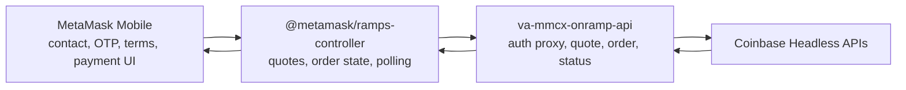

# Coinbase Native: Headless Guest Checkout Plan

> Add Coinbase Headless Onramp as a native guest provider across the on-ramp API, ramps controller, and MetaMask Mobile while keeping hosted Coinbase as a separate sign-in-only provider. Phase 0 proves the payment and API contracts, Phase 1 ships the minimum safe flow, and Phase 2 adds hardening and the separately gated Transak proxy migration.

## Phases checklist

- [ ] **Phase 0** - Confirm Coinbase contracts, prove mobile payment bridges, and settle security and configuration decisions
- [ ] **Phase 1** - Ship the Coinbase Headless guest flow across the backend, ramps controller, and mobile
- [ ] **Phase 2** - Harden coexistence and recovery, then move Transak authentication behind the proxy when approved

---

## Background and scope

Coinbase documents hosted Guest Checkout as deprecated on June 30, 2026. The documentation still uses future tense and the Coinbase changelog does not confirm enforcement, so the live state is a Phase 0 confirmation. The July 31, 2025 date from earlier discussions was a separate session-token requirement, not the hosted Guest Checkout deadline.

The two Coinbase products serve different payment methods and must remain separate:

| Flow              | Surface                                        | Payment methods after hosted guest removal                                    | Scope     |
| ----------------- | ---------------------------------------------- | ----------------------------------------------------------------------------- | --------- |
| Hosted Coinbase   | Existing `coinbase` and `coinbase-m` providers | Coinbase balances, linked bank or instant ACH, and linked cards after sign-in | Unchanged |
| Coinbase Headless | New `coinbase-native` provider                 | Guest Apple Pay on iOS and guest Google Pay on Android                        | In scope  |

Headless is the only future Coinbase guest path. Its public Create Order contract supports Apple Pay and Google Pay guest enums only. It does not provide typed-card entry or ACH. Guest typed-card entry therefore has no Coinbase Headless successor. Users who need to type a card can sign in to Coinbase where applicable or choose another provider.

Mobile-only is a MetaMask scope choice, not a Coinbase platform limit. The extension stays on hosted Coinbase and becomes sign-in-only when Coinbase enforces the hosted guest removal.

Do not set `nativeCounterpart` between hosted and Headless Coinbase. The products have disjoint payment methods, so payment-blind deduplication or native preference could hide the only provider that supports the user's method. Both entries must remain visible with distinct names.

Companion to [PLAN.md](./PLAN.md) and [PLAN\_-_ALL_PROVIDERS_SUPPORT.md](./PLAN_-_ALL_PROVIDERS_SUPPORT.md).

---

## Architecture at a glance

Coinbase credentials, CDP responses, partner identity derivation, verification calls, order creation, and authenticated order status calls stay server-side. Mobile stores only the minimum recovery state in device-only secure storage.

---

## Phase 0 - Launch gates and contract decisions

Goal: remove payment, API, privacy, and identity uncertainty before production flow work starts. Phase 1 does not launch until the payment bridges and required Coinbase contracts are proven.

### Coinbase confirmations

Treat each item below as an open question, not as a current fact:

- Confirm whether Coinbase has enforced the June 30, 2026 hosted Guest Checkout deprecation.
- Confirm production readiness for Google Pay across Create Order, guest quote, lifecycle events, approval, and commercial access. Coinbase documentation and API behavior are inconsistent, so keep Google Pay disabled until the answer is written and tested.
- Confirm whether email verification expires on the same 60-day schedule Coinbase documents for phone re-verification.
- Confirm whether managed email and SMS verification IDs can be reused across multiple orders while valid.
- Confirm whether Create Order supports idempotency and which request field or header provides it.
- Confirm access fees and commercial terms.
- Confirm whether iOS requires any entitlement beyond the public mobile WebView requirements.
- Confirm current lifecycle event names and payloads, including the documented differences around payment success and polling success.

Record the answers in this plan or linked implementation tickets before removing the corresponding gates.

### Mobile payment bridge validation

The Coinbase React Native demo is not proof that the MetaMask WebView works. The demo omits `enableApplePay`, while MetaMask enables it. That setting changes the iOS bridge and can prevent standard `ReactNativeWebView` messages from arriving. Coinbase's iOS native sample uses the `cbOnramp` message handler instead.

Before Phase 1 implementation:

- Build a narrow test screen in `app/components/UI/Ramp/Views/HeadlessPlayground/` using the same patched `@metamask/react-native-webview` and settings as production Checkout.
- On a physical iPhone, open a sandbox order, require the user to tap Apple Pay, complete or cancel the sheet, and verify every required lifecycle event. Never auto-click or script the Apple Pay action.
- Verify events with `enableApplePay` enabled. If `ReactNativeWebView` events do not arrive, choose and prove one minimal path:
  - Patch the WebView fork to register the `cbOnramp` handler and forward messages through the existing React Native event surface.
  - Add a dedicated native `WKWebView` wrapper for Coinbase payment links.
- On Android, verify the Chromium Payment Request manifest query actions, WebView version 137 or newer, Google Play services 25.18.30 or newer, Google Pay production approval, and the production payment sheet on a supported physical device.
- Keep payment initiation behind an explicit user action on both platforms.

Deliverable: physical-device evidence for the pay sheet and lifecycle events on every enabled platform, plus a documented bridge choice.

### Quote and order contract

Settle one normalized contract across all three repositories:

- Pre-verification quotes call Coinbase `/onramp/v1/buy/quote` with the guest payment enum. The backend adapter maps MetaMask payment method IDs to Coinbase guest enums and maps the response back to the shared quote shape.
- Final order creation calls `/platform/v2/onramp/orders` only after required verification and terms acceptance.
- Treat Create Order as the final price. Replace stale quote amounts, fees, exchange rate, and totals with the returned order values before persisting or displaying them.
- Keep Google Pay mappings and provider availability gated until its production contract is confirmed.
- Do not automatically retry an ambiguous Create Order failure until Coinbase confirms idempotency. A timeout after Coinbase receives a request can otherwise create a duplicate order.

### Partner identity and secret policy

`partnerUserRef` is a server-derived, non-reversible identifier:

- Derive it from the authenticated profile ID using a dedicated long-lived HMAC secret. Do not reuse `RAMPS_HASHING_SALT`.
- Use a versioned, truncated base64url format that fits Coinbase's 50-character maximum.
- Reserve room for the `sandbox-` prefix. The value before that prefix must be no longer than 42 characters.
- Store current and prior derivation-key versions in Secrets Manager. Status and history lookup must continue to recognize orders made with retained versions during rotation.
- Require the profile bearer token for every Coinbase auth, order, and status route. There is no anonymous fallback.

### Terms, configuration, and provider discovery

- Define a Coinbase terms version. Persist the actual acceptance timestamp and accepted version, not a boolean that generates a new timestamp per order.
- Force re-consent when the configured terms version changes.
- Do not require `applePayMerchantId` for the public Headless order contract. Keep any additional iOS entitlement as a Phase 0 confirmation.
- Use the same Coinbase v2 endpoint for sandbox and production. Sandbox uses a `sandbox-` partner reference and `useApplePaySandbox` or `useGooglePaySandbox`.
- Reject sandbox prefixes and sandbox flags in production.
- Define `coinbase-native` and `coinbase-native-staging` in `ProvidersService`, with separate display names, logos, translations, and configuration.
- Cover US region, USD fiat, wallet payment methods, supported assets and networks, iOS and Android platform rules, and environment rules in provider discovery tests.
- Add a server-side enable flag and check it at discovery, send-OTP, verify-OTP, quote, Create Order, and status endpoints. Account for public provider-response caching when defining shutoff behavior.

Deliverable: approved contract notes, provider configuration, key-rotation policy, and a kill-switch test matrix.

---

## Phase 1 - Ship the working guest flow

Goal: ship a mobile-only Coinbase guest flow with authenticated server mediation, explicit privacy boundaries, recoverable order state, and no behavior change to Transak or hosted Coinbase.

### Backend: `va-mmcx-onramp-api`

Add a `CoinbaseHeadlessProvider` module and register it through `ProvidersService`.

#### Authentication and verification

- Add provider-scoped routes:
  - `POST /providers/{providerId}/auth/send-otp`
  - `POST /providers/{providerId}/auth/verify-otp`
- Require the profile bearer token and re-check the provider enable flag on both routes.
- Proxy Coinbase managed verification without storing email, phone, OTPs, or verification IDs server-side.
- Return only normalized verification results needed by the mobile flow.

#### Quotes and orders

- Route guest quote requests to `/onramp/v1/buy/quote` and Create Order requests to `/platform/v2/onramp/orders`.
- Validate region, fiat, asset, network, destination wallet, payment enum, verification IDs, terms version, and the original terms acceptance timestamp.
- Derive `partnerUserRef` from the authenticated profile and pass the trusted request origin IP where Coinbase requires it.
- Return a normalized order and payment link. Final Coinbase amounts and fees replace quote-time values.
- Register native order mapping in `GetOrderService` and add both Coinbase Native provider IDs to its native provider set.

#### Secure order status

The current unified order endpoint cannot be reused unchanged because it lacks JWT enforcement and native orders are not necessarily bound to wallet ownership.

- Require bearer authentication for Coinbase Native status.
- Bind status lookup to the HMAC-derived profile identity and the destination wallet stored in the local order recovery record.
- Update the `RampsService` provider path to send bearer auth for Coinbase status requests.
- Define locked-wallet behavior: pause authenticated active polling while the wallet or profile token is unavailable, keep the local record, and resume after unlock. Do not downgrade to an unauthenticated request.
- Reject cross-profile or wrong-wallet status access even when a Coinbase order ID is known.

#### Privacy and observability

Do not rely on the existing pino secret-value redaction. It does not cover arbitrary structured request bodies or telemetry spans.

- Prohibit logging email, phone, OTPs, verification IDs, payment links, session tokens, authorization headers, and Coinbase CDP responses by construction.
- Log only allowlisted fields such as provider ID, route outcome, normalized error code, duration, and non-sensitive order status.
- Apply the existing response-status and endpoint-latency interceptors after confirming their captured attributes are allowlisted.
- Add unit tests that capture logs and telemetry for success and failure paths and assert that prohibited values never appear in string messages, structured fields, errors, or spans.

#### Stale orders and retries

Coinbase may leave an abandoned order in `PROCESSING` indefinitely.

- Persist a local recovery record after Create Order returns, including provider order ID, destination wallet, profile-key version, payment method, creation time, and last observed provider status.
- Stop active polling after a Coinbase-specific deadline. Mark the local record incomplete or abandoned without inventing a Coinbase status.
- Reconcile retained records on a later authenticated session and accept a real terminal Coinbase status if one appears.
- Exclude attempts that failed before Coinbase committed an order from success analytics.
- Do not retry ambiguous Create Order failures automatically.

Tests: JWT and enable-flag enforcement, guest payment mappings, partner reference length and rotation, terms timestamp and version, quote-to-final-order replacement, production sandbox rejection, privacy assertions, status ownership, locked-wallet pause and resume, ambiguous Create Order handling, and stale-order reconciliation.

### Core: `packages/ramps-controller`

- Add a thin `CoinbaseService` that talks only to the MetaMask on-ramp API.
- Add Coinbase controller actions and non-persisted transient state under `nativeProviders.coinbase`.
- Reuse shared order insertion, polling, and `orderStatusChanged` behavior, with Coinbase-specific polling deadlines and bearer-auth status calls.
- Publish `@metamask/ramps-controller` before updating mobile.

Change only `#resolveProviderIdsForQuote` controller-driven automatic provider selection:

- Leave the normal user-selected provider flow unchanged.
- Normalize payment IDs before comparison, including `apple-pay` and `/payments/apple-pay`.
- Treat any overlap between requested and supported payment methods as support.
- Fail open when `supportedPaymentMethods` is absent.
- Filter unsupported providers before applying existing selected, history, native, and fallback precedence.
- Support more than one native provider without assuming Transak is the only native option.

Tests: legacy and canonical payment IDs, any-overlap matching, missing metadata, disjoint support, multiple matching native providers, precedence after filtering, and unchanged explicit user selection.

### Mobile: `metamask-mobile`

#### Provider routing and presentation

- Update `app/components/UI/Ramp/hooks/useContinueWithQuote.ts` to dispatch native continuation by provider ID instead of treating every native quote as Transak.
- Add Coinbase screens under `app/components/UI/Ramp/Views/NativeFlow/` using only the presentation primitives needed for contact entry and OTP.
- Extract reusable contact and OTP presentation from Transak where needed, while leaving Transak's live wrappers, service calls, test IDs, analytics, and `ProviderTokenVault` unchanged in Phase 1.
- Add distinct Coinbase Native names, logos, translations, support links, and provider descriptions that explain guest Apple Pay or Google Pay.

#### Device recovery state

- Add a Coinbase-scoped vault that follows current SecureKeychain, device-only, and wallet-reset conventions. It may later become a shared native provider vault, but that refactor is not required in Phase 1.
- Store `emailVerificationExpiresAt` and `smsVerificationExpiresAt` separately. Coinbase documents phone re-verification at least every 60 days; use the confirmed email contract from Phase 0 rather than assuming the same expiry.
- Reuse verification IDs only when both the email and phone destinations exactly match and neither verification is expired.
- Store the local order recovery record needed for authenticated status reconciliation.
- Never store OTP values, payment links, bearer tokens, or CDP responses in the vault.

#### Consent and checkout

- Add a Coinbase terms screen that persists the accepted terms version and actual acceptance timestamp.
- Create the order only after email, US phone, and terms requirements pass.
- Load the returned payment link through the bridge proven in Phase 0.
- Parse only allowlisted Coinbase lifecycle events. Keep controller polling as the order source of truth.
- Keep the WebView open when Coinbase commits the order and polls for payment, unless the proven event contract requires another lifecycle.
- Fire `onOrderCreated` once for a committed Coinbase order and retain the recovery record even when the user closes the payment sheet.

#### Limits and availability

- Restrict the initial provider to the US and USD with platform-appropriate wallet pay.
- Surface real Coinbase limit errors. The documented default is a $500 rolling seven-day limit and 15 lifetime transactions. Eligible users may upgrade to $2,500 and unlimited lifetime transactions.
- Defer the upgrade experience. V0 must not present the upgraded limit as the default.
- Keep hosted Coinbase available for signed-in balances, linked bank or instant ACH, and linked cards.

#### Mobile verification

- Extend `app/components/UI/Ramp/Views/HeadlessPlayground/` to select `coinbase-native-staging`, request real quotes, start the Coinbase flow, and show a privacy-safe lifecycle log.
- Test the Coinbase provider adapter, contact and OTP presentation, separate verification expiry, terms versioning, provider dispatch, payment event parsing, one-time order callback, locked-wallet polling pause, stale-order recovery, and kill-switch behavior.
- Add one Coinbase Appium smoke flow only after the sandbox and physical-device bridge paths are stable.
- Re-run the existing Transak native suites to prove its wrappers and vault behavior did not change.

Deliverable: an authenticated US user can complete the required verification, accept the current terms, create a Coinbase Headless order, explicitly open Apple Pay or Google Pay, and recover order status after closing or locking the app.

---

## Phase 2 - Hardening and Transak proxy migration

Goal: improve recovery and provider coexistence after Coinbase production behavior is known, then reuse the provider-scoped authentication routes for Transak without coupling that migration to the Coinbase launch.

### Coinbase hardening

- Verify that hosted and Headless Coinbase remain visible as two distinct entries across mobile, extension, and SDK consumers of the cached provider response.
- Review reliability sorting when Coinbase Native has no reliability ID. Sorting last is acceptable only as an explicit product decision.
- Keep monitoring hosted `/buy/config` for payment methods that lead account-less users into a sign-in wall. Filter stale advertised methods server-side only when production behavior proves the need.
- Add webhook ingestion, durable server storage, HMAC verification, replay protection, idempotency, and out-of-order reconciliation only if polling evidence justifies that system.
- Add a limits-upgrade handoff only after Coinbase confirms the supported path and product decides it is needed.
- Add dashboards and alerts in `va-mmcx-onramp-apps-infra` from allowlisted metrics only.

### Transak authentication proxy

- Move Transak send-OTP and verify-OTP calls to the provider-scoped backend routes from TRAM-3484 only after the TRAM-3458 Legal gate is cleared.
- Keep KYC, user details, and order proxying out of scope.
- Move Transak onto shared live wrappers or a generalized provider vault only in this phase, with explicit migration and regression tests.

Tests: two-entry discovery and naming, public cache kill-switch behavior, reconciliation after local abandonment, optional webhook replay and ordering if built, and full Transak native regression coverage for any proxy or vault migration.

Deliverable: production evidence supports the chosen recovery model, Coinbase coexistence stays payment-correct, and any approved Transak proxy move lands independently.

---

## Security and privacy rules

- Keep Coinbase credentials and all Coinbase API traffic server-side.
- Authenticate every verification, order, and status route.
- Bind order access to both derived profile identity and destination wallet.
- Collect only the contact and verification data required by Coinbase.
- Never emit prohibited PII, credentials, verification artifacts, payment links, or CDP bodies to logs, analytics, traces, crash reports, or support diagnostics.
- Keep device recovery data provider-scoped, device-only, purgeable on wallet reset, and bounded by verification and order retention rules.
- Preserve prior HMAC key versions only for the defined rotation and history window.

---

## Deferred

- Coinbase verification or order webhooks unless polling evidence requires them.
- Limits upgrade UI.
- A general `NativeProviderVault` refactor.
- Transak live wrapper and vault migration before Phase 2.
- Broader shared OTP behavior changes that are not needed for Coinbase.

## Out of scope

- Changes to hosted Coinbase sign-in, balances, linked bank or instant ACH, or linked cards.
- A typed-card successor for hosted Guest Checkout.
- Coinbase Headless on MetaMask Extension.
- Web Headless iframe support, domain allowlisting, or QR fallback.
- Coinbase login inside the native guest flow.
- Setting `nativeCounterpart` or hiding either Coinbase provider through brand deduplication.
- Automatically retrying ambiguous Create Order requests without a confirmed idempotency contract.
