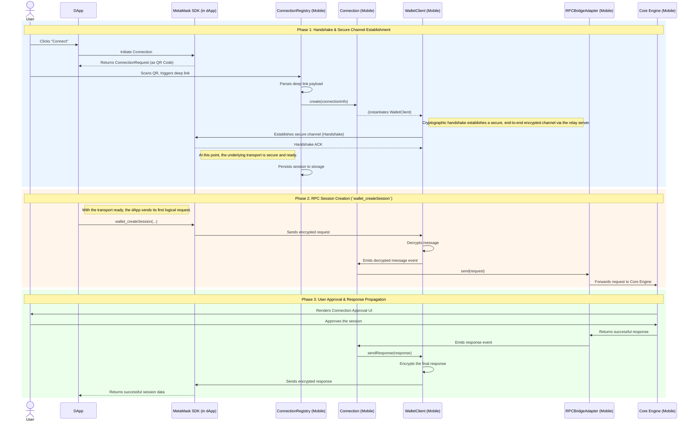

# SDK Connect V2 Technical Documentation

This document provides a technical guide for developers working on the SDK Connect V2 feature. It covers environment setup, core architecture, and data flows.

## Setup, Workflow & Testing

This section contains the necessary commands and configuration for development and debugging.

### Setup logging

#### Enabling V2 Debug Logging

V2-specific logs are disabled by default. Enable them for development.

*   **Action:** Add the following line to your `.js.env` file:
    ```sh
    export SDK_CONNECT_V2_DEBUG="true"
    ```
*   **Purpose:** To activate detailed logging from the V2 module.

#### Useing `adb logcat`

The standard Metro logger is cleared on app restarts, making it unsuitable for debugging connection lifecycles. Use `adb logcat` instead.

*   **Action:** Run this command in a separate terminal:
    ```sh
    adb logcat | grep 'ReactNativeJS:.*\[.\?SDKConnectV2\]'
    ```
*   **Purpose:**
    1.  **Filters noise:** Displays only logs from the `SDKConnectV2` module.
    2.  **Preserves logs:** The OS-level buffer persists through app kills and cold starts, which is a requirement for testing connection resumption flows.

### Useful commands

#### Generate an LLM Context for SDKConnectV2

To analyze the codebase with an LLM, you can generate a focused context file.

*   **Action:** Run the provided command:
    ```sh
	npx repomix app/ -o ./temp/llm.txt \
	--include="core/SDKConnect/**/*,core/Engine/controllers/permission-controller/**/*,core/Engine/controllers/approval-controller/**/*,core/Engine/controllers/transaction-controller/**/*,core/Permissions/**/*,core/DeeplinkManager/**/*,core/RPCMethods/**/*,reducers/sdk/**/*,actions/sdk/**/*,reducers/engine/**/*,selectors/**/*,Views/confirmations/**/*,Views/ReturnToAppModal/**/*,components/UI/SDKLoading/**/*,util/**/*,constants/navigation/Routes.ts,constants/deeplinks.ts,core/BackgroundBridge/**/*,core/SDKConnectV2/**/*,components/Views/SDK/**/*,components/UI/TransactionHeader/**/*,components/Views/AccountConnect/**/*,components/Views/MultichainAccounts/**/*,components/UI/AccountInfoCard/**/*,components/hooks/useOriginSource.*,components/Views/confirmations/components/blockaid-alert-content/**/*,components/Views/confirmations/legacy/components/BlockaidBanner/**/*,components/Views/confirmations/legacy/components/PersonalSign/**/*,components/Views/confirmations/components/rows/**/*,components/Views/confirmations/components/info/**/*,components/Views/confirmations/components/UI/info-row/**/*,lib/ppom/ppom-util.*,util/confirmation/signatureUtils.*,core/createTracingMiddleware/**/*,components/UI/MultichainTransactionListItem/**/*,components/Views/MultichainTransactionsView/**/*,components/Views/ActivityView/**/*,components/UI/TransactionElement/**/*,components/Views/TransactionsView/**/*" \
	--ignore="**/*.test.ts,**/*.snap,**/*.stories.*,**/*.json,**/*.svg,**/*.test.tsx,util/notifications/**/*,util/identity/**/*,selectors/featureFlagController/**/*,selectors/earnController/**/*,util/test/**/*,selectors/**/*testUtils*,util/onboarding/**/*,util/theme/**/*,util/metrics/**/*,util/sentry/**/*,util/address/,util/conversion/,util/number/,util/termsOfUse/termsOfUseContent.ts,core/WalletConnect/WalletConnectV2.ts"
    ```
*   **Purpose:** This script uses `npx repomix` to aggregate all relevant source files into a single `llm.txt`. This provides a comprehensive context for an LLM to answer questions about the feature's implementation, saving you from manual code discovery.

## Core Concepts

This section explains the technical problem and the high-level architecture designed to solve it.

### Problem

The primary goal of the MetaMask SDK is to make it easy for developers to integrate their dApps with MetaMask. However, the ways users interact with dApps are incredibly diverse.

Traditionally, connections happen in a controlled environment like the MetaMask Mobile in-app browser or a desktop browser with the extension, where the dApp and the wallet can directly communicate. But what about the "long tail" of other environments?

- A user wanting to connect on a desktop app.
- A user wanting to connect on a smart TV.
- A user wanting to connect from an untrusted device.

In technical terms: The primary challenge is to **establish a secure, bidirectional communication channel between a dApp and the mobile wallet when no direct execution environment is shared.**

### Architecture

The solution is composed of three distinct components, each with a clear responsibility.

1.  **MetaMask SDK (In the dApp)**
    *   **Responsibility:** Provides a developer-facing API to initiate a connection. It generates a `ConnectionRequest` (via QR code or deeplink) and handles the dApp's side of things.

2.  **Mobile Wallet Protocol (MWP)**
    *   **Responsibility:** A UI/platform/message agnostic, low-level protocol that defines how to establish a secure, end-to-end encrypted communication channel. Its only function is to transport opaque, encrypted messages between two clients (via a relay).

3.  **Mobile App Integration (SDK Connect V2)**
    *   **Responsibility:** The implementation of the MWP on the wallet side, located at `app/core/SDKConnectV2`. It handles incoming deep links, manages the state of multiple connections, and integrates with the wallet's core engine.

## Deep Dive

This section details the internal structure and key components of the `SDKConnectV2` module.

### Core Design Principle: Decoupling via Adapters

The module is architecturally decoupled from the rest of the application. The core business logic in the `services` directory does not directly import or depend on Redux, UI components, or other controllers.

All external interactions are handled through an **adapter layer**. This design principle simplifies the core logic, improves testability, and prevents tight coupling between the feature and the main application.

### `ConnectionRegistry.ts`

This is the central service that manages the lifecycle of all V2 connections. As a singleton, its primary responsibilities are:

*   **Processing Incoming Connections:** It serves as the entry point for new sessions via its `handleConnectDeeplink` method.
*   **Managing Active Connections:** It maintains a `Map` of all active `Connection` objects, allowing the wallet to be connected to multiple dApps simultaneously.
*   **Session Resumption:** On a cold start, it loads all persisted sessions from storage and calls `resume()` on them to re-establish communication channels.

### `Connection.ts`

An instance of this class represents a single, active session with a dApp. Its main function is to connect the protocol layer with the application layer. It holds the `WalletClient` (from MWP) and uses the `IRPCBridgeAdapter` to pass messages to and from the wallet's core engine.

### Handling Stale Connections

Mobile OS may terminate background processes, including WebSocket connections, to save power. This can lead to a "stale" connection where the client-side code believes a connection is active when the underlying socket is closed.

The system mitigates this by listening to `AppState` changes. When the app returns to the foreground, the `ConnectionRegistry` calls **`reconnect()`** on all active connections to ensure the communication channel is healthy. This is distinct from **`resume()`**, which only runs once on cold start to load sessions from storage.

### Adapters

*   **`IHostApplicationAdapter`:** Mediates interactions with the application's UI and state. For example, when a connection is being established, the `ConnectionRegistry` calls `showConnectionLoading()`. The adapter's implementation handles the actual work of dispatching the appropriate Redux action to show a notification.

*   **`IRPCBridgeAdapter`:** Connects a `Connection` instance to the wallet's `BackgroundBridge` to handle RPC requests. This adapter has two key optimizations:
    1.  **Lazy Initialization:** It only creates an instance of the `BackgroundBridge` on the first RPC request for a given session, conserving memory.
    2.  **Message Queuing:** If an RPC request arrives while the wallet's keyring is locked or the engine is not ready, the adapter queues the request. It processes the queue automatically upon receiving an `unlock` event, guaranteeing message delivery.


## End-to-End Flow: A Connection's Journey Illustrated

This section provides a complete, step-by-step walkthrough of the entire connection process. It follows the journey from the user's initial interaction in the dApp to the establishment of a secure channel and the processing of the first RPC message.

The sequence diagram below illustrates the key participants and the flow of information between them.



### Flow Breakdown

The process can be broken down into three main phases:

#### **Phase 1: Handshake & Secure Channel Establishment**

The initial goal is to create a secure, encrypted communication line. This is a transport-level concern, handled by the Mobile Wallet Protocol (MWP).

1.  **Initiation:** The user clicks "Connect" in the dApp. The dApp's **MetaMask SDK** generates a `ConnectionRequest` payload and displays it as a QR code.
2.  **Deep Link:** The user scans the QR code, which triggers a `metamask://connect/mwp?p=...` deep link, causing the OS to open the MetaMask Mobile app and pass it the URL.
3.  **Processing:** The app's **`ConnectionRegistry`** receives and parses the `ConnectionRequest` from the URL.
4.  **Handshake:** The `ConnectionRegistry` creates a new **`Connection`** instance, which in turn instantiates a **`WalletClient`**. This `WalletClient` performs the cryptographic handshake with the dApp's **MetaMask SDK** to establish an end-to-end encrypted channel.
5.  **Persistence:** Upon a successful handshake, the **`ConnectionRegistry`** persists the new session's metadata to storage.

At the end of this phase, a secure channel exists, but the dApp has not yet been granted any permissions by the user. The mobile app is now simply listening for incoming messages on this channel.

#### **Phase 2: RPC Session Creation (`wallet_createSession`)**

With the secure channel established, the dApp can now send its first logical RPC request. For multichain compatibility, this is `wallet_createSession`, which formally requests access to the user's accounts.

1.  **Request:** The dApp calls `wallet_createSession` through the **MetaMask SDK**.
2.  **Encryption & Transmission:** The SDK encrypts the JSON-RPC payload and sends it over the secure channel.
3.  **Decryption:** The mobile app's **`WalletClient`** receives the message, decrypts it, and emits it as an event.
4.  **Internal Routing:**
    *   The corresponding **`Connection`** instance catches the event.
    *   It passes the request to the **`RPCBridgeAdapter`**.
    *   The adapter forwards the request to the wallet's **Core Engine** for processing.

#### **Phase 3: User Approval & Response Propagation**

This phase involves user interaction and the return journey of the response.

1.  **User Approval:** The **Core Engine** determines that `wallet_createSession` requires user consent. It pauses execution and triggers the rendering of a UI component asking the user to approve or reject the connection to the dApp.
2.  **Confirmation:** The user approves the connection.
3.  **Response Path:**
    *   The **Core Engine** generates a successful response containing the requested account information.
    *   The response is sent back to the **`RPCBridgeAdapter`**, which emits it as an event.
    *   The **`Connection`** instance catches the response and calls `sendResponse` on the **`WalletClient`**.
    *   The **`WalletClient`** encrypts the response payload.
    *   Finally, the encrypted response is sent back over the secure channel to the **MetaMask SDK**, which decrypts it and returns the result to the dApp.

The connection is now fully established at both the transport and RPC levels, and the dApp can proceed with further requests.