# Sample Feature

## Overview

The Sample Feature is a development and testing feature that demonstrates best practices and patterns for building features in MetaMask Mobile. This feature serves as a comprehensive reference implementation showcasing various aspects of the application architecture.

> [!WARNING]
> This is a sample feature for development/testing purposes only and should not be activated in production builds.

```mermaid
graph TB
    %% Developer Actor
    Dev[👨‍💻 Developer]

    %% Developer Use Cases
    Dev --> ActivateFeature[Activate Sample Feature with env var flag]
    Dev --> RunE2ETests[Run E2E Tests]
    Dev --> RunUnitTests[Run Unit Tests]
    Dev --> TestFeatureFlags[Test Feature Flags]
```

```mermaid
graph TB
    %% User Actor
    User[👤 User]

    %% User Use Cases
    User --> IncrementCounter[Increment Counter]
    User --> AddPetName[Add New Pet Name]
    User --> UpdatePetName[Update Pet Name]
    User --> SwitchNetwork[Switch Network]
    SwitchNetwork --> SeePetNamesEffect[See Effect on Pet Names List]
```





## Purpose

This feature demonstrates:

- Feature-based modular architecture
- State management using Redux Toolkit and Controllers
- Form validation and error handling
- Navigation patterns within the app
- UI component library usage and styling
- MetaMetrics tracking implementation
- Performance tracing patterns and monitoring
- Comprehensive unit testing
- End-to-end testing

## Architecture

### Directory Structure

The SampleFeature folder structure intentionally mirrors the main `/app` folder structure to demonstrate how features integrate with the broader application architecture. This allows the sample feature to showcase patterns without mixing sample code with production features.

> [!IMPORTANT]
> When creating real features, place them alongside existing production features in their respective directories:

- Components in `/app/components/`
- Redux state in `/app/reducers/`
- Controllers in `/app/core/controllers/`
- Selectors in `/app/selectors/`
- Analytics in `/app/core/Analytics/`
- ...

The SampleFeature's structure mirrors the main `/app` directory. This helps devs quickly identify where to place their feature files in the main app: components, controllers, reducers, etc.

```
app/features/SampleFeature/
├── analytics/              # MetaMetrics event definitions
│   └── events.ts
├── components/             # React components
│   ├── hooks/             # Custom React hooks
│   │   ├── useSampleCounter/
│   │   ├── useSampleNetwork/
│   │   ├── useSamplePetNames/
│   │   └── useSamplePetNamesForm/
│   └── views/             # UI components
│       ├── SampleFeature.tsx           # Main feature component
│       ├── SampleFeature.styles.ts     # Main feature styles
│       ├── SampleFeature.test.tsx      # Main feature tests
│       ├── SampleCounterPane/          # Counter demo
│       ├── SampleNetworkDisplay/       # Network display
│       ├── SamplePetNames/             # Pet names management
│       ├── SampleFeatureDevSettingsEntryPoint/ # Settings entry point
│       └── __snapshots__/              # Test snapshots
├── controllers/           # Business logic controllers
│   ├── sample-petnames-controller-init.ts
│   └── sample-petnames-controller-messenger.ts
├── reducers/              # Redux state management
│   └── sample-counter/
├── selectors/             # Redux selectors
│   └── samplePetNameController/
├── e2e/                   # End-to-end tests
│   ├── sample-scenarios.feature
│   ├── utils.ts
│   ├── README.md
│   ├── pages/
│   ├── selectors/
│   └── specs/
└── README.md              # This documentation file
```

## Components

### 1. Sample Counter

A simple counter implementation demonstrating:

- Redux Toolkit state management
- Custom hooks (`useSampleCounter`)
- Action dispatching
- MetaMetrics event tracking

**Key Files:**

- `components/hooks/useSampleCounter/`
- `reducers/sample-counter/`
- `components/views/SampleCounterPane/`

### 2. Sample Pet Names

A more complex feature showing:

- Controller-based state management
- Form validation with error handling
- Network-specific data storage
- CRUD operations

**Key Files:**

- `controllers/sample-petnames-controller-init.ts`
- `controllers/sample-petnames-controller-messenger.ts`
- `components/hooks/useSamplePetNames/`
- `components/views/SamplePetNames/`

### 3. Sample Network Display

Demonstrates:

- Network state integration
- Dynamic UI updates based on network changes
- Component library usage

**Key Files:**

- `components/hooks/useSampleNetwork/`
- `components/views/SampleNetworkDisplay/`

## State Management Patterns

This feature demonstrates two state management approaches following MetaMask standards:

### Redux Pattern (Counter Example)

The counter demonstrates Redux Toolkit patterns following MetaMask standards. See the [MetaMask Contributor Documentation](https://github.com/MetaMask/contributor-docs/tree/main/docs) for Redux guidelines.

- Redux Toolkit slice with actions and reducers
- Selectors for accessing state
- Custom hooks for component integration
- Dispatch pattern for state updates
- Modern Redux best practices with RTK

### Controller Pattern (Pet Names Example)

The pet names feature showcases the Controller pattern:

- Controller initialization with messenger and persisted state
- Hook abstraction for component usage
- Network-specific state management
- Asynchronous operations handling

## Form Validation and Error Handling

The Pet Names form demonstrates comprehensive validation:

- **Address Validation**: Ethereum address format validation
- **Required Fields**: Name field validation
- **Duplicate Handling**: Shows confirmation dialog for existing addresses
- **Error States**: Visual feedback for validation errors
- **Keyboard Handling**: Proper keyboard dismissal and scroll behavior

## Navigation Patterns

### Accessing the Feature

1. Enable Developer Mode in app settings
2. Navigate to Settings → Developer Options
3. Tap "Navigate to Sample Feature"

### Internal Navigation

- Uses React Navigation integration
- Demonstrates proper back navigation
- Shows modal patterns (duplicate entry confirmation)

## UI Component Library Usage

The feature extensively uses the MetaMask component library:

- Text components with proper color and variant props
- Button components following design system
- TextField components with validation states
- Layout components for consistent spacing

### Styling Patterns

- Uses `useStyles` hook for theming
- Follows MetaMask design system
- Responsive layout with KeyboardAwareScrollView

## MetaMetrics Tracking

Events are defined in `analytics/events.ts` following the event builder pattern:

- Centralized event definitions in a dedicated analytics module
- Event builder helper functions for consistent event creation
- Type-safe event generation using the `generateOpt` utility
- Integration with the global MetaMetrics system
- Separation of event definition from event dispatching

### Privacy Considerations

> [!WARNING] > **Critical Privacy Risk**: Even when using `addSensitiveProperties` for anonymous events, linking sensitive data in the same event creates significant privacy risks.
>
> **Example Risk**: Sending a name and address in the same anonymous event allows correlation between the two pieces of data, even if the user identity is unknown.
>
> **Best Practice**: Avoid tracking multiple sensitive data points in the same event. Instead, track aggregate data, metadata, or separate events for different sensitive information.

**Safe Tracking Examples:**

- ✅ `totalPetNames` (aggregate count)
- ✅ `chainId` (public network info)

**Unsafe Tracking Examples:**

- ❌ Name
- ❌ Address

## Performance Tracing

The Sample Feature demonstrates MetaMask's dual performance monitoring approach using both Sentry tracing and Redux performance tracking:

### Sentry Tracing (`useSamplePetNames.ts`, `useSamplePetNamesForm.ts`)

**Purpose**: Production aimed performance monitoring with privacy protection.

**Implementation**:

- **`useSamplePetNames.ts`**: Tracks pet names listing operations
  - Trace Name: `SampleFeatureListPetNames`
  - Operation: `sample.feature.list.pet.names`
  - Captures: chainId, petNamesCount, feature context (no addresses or names)
- **`useSamplePetNamesForm.ts`**: Tracks pet name addition operations
  - Trace Name: `SampleFeatureAddPetName`
  - Operation: `sample.feature.add.pet.name`
  - Captures: chainId, feature context (no addresses or names)

**Features**:

- Automatic span creation and management
- Error tracking with performance context
- Integration with Sentry's performance dashboard
- Code-fenced trace names for sample feature isolation
- **Privacy-focused**: No tracking of addresses, names, or other sensitive user data
- **Safe to track**: chainId (public network info), petNamesCount (aggregate count), feature context

### Redux Performance Tracking (`useSampleCounter.ts`)

**Purpose**: Development debugging and testing performance metrics (only active in test environments).

**Implementation**:

- **`useSampleCounter.ts`**: Tracks counter increment operations
  - Event Name: `SAMPLE_COUNTER_INCREMENT`
  - Captures: current count, new count, success/error status
  - Error handling with proper cleanup

**Features**:

- Session-based performance tracking
- Environment metadata collection
- Real-time performance data for debugging
- Development-only activation

### Best Practices Demonstrated

1. **Proper Error Handling**: Both tracing systems ensure traces are ended even when operations fail
2. **Rich Context**: Captures relevant metadata for debugging and performance analysis
3. **Code Fencing**: Sample feature specific trace names are only included when the feature is enabled
4. **Consistent Naming**: Uses descriptive names and structured metadata
5. **Testing Integration**: Comprehensive unit tests verify tracing functionality without making actual API calls

### Monitoring and Debugging

- **Development**: Redux DevTools for performance metrics in test environments
- **Production**: Sentry performance dashboard for real-world performance data
- **Error Tracking**: Automatic error capture with performance context
- **Testing**: Comprehensive unit tests with mocked tracing utilities

## Feature Selection

The Sample Feature uses multiple feature selection mechanisms to control its availability and behavior across different environments and use cases.

### Build-Level Feature Selection (Code Fencing)

The Sample Feature uses code fencing to ensure it's completely excluded from production builds. It's only included when explicitly enabled via the `INCLUDE_SAMPLE_FEATURE` environment variable.

#### Enabling the Feature

To include the Sample Feature in your build:

##### For iOS development

```bash
INCLUDE_SAMPLE_FEATURE=true yarn start:ios
```

##### For Android development

```bash
INCLUDE_SAMPLE_FEATURE=true yarn start:android
```

#### How It Works

1. **Code Fencing**: All Sample Feature code is wrapped with code fence comments:
   ```typescript
   ///: BEGIN:ONLY_INCLUDE_IF(sample-feature)
   // Sample feature code here
   ///: END:ONLY_INCLUDE_IF
   ```
2. **Metro Transform**: The Metro bundler removes fenced code during build time based on the environment variable
3. **Zero Production Impact**: When `INCLUDE_SAMPLE_FEATURE` is not set, the code is completely removed from the bundle

#### Default Behavior

- **Production builds**: Feature is always excluded
- **Development builds**: Feature is excluded unless explicitly enabled
- **QA/Beta builds**: Feature is excluded unless explicitly enabled

### Runtime Feature Selection (Remote Feature Flags)

The Sample Feature demonstrates remote feature flag implementation patterns on the counter feature. This shows how to implement conditional UI rendering based on remote feature flags, but the actual flag is not configured in Launch Darkly.

#### Counter Pane Feature Flag

The `SampleCounterPane` component is controlled by the `sampleFeatureCounterEnabled` feature flag, demonstrating how to implement conditional UI rendering based on remote feature flags.

> [!NOTE]
> The `sampleFeatureCounterEnabled` flag is implemented in the sample feature to demonstrate the pattern, but it is **not configured in Launch Darkly**. Developers must use the local environment variable override to test this functionality.

##### Local Override

For development and testing, you can override the feature flag using a local environment variable:

```bash
# Enable the counter pane locally (default behavior)
export MM_SAMPLE_FEATURE_COUNTER_ENABLED="true"

# Disable the counter pane locally
export MM_SAMPLE_FEATURE_COUNTER_ENABLED="false"
```

##### Remote Control

The feature can be controlled remotely via the Launch Darkly feature flag API using the flag name `sampleFeatureCounterEnabled`.

> [!IMPORTANT] > **Launch Darkly Access Required**: To configure and control remote feature flags, developers need access to Launch Darkly. If you don't have access:
>
> - Contact Helpdesk to request Launch Darkly access
> - Or reach out to the platform team for assistance
> - Until access is granted, use the local environment variable override for testing

Read more about remote feature flag at https://github.com/MetaMask/contributor-docs/blob/main/docs/remote-feature-flags.md

##### Behavior Priority

1. **Local Environment Variable** (`MM_SAMPLE_FEATURE_COUNTER_ENABLED`) - Highest priority
2. **Remote Feature Flag** (`sampleFeatureCounterEnabled`) - Fallback (when configured in Launch Darkly)
3. **Default Value** (`true`) - Final fallback - Counter pane is visible by default

##### Testing Scenarios

- **Default**: Counter pane is visible (`MM_SAMPLE_FEATURE_COUNTER_ENABLED="true"`)
- **Local Disable**: Counter pane is hidden (`MM_SAMPLE_FEATURE_COUNTER_ENABLED="false"`)
- **Remote Control**: Counter pane visibility controlled by Launch Darkly API (when flag is configured)
- **Override Mode**: All remote flags disabled, uses local defaults

##### Implementation Details

The feature flag implementation follows MetaMask's established patterns:

- **Selector Location**: `app/features/SampleFeature/selectors/sampleFeatureCounter/`
- **Local Override**: Uses `getFeatureFlagValue` utility function
- **Component Integration**: Conditional rendering in `SampleFeature.tsx`
- **Default Safety**: Defaults to enabled for better developer experience

This demonstrates how to implement feature flags that can be controlled both locally for development and remotely for production rollouts.

## Testing

### Unit Testing

The SampleFeature demonstrates comprehensive testing patterns and best practices:

**Testing Framework:**

- React Native Testing Library for component testing
- Jest as the test runner and assertion library
- Testing hooks with `@testing-library/react-hooks`
- Redux state testing with mock stores

**Key Testing Patterns:**

- Component testing with user interaction simulation
- Hook testing in isolation
- Redux state and action testing
- Mocking external dependencies and modules
- Snapshot testing for UI consistency
- Async operation testing

**Mocking Strategies:**

- Module mocking for native dependencies
- Redux store mocking with `configureStore`
- Navigation mocking for testing navigation flows
- MetaMetrics tracking mock verification
- Controller mocking for isolated component tests

**Best Practices Demonstrated:**

- Descriptive test names following behavior-driven patterns
- Proper test setup and teardown
- Testing user interactions over implementation details
- Accessibility queries for element selection
- Waiting for async operations with `waitFor`
- Testing error states and edge cases
- Minimal snapshot usage focused on critical UI

Each component and hook has corresponding test files:

```bash
# Run specific test
yarn jest app/features/SampleFeature/components/views/SampleFeature.test.tsx

# Run all Sample feature unit test files
yarn jest app/features/SampleFeature --testMatch="**/*.test.ts?(x)"
```

**Test Coverage:**

- Component rendering
- User interactions
- State management
- Hook behavior
- Error scenarios

### End-to-End Testing

Comprehensive E2E tests written in TypeScript demonstrating best practices for Detox testing.

> [!NOTE]
> These e2e tests are for local development only and are not included in CI pipelines since this is a sample feature.

> [!IMPORTANT]
> The Sample Feature must be included in the build using the `INCLUDE_SAMPLE_FEATURE` flag for E2E tests to work.

**Currently Implemented E2E Tests:**

- Basic navigation to Sample Feature (Settings → Developer Options → Sample Feature)
- Feature visibility verification (title, description, container)
- Counter interactions (increment, value verification, persistence)
- Pet name CRUD operations (create multiple pet names, display with truncated addresses)
- Pet names form validation and display
- Page object model structure for maintainable tests

**Test Implementation Status:**
The current E2E implementation includes comprehensive tests for counter functionality and pet name creation. The page object model includes selectors for all major components (counter, pet names, network display) with actual interaction tests implemented.

1. Build the app with Sample Feature included for E2E testing:

   ```bash
   yarn test:e2e:sample:android:build
   ```

   Or for iOS:

   ```bash
   yarn test:e2e:sample:ios:build
   ```

2. Run Sample Feature E2E tests (environment variable included automatically):

   ```bash
   yarn test:e2e:sample:android:debug:run
   ```

   Or for iOS:

   ```bash
   yarn test:e2e:sample:ios:debug:run
   ```

**Without the flag, the Sample Feature won't be in the build and the tests will fail!**

**E2E Implementation Details:**
See [`app/features/SampleFeature/e2e/README.md`](./e2e/README.md) for:

- Page object patterns
- TypeScript configuration
- Selector strategies
- Test structure and organization

**Planned Test Scenarios (Not Yet Implemented):**

- Pet name update/edit functionality
- Duplicate address handling with confirmation dialogs
- Network switching behavior and network-specific data isolation
- Form validation error states and edge cases
- Error handling scenarios for invalid inputs
- UI element styling and accessibility verification

**Key E2E Testing Patterns Demonstrated:**

- Page Object Model for maintainable tests
- Text-based selectors for resilient element targeting
- Proper async handling with Detox waitFor utilities
- Integration with main app E2E page objects
- TypeScript for type-safe test code

## Development Guidelines

### Adding New Components

1. Create component in `components/views/`
2. Add corresponding hook in `components/hooks/` if needed
3. Write unit tests alongside the component
4. Add E2E test scenarios
5. Update analytics events if tracking is needed

### State Management Decision Tree

- **Simple UI State**: Use React hooks (useState, useReducer)
- **Feature-wide State**: Use Redux Toolkit slice
- **Cross-feature State**: Use Controller pattern
- **Form State**: Use custom form hooks with validation

### Code Quality

This feature follows MetaMask's coding standards. See the [MetaMask Contributor Documentation](https://github.com/MetaMask/contributor-docs/tree/main/docs) for guidelines on JavaScript, TypeScript, React, and testing.

> [!IMPORTANT]
> Add `@sampleFeature` JSDoc tag to indicate non-production code.

### Testing Requirements

This feature demonstrates testing patterns aligned with MetaMask standards. See the [testing guidelines](https://github.com/MetaMask/contributor-docs/tree/main/docs/testing) for unit testing, UI integration testing, and E2E testing best practices.

## Common Patterns

### Error Handling

The feature demonstrates proper error handling:

- Try-catch blocks for async operations
- User-friendly error messages
- Analytics tracking for failures
- Recovery strategies

### Form Validation

Address validation includes:

- Ethereum address format checking
- Required field validation
- Real-time validation feedback
- Clear error messaging

### Network-Specific Data

The pet names feature demonstrates network-specific data storage:

- Pet names are isolated per network using chainId
- Each network maintains its own list of pet names
- Switching networks automatically filters the displayed data
- Controller state is partitioned by network identifier

## Resources

- [MetaMask Contributor Documentation](https://github.com/MetaMask/contributor-docs)
- [MetaMask Mobile Architecture Guide](../../docs/architecture.md)
- [Component Library Documentation](../../component-library/README.md)

## Contributing

When contributing to this sample feature:

1. Maintain it as a reference implementation
2. Keep examples simple and focused
3. Document any new patterns thoroughly
4. Ensure all tests pass
5. Update this README with significant changes

> [!NOTE]
> This feature is for demonstration purposes. Real features should follow these patterns but be production-ready.
