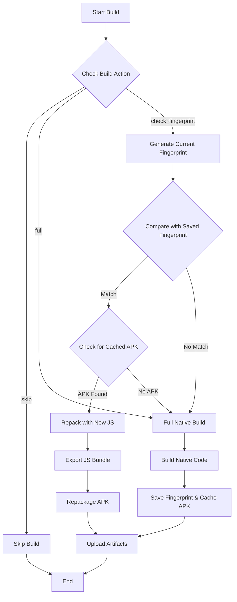

# Build Caching with Fingerprinting

## Overview

The MetaMask Mobile CI/CD pipeline uses a fingerprinting mechanism to optimize build times by detecting when native code has changed. When only JavaScript/TypeScript code changes (but native code remains the same), the system can reuse previously built APKs and simply update the JavaScript bundle, saving significant build time.

## How It Works

### 1. Fingerprinting

The system uses [Expo Fingerprint](https://docs.expo.dev/build-reference/fingerprint/) to generate a unique hash representing the native code dependencies:

- Native modules and their versions
- Platform-specific configuration files
- Build configuration (gradle files, podfiles, etc.)
- Native source code

The fingerprint does NOT include:
- JavaScript/TypeScript source code
- Assets that are bundled separately
- Test files

### 2. Build Decision Flow



### 3. Build Methods

#### Full Build (`build_method: full`)
- Triggered when native code changes are detected
- Builds the complete Android APK from scratch
- Saves the fingerprint and caches the APK for future use
- Time: ~15-20 minutes

#### Repack Build (`build_method: repack`)
- Triggered when only JS/TS code changes
- Reuses cached APK from previous build
- Updates only the JavaScript bundle using `@expo/repack-app`
- Time: ~3-5 minutes (80% faster!)

#### Skip Build (`build_method: skip`)
- Triggered when changes don't affect mobile code (e.g., CI-only changes)
- No build performed
- Time: 0 minutes

## Implementation Details

### Scripts

#### `scripts/generate-fingerprint.js`
Generates a fingerprint hash for the current native code state:
```bash
yarn fingerprint:generate  # Outputs: hash string
```

#### `scripts/check-fingerprint.js`
Compares current fingerprint with saved fingerprint:
```bash
yarn fingerprint:check  # Exit 0 if match, 1 if different
```

### GitHub Actions

#### `.github/actions/fingerprint-build-check`
- Restores previous fingerprint from cache
- Compares fingerprints to determine build method
- Validates cached APK if fingerprint matches
- Outputs: `build_method`, `can_repack`, `cache_hit`

#### `.github/actions/save-build-fingerprint`
- Generates and saves current fingerprint
- Caches build artifacts for future reuse
- Uses GitHub Actions cache with fingerprint as key

### Workflow Integration

The build caching is integrated into the Android E2E build workflow:

```yaml
- name: Fingerprint build check
  id: build-decision
  uses: ./.github/actions/fingerprint-build-check
  with:
    platform: android
    build_action: ${{ inputs.build_action }}
    apk_path: android/app/build/outputs/apk/prod/release/app-prod-release.apk
    pr_number: ${{ github.event.pull_request.number }}

# Different paths based on build decision:
- name: Build Android E2E APKs
  if: ${{ steps.build-decision.outputs.build_method == 'full' }}
  # ... full build steps

- name: Repackage App Binary
  if: ${{ steps.build-decision.outputs.build_method == 'repack' }}
  # ... repack steps
```

## Cache Key Strategy

Cache keys are structured as:
```
{platform}-artifacts-{pr_number}-{fingerprint_hash}
```

This ensures:
- Platform-specific caching (android/ios)
- PR-specific caches to avoid conflicts
- Fingerprint-based invalidation

## Validation & Error Handling

### APK Validation
When repacking, the system validates:
1. **File existence**: Cached APK must exist
2. **File size**: APK must be > 1MB
3. **Size comparison**: Repacked APK should be within 10% of original size
4. **APK structure**: Uses `aapt` to validate APK format (if available)

### Fallback Strategy
If any validation fails during repacking:
1. Restore original APK from backup
2. Fall back to full build
3. Log detailed error information

## Performance Metrics

The system logs detailed performance metrics:
- Build method used (full/repack/skip)
- Cache hit/miss status
- Time saved by using cached builds
- Reasons for full builds

## Troubleshooting

### Common Issues

#### 1. Fingerprint Always Mismatches
- Check that `yarn fingerprint:generate` outputs only the hash
- Verify no console.log statements in generate script
- Ensure consistent environment between builds

#### 2. Repacking Fails
- Check expo export generates bundle at correct path
- Verify @expo/repack-app is installed
- Check APK validation logs for specific errors

#### 3. Cache Not Found
- Verify cache key includes correct PR number
- Check GitHub Actions cache limits (10GB)
- Ensure previous build completed successfully

### Debug Commands

```bash
# Generate and display current fingerprint
yarn fingerprint:generate

# Check if fingerprint matches saved one
yarn fingerprint:check

# Manually test repacking
npx @expo/repack-app \
  --input android/app/build/outputs/apk/prod/release/app-prod-release.apk \
  --output repacked.apk \
  --js-bundle dist/_expo/static/js/android/index.js
```

## Future Improvements

1. **iOS Support**: Extend fingerprinting to iOS builds
2. **Gradle Cache**: Additional caching of gradle dependencies
3. **Metrics Dashboard**: Track cache hit rates and time savings
4. **Smart Invalidation**: More granular fingerprinting for specific modules
5. **Parallel Caching**: Support multiple concurrent PR builds

## References

- [Expo Fingerprint Documentation](https://docs.expo.dev/build-reference/fingerprint/)
- [@expo/repack-app Documentation](https://www.npmjs.com/package/@expo/repack-app)
- [GitHub Actions Cache](https://docs.github.com/en/actions/using-workflows/caching-dependencies-to-speed-up-workflows)
