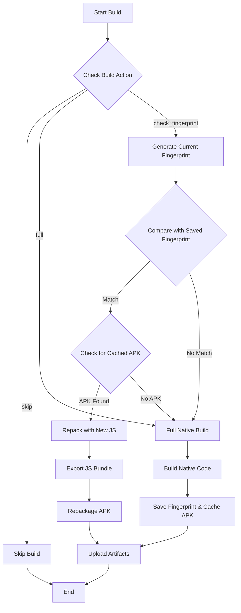

# Build Caching with Fingerprinting

## Overview

The MetaMask Mobile CI/CD pipeline uses a fingerprinting mechanism to optimize build times by detecting when native code has changed. When only JavaScript/TypeScript code changes (but native code remains the same), the system can reuse previously built APKs and simply update the JavaScript bundle, saving significant build time.

> **✅ Current Status**: This feature is now implemented for **both Android and iOS** platforms!

## How It Works

### 1. Fingerprinting

The system uses [Expo Fingerprint](https://docs.expo.dev/build-reference/fingerprint/) to generate a unique hash representing the native code dependencies:

- Native modules and their versions
- Platform-specific configuration files
- Build configuration (gradle files, podfiles, etc.)
- Native source code

The fingerprint does NOT include:
- JavaScript/TypeScript source code
- Assets that are bundled separately
- Test files

### 2. Build Decision Flow



### 3. Build Methods

#### Full Build (`build_method: full`)
- **Android & iOS**: Triggered when native code changes are detected
- Builds the complete APK/IPA from scratch
- Saves the fingerprint and caches the artifacts for future use

#### Repack Build (`build_method: repack`)
- **Android**: Reuses cached APK, updates JS bundle using `@expo/repack-app`
- **iOS**: Reuses cached .app bundle, updates JS bundle using custom repack script
- Significantly faster than full builds by avoiding native compilation

#### Skip Build (`build_method: skip`)
- Triggered when changes don't affect mobile code (e.g., CI-only changes)
- No build performed for either platform

## Implementation Details

### Scripts

#### `scripts/generate-fingerprint.js`
Generates a fingerprint hash for the current native code state:
```bash
yarn fingerprint:generate  # Outputs: hash string
```

#### `scripts/check-fingerprint.js`
Compares current fingerprint with saved fingerprint:
```bash
yarn fingerprint:check  # Exit 0 if match, 1 if different
```

#### `scripts/repack-app.js` (Unified Tool)
Unified cross-platform repacking tool supporting both Android APK and iOS .app bundles with a single CLI:
```bash
# Android repacking
yarn repack --platform android --input app.apk --bundle bundle.js

# iOS repacking
yarn repack --platform ios --input MyApp.app --bundle main.jsbundle
```

### GitHub Actions

#### `.github/actions/fingerprint-build-check` (Unified)
- Cross-platform fingerprint checking for both Android and iOS
- Restore previous fingerprint from cache
- Compare fingerprints to determine build method (full/repack/skip)
- Validate cached artifacts (APK files for Android, .app directories for iOS)
- Outputs: `build_method`, `can_repack`, `cache_hit`

#### `.github/actions/save-build-fingerprint` (Unified)
- Cross-platform fingerprint saving for both Android and iOS
- Generate and save current fingerprint
- Cache build artifacts for future reuse
- Use platform-specific cache keys with fingerprint-based invalidation


### Workflow Integration

The build caching is integrated into both Android and iOS E2E build workflows:

```yaml
- name: Fingerprint build check
  id: build-decision
  uses: ./.github/actions/fingerprint-build-check
  with:
    platform: android
    build_action: ${{ inputs.build_action }}
    apk_path: android/app/build/outputs/apk/prod/release/app-prod-release.apk
    pr_number: ${{ github.event.pull_request.number }}

# Different paths based on build decision:
- name: Build Android E2E APKs
  if: ${{ steps.build-decision.outputs.build_method == 'full' }}
  # ... full build steps

- name: Repackage App Binary
  if: ${{ steps.build-decision.outputs.build_method == 'repack' }}
  # ... repack steps using unified tool
```

## Cache Key Strategy

Cache keys are structured as:
```
{platform}-artifacts-{pr_number}-{fingerprint_hash}
```

This ensures:
- **Platform-specific caching**: Separate caches for Android (APK) and iOS (.app) artifacts
- **PR-specific caches**: Avoid conflicts between different PRs
- **Fingerprint-based invalidation**: Automatic cache invalidation when native code changes

## Validation & Error Handling

### Artifact Validation
When repacking, the system validates cached artifacts:

#### Android APK Validation:
1. **File existence**: Cached APK must exist
2. **File size**: APK must be > 1MB
3. **Size comparison**: Repacked APK should be within 10% of original size
4. **APK structure**: Uses `aapt` to validate APK format (if available)

#### iOS .app Bundle Validation:
1. **Directory existence**: Cached .app bundle must exist
2. **Directory size**: .app bundle must be > 10MB
3. **Size comparison**: Repacked .app should be within 10% of original size
4. **Bundle structure**: Validates Info.plist and bundle contents

### Fallback Strategy
If any validation fails during repacking:
1. Restore original APK from backup
2. Fall back to full build
3. Log detailed error information

## Performance Metrics

The system logs detailed performance metrics for both platforms:
- Build method used (full/repack/skip)
- Cache hit/miss status
- Time saved by using cached builds
- Reasons for full builds

**Android Build Improvements:**
- JS-only changes: Uses repack method (significantly faster by avoiding native compilation)
- Native changes: Requires full build
- Documentation changes: Build skipped entirely

**iOS Build Improvements:**
- JS-only changes: Uses repack method (significantly faster by avoiding native compilation)
- Native changes: Requires full build
- Documentation changes: Build skipped entirely

## Troubleshooting

### Common Issues

#### 1. Fingerprint Always Mismatches
- Check that `yarn fingerprint:generate` outputs only the hash
- Verify no console.log statements in generate script
- Ensure consistent environment between builds

#### 2. Repacking Fails
- Check expo export generates bundle at correct path
- Verify @expo/repack-app is installed
- Check APK validation logs for specific errors

#### 3. Cache Not Found
- Verify cache key includes correct PR number
- Check GitHub Actions cache limits (10GB)
- Ensure previous build completed successfully

### Debug Commands

```bash
# Generate and display current fingerprint
yarn fingerprint:generate

# Check if fingerprint matches saved one
yarn fingerprint:check

# Manually test repacking
npx @expo/repack-app \
  --input android/app/build/outputs/apk/prod/release/app-prod-release.apk \
  --output repacked.apk \
  --js-bundle dist/_expo/static/js/android/index.js
```

## Current Limitations

- **Cache size limits**: Subject to GitHub Actions 10GB cache limit and automatic cleanup policies

## Future Improvements

1. **Gradle/CocoaPods Cache**: Additional caching of build dependencies
2. **Metrics Dashboard**: Track cache hit rates and time savings across platforms
3. **Smart Invalidation**: More granular fingerprinting for specific modules
4. **Parallel Caching**: Support multiple concurrent PR builds
5. **Enhanced Cache Cleanup**: More sophisticated cleanup strategies based on usage patterns

## References

- [Expo Fingerprint Documentation](https://docs.expo.dev/build-reference/fingerprint/)
- [@expo/repack-app Documentation](https://www.npmjs.com/package/@expo/repack-app)
- [GitHub Actions Cache](https://docs.github.com/en/actions/using-workflows/caching-dependencies-to-speed-up-workflows)
