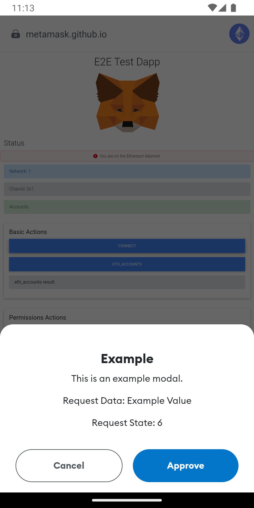

# Adding New Confirmations

## Overview

Given the security focused nature of self-custody, confirmations and approvals form a pivotal aspect of MetaMask Mobile.

Confirmations can be triggered by dApps and the UI itself, and are used to approve a variety of operations such as:

- Connecting to dApps
- Giving permissions to dApps
- Sending Eth
- Transfering tokens
- Signing data
- Interacting with Snaps
- Adding Ethereum networks

It is vital any new confirmations are implemented using best practices and consistent patterns, to avoid adding complexity to the code, and to minimise the maintenance cost of many alternate confirmations.

## Steps

### 1. Create Approval Request

Call the `add` method on the `ApprovalController` to create an approval request.

This returns a `Promise` which will resolve if the confirmation is approved, and reject if the confirmation is denied or cancelled.

Use an `async` function to send the message so the logic can `await` the confirmation and code execution can continue once approved. This enables the logic ran after approval to be kept in the same flow and therefore the logic to remain readable and encapsulated.

Ensure suitable error handling is in place to handle the confirmation being cancelled or denied and therefore the `Promise` being rejected.

The available arguments are:

| Name | Description | Example Value |
| -- | -- | -- |
| opts.id | The ID of the approval request.<br>Assigned to a random value if not provided. | `"f81f5c8a-33bb-4f31-a4e2-52f8b94c393b"` |
| opts.origin | The origin of the request.<br>Either the dApp host or "metamask" if internal. | `"metamask.github.io"` |
| opts.type | A string identifying the type of confirmation. | `"eth_signTypedData"` |
| opts.requestData | Additional fixed data for the request.<br>Must be a JSON compatible object.| `{ transactionId: '123' }` |
| opts.requestState | Additional mutable data for the request.<br>Must be a JSON compatible object.<br>Can be updated using the `updateRequestState` method. | `{ status: 'pending' }` |

#### Example

```javascript
const approvalData = await Engine.context.ApprovalController.add({
    origin: hostname,
    type: ApprovalType.Example,
    requestData: { value: 'Example Value' }
});
```

### 2. Update Approval Request (Optional)

If you wish to provide additional state to the confirmation while it is visible, call the `updateRequestState` method on the `ApprovalController`.

This requires you to have provided the `id` when creating the approval request, so it can be provided in the arguments.

The available arguments are:

| Name | Description | Example Value |
| -- | -- | -- |
| opts.id | The ID of the approval request to update. | `"f81f5c8a-33bb-4f31-a4e2-52f8b94c393b"` |
| opts.requestState | The updated mutable data for the request.<br>Must be a JSON compatible object. | `{ status: 'pending' }` |

#### Example

```javascript
await Engine.context.ApprovalController.updateRequestState({
    id,
    requestState: { counter },
});
```

### 3. Define Approval Type

Update the `ApprovalType` enum in [@metamask/controller-utils](https://github.com/MetaMask/core/blob/main/packages/controller-utils/src/constants.ts) to include a new entry to identify the new confirmations.

#### Example

```typescript
export enum ApprovalType {
  ...
  Example = 'EXAMPLE'
}
```

This must match the `opts.type` provided in the `add` request.

### 4. Handle Approval Type

Update the `handlePendingApprovals` method in [app/components/Nav/Main/RootRPCMethodsUI.js](../app/components/Nav/Main/RootRPCMethodsUI.js) with a new case for the new approval type.

This case needs to update the local React state using any relevant data from the approval request and set the pending approval state using the `showPendingApprovalModal` method.

#### Example

```javascript
case ApprovalType.Example:
    setExampleRequest({ data: requestData, id: request.id });
    showPendingApprovalModal({
        type: ApprovalType.Example,
        origin: request.origin,
    });
    break;
```

### 5. Create Approval Component

Create a component in `app/components/UI` to define the content of the modal.

Use `Approval` as a suffix so similar components can be identified, such as `ExampleApproval`.

Include `onCancel` and `onConfirm` properties to decouple the component from the side effects of rejecting or approving the confirmation.

For an example, see the [ExampleApproval](https://github.com/MetaMask/metamask-mobile/blob/example/confirmation/app/components/UI/ExampleApproval/index.js) in the [example branch](https://github.com/MetaMask/metamask-mobile/compare/main...example/confirmation).

### 6. Create Handler Functions

Create handler functions for approval and rejection of the confirmation in the [RootRPCMethodsUI](../app/components/Nav/Main/RootRPCMethodsUI.js) component.

Use the `acceptPendingApproval` and `rejectPendingApproval` local methods to trigger the `accept` and `reject` methods of the `ApprovalController` to resolve the confirmation promise.

Ensure `setShowPendingApproval` is called to clear the local pending approval state.

Ensure any related local state is cleared.

#### Example

```javascript
const onExampleConfirm = () => {
    acceptPendingApproval(exampleRequest.id, exampleRequest.requestData);
    setShowPendingApproval(false);
    setExampleRequest(undefined);
};

const onExampleReject = () => {
    rejectPendingApproval(exampleRequest.id, exampleRequest.requestData);
    setShowPendingApproval(false);
    setExampleRequest(undefined);
};
```

### 7. Render Modal

Update the [RootRPCMethodsUI](../app/components/Nav/Main/RootRPCMethodsUI.js) component to render a modal for the new approval type.

Use a new method to encapsulate the code for the approval type.

Include the new approval component as a child of the `Modal` component.

Reference the new handlers in the `Modal` properties `onSwipeComplete` and `onBackdropPress`, and in the appropriate properties of the new approval component.

#### Example

```javascript
const renderExampleModal = () => (
    <Modal
      isVisible={showPendingApproval?.type === ApprovalType.Example}
      animationIn="slideInUp"
      animationOut="slideOutDown"
      style={styles.bottomModal}
      backdropColor={colors.overlay.default}
      backdropOpacity={1}
      animationInTiming={300}
      animationOutTiming={300}
      onSwipeComplete={onExampleReject}
      onBackdropPress={onExampleReject}
      swipeDirection={'down'}
    >
      <ExampleApproval
        onCancel={onExampleReject}
        onConfirm={onExampleConfirm}
        value={exampleRequest?.requestData.value}
        counter={exampleRequest?.requestState?.counter}
      />
    </Modal>
  );
```

## Example Branch

See [this branch](https://github.com/MetaMask/metamask-mobile/compare/main...example/confirmation) as an example of the full code needed to add a confirmation.

The confirmation can be tested using the [E2E Test dApp](https://metamask.github.io/test-dapp/) and selecting `Connect`.

## Screenshots

### Confirmation Modal

[](assets/confirmation.png)
