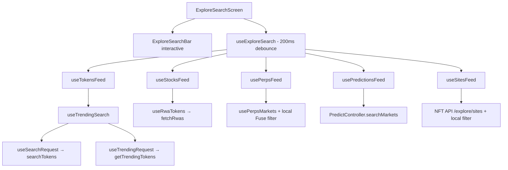

# Explore Search

> **What this is**: the single knowledge source for the Explore search functionality in MetaMask Mobile — how it works, where it is used, what to watch out for, and where it is heading. It is one document for both humans and AI agents: engineers can read it end-to-end or jump to a section; agents should be pointed at this file (it is registered in `AGENTS.md` → Documentation References) and can treat [Canonical facts](#1-canonical-facts) as assertable without re-verification.
>
> **Scope**: the omni-search on the Explore (Trending) tab, the token-search stack that powers it, the other surfaces that reuse (or duplicate) that stack — Swaps/Bridge, Manage/Import Tokens, the in-app Browser — and the long-term plan to centralise them.
>
> **Maintenance**: last verified against `main`, July 2026. This document is the source of truth for Explore search: update it in the same PR as any architecture change (new feeds, API migrations, centralisation steps from [§8](#8-long-term-vision-centralising-search)). File paths and symbols are the stable references; exact line numbers drift.

---

## Table of contents

1. [Canonical facts](#1-canonical-facts)
2. [How it works](#2-how-it-works)
3. [File map](#3-file-map)
4. [Where search lives across the app](#4-where-search-lives-across-the-app)
5. [Pitfalls and invariants](#5-pitfalls-and-invariants)
6. [Task recipes](#6-task-recipes)
7. [Testing](#7-testing)
8. [Long-term vision: centralising search](#8-long-term-vision-centralising-search)
9. [Glossary](#9-glossary)

---

## 1. Canonical facts

The mental model in nine statements. Everything else in this document elaborates on these; they are safe to rely on and repeat without re-deriving them from the code.

- "Explore", "Trending" and "Discover" are the **same feature**. The product name is **Explore**; the code lives under `TrendingView` (screens) and `Trending` (shared hooks/components) for historical reasons.
- Explore search is an **omni-search**: one query fans out to five feeds — **tokens, perps, stocks (RWAs), predictions, sites** — each backed by its own data source.
- The orchestrator is `useExploreSearch(query, { exposePagination? })` → `{ sections: SearchFeedSection[] }`, which owns a single 200 ms debounce.
- Token search is **stateless**: hooks call `searchTokens` / `getTrendingTokens` / `fetchRwas` from `@metamask/assets-controllers` directly against `https://token.api.cx.metamask.io`. There is **no search controller** and no Redux state for search results.
- `TokenSearchDiscoveryDataController` (registered in the Engine) is **not** part of listing search results. It hydrates full token metadata + price **after** a user taps a search result ([§2.6](#26-what-happens-when-a-result-is-tapped)).
- The old core package `@metamask/token-search-discovery-controller` (`TokenSearchDiscoveryController`, Portfolio `/tokens-search/*` endpoints) is **deprecated and removed from core**. Do not reintroduce it or copy patterns from it.
- Swaps/Bridge token selection uses a **different** search stack (`POST {bridge-api}/getTokens/search`, JWT-authenticated, minimum query length 3) — the biggest fracture to close ([§8](#8-long-term-vision-centralising-search)).
- Manage/Import Tokens (`AddAsset`) reuses the **same** token-search stack as Explore (`useTrendingSearch`), scoped to a single chain, with `enableDebounce: true` and `includeStocks: true`.
- Anything that calls `useExploreSearch` (directly or transitively) must render inside `PerpsSectionProvider`.

---

## 2. How it works

### 2.1 Entry points

| Entry point | Path | Behaviour |
| --- | --- | --- |
| Explore tab search bar | `app/components/Views/TrendingView/TrendingView.tsx` (`ExploreFeed`) | `ExploreSearchBar` in `button` mode; tapping navigates to `Routes.EXPLORE_SEARCH` |
| Explore search screen | `app/components/Views/TrendingView/Views/ExploreSearchScreen/ExploreSearchScreen.tsx` | The actual search experience (interactive bar + results) |
| Deeplink | `app/core/DeeplinkManager/handlers/legacy/handleTrendingUrl.ts` | `…/trending?screen=search&q=eth` opens Explore search with `initialQuery` prefilled |
| Browser omni-search | `app/components/UI/UrlAutocomplete/index.tsx` | Reuses `useExploreSearch` inside the browser URL bar ([§4.4](#44-browser-omni-search-urlautocomplete)) |

Route constants (`app/constants/navigation/Routes.ts`): `TRENDING_VIEW` (bottom tab), `TRENDING_FEED` (feed screen in the Explore stack), `EXPLORE_SEARCH` (search screen on the main stack). Registration is in `app/components/Nav/Main/MainNavigator.js`.

### 2.2 The omni-search hook

`useExploreSearch` (`app/components/Views/TrendingView/search/useExploreSearch.ts`) is the orchestrator:

- Debounces the query once, centrally (`DEBOUNCE_MS = 200`).
- Calls one feed hook per section and assembles `SearchFeedSection[]` (`feedId`, `title`, `items`, `isLoading`, optional pagination fields).
- The perps section is omitted entirely when `selectPerpsEnabledFlag` is off.
- `exposePagination: true` (used by the search screen) forwards `fetchMore` / `hasMore` / `total` for feeds that support server pagination (tokens, stocks, predictions).



### 2.3 The five feeds

All feed hooks live under `app/components/Views/TrendingView/feeds/`:

| Feed | Hook | Search strategy | Pagination |
| --- | --- | --- | --- |
| Tokens | `tokens/useTokensFeed.ts` | **Server** search via `useTrendingSearch` (merges trending + search API results) | Cursor-based (`after`), search mode only |
| Perps | `perps/usePerpsFeed.ts` | **Client**: `filterMarketsByQuery` (`@metamask/perps-controller`) + Fuse.js over already-loaded markets | None (full list is loaded) |
| Stocks (RWAs) | `stocks/useStocksFeed.ts` | **Server** search via `useRwaTokens` → `fetchRwas` | Cursor-based |
| Predictions | `predictions/usePredictionsFeed.ts` | **Server** via `usePredictSearchMarketData` → `Engine.context.PredictController.searchMarkets({ q, limit, page })` (TanStack `useInfiniteQuery`) | Page-based |
| Sites | `sites/useSitesFeed.ts` | Fetch-all from NFT API (`https://nft.api.cx.metamask.io/explore/sites?limit=100`), then **client** filter (`useSitesData`) | None |

Shared client-side fuzzy matching lives in `feeds/search-utils.ts` (`fuseSearch`, `TOKEN_FUSE_OPTIONS`, `PERPS_FUSE_OPTIONS`, `PREDICTIONS_FUSE_OPTIONS`; Fuse threshold 0.2).

### 2.4 The token search pipeline (the part other teams reuse)

This is the stack most relevant to centralisation. It lives under `app/components/UI/Trending/hooks/`:

```text
useTokensFeed (Explore-specific glue: sorting, risky-token filter, page-boundary handling)
  └─ useTrendingSearch          # merge layer: decides trending vs search, dedupes by assetId
       ├─ useSearchRequest      # searchTokens() → GET /tokens/search  (query mode)
       └─ useTrendingRequest    # getTrendingTokens() → GET /v3/tokens/trending  (empty-query mode, 5-min polling)
```

Key behaviours of `useTrendingSearch` (`useTrendingSearch/useTrendingSearch.ts`):

- **Empty query** → returns trending tokens, sorted via `sortTrendingTokens` (price change / volume / market cap options).
- **Non-empty query** → filters the already-loaded trending list by symbol/name **and** merges in server search results, deduping on `assetId` (trending entries win). This gives instant partial results while the API call is in flight.
- `includeStocks: false` (default) drops results with `rwaData` so stocks don't leak into token-only surfaces; the Explore stocks feed handles them separately.
- Optional internal debounce (`enableDebounce`, 200 ms). Explore disables it because `useExploreSearch` already debounces — see [§5.2](#52-debounce-layering).

Key behaviours of `useSearchRequest` (`useSearchRequest/useSearchRequest.ts`):

- Calls `searchTokens(chainIds, query, { limit, includeMarketData, includeTokenSecurityData: true, after })` from `@metamask/assets-controllers`.
- Defaults `chainIds` to `TRENDING_NETWORKS_LIST` (`app/components/UI/Trending/utils/trendingNetworksList.ts`).
- Guards against out-of-order responses with a `requestIdRef` counter; guards duplicate `loadMore` calls with a ref flag.

Key behaviours of `useTrendingRequest` (`useTrendingRequest/useTrendingRequest.ts`):

- Calls `getTrendingTokens` with per-network liquidity/volume thresholds (`TRENDING_NETWORK_THRESHOLDS`, `MULTI_CHAIN_BASELINE_THRESHOLDS`) and `excludeLabels: ['stable_coin', 'blue_chip']`.
- Silently re-polls every 5 minutes once the initial load succeeds.
- Optional `filterLowQuality` pass (`utils/filterTrendingTokens.ts`) removes tokens without meaningful names or flagged Warning/Spam/Malicious.

### 2.5 Backend APIs

| API | Endpoint | Used by |
| --- | --- | --- |
| Token API | `GET https://token.api.cx.metamask.io/tokens/search?networks=…&query=…&first=…&after=…` | `searchTokens` (Explore tokens, Import Tokens) |
| Token API | `GET https://token.api.cx.metamask.io/v3/tokens/trending?chainIds=…&sort=…` | `getTrendingTokens` (empty-query state, home feeds) |
| Token API | `GET https://token.api.cx.metamask.io/v1/rwas?…` | `fetchRwas` (stocks feed) |
| Token API | `GET https://token.api.cx.metamask.io/token/{decimalChainId}?address=…` | `fetchTokenMetadata` — post-tap hydration ([§2.6](#26-what-happens-when-a-result-is-tapped)) |
| NFT API | `GET https://nft.api.cx.metamask.io/explore/sites?limit=100` | Sites feed |
| Predict backend | via `PredictController.searchMarkets` | Predictions feed |
| Bridge API | `POST {BRIDGE_API_BASE_URL}/getTokens/search` (JWT-authenticated) | **Swaps/Bridge only** — not the token API ([§4.2](#42-swapsbridge-token-selection)) |

The client functions (`searchTokens`, `getTrendingTokens`, `fetchRwas`, `fetchTokenMetadata`) are implemented in the core monorepo: `packages/assets-controllers/src/token-service.ts` (`@metamask/assets-controllers`).

> **History**: an older core package, `@metamask/token-search-discovery-controller` (`TokenSearchDiscoveryController`, `TokenSearchApiService`, Portfolio API `/tokens-search/*` endpoints, Moralis-shaped responses), is **deprecated and removed from core** (core PR #7789). Old docs and PRs referencing `searchTokensFormatted` or `MoralisTokenResponseItem` are about that removed stack.

### 2.6 What happens when a result is tapped

Token/stock rows navigate to the asset detail flow. Search results only carry list-level data, so the full asset view needs hydration:

1. `AssetLoader` (`app/components/Views/AssetLoader/index.tsx`) is pushed with `{ address, chainId }`.
2. It calls `Engine.context.TokenSearchDiscoveryDataController.fetchTokenDisplayData(chainId, address)`.
3. The controller (from `@metamask/assets-controllers`) fetches metadata + price and caches it in `tokenDisplayData` (max 10 entries, persisted).
4. `AssetLoader` watches `selectTokenDisplayData` (`app/selectors/tokenSearchDiscoveryDataController.ts`) and replaces itself with the asset view, passing `isFromSearch: true`.
5. Downstream components use `isAssetFromSearch(asset)` to know the asset may not be in the user's wallet state.

Engine wiring: `app/core/Engine/controllers/token-search-discovery-data-controller-init.ts` and `app/core/Engine/messengers/token-search-discovery-data-controller-messenger.ts`.

### 2.7 Search screen UI composition

`ExploreSearchScreen.tsx` renders:

- `ExploreSearchBar` (`components/ExploreSearchBar/ExploreSearchBar.tsx`) — dual-mode component: `button` (faux bar on the feed) or `interactive` (real `TextFieldSearch`).
- A pill row (`All` + one pill per feed) driving two panes:
  - **All** → `ExploreSearchResults` (`search/ExploreSearchResults.tsx`): sectioned list showing at most `MAX_ITEMS_PER_SECTION = 3` items per feed (`search/viewMoreLabel.ts`) with "View more" buttons. Empty query shows popular assets (BTC/ETH/SOL) and crypto movers pills.
  - **Single feed** → `FullFeedList` (inside `ExploreSearchScreen.tsx`): paginated FlashList (`onEndReached` → `fetchMore`).
- `SearchFeedRow` (`search/SearchFeedRow.tsx`) — renders the right row component per feed and fires tap analytics.

One `useExploreSearch` instance is shared by the pill row and both panes, so switching pills never re-fires API calls.

### 2.8 Analytics and A/B testing

- `search/analytics.ts` — `trackExploreSearchEvent` emits `Explore Search Interacted` events with `interaction_type` ∈ `searched | result_clicked | tab_switched | scrolled`, plus helpers (`useInstrumentedSearchEffect`, `useScrollTracking`, `getExploreSearchResultCount`).
- `search/abTestConfig.ts` — Quick Buy A/B test (`assetsASSETS3380AbtestExploreQuickBuy`): treatment shows a quick-trade button on token/stock rows in search results.

### 2.9 Feature flags

| Flag / setting | Where | Effect |
| --- | --- | --- |
| `selectPerpsEnabledFlag` | `app/components/UI/Perps` | Removes the perps section from omni-search |
| `selectBasicFunctionalityEnabled` | `app/selectors/settings` | When off, search bar placeholder changes and API-dependent sections are suppressed (sites-only browser search) |
| `assetsASSETS3380AbtestExploreQuickBuy` | remote A/B flag | Quick Buy button variant |
| `tokenSearchDiscoveryEnabled` | `app/selectors/featureFlagController/tokenSearchDiscovery/` | **Legacy** — selector exists but no UI consumes it; predates the current Explore implementation |

---

## 3. File map

Start here for any Explore-search task:

```text
app/components/Views/TrendingView/
├── TrendingView.tsx                          # ExploreFeed screen; search bar (button mode)
├── Views/ExploreSearchScreen/                # search screen (bar, pills, FullFeedList)
├── components/ExploreSearchBar/              # dual-mode search bar
├── search/
│   ├── useExploreSearch.ts                   # omni-search orchestrator (THE entry point)
│   ├── ExploreSearchResults.tsx              # "All" pane, 3-per-section + view-more
│   ├── SearchFeedRow.tsx                     # per-feed row renderer + tap analytics
│   ├── analytics.ts                          # Explore Search Interacted events
│   ├── abTestConfig.ts                       # Quick Buy A/B
│   └── viewMoreLabel.ts                      # MAX_ITEMS_PER_SECTION = 3
└── feeds/
    ├── search-utils.ts                       # fuseSearch + per-feed Fuse options
    ├── tokens/useTokensFeed.ts               # tokens feed glue
    ├── perps/usePerpsFeed.ts                 # client-filtered perps feed
    ├── stocks/useStocksFeed.ts               # RWA feed
    ├── predictions/usePredictionsFeed.ts     # predict feed
    └── sites/useSitesFeed.ts                 # curated sites feed

app/components/UI/Trending/
├── hooks/useTrendingSearch/                  # merge layer (trending + search)
├── hooks/useSearchRequest/                   # searchTokens() wrapper (cursor pagination)
├── hooks/useTrendingRequest/                 # getTrendingTokens() wrapper (thresholds, polling)
├── hooks/useRwaTokens/                       # fetchRwas() wrapper
└── utils/trendingNetworksList.ts             # TRENDING_NETWORKS_LIST, RWA_CHAIN_IDS

Other surfaces:
├── app/components/Views/AddAsset/components/SearchTokenAutoComplete/   # import tokens search
├── app/components/UI/Bridge/hooks/useSearchTokens.ts                   # swaps/bridge server search
├── app/components/UI/Bridge/components/BridgeTokenSelector/            # swaps/bridge UI
├── app/components/UI/UrlAutocomplete/index.tsx                         # browser omni-search
├── app/components/Views/confirmations/hooks/send/useTokenSearch.ts     # send flow (local)
└── app/components/UI/Ramp/hooks/useSearchTokenResults.ts               # ramp (local Fuse)

Post-tap hydration:
├── app/components/Views/AssetLoader/index.tsx
├── app/core/Engine/controllers/token-search-discovery-data-controller-init.ts
└── app/selectors/tokenSearchDiscoveryDataController.ts

Deeplink: app/core/DeeplinkManager/handlers/legacy/handleTrendingUrl.ts
Routes:   app/constants/navigation/Routes.ts (TRENDING_VIEW / TRENDING_FEED / EXPLORE_SEARCH)
```

---

## 4. Where search lives across the app

### 4.1 Explore search (primary surface)

Described in [§2](#2-how-it-works). Everything under `app/components/Views/TrendingView/` (feed screen, tabs, search) plus the shared hooks under `app/components/UI/Trending/hooks/`.

### 4.2 Swaps/Bridge token selection

There is no `app/components/UI/Swaps` tree anymore; swap/bridge token picking is the **Bridge** feature:

- UI: `app/components/UI/Bridge/components/BridgeTokenSelector/BridgeTokenSelector.tsx`
- Server search: `app/components/UI/Bridge/hooks/useSearchTokens.ts` — `POST {BRIDGE_API_BASE_URL}/getTokens/search` with a JWT from `AuthenticationController.getBearerToken()`, lodash `debounce` at 300 ms, **minimum query length 3**, cursor pagination via `after`.
- Local fallback/legacy: `app/components/UI/Bridge/hooks/useTokenSearch/index.ts` — Fuse.js over already-loaded `BridgeToken[]`.

**This is a different API, different result type (`PopularToken` vs `TrendingAsset`), different auth model, and different debounce/min-length policy than Explore.** It exists because swaps need swappability guarantees the token API historically did not provide. This is the primary fracture to resolve ([§8](#8-long-term-vision-centralising-search)).

### 4.3 Manage / Import tokens

- Host screen: `app/components/Views/AddAsset/AddAsset.tsx` (route `AddAsset`, reachable from wallet "Manage tokens" / import flows).
- Search: `app/components/Views/AddAsset/components/SearchTokenAutoComplete/SearchTokenAutocomplete.tsx` — **reuses the Explore stack** (`useTrendingSearch`) with:
  - `chainIds: [formatChainIdToCaip(selectedChainId)]` (single-chain scope),
  - `enableDebounce: true` (uses the hook's internal 200 ms debounce),
  - `includeStocks: true`,
  - trending results (empty query) sorted by market cap.
- Results list: `components/SearchTokenResults/SearchTokenResults.tsx`; conversion via `convertTrendingAssetsToImporAssets` (`AddAsset/utils/utils.ts`) (note the existing typo in the function name).
- Import writes through `TokensController.addTokens` (EVM) / `MultichainAssetsController.addAssets` (non-EVM).

This surface is the proof that reuse works: it shares the search pipeline with Explore and only supplies different knobs.

### 4.4 Browser omni-search (`UrlAutocomplete`)

- `app/components/UI/UrlAutocomplete/index.tsx` bridges `useExploreSearch` into the browser URL bar.
- Section order is browser-specific: `BROWSER_SEARCH_SECTIONS_ORDER = ['sites', 'tokens', 'perps', 'predictions']` (`UrlAutocomplete.constants.ts`); tokens and stocks sections are merged into one "Tokens" section.
- Recents/Favorites are filtered locally with Fuse (`HISTORY_FUSE_OPTIONS`).
- When basic functionality is off, only local sections (Recents/Favorites) render.

### 4.5 Adjacent search implementations (not on the shared stack)

These are the other token/asset searches in the app. They are relevant to the centralisation story ([§8](#8-long-term-vision-centralising-search)) even though they are not "Explore search":

| Surface | Path | Strategy |
| --- | --- | --- |
| Send flow asset picker | `app/components/Views/confirmations/hooks/send/useTokenSearch.ts` | Local substring match over the user's own tokens/NFTs (name/symbol/address) |
| Ramp/deposit token selection | `app/components/UI/Ramp/hooks/useSearchTokenResults.ts` | Local Fuse over the deposit token list |
| Perps market list (standalone) | `app/components/UI/Perps/hooks/usePerpsSearch.ts` | Local filter, same approach as the perps feed |
| Predict home/feed search | `app/components/UI/Predict/hooks/usePredictSearch.ts`, `usePredictSearchMarketData.tsx` | UI state + server search via `PredictController` |

---

## 5. Pitfalls and invariants

Rules that hold today and the traps that break them. Treat these as constraints when modifying anything in [§3](#3-file-map).

### 5.1 Naming traps

- **`TokenSearchDiscoveryDataController` does not do search.** Despite the name, it only caches post-tap token display data ([§2.6](#26-what-happens-when-a-result-is-tapped)). Search result lists never touch it.
- **`TokenSearchDiscoveryController` (no "Data") no longer exists** — removed from core along with `@metamask/token-search-discovery-controller`.
- **"Trending" in paths = Explore.** `TrendingView` is the Explore tab; `app/components/UI/Trending/` hosts the shared token feed/search machinery. `app/components/Views/TokenDiscovery/` is an unused placeholder.
- `TokenListController` and `SwapsController` are **not** in the mobile Engine anymore; don't reach for them for search or token lists.

### 5.2 Debounce layering

There are three debounce implementations in the token path: `useExploreSearch` (200 ms), `useTrendingSearch` (200 ms, optional), `useSearchRequest` (300 ms, optional, default **off**). The rule is: **exactly one layer debounces**.

- Explore: `useExploreSearch` debounces → `useTokensFeed` passes `enableDebounce: false` down.
- Import Tokens: no omni layer → `useTrendingSearch` gets `enableDebounce: true`.

If you add a new consumer, decide where the debounce lives and disable the others, or you'll get 400–500 ms of dead time. Loading states deliberately include the debounce window (`isDebouncing`, `query !== debouncedQuery` checks) so skeletons show immediately on typing — preserve that when refactoring.

### 5.3 Stale responses and pagination guards

`useSearchRequest`, `useTrendingRequest` and `useRwaTokens` each implement the same two guards by hand:

- `requestIdRef` counter — only the latest request may write state (queries can resolve out of order).
- `isLoadingMoreRef` — FlashList `onEndReached` fires multiple times; the ref (not state) prevents duplicate page fetches.

If you touch these hooks, keep both guards. Longer term this is exactly the duplication a shared search service should absorb ([§8](#8-long-term-vision-centralising-search)).

### 5.4 Search-result ordering subtleties

`useTokensFeed` sorts **only the first page** of search results by market cap, then appends subsequent pages in server order (`firstPageSizeRef` boundary logic). This is deliberate: re-sorting on every page would visibly shuffle rows under the user's finger while scrolling. Similarly, `usePredictionsFeed` skips Fuse re-ranking when a query is active to preserve server relevance order across pages. Don't "simplify" these into a single global sort.

### 5.5 Networks must be supported server-side

`TRENDING_NETWORKS_LIST` (`app/components/UI/Trending/utils/trendingNetworksList.ts`) is the default chain set for token search/trending. The comment in that file is load-bearing: **before adding a network, confirm both the search API and the trending API support it**, or that network silently returns nothing/errors. RWAs have their own subset (`RWA_CHAIN_IDS` — Ethereum + BNB). Trending quality thresholds are per-network (`TRENDING_NETWORK_THRESHOLDS` in `useTrendingRequest.ts`) and the multi-chain baseline must stay ≥ every per-network threshold.

### 5.6 Provider requirements

Any component calling `useExploreSearch` (directly or transitively) must be inside `PerpsSectionProvider` — `usePerpsFeed` → `usePerpsMarkets` reads perps connection contexts. Forgetting this crashes at runtime with a perps context error; it is the most common integration mistake (both `ExploreSearchScreen` and `UrlAutocomplete` wrap for this reason).

### 5.7 Security/risk filtering is surface-dependent

Token results carry `securityData` (requested with `includeTokenSecurityData: true`). Surfaces that display a risk badge show everything; surfaces without a badge must pass `hideRiskyTokens`/`filterLowQuality` so Warning/Spam/Malicious tokens are hidden. When building a new consumer, decide explicitly which mode you're in.

### 5.8 Privacy toggle

Basic functionality (privacy mode) disables all remote search sections. Any new feed must respect `selectBasicFunctionalityEnabled` — check how `ExploreSearchBar` and `UrlAutocomplete` handle it.

### 5.9 Analytics invariants

`Explore Search Interacted` events must carry accurate `tab_name` / `section_name` / `result_count` (see `search/analytics.ts` and its tests). The empty-feed fallback case is subtle: when a feed pill shows the all-sections fallback, `activeTab` must reflect the tapped pill, not `'all'`. Quick Buy events are auto-enriched with the A/B variant via `EXPLORE_QUICK_BUY_AB_TEST_ANALYTICS_MAPPING` — keep `source` values in sync if you add surfaces.

### 5.10 Things that look related but aren't

- `portfolio.metamask.io` links on Explore are just browser links, not a search backend.
- `tests/feature-flags/feature-flag-registry.ts` lists `tokenSearchDiscoveryEnabled` / `trendingTokens` — registry defaults, not proof of runtime use.

---

## 6. Task recipes

Step-by-step starting points for the most common changes.

**Add a new feed/section to omni-search**

1. Create `feeds/<feed>/use<Feed>Feed.ts` returning `{ data, isLoading, refetch }` (+ pagination fields if server-paginated). Accept `{ query, refresh }`.
2. Add the feed id to `SearchFeedId` and a section entry in `useExploreSearch.ts` (respect feature flags there, like perps does).
3. Add a row renderer + skeleton case in `SearchFeedRow.tsx` (`getItemId` too) and a Fuse option set in `feeds/search-utils.ts` if client-filtered.
4. Update `search/analytics.ts` types (`SearchFeedPill`) and the browser order list in `UrlAutocomplete.constants.ts` if the browser should show it.
5. Add tests mirroring `useExploreSearch.test.ts` / `SearchFeedRow.test.tsx`.

**Change debounce behaviour** — change it in exactly one layer ([§5.2](#52-debounce-layering)); update `isLoading` logic that treats "debouncing" as loading; update timer-based tests (`jest.advanceTimersByTime`).

**Add a network to token search/trending** — verify both APIs support it; add to `TRENDING_NETWORKS_LIST` (+ code-fence guards like the Solana/Tron examples); add thresholds to `TRENDING_NETWORK_THRESHOLDS`; keep the multi-chain baseline ≥ per-network values ([§5.5](#55-networks-must-be-supported-server-side)).

**Touch result ordering** — read [§5.4](#54-search-result-ordering-subtleties) first; first-page-only sort and server-order pagination are intentional.

**Modify token row UI** — the shared row is `TrendingTokenRowItem` (`app/components/UI/Trending/components/TrendingTokenRowItem/`); Explore search wraps it via `TokenSearchRowItem` in `feeds/tokens/TokenRowItem.tsx` with `SEARCH_TOKENS_FILTER_CONTEXT`. Changes affect home tabs, search, movers pills, and AddAsset previews — check all.

---

## 7. Testing

- Unit tests sit next to sources: `search/useExploreSearch.test.ts`, `hooks/useSearchRequest/useSearchRequest.test.ts`, `hooks/useTrendingSearch/useTrendingSearch.test.ts`, `feeds/tokens/useTokensFeed.test.ts`, `SearchTokenAutocomplete.test.tsx`, `Bridge/hooks/useSearchTokens.test.ts`, etc.
- Component-view tests: `ExploreSearchScreen.view.test.tsx`, `TrendingView.view.test.tsx`; renderers in `tests/component-view/renderers/trending.ts` (`renderExploreSearchScreenWithRoutes`); locators in `tests/locators/Trending/`.
- Run: `yarn jest <file>` (never npm). Timers: debounce tests use fake timers (`jest.advanceTimersByTime`).
- API mocking in tests targets `token.api.cx.metamask.io` paths `/tokens/search`, `/v3/tokens/trending`, `/v1/rwas`, and `nft.api.cx.metamask.io/explore/sites`.
- Deeplink manual test: `https://link.metamask.io/trending?screen=search&q=eth`.

---

## 8. Long-term vision: centralising search

### 8.1 The problem

Token search/list functionality is currently fractured across teams. The same product concept — "type a string, get a ranked list of tokens" — has at least four implementations with different APIs, result types, debounce policies and quality filters:

| Surface | Owner (typical) | API | Result type | Min length | Debounce |
| --- | --- | --- | --- | --- | --- |
| Explore search | Assets/Explore | token API `/tokens/search` + `/v3/tokens/trending` | `TrendingAsset` | 1 | 200 ms (omni layer) |
| Import/Manage tokens | Assets | same as Explore (shared hooks) | `TrendingAsset` → `ImportAsset` | 1 | 200 ms (hook layer) |
| Swaps/Bridge selector | Swaps | bridge API `/getTokens/search` (JWT) | `PopularToken` | 3 | 300 ms (lodash) |
| Send asset picker | Confirmations | none (local wallet state) | `AssetType` | 1 | none |
| Ramp token selection | Ramp | none (local Fuse) | deposit token type | 1 | none |

Consequences: inconsistent results for the same query on different screens (a token can be findable in Explore but not in Swaps), duplicated stale-request/pagination/debounce logic, per-surface bug fixes that don't propagate, and three different "is this token risky/swappable" policies.

### 8.2 Target state

One shared token-search layer with per-surface policy knobs, not per-surface pipelines:

1. **One backend contract.** Converge on the token API (`token.api.cx.metamask.io`) as the single search backend. The missing piece for swaps is server-side swappability filtering — coordinate with the token API team to expose it (e.g. a `swappable=true` filter or per-route capability flags) so the Bridge `/getTokens/search` call can be retired, or wrapped behind the same client.
2. **One client entry point.** A single `useTokenSearch`-style hook (or a headless service module) owning: debounce, min-length policy, request-id/stale guards, cursor pagination, error surface, and result normalisation. Surfaces pass declarative options (`chainIds`, `limit`, `includeStocks`, `swappableOnly`, `hideRiskyTokens`, `sort`). The existing `useTrendingSearch`/`useSearchRequest` pair is the natural seed for this; the Bridge hooks are the first migration target.
3. **One result type.** Standardise on `TrendingAsset` (CAIP `assetId`-keyed) as the wire-to-UI shape and delete per-surface conversions (`convertTrendingAssetsToImporAssets`, `PopularToken` mapping) or reduce them to display-only adapters.
4. **Shared UI primitives.** Token row + skeleton + sectioned results are already close to shared (`TrendingTokenRowItem`, `SearchFeedRow`); finish the job so Swaps/Send/Ramp render the same rows with surface-specific accessories (balance, quick buy, selection checkbox).
5. **Consider promoting the client layer to core.** If extension needs the same convergence (it has its own `shared/lib/token-search/token-search-api.ts`), the normalised search client belongs in `@metamask/assets-controllers` (or a small dedicated package) rather than mobile — same playbook as `@metamask/perps-controller` (see ADR-042 in core).
6. **Ownership.** Nominate one team as the owner of the shared search layer (currently the Explore/Assets side de-facto owns it) and route API-policy changes (thresholds, quality filters, new networks) through them, with a CODEOWNERS entry for the shared hooks.

### 8.3 Suggested sequencing

1. Extract the token pipeline (`useSearchRequest`/`useTrendingRequest`/`useTrendingSearch` + network lists + quality filters) out of `UI/Trending` into a neutral module (e.g. `app/components/UI/TokenSearch/` or `app/core/token-search/`) with no Explore-specific imports; Explore and AddAsset keep working via re-exports.
2. Add swappability support to the shared pipeline (server-side filter when available; interim: client-side intersect with bridge-supported assets).
3. Migrate `BridgeTokenSelector` off `useSearchTokens`/bridge API; delete the bespoke JWT search path.
4. Optionally migrate Send/Ramp local searches to the shared hook in "local corpus" mode (same ranking/UX, no network calls), so all pickers feel identical.
5. Evaluate moving the module to core for extension parity.

### 8.4 What to avoid

- Building "one more" search hook next to the existing ones — extend the shared pipeline instead.
- Re-introducing a stateful search controller: the stateless-hooks-over-API model has proven simpler; the only justified state is post-tap hydration (`TokenSearchDiscoveryDataController`) and possibly a recent-searches store.
- Coupling the shared layer to Explore UI concerns (pills, analytics event names, A/B config) — those stay in the Explore feature.

---

## 9. Glossary

| Term | Meaning |
| --- | --- |
| Explore / Trending / Discover | The Explore bottom tab (one feature, three names) |
| Omni-search | One query fanned out to tokens/perps/stocks/predictions/sites |
| Feed | One section of the omni-search with its own data source |
| `TrendingAsset` | Canonical token search/trending result type (from `@metamask/assets-controllers`) |
| RWA / stocks | Tokenized real-world assets, served by `/v1/rwas` |
| Movers | "Crypto movers" pills on Explore (same tokens feed, different sort context) |
| Post-tap hydration | `AssetLoader` + `TokenSearchDiscoveryDataController` fetching full token data after a result is tapped |
| Quick Buy | A/B-tested buy button on token/stock search rows |

---

*Questions or corrections: update this document in place — it is the single source of truth for Explore search, for humans and agents alike.*
