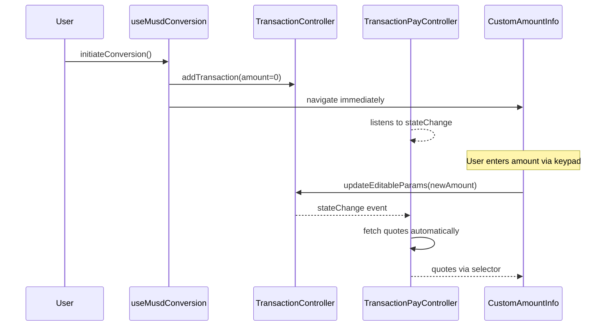
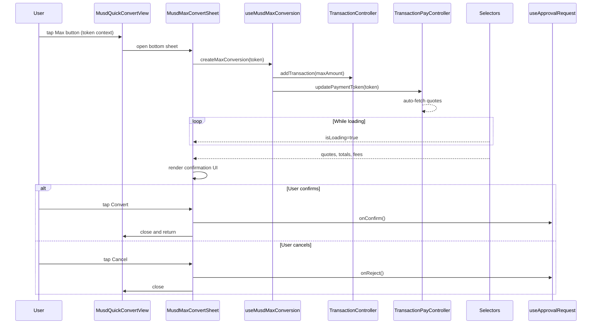
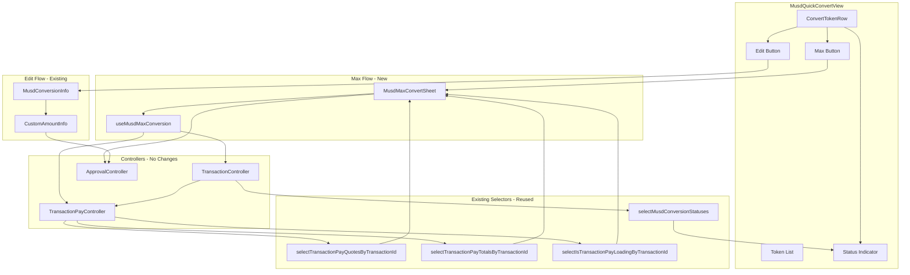

# mUSD Quick Convert Token List - Architecture & Implementation Guide

> This document is the centralized knowledge source for implementing mUSD Quick Convert features in MetaMask Mobile. It covers architectural decisions, controller infrastructure, and implementation patterns.

## Table of Contents

1. [Feature Overview](#feature-overview)
2. [MetaMask Pay (Relay) Architecture](#metamask-pay-relay-architecture)
3. [Key Finding: No New Controller Needed](#key-finding-no-new-controller-needed)
4. [Existing Infrastructure in TransactionController](#existing-infrastructure-in-transactioncontroller)
5. [Component Architecture](#component-architecture)
6. [File Structure](#file-structure)
7. [Implementation Details](#implementation-details)
8. [Navigation Flows](#navigation-flows)
9. [Key Design Decisions](#key-design-decisions)
10. [Error Handling](#error-handling)
11. [UI Flow Differentiation: Max vs Custom Amount](#ui-flow-differentiation-max-vs-custom-amount)
12. [Selectors & Hooks Reference](#selectors--hooks-reference)
13. [Events for Real-Time Updates](#events-for-real-time-updates)
14. [Files to Modify](#files-to-modify)
15. [Open Questions](#open-questions)

---

## Feature Overview

### What is mUSD Quick Convert?

The mUSD Quick Convert Token List is a standalone screen where users can convert their existing tokens (stablecoins like USDC, USDT, DAI, and crypto like ETH, UNI) into mUSD (MetaMask USD) which earns yield automatically.

### Key Capabilities

1. View all convertible tokens they hold (filtered by remote allowlist)
2. Tap **"Max"** to open a quick confirmation bottom sheet for full balance conversion
3. Tap **"Edit"** (pencil) to navigate to the existing custom amount confirmation screen
4. See real-time status indicators (spinner for pending, checkmark for confirmed)

### UI Components

| Component                          | Description                                              |
| ---------------------------------- | -------------------------------------------------------- |
| **MusdQuickConvertView**           | Main screen with token list                              |
| **ConvertTokenRow**                | Individual token row with Max/Edit buttons               |
| **MusdMaxConvertSheet**            | Bottom sheet for quick max confirmation                  |
| **MusdConversionAssetOverviewCta** | Reusable banner (existing component, parameterized copy) |
| **Status Indicators**              | Spinner (pending) / Checkmark (confirmed)                |

### Key User Flow

1. User sees list of convertible tokens with balances
2. User taps "Max" on a token (e.g., USDC)
3. Confirmation bottom sheet appears with quote data
4. After confirmation, user returns to Convert List
5. The row shows a **loading spinner** while transaction is pending
6. Once confirmed on-chain, the row shows a **green checkmark**
7. User can immediately start another conversion without waiting

---

## MetaMask Pay (Relay) Architecture

### Critical Insight: TransactionPayController is Reactive

The `TransactionPayController` **automatically fetches Relay quotes** whenever:

- A new transaction is added (`TransactionController:unapprovedTransactionAdded`)
- A transaction is updated (`TransactionController:stateChange`)
- A payment token is set (`updatePaymentToken`)

**This means no custom quote-fetching logic is needed for the Max bottom sheet.** We create a transaction with max amount, set the payment token, and the controller handles everything.

### Relay Supports Same-Chain AND Cross-Chain

Relay (via TransactionPayController) supports **BOTH**:

- **Same-chain token swaps** (e.g., Linea USDC → Linea mUSD)
- **Cross-chain bridging** (e.g., Ethereum USDC → Linea mUSD)

It is not limited to only cross-chain operations.

### Existing Edit Flow (Reference)



### New Max Flow



---

## Key Finding: No New Controller Needed

After analyzing the `@metamask/core` monorepo, **all required state for mUSD conversions already exists in `TransactionController`**.

### Why a Separate Controller Was Considered

Initially, a `TokenConversionController` or `MusdConversionController` was considered to track:

- List of in-flight conversion transactions
- Transaction status for UI indicators
- Cross-client reusability (Mobile → Extension)

### Why It's Not Needed

The `TransactionController` already provides:

1. **`TransactionType.musdConversion`** - A dedicated transaction type already exists
2. **All required metadata fields** - Source/destination token info, status, timestamps
3. **Real-time events** - Status update events for reactive UI
4. **Persistence** - Transaction history is already persisted

---

## Existing Infrastructure in TransactionController

### TransactionType Enum (Already Exists)

```typescript
// From @metamask/transaction-controller/src/types.ts
export enum TransactionType {
  // ... other types ...

  /**
   * A transaction that converts tokens to mUSD.
   */
  musdConversion = 'musdConversion',

  // ... other types ...
}
```

### TransactionMeta Fields Available

| Field                      | Type                | Description                                                                                   |
| -------------------------- | ------------------- | --------------------------------------------------------------------------------------------- |
| `id`                       | `string`            | Unique transaction ID                                                                         |
| `type`                     | `TransactionType`   | Use `musdConversion`                                                                          |
| `status`                   | `TransactionStatus` | `unapproved`, `approved`, `signed`, `submitted`, `confirmed`, `failed`, `dropped`, `rejected` |
| `chainId`                  | `Hex`               | Chain ID (e.g., `0x1` for Ethereum)                                                           |
| `sourceTokenAddress`       | `string`            | Address of token being converted                                                              |
| `sourceTokenSymbol`        | `string`            | Symbol (e.g., "USDC")                                                                         |
| `sourceTokenAmount`        | `string`            | Raw amount being converted                                                                    |
| `sourceTokenDecimals`      | `number`            | Token decimals                                                                                |
| `destinationTokenAddress`  | `string`            | mUSD contract address                                                                         |
| `destinationTokenSymbol`   | `string`            | "mUSD"                                                                                        |
| `destinationTokenAmount`   | `string`            | Expected mUSD amount                                                                          |
| `destinationTokenDecimals` | `number`            | mUSD decimals                                                                                 |
| `time`                     | `number`            | Transaction creation timestamp (ms)                                                           |
| `submittedTime`            | `number`            | When submitted to network (ms)                                                                |
| `blockTimestamp`           | `string`            | When included in block                                                                        |
| `txParams.from`            | `string`            | User's account address                                                                        |

### TransactionStatus Enum

```typescript
export enum TransactionStatus {
  unapproved = 'unapproved', // Awaiting user approval
  approved = 'approved', // Approved, not yet signed
  signed = 'signed', // Signed, being submitted
  submitted = 'submitted', // Submitted, awaiting confirmation
  confirmed = 'confirmed', // ✅ Successfully confirmed
  failed = 'failed', // ❌ Failed on-chain
  dropped = 'dropped', // Superseded by another tx
  rejected = 'rejected', // User rejected
}
```

---

## Component Architecture



---

## File Structure

### New Files to Create

```
app/components/UI/Earn/
├── Views/
│   └── MusdQuickConvertView/
│       ├── index.tsx                    # Main screen component
│       ├── MusdQuickConvertView.styles.ts
│       ├── MusdQuickConvertView.types.ts
│       └── components/
│           └── ConvertTokenRow/         # Individual token row
│               ├── index.tsx
│               ├── ConvertTokenRow.styles.ts
│               └── ConvertTokenRow.types.ts
├── components/
│   └── Musd/
│       └── MusdMaxConvertSheet/
│           ├── index.tsx
│           ├── MusdMaxConvertSheet.styles.ts
│           └── MusdMaxConvertSheet.types.ts
├── hooks/
│   └── useMusdMaxConversion.ts
└── selectors/
    └── musdConversionStatus.ts
```

---

## Implementation Details

### 1. useMusdMaxConversion Hook

**Path:** `app/components/UI/Earn/hooks/useMusdMaxConversion.ts`

Creates max-amount transaction and sets payment token. Leverages existing infrastructure:

```typescript
export const useMusdMaxConversion = () => {
  const createMaxConversion = async (token: ConvertibleToken) => {
    const { NetworkController, TransactionController, TransactionPayController } = Engine.context;

    // 1. Calculate max amount from token balance
    const maxAmount = toHex(token.balance);

    // 2. Determine output chain (same-chain if mUSD exists, else mainnet)
    const outputChainId = getOutputChainId(token.chainId);

    // 3. Get network client for the output chain
    const networkClientId = NetworkController.findNetworkClientIdByChainId(outputChainId);

    // 4. Generate transfer data with max amount
    const transferData = generateTransferData('transfer', {
      toAddress: selectedAddress,
      amount: maxAmount,
    });

    const mUSDTokenAddress = MUSD_TOKEN_ADDRESS_BY_CHAIN[outputChainId];

    // 5. Create transaction with ALL required options
    const { transactionMeta } = await TransactionController.addTransaction(
      {
        to: mUSDTokenAddress,
        from: selectedAddress,
        data: transferData,
        value: '0x0',
        chainId: outputChainId,
      },
      {
        // Required for better UX - don't block on gas estimation
        skipInitialGasEstimate: true,
        networkClientId,
        origin: MMM_ORIGIN,
        type: TransactionType.musdConversion,
        // CRITICAL: nestedTransactions is required for Relay to work
        nestedTransactions: [
          {
            to: mUSDTokenAddress,
            data: transferData as Hex,
            value: '0x0',
          },
        ],
      },
    );

    // 6. Set payment token - triggers automatic quote fetching
    TransactionPayController.updatePaymentToken({
      transactionId: transactionMeta.id,
      tokenAddress: token.address,
      chainId: token.chainId,
    });

    return transactionMeta.id;
  };

  return { createMaxConversion };
};
```

### 2. MusdMaxConvertSheet Bottom Sheet

**Path:** `app/components/UI/Earn/components/Musd/MusdMaxConvertSheet/`

Thin UI layer that reads from **existing selectors** (no new TransactionPay logic):

```typescript
import useApprovalRequest from '../../../../Views/confirmations/hooks/useApprovalRequest';

const MusdMaxConvertSheet = ({ token, sheetRef, onClose }) => {
  const { createMaxConversion } = useMusdMaxConversion();
  const [txId, setTxId] = useState<string>();

  // Use the approval request hook for confirm/reject actions
  const { onConfirm, onReject } = useApprovalRequest();

  // Existing selectors - no new TransactionPay logic needed!
  const isLoading = useSelector((state) =>
    selectIsTransactionPayLoadingByTransactionId(state, txId),
  );
  const quotes = useSelector((state) =>
    selectTransactionPayQuotesByTransactionId(state, txId),
  );
  const totals = useSelector((state) =>
    selectTransactionPayTotalsByTransactionId(state, txId),
  );

  useEffect(() => {
    // Create transaction when sheet opens
    createMaxConversion(token).then(setTxId);
  }, [token]);

  const handleConfirm = async () => {
    // Use the hook's onConfirm - handles approval request correctly
    await onConfirm();
    onClose();
  };

  const handleCancel = async () => {
    // Use the hook's onReject - handles approval request correctly
    onReject();
    onClose();
  };

  // Render using BottomSheet, BottomSheetHeader, BottomSheetFooter pattern
  // Similar to PerpsFlipPositionConfirmSheet
};
```

### 3. Conversion Status Selectors

**Path:** `app/components/UI/Earn/selectors/musdConversionStatus.ts`

Derive pending/completed status from TransactionController (no duplicate state):

```typescript
export const selectMusdConversionStatuses = createSelector(
  [selectTransactions],
  (transactions) => {
    const musdConversions = transactions.filter(
      (tx) => tx.type === TransactionType.musdConversion,
    );

    // Group by sourceToken address + chainId
    // Return map: { "address-chainId": { isPending, isConfirmed, txId } }
  },
);
```

### 4. Feature Flag Selector

**Path:** `app/components/UI/Earn/selectors/featureFlags/index.ts`

Add new version-gated flag with local fallback (following the same pattern as other mUSD flags):

```typescript
export const selectMusdQuickConvertEnabledFlag = createSelector(
  selectRemoteFeatureFlags,
  (remoteFeatureFlags) => {
    const localFlag = process.env.MM_MUSD_QUICK_CONVERT_ENABLED === 'true';
    const remoteFlag =
      remoteFeatureFlags?.earnMusdQuickConvertEnabled as unknown as VersionGatedFeatureFlag;

    // Fallback to local flag if remote flag is not available
    return validatedVersionGatedFeatureFlag(remoteFlag) ?? localFlag;
  },
);

// Usage: const canShow = isMusdFlowEnabled && isQuickConvertEnabled;
```

**Environment Variable:** `MM_MUSD_QUICK_CONVERT_ENABLED`

- Added to `.js.env.example` (default: `"false"`)
- Added to `bitrise.yml` (default: `false`)

---

## Navigation Flows

### Max Flow (Quick Confirm)

1. User taps "Max" on token row
2. Open `MusdMaxConvertSheet` with token context
3. Hook creates transaction with max amount + sets payment token
4. TransactionPayController auto-fetches quotes
5. Bottom sheet displays quote data from existing selectors
6. User confirms → Transaction approved → Sheet closes → Return to list
7. Row shows spinner while pending

### Edit Flow (Custom Amount)

1. User taps "Edit" (pencil) on token row
2. Navigate to existing `MusdConversionInfo`
3. Pass `preferredPaymentToken: { address, chainId }` via route params
4. User sets amount and confirms
5. On back/cancel → Clear transaction, return to Convert List

### Back Button Handling

Both flows: Return to Convert List.

- **Edit flow**: Existing `useClearConfirmationOnBackSwipe` handles cleanup
- **Max flow**: Sheet explicitly rejects transaction on cancel

### Post-Confirmation Navigation

Update `useTransactionConfirm` to navigate back to Quick Convert list after mUSD confirmation.

---

## Key Design Decisions

### Same-Chain vs Cross-Chain Logic

```typescript
const getOutputChainId = (paymentTokenChainId: Hex): Hex => {
  const mUsdAddress = MUSD_TOKEN_ADDRESS_BY_CHAIN[paymentTokenChainId];
  if (mUsdAddress) {
    // mUSD exists on this chain - same-chain conversion
    return paymentTokenChainId;
  }
  // mUSD not on this chain - cross-chain to Ethereum mainnet
  return CHAIN_IDS.MAINNET;
};
```

### Token Filtering

Tokens shown in list must meet ALL criteria:

1. User has balance > 0
2. Token is in `musdConversionPaymentTokensAllowlist`
3. Token address + chainId combination is unique (one row per chain)

### Status Indicator Logic

```typescript
const getRowStatus = (address: string, chainId: Hex) => {
  // Derive from TransactionController - if ANY pending, show spinner
  const pendingConversions = musdConversions.filter(
    (tx) =>
      tx.metamaskPay?.tokenAddress === address &&
      tx.metamaskPay?.chainId === chainId &&
      ['unapproved', 'approved', 'signed', 'submitted'].includes(tx.status),
  );

  if (pendingConversions.length > 0) return 'pending';
  return 'idle';
};
```

### Multiple Concurrent Conversions

If ANY conversion is pending for a token+chain, show spinner (simplest approach).

### Confirmations Agnosticism

**Critical constraint**: `CustomAmountInfo` MUST remain agnostic.

The mUSD-specific behavior is isolated in:

- `MusdConversionInfo` - Uses `overrideContent` prop
- `info-root.tsx` - Routes based on `TransactionType.musdConversion`

**No changes needed to CustomAmountInfo** for this feature.

---

## Error Handling

| Scenario                     | Behavior                                      |
| ---------------------------- | --------------------------------------------- |
| Conversion fails on-chain    | Reset row to Max/Edit buttons                 |
| User rejects in bottom sheet | Close sheet, reject transaction, stay on list |
| Quote fetching fails         | Show error in bottom sheet, disable confirm   |
| Insufficient balance         | Re-validate on confirmation screen            |

---

## UI Flow Differentiation: Max vs Custom Amount

The Convert List has two entry points that use **separate screens**:

| Button              | Destination                               | Description                        |
| ------------------- | ----------------------------------------- | ---------------------------------- |
| **"Max" button**    | `MusdMaxConvertSheet`                     | New bottom sheet for quick confirm |
| **"Edit" (pencil)** | `MusdConversionInfo` → `CustomAmountInfo` | Existing full confirmation flow    |

### Why No Shared State is Needed

Since each flow navigates to a **different component**, flow differentiation is implicit in the navigation destination itself. There's no need for React Context or Redux to track "which flow am I in?" because:

1. **Max Flow** → Opens `MusdMaxConvertSheet` (a dedicated bottom sheet that handles its own transaction creation)
2. **Edit Flow** → Navigates to the existing `MusdConversionInfo` screen (which wraps `CustomAmountInfo`)

The screens are entirely separate, so no shared state coordination is required.

### Flow Diagram

```
┌─────────────────────────────────────────────────────────────────┐
│                     Convert List Screen                          │
├─────────────────────────────────────────────────────────────────┤
│                                                                  │
│   [USDC $12,303.39]  [Max]  [✏️]                                │
│                        │      │                                  │
│                        │      └──► navigate('MusdConversionInfo')│
│                        │           (existing confirmation flow)  │
│                        │                                         │
│                        └──► open MusdMaxConvertSheet             │
│                             (new bottom sheet)                   │
│                                                                  │
│   ┌────────────────────────┐    ┌─────────────────────────┐     │
│   │  MusdMaxConvertSheet   │    │  MusdConversionInfo     │     │
│   │  (Bottom Sheet)        │    │  → CustomAmountInfo     │     │
│   │                        │    │  (Full Screen)          │     │
│   │  • Quick max confirm   │    │                         │     │
│   │  • Self-contained      │    │  • Keypad for amount    │     │
│   │  • Returns to list     │    │  • Detailed confirm     │     │
│   └────────────────────────┘    └─────────────────────────┘     │
└─────────────────────────────────────────────────────────────────┘
```

---

## Selectors & Hooks Reference

### mUSD Conversion Selectors

```typescript
// selectors/musdConversionSelectors.ts
import { createSelector } from 'reselect';
import {
  TransactionType,
  TransactionStatus,
  TransactionMeta,
} from '@metamask/transaction-controller';

// Base selector for all transactions
const selectTransactions = (state: RootState): TransactionMeta[] =>
  state.engine.backgroundState.TransactionController?.transactions ?? [];

// Filter to only mUSD conversions
export const selectMusdConversions = createSelector(
  [selectTransactions],
  (transactions) =>
    transactions.filter((tx) => tx.type === TransactionType.musdConversion),
);

// Get pending conversions (for loading spinners)
export const selectPendingMusdConversions = createSelector(
  [selectMusdConversions],
  (conversions) =>
    conversions.filter((tx) =>
      [
        TransactionStatus.unapproved,
        TransactionStatus.approved,
        TransactionStatus.signed,
        TransactionStatus.submitted,
      ].includes(tx.status as TransactionStatus),
    ),
);

// Get completed conversions (for green checkmarks)
export const selectCompletedMusdConversions = createSelector(
  [selectMusdConversions],
  (conversions) =>
    conversions.filter((tx) => tx.status === TransactionStatus.confirmed),
);

// Get conversion status by payment token address and chainId
export const selectConversionStatusByPaymentToken = createSelector(
  [
    selectMusdConversions,
    (_: RootState, tokenAddress: string, chainId: string) => ({
      tokenAddress: tokenAddress.toLowerCase(),
      chainId,
    }),
  ],
  (conversions, { tokenAddress, chainId }) => {
    // Find the most recent conversion for this token + chain combination
    const sortedConversions = [...conversions].sort(
      (a, b) => (b.time ?? 0) - (a.time ?? 0),
    );

    const conversion = sortedConversions.find(
      (tx) =>
        tx.metamaskPay?.tokenAddress?.toLowerCase() === tokenAddress &&
        tx.metamaskPay?.chainId === chainId,
    );

    if (!conversion) return null;

    return {
      txId: conversion.id,
      status: conversion.status,
      isPending: [
        TransactionStatus.unapproved,
        TransactionStatus.approved,
        TransactionStatus.signed,
        TransactionStatus.submitted,
      ].includes(conversion.status as TransactionStatus),
      isConfirmed: conversion.status === TransactionStatus.confirmed,
      isFailed: conversion.status === TransactionStatus.failed,
    };
  },
);

// Get all conversions with UI-friendly status
// Key is "tokenAddress-chainId" to handle same token on different chains
export const selectMusdConversionStatuses = createSelector(
  [selectMusdConversions],
  (conversions) => {
    const statusMap: Record<
      string,
      {
        txId: string;
        status: TransactionStatus;
        isPending: boolean;
        isConfirmed: boolean;
      }
    > = {};

    // Sort by time descending to get most recent first
    const sorted = [...conversions].sort(
      (a, b) => (b.time ?? 0) - (a.time ?? 0),
    );

    for (const tx of sorted) {
      // Use metamaskPay data which contains the payment token info
      const tokenAddress = tx.metamaskPay?.tokenAddress?.toLowerCase();
      const chainId = tx.metamaskPay?.chainId;

      // Key includes BOTH address AND chainId to handle same token on different chains
      if (tokenAddress && chainId) {
        const key = `${tokenAddress}-${chainId}`;

        if (!statusMap[key]) {
          statusMap[key] = {
            txId: tx.id,
            status: tx.status as TransactionStatus,
            isPending: ['unapproved', 'approved', 'signed', 'submitted'].includes(
              tx.status,
            ),
            isConfirmed: tx.status === TransactionStatus.confirmed,
          };
        }
      }
    }

    return statusMap;
  },
);
```

### Real-Time Status Hook

```typescript
// hooks/useMusdConversionRowStatus.ts
import { useEffect, useCallback } from 'react';
import { useSelector } from 'react-redux';
import {
  TransactionType,
  TransactionMeta,
} from '@metamask/transaction-controller';
import { Hex } from '@metamask/utils';
import Engine from '../../core/Engine';
import { selectConversionStatusByPaymentToken } from '../selectors/musdConversionSelectors';

export type ConversionUIStatus = 'idle' | 'pending' | 'confirmed' | 'failed';

/**
 * Hook to get the UI status for a token row in the Quick Convert list.
 * Uses both tokenAddress AND chainId to identify the correct conversion.
 */
export const useMusdConversionRowStatus = (
  tokenAddress: string,
  chainId: Hex,
): ConversionUIStatus => {
  // Get status from state using both address and chainId
  const conversionState = useSelector((state) =>
    selectConversionStatusByPaymentToken(state, tokenAddress, chainId),
  );

  // Derive UI status
  if (!conversionState) return 'idle';
  if (conversionState.isPending) return 'pending';
  if (conversionState.isConfirmed) return 'confirmed';
  if (conversionState.isFailed) return 'failed';
  return 'idle';
};

// Hook to listen for conversion status changes
export const useMusdConversionEvents = (
  onStatusChange?: (txMeta: TransactionMeta) => void,
) => {
  useEffect(() => {
    const handleStatusUpdate = (transactionMeta: TransactionMeta) => {
      if (transactionMeta.type === TransactionType.musdConversion) {
        onStatusChange?.(transactionMeta);
      }
    };

    // Subscribe to status updates
    Engine.controllerMessenger.subscribe(
      'TransactionController:transactionStatusUpdated',
      handleStatusUpdate,
    );

    // Subscribe to confirmed transactions
    Engine.controllerMessenger.subscribe(
      'TransactionController:transactionConfirmed',
      handleStatusUpdate,
    );

    // Subscribe to failed transactions
    Engine.controllerMessenger.subscribe(
      'TransactionController:transactionFailed',
      handleStatusUpdate,
    );

    return () => {
      Engine.controllerMessenger.unsubscribe(
        'TransactionController:transactionStatusUpdated',
        handleStatusUpdate,
      );
      Engine.controllerMessenger.unsubscribe(
        'TransactionController:transactionConfirmed',
        handleStatusUpdate,
      );
      Engine.controllerMessenger.unsubscribe(
        'TransactionController:transactionFailed',
        handleStatusUpdate,
      );
    };
  }, [onStatusChange]);
};
```

---

## Events for Real-Time Updates

### Available TransactionController Events

| Event                                            | When Fired                       | Use Case                    |
| ------------------------------------------------ | -------------------------------- | --------------------------- |
| `TransactionController:transactionStatusUpdated` | Any status change                | Update UI spinner/checkmark |
| `TransactionController:transactionSubmitted`     | Transaction submitted to network | Show loading spinner        |
| `TransactionController:transactionConfirmed`     | Transaction confirmed on-chain   | Show green checkmark        |
| `TransactionController:transactionFailed`        | Transaction failed               | Show error state            |
| `TransactionController:transactionDropped`       | Transaction dropped/replaced     | Handle edge case            |
| `TransactionController:transactionRejected`      | User rejected                    | Reset to idle state         |

### Event Payload

All events include the full `TransactionMeta` object, which contains:

- `id` - Transaction ID
- `type` - `'musdConversion'` for our transactions
- `status` - Current status
- `sourceTokenAddress` - Token being converted
- All other metadata fields

### Related Files in Core Repo

| File                                                           | Purpose                                                               |
| -------------------------------------------------------------- | --------------------------------------------------------------------- |
| `packages/transaction-controller/src/types.ts`                 | `TransactionMeta`, `TransactionStatus`, `TransactionType` definitions |
| `packages/transaction-controller/src/TransactionController.ts` | Main controller with event publishing                                 |
| `packages/transaction-controller/src/index.ts`                 | Exported types and events                                             |

---

## Files to Modify

| File                                                                             | Change                                      |
| -------------------------------------------------------------------------------- | ------------------------------------------- |
| `app/components/UI/Earn/selectors/featureFlags/index.ts`                         | Add `selectMusdQuickConvertEnabledFlag`     |
| `.js.env.example`                                                                | Add `MM_MUSD_QUICK_CONVERT_ENABLED="false"` |
| `bitrise.yml`                                                                    | Add `MM_MUSD_QUICK_CONVERT_ENABLED: false`  |
| `app/constants/navigation/Routes.ts`                                             | Add `MUSD.QUICK_CONVERT` route              |
| Earn navigator                                                                   | Register new screen                         |
| `app/components/Views/confirmations/hooks/transactions/useTransactionConfirm.ts` | Update mUSD post-confirm navigation         |

---

## Open Questions

1. **Should we clear the "confirmed" status after some time?** Currently, the green checkmark would persist. Consider adding a timestamp check or user dismissal.

2. **How should failed conversions be handled in the UI?** Show error state, retry button, or auto-dismiss?

3. **Should we track conversion history beyond the current session?** TransactionController already persists, so history is available.

---

## Reusable Components

### MusdConversionAssetOverviewCta

**Path:** `app/components/UI/Earn/components/Musd/MusdConversionAssetOverviewCta/`

This existing component can be reused for the Quick Convert list banner. Currently it displays:

- "Earn rewards when you convert to mUSD" text
- mUSD icon
- Tap handler to initiate conversion

**Suggested Enhancement:** Parameterize the copy via props to support different contexts:

```typescript
interface MusdConversionAssetOverviewCtaProps {
  asset?: TokenI; // Optional for list context
  variant?: 'assetOverview' | 'convertList'; // Different copy per context
  testId?: string;
}
```

This avoids creating a duplicate `MusdInfoBanner` component.

---

## Summary

| Requirement                   | Solution                                                                                             |
| ----------------------------- | ---------------------------------------------------------------------------------------------------- |
| Track in-flight conversions   | Filter `TransactionController.state.transactions` by `type === 'musdConversion'`                     |
| Get real-time status updates  | Subscribe to `TransactionController:transactionStatusUpdated` event                                  |
| Display pending indicators    | Check `tx.status` is `'submitted'`, `'signed'`, or `'approved'`                                      |
| Display completion indicators | Check `tx.status === 'confirmed'`                                                                    |
| Fetch Relay quotes            | Set payment token via `TransactionPayController.updatePaymentToken()` - quotes fetched automatically |
| Cross-client reuse            | Selectors can be shared; logic derives from common TransactionController                             |
| Persist conversion history    | Already persisted by TransactionController                                                           |

### Key Insights

1. **No new controller is needed.** The existing `TransactionController` with `TransactionType.musdConversion` provides all the infrastructure.

2. **TransactionPayController is reactive.** Setting a payment token automatically triggers quote fetching - no custom logic needed.

3. **Relay supports same-chain AND cross-chain.** The implementation handles both scenarios based on whether mUSD exists on the source chain.

The implementation in Mobile is purely:

1. **Selectors** - To filter/derive mUSD conversions from transaction state
2. **Hooks** - To subscribe to real-time updates via messenger events
3. **Components** - To render status indicators based on derived state
4. **One new hook** - `useMusdMaxConversion` to create max transactions and set payment tokens
