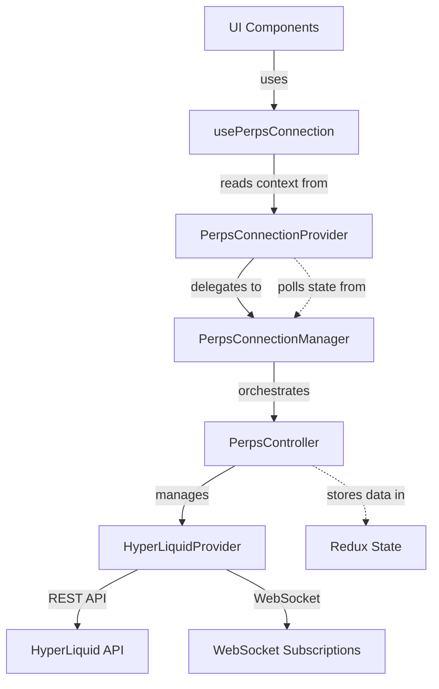
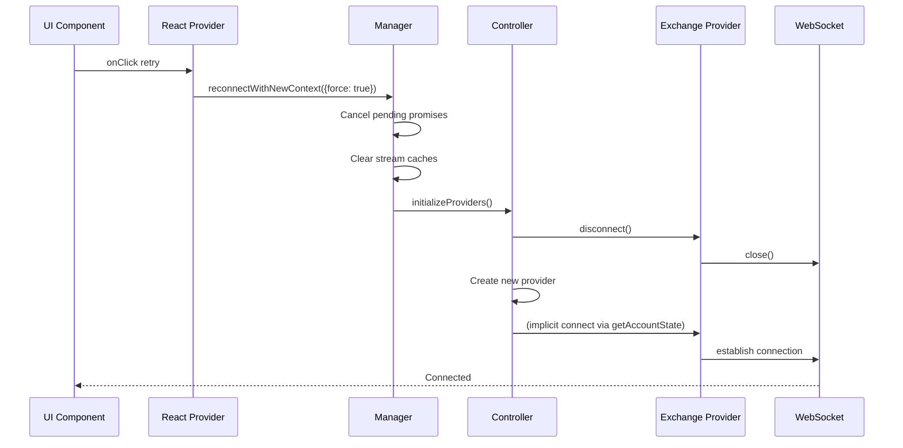
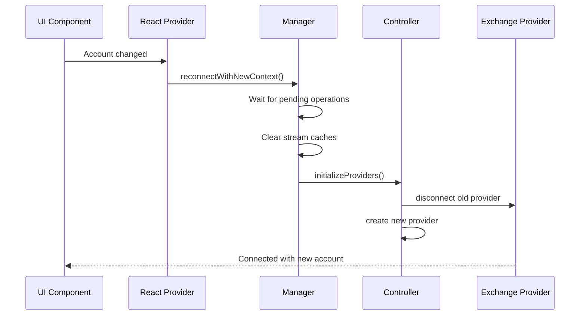

# Perps Connection Architecture

## Overview

The Perps connection system uses a layered architecture where each layer has clear responsibilities and ownership boundaries.

## Layer Stack



## Layer Responsibilities

### Hook Layer: usePerpsConnection

**What it is**: React hook that provides access to connection state and methods for UI components

**Owns**:

- Nothing - it's a pure accessor hook

**Responsibilities**:

- Read connection context from PerpsConnectionProvider
- Provide type-safe access to connection state and methods
- Throw error if used outside of Provider

**Does NOT**:

- Store any state
- Perform any logic
- Know about Manager, Controller, or Provider implementation

**Key API**: Returns `{ isConnected, isConnecting, isInitialized, error, connect, disconnect, reconnectWithNewContext, resetError }`

**Usage**: Primary API for all UI components to interact with the connection system

---

### UI Layer: PerpsConnectionProvider

**What it is**: React Context provider that exposes connection state and methods to UI components

**Owns**:

- Local React state (polled from Manager)
- Polling interval for state synchronization
- UI-level error handling decisions (show error screen vs skeleton)
- Internal visibility lifecycle management (via `usePerpsConnectionLifecycle` hook)

**Responsibilities**:

- Translate singleton Manager state into React state
- Provide stable callback functions to UI
- Decide when to show loading skeleton vs error screen vs content
- Handle app/tab visibility changes (connect when visible, disconnect when hidden)
- Handle E2E mode with mock state

**Does NOT**:

- Manage actual connection lifecycle (delegates to Manager)
- Know about WebSockets or providers
- Handle race conditions or reconnection logic

**Exposes**: Connection context via `PerpsConnectionContext` that `usePerpsConnection` hook reads from

**Note**: Internally uses `usePerpsConnectionLifecycle` to automatically connect/disconnect based on app state and tab visibility, but this is an implementation detail not exposed to UI components.

---

### Manager Layer: PerpsConnectionManager (Singleton)

**What it is**: Orchestrator that coordinates connection lifecycle and manages connection state

**Owns**:

- Connection state (`isConnected`, `isConnecting`, `isInitialized`, `error`)
- Race condition guards (`initPromise`, `pendingReconnectPromise`)
- Grace period timer (20s delay before disconnect)
- Reference counting (tracks active provider instances)
- Stream manager caches

**Responsibilities**:

- Coordinate connect/disconnect based on provider reference counting
- Handle force flag logic (cancel pending operations vs wait)
- Implement grace period to prevent flickering disconnects
- Clear stream caches during reconnection
- Delegate actual provider initialization to Controller

**Does NOT**:

- Create or manage provider instances
- Know about specific exchange protocols
- Update Redux state
- Handle WebSocket connections directly

**Key Methods**:

- `connect()` - Initialize connection if first provider instance
- `disconnect()` - Disconnect if last provider instance (after grace period)
- `reconnectWithNewContext(options?: ReconnectOptions)` - Coordinate full reconnection with optional force flag

---

### Controller Layer: PerpsController (Redux)

**What it is**: Redux controller that manages provider instances and exposes data methods

**Owns**:

- Provider instances (`Map<string, Provider>`)
- Redux state (account state, orders, positions, market data)
- Initialization flags (`isInitialized`, `isReinitializing`)
- Network configuration (testnet vs mainnet)

**Responsibilities**:

- Create and destroy provider instances
- Disconnect old providers and create new ones during reinitialization
- Expose data access methods (`getAccountState`, `placeOrder`, etc.)
- Update Redux state based on provider data
- Handle provider-level errors and log to Sentry

**Does NOT**:

- Handle reconnection orchestration (Manager's job)
- Know about force flags or pending operations
- Manage UI state or React lifecycle
- Implement grace periods or reference counting

**Key Methods**:

- `initializeProviders()` - Disconnect old providers, create new ones
- `disconnect()` - Disconnect provider and reset initialization state
- `getAccountState()`, `placeOrder()`, etc. - Data access methods

---

### Provider Layer: HyperLiquidProvider

**What it is**: Exchange-specific implementation of the provider interface

**Owns**:

- REST API clients (InfoClient for queries, ExchangeClient for trading)
- WebSocket connection for real-time subscriptions
- Exchange-specific API request formatting
- Protocol-specific message handling
- Subscription management

**Responsibilities**:

- Make REST API calls for trading operations (place/cancel/edit orders)
- Make REST API calls for data queries (account state, positions, market info)
- Establish and maintain WebSocket connection for real-time subscriptions
- Format requests according to exchange protocol
- Parse responses and normalize data
- Handle exchange-specific errors
- Manage subscriptions (prices, order fills, position updates)

**Does NOT**:

- Know about Redux or React
- Handle reconnection logic
- Implement grace periods
- Manage multiple provider instances

**Communication Methods**:

- **REST API**: Account queries, order placement/cancellation, balance checks, market data
- **WebSocket**: Real-time price updates, order fill notifications, position changes

**Key Methods**:

- `connect()` - Initialize REST clients and WebSocket connection
- `disconnect()` - Close WebSocket and cleanup clients
- `placeOrder()`, `cancelOrder()` - Trading via REST API
- `getAccountState()`, `getPositions()` - Data queries via REST API
- `subscribeToPrices()`, `subscribeToOrders()` - Real-time updates via WebSocket

---

## Design Principles

1. **Manager Orchestrates, Controller Provides Primitives**

   - Manager coordinates "when" and "why" to reconnect
   - Controller provides "how" to initialize/disconnect providers
   - Manager never directly touches providers

2. **Provider is Exchange-Agnostic Interface**

   - Controller doesn't know about HyperLiquid specifics
   - Easy to add new providers (Binance, GMX, etc.)
   - Provider implements standard interface

3. **UI Layer is Presentation Only**

   - Provider (React) polls state from Manager (singleton)
   - No business logic in React components
   - UI decides presentation based on state

4. **Clear Ownership Boundaries**
   - Each layer owns specific concerns
   - No cross-layer state management
   - Dependencies flow downward only

---

## Key Methods by Layer

### Manager Layer Methods

| Method                      | Signature                                       | Purpose                                         |
| --------------------------- | ----------------------------------------------- | ----------------------------------------------- |
| `connect()`                 | `() => Promise<void>`                           | Initialize connection if first provider         |
| `disconnect()`              | `() => Promise<void>`                           | Disconnect if last provider (with grace period) |
| `reconnectWithNewContext()` | `(options?: ReconnectOptions) => Promise<void>` | Coordinate full reconnection                    |
| `getConnectionState()`      | `() => ConnectionState`                         | Get current connection state (for polling)      |
| `resetError()`              | `() => void`                                    | Clear error state                               |

### Controller Layer Methods

| Method                  | Signature                     | Purpose                              |
| ----------------------- | ----------------------------- | ------------------------------------ |
| `initializeProviders()` | `() => Promise<void>`         | Disconnect old, create new providers |
| `disconnect()`          | `() => Promise<void>`         | Disconnect provider, reset flags     |
| `getAccountState()`     | `() => Promise<AccountState>` | Fetch account data                   |
| `placeOrder()`          | `(order) => Promise<void>`    | Submit order                         |

### Provider Layer Methods (React)

| Method                      | Signature                     | Purpose              |
| --------------------------- | ----------------------------- | -------------------- |
| `connect()`                 | `() => Promise<void>`         | Delegates to Manager |
| `disconnect()`              | `() => Promise<void>`         | Delegates to Manager |
| `reconnectWithNewContext()` | `(options?) => Promise<void>` | Delegates to Manager |
| `resetError()`              | `() => void`                  | Delegates to Manager |

---

## ReconnectOptions

```typescript
interface ReconnectOptions {
  force?: boolean; // default: false
}
```

**Only used at Manager layer** - Controls pending operation handling:

- `force: false` (default): Waits for pending operations → safe for automatic reconnects
- `force: true`: Cancels pending operations → user-initiated retry

**Why Controller doesn't need it**: Manager calls `initializeProviders()` directly which always does full reinitialization with provider disconnect/recreate.

---

## Flow Scenarios

### User Retry (force: true)

**Why each layer is involved**:

- **UI**: User clicks retry button → Provider.reconnectWithNewContext({ force: true })
- **Provider (React)**: Delegates to Manager singleton
- **Manager**: Cancels pending promises, clears caches, calls Controller.initializeProviders()
- **Controller**: Disconnects old provider, creates new one
- **Provider (Exchange)**: Closes WebSocket, establishes new connection



### Account Switch (force: false)

**Why each layer is involved**:

- **UI**: Account changed → Lifecycle hook calls reconnect
- **Provider (React)**: Delegates to Manager
- **Manager**: Waits for pending operations, then reinitializes
- **Controller**: Disconnects old provider (old account), creates new one
- **Provider (Exchange)**: Closes WebSocket, establishes new connection with new account context



---

## Race Condition Guards

Each layer protects against its own concurrency concerns:

| Guard                     | Location   | Purpose                           | Why This Layer                     |
| ------------------------- | ---------- | --------------------------------- | ---------------------------------- |
| `initPromise`             | Manager    | Prevents concurrent connect()     | Manager owns connection lifecycle  |
| `pendingReconnectPromise` | Manager    | Prevents concurrent reconnects    | Manager coordinates reconnection   |
| `isReinitializing`        | Controller | Prevents concurrent provider init | Controller owns provider instances |

---

## When to Use What

| Scenario          | Method                      | Options           | Which Layer Decides         |
| ----------------- | --------------------------- | ----------------- | --------------------------- |
| Initial load      | `connect()`                 | -                 | Manager (via Provider hook) |
| User retry button | `reconnectWithNewContext()` | `{ force: true }` | UI → Provider → Manager     |
| Account switch    | `reconnectWithNewContext()` | default           | Lifecycle hook → Manager    |
| Network switch    | `reconnectWithNewContext()` | default           | Lifecycle hook → Manager    |
| App background    | `disconnect()`              | -                 | Lifecycle hook → Manager    |
| App foreground    | `connect()`                 | -                 | Lifecycle hook → Manager    |

---

## Error Handling by Layer

Each layer handles errors at its own level:

1. **Provider Layer (Exchange)**:

   - Catches WebSocket errors, logs to Sentry
   - Returns error state to Controller

2. **Controller Layer**:

   - Catches provider errors, logs to Sentry
   - Updates Redux error state
   - Throws to Manager

3. **Manager Layer**:

   - Catches Controller errors, logs to DevLogger
   - Sets local error state
   - Does NOT throw (prevents crash)

4. **Provider Layer (React)**:
   - Catches Manager errors, logs to Sentry
   - Polls error state from Manager
   - Decides UI presentation (error screen vs retry button)

**All layers update state regardless of error to keep UI in sync.**
