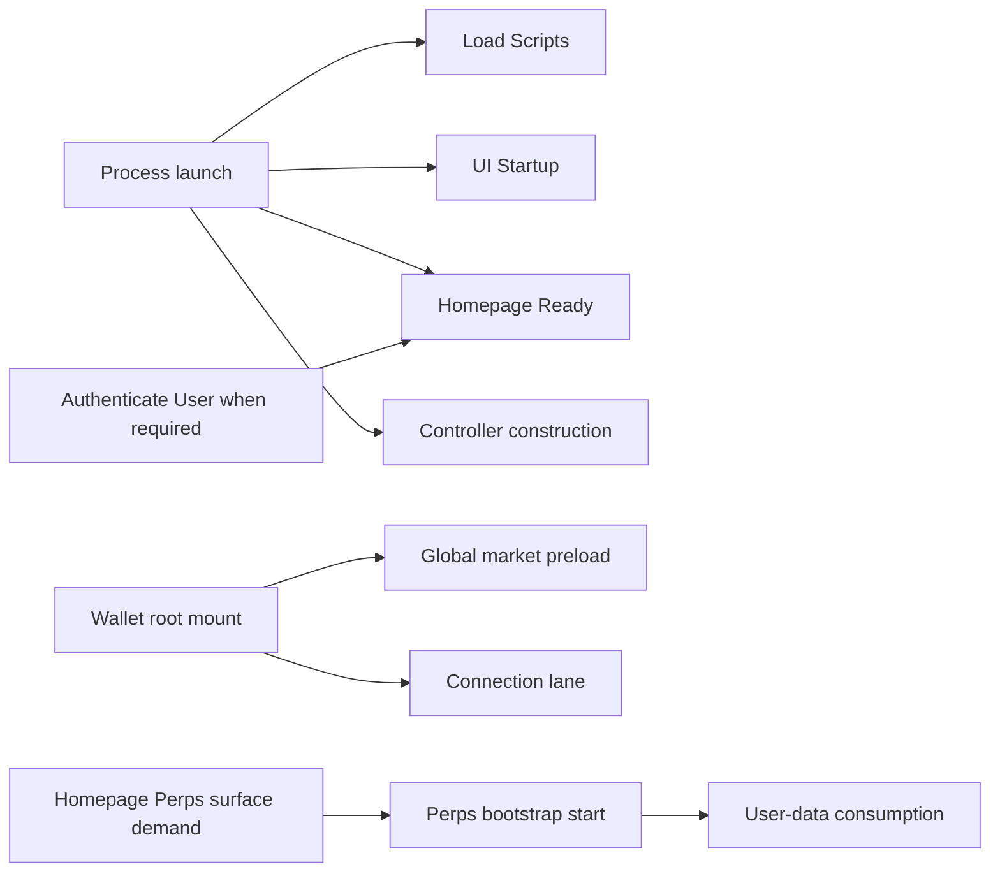
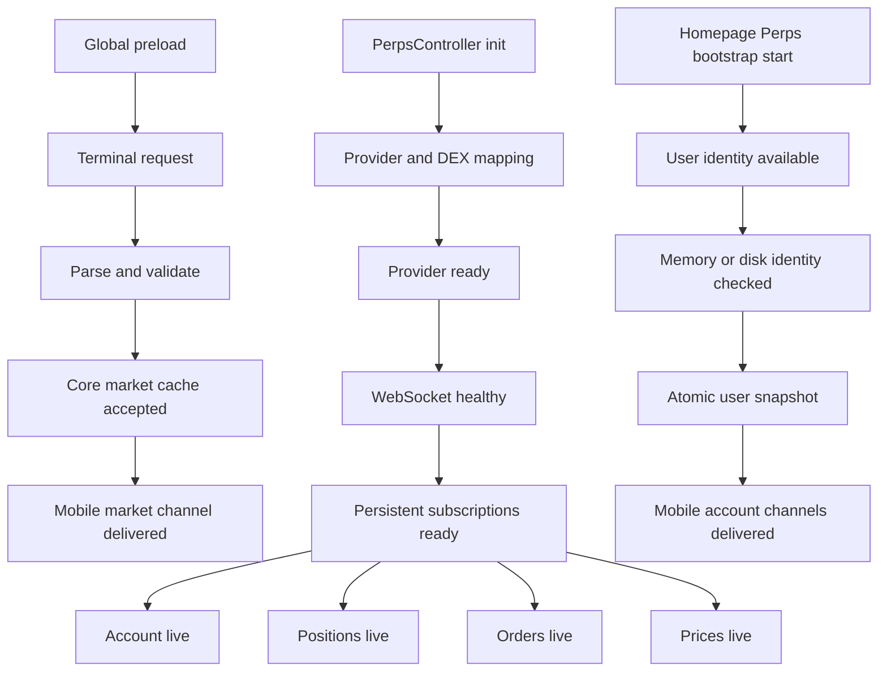
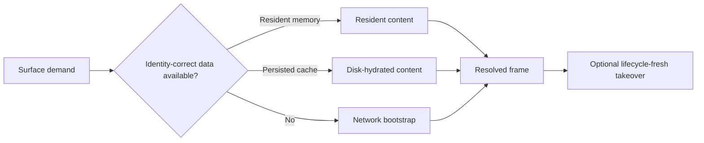

# Perps performance measurement architecture

This is the source of truth for measurement semantics. It intentionally contains no measured values. One `perps.performance` recipe runs unchanged on Android and iOS; only the harness device target changes.

## Delivery status

This document is the target cross-PR contract. This PR reuses the existing app
startup, Homepage Ready, and section TTC/DFD traces without changing their
owners. It adds the `perps_bootstrap_start` session and Mobile milestone
producers; dashboard rows remain `release pending` until the proven
instrumentation and its Core dependency ship.

## Two clocks, no assumed ordering

App startup and Perps bootstrap are related but not sequential by definition:

`perps_bootstrap_start` is emitted when the mounted Homepage Perps surface begins a measurable loading generation. The surface owns that session through completion, context change, backgrounding, or unmount, so wallet-root and off-homepage activity cannot create false timeouts. It is not controller construction, login completion, wallet readiness, or Homepage readiness. The controller, global market preload, and connection may already be active because global data has no account dependency. Startup and Perps traces remain independently owned and are compared only as release/platform cohorts, not joined per event.

### Homepage Ready anchors

| `app_start_type` | `start_source` | Homepage Ready start           | Valid interpretation                      |
| ---------------- | -------------- | ------------------------------ | ----------------------------------------- |
| `cold`           | `app_open`     | Native app launch              | Full process-to-usable-Homepage duration  |
| `cold` or `warm` | `unlock`       | Unlock submission              | Unlock-submit-to-usable-Homepage duration |
| `warm`           | `app_open`     | AppState foreground transition | Resume-to-usable-Homepage duration        |

Only the cold cohort may label Homepage Ready as full app startup. Authentication is absent for an already-unlocked cold start and must remain missing rather than synthesized.

## Parallel Perps lanes

The global lane does not require an unlocked account. It may start before controller initialization or Homepage readiness. User-data and WebSocket timing are separate from the global-market optimization and must not be claimed as improved without their own evidence.

## Cached and resume paths

Resident return, cold disk hydration, short background continuity, and reconnect are distinct cohorts. Market and account cache sources are attributes within those cohorts, not separate lifecycle names.

## Canonical stage vocabulary

These names are shared by Mobile emitters, the harness parser, recipe requirements, evidence, runbook, and report:

| Stage                         | Meaning                                                   |
| ----------------------------- | --------------------------------------------------------- |
| `perps_bootstrap_start`       | Perps bootstrap requested                                 |
| `surface_demand`              | A visible surface requests Perps state                    |
| `surface_initial_ui_recorded` | Perps shell/header first committed                        |
| `surface_resolved_recorded`   | Valid content, resolved-empty, or visible error committed |
| `surface_live_recorded`       | Lifecycle-fresh data consumed by that surface committed   |

Terminal rows already resident in the Mobile market cache remain
`market_source=memory_cache`, even if each row retains Terminal provenance.
Only a Terminal fetch accepted during the current lifecycle can emit
`market_source=terminal_v2` and satisfy `surface_live_recorded`.
An account variant may resolve from cache, but its live stage records
`source=fresh_socket` and the matching connection generation only after the
session accepts fresh positions, orders, and account milestones.

`react_commit`, `next_frame_checkpoint`, `socket_received`, and `subscriber_delivery` are lower-level recipe diagnostics, not public funnel stages.

## Authoritative producer table

Each boundary has exactly one producer.

| Boundary or measurement                       | Authoritative producer                                  | Destination                                                                                                                                           |
| --------------------------------------------- | ------------------------------------------------------- | ----------------------------------------------------------------------------------------------------------------------------------------------------- |
| Load Scripts                                  | Existing Mobile startup instrumentation                 | `Load Scripts` trace                                                                                                                                  |
| UI Startup                                    | Existing Mobile startup instrumentation                 | `UI Startup` trace                                                                                                                                    |
| Authentication duration                       | Existing Mobile login instrumentation                   | `Authenticate User` trace                                                                                                                             |
| Homepage ready                                | Existing Mobile Homepage instrumentation                | `Homepage Ready` trace                                                                                                                                |
| Perps bootstrap start                         | Mounted Mobile Homepage Perps surface                   | slim `Perps Loading Session` anchor and recipe marker                                                                                                 |
| Controller constructed                        | Core constructor, using Mobile-supplied monotonic clock | Buffer construction/hydration timestamps in Core; after `perps_bootstrap_start`, write the derived offset to the explicit loading-session span handle |
| Market/user disk hydration identity and age   | Core cache code                                         | corresponding preload trace attributes plus recipe event                                                                                              |
| Terminal request, parse/validation, adoption  | Core Terminal market service                            | `Perps Market Data Preload` measurements only                                                                                                         |
| Global market preload                         | Core controller                                         | `Perps Market Data Preload` trace                                                                                                                     |
| User preload                                  | Core controller                                         | `Perps User Data Preload` trace                                                                                                                       |
| Provider init, health, socket, subscriptions  | Existing Mobile connection manager                      | `Perps Connection Establishment` measurements                                                                                                         |
| First live price/positions/orders/account     | Existing Mobile stream manager                          | existing `Perps WebSocket First *` traces                                                                                                             |
| Homepage Perps TTC/DFD                        | Existing `useSectionPerformance`                        | existing Homepage section traces, extended with source/lifecycle/content variant                                                                      |
| Surface initial UI and live-visible           | Mobile surface instrumentation                          | measurements on the existing surface trace; recipe stages above                                                                                       |
| Bootstrap-relative markets/cache/live offsets | Mobile loading-session coordinator                      | slim `Perps Loading Session` only                                                                                                                     |

Core-to-Mobile measurements must target an explicit trace/span handle. Ambient-span measurement writes are not accepted. The Core user-preload trace must not contain a wallet address or any other user identifier.

## Slim loading session

`Perps Loading Session` exists because Sentry dashboards cannot join independent root transactions. It contains only:

- the `perps_bootstrap_start` anchor;
- non-negative bootstrap-relative readiness offsets for markets, one coherent atomic cached account state, and required live streams;
- lifecycle, surface, content variant, source, release, and outcome attributes.

It must not copy startup, Terminal request/parse, preload, connection, first-data, TTC, or DFD durations. Existing traces remain authoritative for those values.

`perps_session_id` is generated once per lifecycle/context generation and attached as trace data/context to reused traces for drill-down. It is never used as a dashboard group-by tag. Dashboard cohorts use bounded attributes such as release, platform, lifecycle, surface, content variant, and source.

Sessions cancelled by context change, backgrounding, or surface unmount are ended with a bounded cancellation reason but no success/content outcome, and are excluded from success, error, and latency cohorts.

## Market-detail readiness

Market detail has a separate screen-owned session. It does not extend the
Homepage loading session.

`Perps Market Detail Live` remains the minimum-useful-screen duration. The
`Perps Market Detail Session` adds one shared market-detail-mount anchor and
records when each applicable section resolves. It stores no controller,
connection, WebSocket, chart-internal, or API duration.

One session owns one market, mode, selected account, provider, network, and
HIP-3 configuration generation. A market/mode/context change starts a new
generation. Backgrounding or unmounting the screen cancels the active generation,
so suspended time and stale-market callbacks cannot enter latency percentiles.
Foreground resume starts a new `lifecycle_context=background_resume` cohort.
Already-resolved resident sections may correctly record near zero in that
cohort; dashboards must never pool it with `cold_process` or `warm` navigation.
`generation_trigger` further separates `initial`, `background_resume`,
`market_switch`, `mode_switch`, `account_switch`, `network_switch`, and
`configuration_change`. Resident global/account sections may correctly resolve
near zero after a context switch; navigation widgets filter to `initial`, while
the other triggers have their own continuity/recovery cohorts.

| Section          | Lite         | Pro               | Resolved boundary                                                              |
| ---------------- | ------------ | ----------------- | ------------------------------------------------------------------------------ |
| Market           | Yes          | Yes               | Current-symbol metadata is available                                           |
| Price            | Yes          | Yes               | Current-symbol display price is positive                                       |
| Chart            | Yes          | Yes when expanded | Skeleton replaced by the current-symbol chart or fallback                      |
| Stats            | Yes          | Yes               | Current-symbol market statistics resolve                                       |
| Market Insights  | When enabled | No                | Current-symbol content, empty response, or fetch error resolves                |
| Account          | Yes          | Yes               | Current-account state or a valid empty state resolves                          |
| Order book       | No           | Yes when expanded | Current-symbol ladder, valid empty state, or visible connection error resolves |
| Positions/orders | Yes          | Yes               | Current-account streams resolve to rows or a valid empty state                 |

The session measurements are:

- `market_resolved_ms`
- `price_resolved_ms`
- `chart_resolved_ms`
- `stats_resolved_ms`
- `insights_resolved_ms`
- `account_resolved_ms`
- `order_book_resolved_ms`
- `positions_orders_resolved_ms`

Every emitted offset is non-negative and relative to detail-session start. Each
measurement has a matching `<section>_state` attribute with `content`, `empty`,
or `error`. `not_applicable` is stored as state without a fabricated zero
measurement. Latency widgets include `content` and valid `empty` rows and
exclude `error`; reliability widgets count error and timeout rows separately.
A terminal section error ends the session with `success=false`,
`reason=section_error`, and `has_section_error=true`. Cancellation and timeout
rows also remain outside completed-session cohorts.

Trade-control readiness has no independent async producer. Dashboard queries
derive it as `max(market_resolved_ms, price_resolved_ms,
account_resolved_ms)` instead of emitting a duplicate measurement.

`chart_strategy` records the configured Advanced/Lightweight strategy.
`chart_library` records the library that actually rendered and is updated when
Advanced falls back to Lightweight without restarting the detail generation.
`market_source=route|stream_enrichment|unknown` distinguishes the normally
immediate route-metadata row from deep-link or activity entries that wait for
market enrichment, so the market offset is not interpreted as fetch latency.

Stats `error` means market-data subscription setup failed. A connected
subscription that never delivers a current-symbol tick remains `loading` and
ends through the bounded session timeout; it is not relabelled as an error.
`Perps Market Detail Live` ends immediately with `reason=stats_error` for the
explicit error state instead of waiting for screen unmount.

Existing `perps.chart.first_candle` spans keep the chart-mount anchor and remain
authoritative for chart-internal work. Existing `Perps WebSocket First *` spans
keep their connection/subscription anchors. Their durations are not copied into
the detail session.

## Derived metrics

| Metric                               | Formula / source                                                              |
| ------------------------------------ | ----------------------------------------------------------------------------- |
| Cold app startup                     | Existing cold `Homepage Ready` duration                                       |
| Authentication                       | Existing `Authenticate User` duration                                         |
| Auth-to-home                         | Existing traces remain separate; no synthetic join in this PR                 |
| Homepage/Perps ordering              | Existing traces remain separate; no per-event offset in this PR               |
| Controller init                      | Existing connection trace measurement                                         |
| Terminal network / parse / adoption  | Existing market-preload trace measurements                                    |
| Markets ready                        | Bootstrap-relative loading-session milestone                                  |
| Account cache ready                  | Atomic user-snapshot acceptance/delivery bootstrap-relative milestone         |
| Complete live account                | `max(account_live, positions_live, orders_live)` bootstrap-relative milestone |
| Live prices                          | `prices_live` bootstrap-relative milestone                                    |
| Homepage TTC/DFD                     | Existing Homepage section traces                                              |
| Initial UI / live-visible            | Existing surface trace measurements plus recipe frame evidence                |
| Detail minimum useful                | Existing `Perps Market Detail Live` duration, split by `detail_mode`          |
| Detail section resolution            | Detail-mount-relative `Perps Market Detail Session` measurements              |
| Cache-to-visible / socket-to-visible | Recipe evidence; promote only after semantics are proven                      |

All loading-session offsets are non-negative and bootstrap-relative.

## TTC and DFD

- Homepage TTC is the existing `Homepage Section Time To Content`: surface mount/demand to valid content, resolved-empty, or visible error. Skeleton-only is not complete.
- Homepage DFD is the existing `Homepage Section Data Fetch`: loading interval for that section.
- Preserve the current visible-error event contract for compatibility, but production percentile widgets must filter `content_state != error`. Error rate is a separate widget filtered to `content_state = error`.
- Initial UI and live-visible are separate measurements. Complete resolved content must never be labelled “first visible”.
- Recipe-only socket → subscriber → commit → frame splits diagnose rendering; Sentry stores only the useful aggregate `socket_to_visible_ms` if device proof shows it is needed.

## Surface readiness

| Surface/content           | Resolved requirement                                                                 | Live requirement                                       |
| ------------------------- | ------------------------------------------------------------------------------------ | ------------------------------------------------------ |
| Homepage trending         | Positions and orders resolved empty, plus active markets with snapshot prices/trends | None unless the cards begin consuming live prices      |
| Homepage positions/orders | Coherent positions, orders, and account state; expected item visible                 | Current-context account/positions/orders               |
| Market list               | Active markets with snapshot prices                                                  | First live prices for subscribed symbols               |
| Market detail             | Selected market metadata and snapshot price                                          | Selected-symbol price; order book/candles are separate |
| Order form                | Market details and account state                                                     | Current price/account state required by calculations   |
| Error state               | Retryable error visibly committed                                                    | Not applicable                                         |

## Executable lifecycle v1

| Lifecycle              | Start condition                                   | Required proof                                                     |
| ---------------------- | ------------------------------------------------- | ------------------------------------------------------------------ |
| `cold_no_cache`        | New process, Perps caches cleared                 | Resolved surface plus bounded required-stream completion           |
| `navigate_return`      | Surface remounted in same process                 | Resident frame; fresh tick optional                                |
| `background_short`     | Background below documented grace period          | Resident frame and connection continuity; fresh tick optional      |
| `background_reconnect` | Background beyond grace period                    | Cached/LKG frame allowed, then fresh takeover                      |
| `account_switch`       | Selected account changes                          | No prior-account frame; new identity accepted                      |
| `network_switch`       | Provider, Perps network, or HIP-3 context changes | No prior-context frame; new provider/network/DEX identity accepted |

A dedicated `provider_switch` cohort and `network_recovery` are deferred until the recipe has explicit target-provider/offline controls. Provider and HIP-3 changes currently use the broader `network_switch` context-generation cohort.

## Recipe and evidence rules

- One public recipe: `perps.performance`.
- There is no platform parameter. `--device` selects Android or iOS.
- Setup proves unlocked wallet, selected account, provider, network, and content precondition in the same run. There is no boolean that bypasses those proofs.
- Setup nodes remain in `trace.json` but are excluded from performance durations.
- Cold live-stream completion is state-driven and bounded by 90 seconds; it is not an arbitrary sleep.
- `--hud show` is normal. `--hud hide` is permitted only for a labelled matched timing cohort and must match across arms.
- Every report value has exactly one status: `validated`, `recipe pending`, `release pending`, or `excluded`.
- Missing events remain missing. No derived value is fabricated.
- Dashboard 3948326 remains unchanged; corrections are proposals until its owner approves them.
