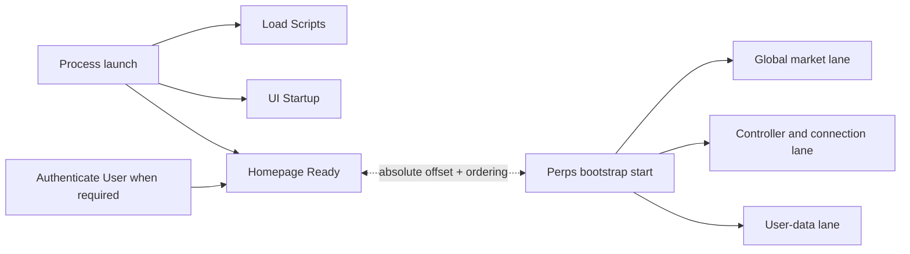
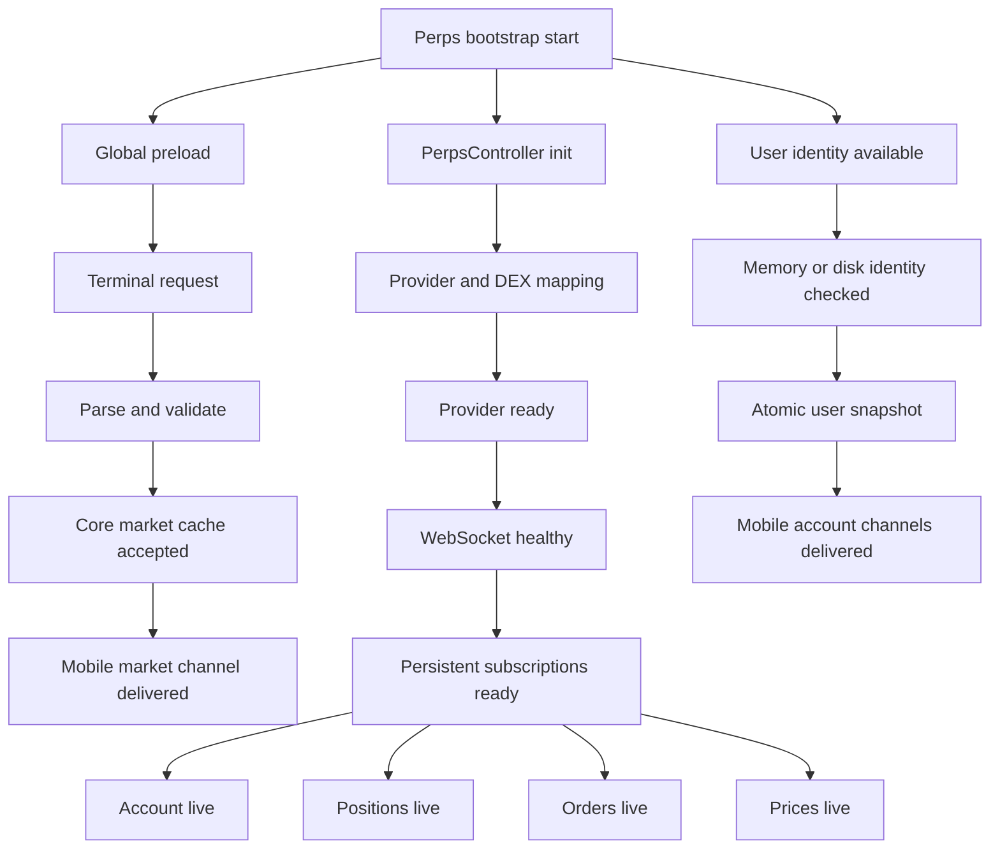
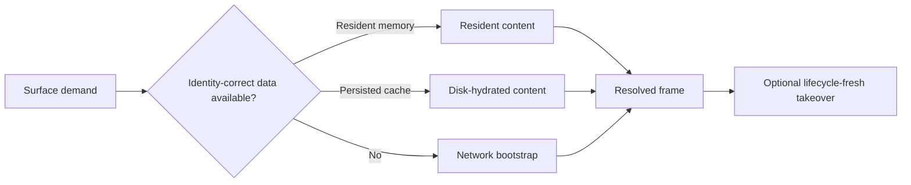

# Perps performance measurement architecture

This is the source of truth for measurement semantics. It intentionally contains no measured values. One `perps.performance` recipe runs unchanged on Android and iOS; only the harness device target changes.

## Two clocks, no assumed ordering

App startup and Perps bootstrap are related but not sequential by definition:

`perps_bootstrap_start` is emitted when `PerpsAlwaysOnProvider` requests global, controller, and user bootstrap. It is not controller construction, Perps Home navigation, login completion, wallet readiness, or Homepage readiness. The controller may already exist from Engine setup, and global market preload may safely begin before authentication because it has no account dependency. The report preserves the actual ordering of construction, bootstrap request, Homepage readiness, and surface demand so moving safe work earlier remains measurable.

### Homepage Ready anchors

| `app_start_type` | `start_source` | Homepage Ready start           | Valid interpretation                      |
| ---------------- | -------------- | ------------------------------ | ----------------------------------------- |
| `cold`           | `app_open`     | Native app launch              | Full process-to-usable-Homepage duration  |
| `cold` or `warm` | `unlock`       | Unlock submission              | Unlock-submit-to-usable-Homepage duration |
| `warm`           | `app_open`     | AppState foreground transition | Resume-to-usable-Homepage duration        |

Only the cold cohort may label Homepage Ready as full app startup. Authentication is absent for an already-unlocked cold start and must remain missing rather than synthesized.

## Parallel Perps lanes

The global lane does not require an unlocked account. It may start before controller initialization or Homepage readiness. User-data and WebSocket timing are separate from the global-market optimization and must not be claimed as improved without their own evidence.

## Cached and resume paths

Resident return, cold disk hydration, short background continuity, and reconnect are distinct cohorts. Market and account cache sources are attributes within those cohorts, not separate lifecycle names.

## Canonical stage vocabulary

These names are shared by Mobile emitters, the harness parser, recipe requirements, evidence, runbook, and report:

| Stage                         | Meaning                                                   |
| ----------------------------- | --------------------------------------------------------- |
| `perps_bootstrap_start`       | Perps bootstrap requested                                 |
| `surface_demand`              | A visible surface requests Perps state                    |
| `surface_initial_ui_recorded` | Perps shell/header first committed                        |
| `surface_resolved_recorded`   | Valid content, resolved-empty, or visible error committed |
| `surface_live_recorded`       | Lifecycle-fresh data consumed by that surface committed   |

`react_commit`, `next_frame_checkpoint`, `socket_received`, and `subscriber_delivery` are lower-level recipe diagnostics, not public funnel stages.

## Authoritative producer table

Each boundary has exactly one producer.

| Boundary or measurement                       | Authoritative producer                                  | Destination                                                                                                                                           |
| --------------------------------------------- | ------------------------------------------------------- | ----------------------------------------------------------------------------------------------------------------------------------------------------- |
| Load Scripts                                  | Existing Mobile startup instrumentation                 | `Load Scripts` trace                                                                                                                                  |
| UI Startup                                    | Existing Mobile startup instrumentation                 | `UI Startup` trace                                                                                                                                    |
| Authentication duration                       | Existing Mobile login instrumentation                   | `Authenticate User` trace                                                                                                                             |
| Authentication end to Homepage ready          | Mobile Homepage Ready flow, unlock cohort only          | `Homepage Ready` measurement                                                                                                                          |
| Homepage ready                                | Existing Mobile Homepage instrumentation                | `Homepage Ready` trace                                                                                                                                |
| Perps bootstrap start                         | Mobile `PerpsAlwaysOnProvider`                          | slim `Perps Loading Session` anchor and recipe marker                                                                                                 |
| Controller constructed                        | Core constructor, using Mobile-supplied monotonic clock | Buffer construction/hydration timestamps in Core; after `perps_bootstrap_start`, write the derived offset to the explicit loading-session span handle |
| Market/user disk hydration identity and age   | Core cache code                                         | corresponding preload trace attributes plus recipe event                                                                                              |
| Terminal request, parse/validation, adoption  | Core Terminal market service                            | `Perps Market Data Preload` measurements only                                                                                                         |
| Global market preload                         | Core controller                                         | `Perps Market Data Preload` trace                                                                                                                     |
| User preload                                  | Core controller                                         | `Perps User Data Preload` trace                                                                                                                       |
| Provider init, health, socket, subscriptions  | Existing Mobile connection manager                      | `Perps Connection Establishment` measurements                                                                                                         |
| First live price/positions/orders/account     | Existing Mobile stream manager                          | existing `Perps WebSocket First *` traces                                                                                                             |
| Homepage Perps TTC/DFD                        | Existing `useSectionPerformance`                        | existing Homepage section traces, extended with source/lifecycle/content variant                                                                      |
| Surface initial UI and live-visible           | Mobile surface instrumentation                          | measurements on the existing surface trace; recipe stages above                                                                                       |
| Bootstrap-relative markets/cache/live offsets | Mobile loading-session coordinator                      | slim `Perps Loading Session` only                                                                                                                     |

Core-to-Mobile measurements must target an explicit trace/span handle. Ambient-span measurement writes are not accepted. The Core user-preload trace must not contain a wallet address or any other user identifier.

## Slim loading session

`Perps Loading Session` exists because Sentry dashboards cannot join independent root transactions. It contains only:

- the `perps_bootstrap_start` anchor;
- non-negative bootstrap-relative readiness offsets for markets, one coherent atomic cached account state, and required live streams;
- the non-negative distance to Homepage Ready plus `bootstrap_before_homepage_ready`;
- lifecycle, surface, content variant, source, release, and outcome attributes.

It must not copy startup, Terminal request/parse, preload, connection, first-data, TTC, or DFD durations. Existing traces remain authoritative for those values.

`perps_session_id` is generated once per lifecycle/context generation and attached as trace data/context to reused traces for drill-down. It is never used as a dashboard group-by tag. Dashboard cohorts use bounded attributes such as release, platform, lifecycle, surface, content variant, and source.

## Derived metrics

| Metric                               | Formula / source                                                              |
| ------------------------------------ | ----------------------------------------------------------------------------- |
| Cold app startup                     | Existing cold `Homepage Ready` duration                                       |
| Authentication                       | Existing `Authenticate User` duration                                         |
| Auth-to-home                         | Homepage Ready measurement, unlock cohort only                                |
| Homepage/Perps distance              | `abs(homepage_ready - perps_bootstrap_start)` plus ordering boolean           |
| Controller init                      | Existing connection trace measurement                                         |
| Terminal network / parse / adoption  | Existing market-preload trace measurements                                    |
| Markets ready                        | Bootstrap-relative loading-session milestone                                  |
| Account cache ready                  | Atomic user-snapshot acceptance/delivery bootstrap-relative milestone         |
| Complete live account                | `max(account_live, positions_live, orders_live)` bootstrap-relative milestone |
| Live prices                          | `prices_live` bootstrap-relative milestone                                    |
| Homepage TTC/DFD                     | Existing Homepage section traces                                              |
| Initial UI / live-visible            | Existing surface trace measurements plus recipe frame evidence                |
| Cache-to-visible / socket-to-visible | Recipe evidence; promote only after semantics are proven                      |

All offsets are non-negative. Ordering is represented by a separate bounded boolean attribute.

## TTC and DFD

- Homepage TTC is the existing `Homepage Section Time To Content`: surface mount/demand to valid content, resolved-empty, or visible error. Skeleton-only is not complete.
- Homepage DFD is the existing `Homepage Section Data Fetch`: loading interval for that section.
- Preserve the current visible-error event contract for compatibility, but production percentile widgets must filter `content_state != error`. Error rate is a separate widget filtered to `content_state = error`.
- Initial UI and live-visible are separate measurements. Complete resolved content must never be labelled “first visible”.
- Recipe-only socket → subscriber → commit → frame splits diagnose rendering; Sentry stores only the useful aggregate `socket_to_visible_ms` if device proof shows it is needed.

## Surface readiness

| Surface/content           | Resolved requirement                                                                 | Live requirement                                       |
| ------------------------- | ------------------------------------------------------------------------------------ | ------------------------------------------------------ |
| Homepage trending         | Positions and orders resolved empty, plus active markets with snapshot prices/trends | None unless the cards begin consuming live prices      |
| Homepage positions/orders | Coherent positions, orders, and account state; expected item visible                 | Current-context account/positions/orders               |
| Market list               | Active markets with snapshot prices                                                  | First live prices for subscribed symbols               |
| Market detail             | Selected market metadata and snapshot price                                          | Selected-symbol price; order book/candles are separate |
| Order form                | Market details and account state                                                     | Current price/account state required by calculations   |
| Error state               | Retryable error visibly committed                                                    | Not applicable                                         |

## Executable lifecycle v1

| Lifecycle              | Start condition                             | Required proof                                                |
| ---------------------- | ------------------------------------------- | ------------------------------------------------------------- |
| `cold_no_cache`        | New process, Perps caches cleared           | Resolved surface plus bounded required-stream completion      |
| `cold_disk_cache`      | New process, valid persisted cache retained | Identity-correct cached frame, then fresh takeover            |
| `navigate_return`      | Surface remounted in same process           | Resident frame; fresh tick optional                           |
| `background_short`     | Background below documented grace period    | Resident frame and connection continuity; fresh tick optional |
| `background_reconnect` | Background beyond grace period              | Cached/LKG frame allowed, then fresh takeover                 |
| `account_switch`       | Selected account changes                    | No prior-account frame; new identity accepted                 |
| `network_switch`       | Perps network changes                       | No prior-network frame; new network/DEX identity accepted     |

`provider_switch` and `network_recovery` are deferred until the recipe has explicit target-provider/offline controls. They are not v1 claims.

## Recipe and evidence rules

- One public recipe: `perps.performance`.
- There is no platform parameter. `--device` selects Android or iOS.
- Setup proves unlocked wallet, selected account, provider, network, and content precondition in the same run. There is no boolean that bypasses those proofs.
- Setup nodes remain in `trace.json` but are excluded from performance durations.
- Cold live-stream completion is state-driven and bounded by 90 seconds; it is not an arbitrary sleep.
- `--hud show` is normal. `--hud hide` is permitted only for a labelled matched timing cohort and must match across arms.
- Every report value has exactly one status: `validated`, `recipe pending`, `release pending`, or `excluded`.
- Missing events remain missing. No derived value is fabricated.
- Dashboard 3948326 remains unchanged; corrections are proposals until its owner approves them.
